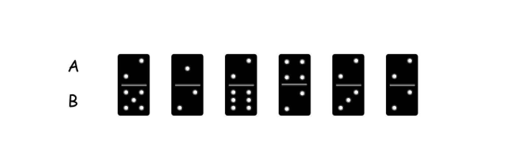
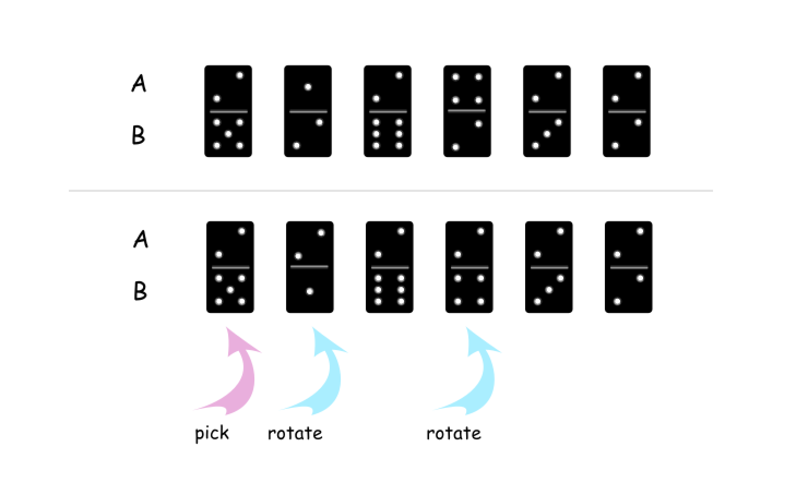
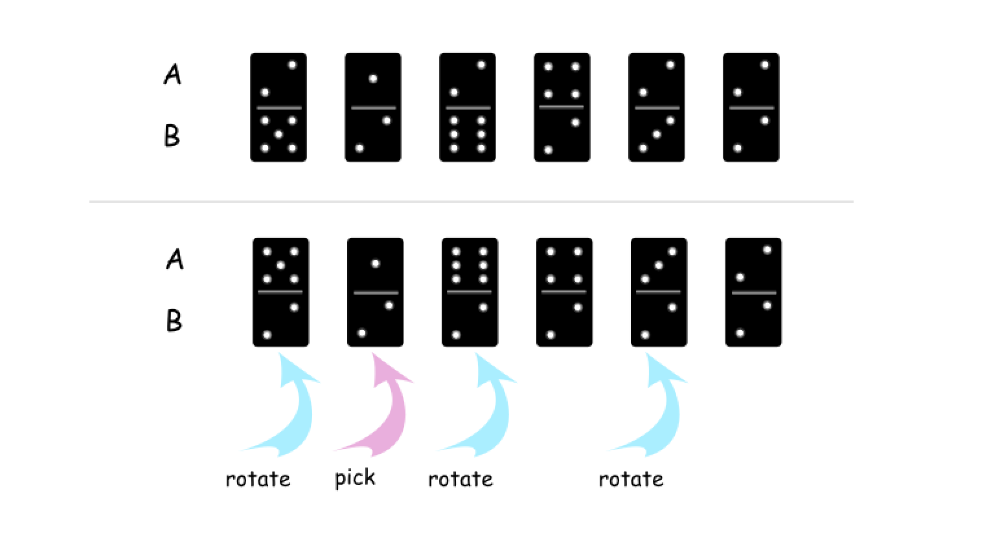
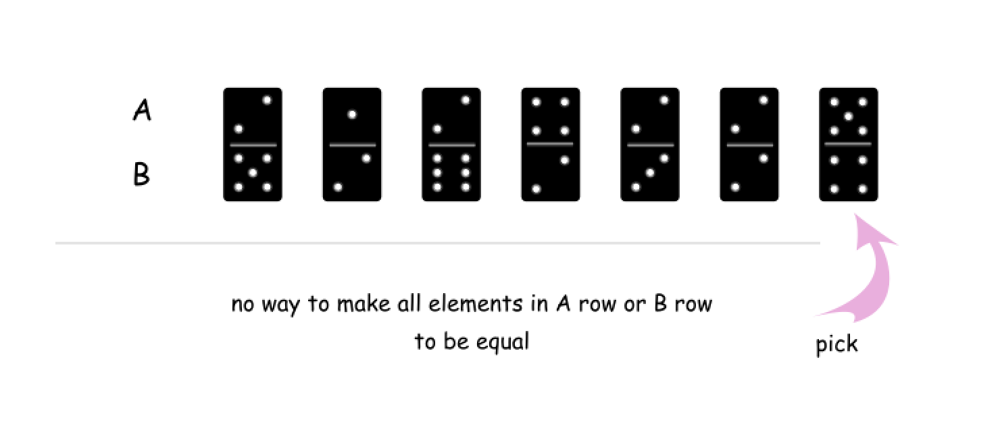

> 原文链接: https://leetcode-cn.com/problems/minimum-domino-rotations-for-equal-row


## 英文原文
<div><p>In a row of dominoes, <code>tops[i]</code> and <code>bottoms[i]</code> represent the top and bottom halves of the <code>i<sup>th</sup></code> domino. (A domino is a tile with two numbers from 1 to 6 - one on each half of the tile.)</p>

<p>We may rotate the <code>i<sup>th</sup></code> domino, so that <code>tops[i]</code> and <code>bottoms[i]</code> swap values.</p>

<p>Return the minimum number of rotations so that all the values in <code>tops</code> are the same, or all the values in <code>bottoms</code> are the same.</p>

<p>If it cannot be done, return <code>-1</code>.</p>

<p>&nbsp;</p>
<p><strong>Example 1:</strong></p>

<pre>
<strong>Input:</strong> tops = [2,1,2,4,2,2], bottoms = [5,2,6,2,3,2]
<strong>Output:</strong> 2
<strong>Explanation:</strong> 
The first figure represents the dominoes as given by tops and bottoms: before we do any rotations.
If we rotate the second and fourth dominoes, we can make every value in the top row equal to 2, as indicated by the second figure.
</pre>

<p><strong>Example 2:</strong></p>

<pre>
<strong>Input:</strong> tops = [3,5,1,2,3], bottoms = [3,6,3,3,4]
<strong>Output:</strong> -1
<strong>Explanation:</strong> 
In this case, it is not possible to rotate the dominoes to make one row of values equal.
</pre>

<p>&nbsp;</p>
<p><strong>Constraints:</strong></p>

<ul>
	<li><code>2 &lt;= tops.length &lt;= 2 * 10<sup>4</sup></code></li>
	<li><code>bottoms.length == tops.length</code></li>
	<li><code>1 &lt;= tops[i], bottoms[i] &lt;= 6</code></li>
</ul>
</div>

## 中文题目
<div><p>在一排多米诺骨牌中，<code>A[i]</code> 和 <code>B[i]</code>&nbsp;分别代表第 i 个多米诺骨牌的上半部分和下半部分。（一个多米诺是两个从 1 到 6 的数字同列平铺形成的&nbsp;&mdash;&mdash; 该平铺的每一半上都有一个数字。）</p>

<p>我们可以旋转第&nbsp;<code>i</code>&nbsp;张多米诺，使得&nbsp;<code>A[i]</code> 和&nbsp;<code>B[i]</code>&nbsp;的值交换。</p>

<p>返回能使 <code>A</code> 中所有值或者 <code>B</code> 中所有值都相同的最小旋转次数。</p>

<p>如果无法做到，返回&nbsp;<code>-1</code>.</p>

<p>&nbsp;</p>

<p><strong>示例 1：</strong></p>

<p></p>

<pre><strong>输入：</strong>A = [2,1,2,4,2,2], B = [5,2,6,2,3,2]
<strong>输出：</strong>2
<strong>解释：</strong>
图一表示：在我们旋转之前， A 和 B 给出的多米诺牌。
如果我们旋转第二个和第四个多米诺骨牌，我们可以使上面一行中的每个值都等于 2，如图二所示。
</pre>

<p><strong>示例 2：</strong></p>

<pre><strong>输入：</strong>A = [3,5,1,2,3], B = [3,6,3,3,4]
<strong>输出：</strong>-1
<strong>解释：</strong>
在这种情况下，不可能旋转多米诺牌使一行的值相等。
</pre>

<p>&nbsp;</p>

<p><strong>提示：</strong></p>

<ol>
	<li><code>1 &lt;= A[i], B[i] &lt;= 6</code></li>
	<li><code>2 &lt;= A.length == B.length &lt;= 20000</code></li>
</ol>
</div>

## 通过代码
<RecoDemo>
</RecoDemo>


## 官方题解
#### 方法一：贪心

**分析**

我们随便选其中的一个多米诺骨牌，它的标号为 `i`，上半部分的数字为 `A[i]`，下半部分的数字为 `B[i]`。

{:width=500}
{:align=center}    

此时可能会有三种情况：

1. 以数字 `A[i]` 作为基准，将 `A` 或 `B` 中的所有值都变为 `A[i]`。例如，下图中，我们选择了第 $0$ 个多米诺骨牌，这样可以将 `A` 中的所有值都变为 $2$。

{:width=500}
{:align=center}    

2. 以数字 `B[i]` 作为基准，将 `A` 或 `B` 中的所有值都变为 `B[i]`。例如，下图中，我们选择了第 $1$ 个多米诺骨牌，这样可以将 `B` 中的所有值都变为 $2$。

{:width=500}
{:align=center}    

3. 无论选择 `A[i]` 还是 `B[i]` 都没有办法将 `A` 或 `B` 中的所有值变为都相同。例如，下图中，我们选择了最后一个多米诺骨牌，无论是它的上半部分 $5$ 还是下半部分 $4$，都无法满足条件。

{:width=500}
{:align=center}    

如果要满足第 $1$ 种或是第 $2$ 种情况，就必须存在一块多米诺骨牌，它的上半部分或者下半部分的数字 `x` 在所有其它的多米诺骨牌中都出现过。若该条件满足，则说明所有多米诺骨牌中都出现了数字 `x`。因此，我们只要选择任意一块多米诺骨牌，判断它的上半部分或下半部分的数字是否可以作为 `x` 即可。

**算法**

- 选择第一块多米诺骨牌，它包含两个数字 `A[0]` 和 `B[0]`；
- 检查其余的多米诺骨牌中是否出现过 `A[0]`。如果都出现过，则求出最少的翻转次数，其为将 `A[0]` 全部翻到 `A` 和全部翻到 `B` 中的较少的次数。
- 检查其余的多米诺骨牌中是否出现过 `B[0]`。如果都出现过，则求出最少的翻转次数，其为将 `B[0]` 全部翻到 `A` 和全部翻到 `B` 中的较少的次数。

- 如果上述两次检查都失败，则返回 `-1`。

```Python [sol1]
class Solution:        
    def minDominoRotations(self, A: List[int], B: List[int]) -> int:
        def check(x):
            """
            Return min number of swaps 
            if one could make all elements in A or B equal to x.
            Else return -1.
            """
            # how many rotations should be done
            # to have all elements in A equal to x
            # and to have all elements in B equal to x
            rotations_a = rotations_b = 0
            for i in range(n):
                # rotations coudn't be done
                if A[i] != x and B[i] != x:
                    return -1
                # A[i] != x and B[i] == x
                elif A[i] != x:
                    rotations_a += 1
                # A[i] == x and B[i] != x    
                elif B[i] != x:
                    rotations_b += 1
            # min number of rotations to have all
            # elements equal to x in A or B
            return min(rotations_a, rotations_b)
    
        n = len(A)
        rotations = check(A[0]) 
        # If one could make all elements in A or B equal to A[0]
        if rotations != -1 or A[0] == B[0]:
            return rotations 
        # If one could make all elements in A or B equal to B[0]
        else:
            return check(B[0])
```

```Java [sol1]
class Solution {
    /*
    Return min number of rotations 
    if one could make all elements in A or B equal to x.
    Else return -1.
    */
    public int check(int x, int[] A, int[] B, int n) {
        // how many rotations should be done
        // to have all elements in A equal to x
        // and to have all elements in B equal to x
        int rotations_a = 0, rotations_b = 0;
        for (int i = 0; i < n; i++) {
            // rotations coudn't be done
            if (A[i] != x && B[i] != x) return -1;
            // A[i] != x and B[i] == x
            else if (A[i] != x) rotations_a++;
            // A[i] == x and B[i] != x    
            else if (B[i] != x) rotations_b++;
        }
        // min number of rotations to have all
        // elements equal to x in A or B
        return Math.min(rotations_a, rotations_b);
    }

    public int minDominoRotations(int[] A, int[] B) {
        int n = A.length;
        int rotations = check(A[0], B, A, n);
        // If one could make all elements in A or B equal to A[0]
        if (rotations != -1 || A[0] == B[0]) return rotations;
        // If one could make all elements in A or B equal to B[0]
        else return check(B[0], B, A, n);
    }
}
```

```C++ [sol1]
class Solution {
    public:
    /*
    Return min number of rotations 
    if one could make all elements in A or B equal to x.
    Else return -1.
    */
    int check(int x, vector<int>& A, vector<int>& B, int n) {
        // how many rotations should be done
        // to have all elements in A equal to x
        // and to have all elements in B equal to x
        int rotations_a = 0, rotations_b = 0;
        for (int i = 0; i < n; i++) {
            // rotations coudn't be done
            if (A[i] != x && B[i] != x) return -1;
            // A[i] != x and B[i] == x
            else if (A[i] != x) rotations_a++;
            // A[i] == x and B[i] != x    
            else if (B[i] != x) rotations_b++;
        }
        // min number of rotations to have all
        // elements equal to x in A or B
        return min(rotations_a, rotations_b);
    }

    int minDominoRotations(vector<int>& A, vector<int>& B) {
        int n = A.size();
        int rotations = check(A[0], B, A, n);
        // If one could make all elements in A or B equal to A[0]
        if (rotations != -1 || A[0] == B[0]) return rotations;
        // If one could make all elements in A or B equal to B[0]
        else return check(B[0], B, A, n);
    }
};
```

**复杂度分析**

* 时间复杂度：$O(N)$。我们只会遍历所有的数组最多两次。

* 空间复杂度：$O(1)$。

## 统计信息
| 通过次数 | 提交次数 | AC比率 |
| :------: | :------: | :------: |
|    6612    |    14180    |   46.6%   |

## 提交历史
| 提交时间 | 提交结果 | 执行时间 |  内存消耗  | 语言 |
| :------: | :------: | :------: | :--------: | :--------: |
