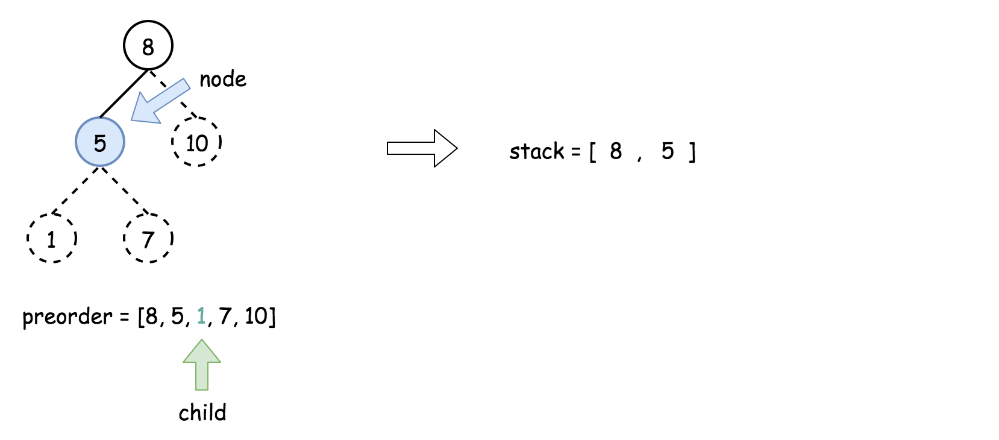
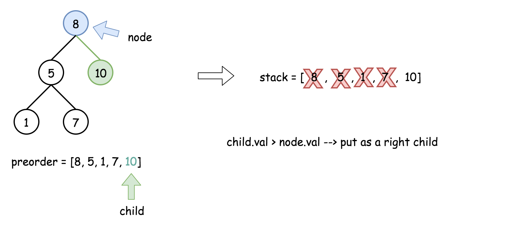

> 原文链接: https://leetcode-cn.com/problems/construct-binary-search-tree-from-preorder-traversal


## 英文原文
<div><p>Given an array of integers preorder, which represents the <strong>preorder traversal</strong> of a BST (i.e., <strong>binary search tree</strong>), construct the tree and return <em>its root</em>.</p>

<p>It is <strong>guaranteed</strong> that there is always possible to find a binary search tree with the given requirements for the given test cases.</p>

<p>A <strong>binary search tree</strong> is a binary tree where for every node, any descendant of <code>Node.left</code> has a value <strong>strictly less than</strong> <code>Node.val</code>, and any descendant of <code>Node.right</code> has a value <strong>strictly greater than</strong> <code>Node.val</code>.</p>

<p>A <strong>preorder traversal</strong> of a binary tree displays the value of the node first, then traverses <code>Node.left</code>, then traverses <code>Node.right</code>.</p>

<p>&nbsp;</p>
<p><strong>Example 1:</strong></p>

<pre>
<strong>Input:</strong> preorder = [8,5,1,7,10,12]
<strong>Output:</strong> [8,5,10,1,7,null,12]
</pre>

<p><strong>Example 2:</strong></p>

<pre>
<strong>Input:</strong> preorder = [1,3]
<strong>Output:</strong> [1,null,3]
</pre>

<p>&nbsp;</p>
<p><strong>Constraints:</strong></p>

<ul>
	<li><code>1 &lt;= preorder.length &lt;= 100</code></li>
	<li><code>1 &lt;= preorder[i] &lt;= 1000</code></li>
	<li>All the values of <code>preorder</code> are <strong>unique</strong>.</li>
</ul>
</div>

## 中文题目
<div><p>返回与给定前序遍历&nbsp;<code>preorder</code> 相匹配的二叉搜索树（binary <strong>search</strong> tree）的根结点。</p>

<p><em>(回想一下，二叉搜索树是二叉树的一种，其每个节点都满足以下规则，对于&nbsp;<code>node.left</code>&nbsp;的任何后代，值总 <code>&lt; node.val</code>，而 <code>node.right</code> 的任何后代，值总 <code>&gt; node.val</code>。此外，前序遍历首先显示节点&nbsp;<code>node</code> 的值，然后遍历 <code>node.left</code>，接着遍历 <code>node.right</code>。）</em></p>

<p>题目保证，对于给定的测试用例，总能找到满足要求的二叉搜索树。</p>

<p>&nbsp;</p>

<p><strong>示例：</strong></p>

<pre><strong>输入：</strong>[8,5,1,7,10,12]
<strong>输出：</strong>[8,5,10,1,7,null,12]

</pre>

<p>&nbsp;</p>

<p><strong>提示：</strong></p>

<ul>
	<li><code>1 &lt;= preorder.length &lt;= 100</code></li>
	<li><code>1 &lt;= preorder[i]&nbsp;&lt;= 10^8</code></li>
	<li><code>preorder</code> 中的值互不相同</li>
</ul>
</div>

## 通过代码
<RecoDemo>
</RecoDemo>


## 官方题解
#### 方法一：使用先序遍历和中序遍历构造二叉树

**分析**

由于树是「二叉搜索树」，我们知道「二叉搜索树」的中序遍历的结果是有序序列。我们可以对「前序遍历」的结果 **排序** 得到「中序遍历」的结果。于是问题就转换成为 [105. 从前序与中序遍历序列构造二叉树](/problems/construct-binary-tree-from-preorder-and-inorder-traversal/)，该题也是一道非常经典的二叉树问题，读者可以参考 [官方题解](https://leetcode-cn.com/problems/construct-binary-tree-from-preorder-and-inorder-traversal/solution/cong-qian-xu-yu-zhong-xu-bian-li-xu-lie-gou-zao-9/)。


**代码**

```Java []
import java.util.Arrays;
import java.util.HashMap;
import java.util.Map;

public class Solution {

    public TreeNode bstFromPreorder(int[] preorder) {
        int len = preorder.length;
        Map<Integer, Integer> hashMap = new HashMap<>();

        int[] inorder = new int[len];
        System.arraycopy(preorder, 0, inorder, 0, len);
        Arrays.sort(inorder);

        int index = 0;
        for (Integer value : inorder) {
            hashMap.put(value, index);
            index++;
        }
        return dfs(0, len - 1, 0, len - 1, preorder, hashMap);
    }

    public TreeNode dfs(int preLeft, int preRight, int inLeft, int inRight, int[] preorder, Map<Integer, Integer> hashMap) {
        if (preLeft > preRight || inLeft > inRight) {
            return null;
        }
        int pivot = preorder[preLeft];
        TreeNode root = new TreeNode(pivot);
        int pivotIndex = hashMap.get(pivot);
        root.left = dfs(preLeft + 1, pivotIndex - inLeft + preLeft,
                inLeft, pivotIndex - 1, preorder, hashMap);
        root.right = dfs(pivotIndex - inLeft + preLeft + 1, preRight,
                pivotIndex + 1, inRight, preorder, hashMap);
        return root;
    }
}
```

**复杂度分析**

- 时间复杂度：$O(N \log N)$。对先序遍历进行排序的时间复杂度为 $O(N \log N)$，构造二叉搜索树的时间复杂度为 $O(N)$，因此总的时间复杂度为 $O(N \log N)$。
- 空间复杂度：$O(N)$，中序遍历使用的数组的空间为 $O(N)$。

---

#### 方法二：二分查找左右子树的分界线递归构建左右子树

当我们「先序遍历序列」排序得到「中序遍历序列」时，我们花费了 $O(N \log N)$ 的时间复杂度。但事实上并没有得到任何额外的信息。可以直接跳过生成中序遍历的步骤，根据先序遍历直接构造出二叉树。

根据「前序遍历」的定义：前序遍历的第 1 个结点一定是二叉树的根结点。

再根据「二叉搜索树」的定义：根据前序遍历的第 1 个结点的值可以把「前序遍历」序列除了第 1 个结点以外后面的部分，分为两个区间：

+ 第 1 个子区间里所有的元素都严格小于根结点，我们可以递归构建成根结点的左子树；
+ 第 2 个子区间里所有的元素都严格大于根结点，我们可以递归构建成根结点的右子树。

找到这两个子区间的分界线，可以使用二分查找。下面我们通过具体例子向大家展示这种方法。

<,,,,>


**代码**

```Java []
public class Solution {

    public TreeNode bstFromPreorder(int[] preorder) {
        int len = preorder.length;
        if (len == 0) {
            return null;
        }
        return dfs(preorder, 0, len - 1);
    }

    /**
     * 根据 preorder 的子区间 [left..right] 构建二叉树
     *
     * @param preorder
     * @param left
     * @param right
     * @return
     */
    private TreeNode dfs(int[] preorder, int left, int right) {
        if (left > right) {
            return null;
        }

        TreeNode root = new TreeNode(preorder[left]);
        if (left == right) {
            return root;
        }

        // 在区间 [left..right] 里找最后一个小于 preorder[left] 的下标
        // 注意这里设置区间的左边界为 left ，不能是 left + 1
        // 这是因为考虑到区间只有 2 个元素 [left, right] 的情况，第 1 个部分为空区间，第 2 部分只有一个元素 right
        int l = left;
        int r = right;

        while (l < r) {
            int mid = l + (r - l + 1) / 2;
            if (preorder[mid] < preorder[left]) {
                // 下一轮搜索区间是 [mid, r]
                l = mid;
            } else {
                // 下一轮搜索区间是 [l, mid - 1]
                r = mid - 1;
            }
        }
        
        TreeNode leftTree = dfs(preorder, left + 1, l);
        TreeNode rightTree = dfs(preorder, l + 1, right);
        root.left = leftTree;
        root.right = rightTree;
        return root;
    }
}
```


**复杂度分析**：

+ 时间复杂度：$O(N \log N)$，在找左右子树分界线的时候时间复杂度为 $O(\log N)$；
+ 空间复杂度：$O(N)$。

---


#### 方法三：根据数值上下界递归构建左右子树

**分析**

由于题目中的二叉树是二叉搜索树，因此 **根据先序遍历构造出的二叉树才是唯一的**。

我们使用递归的方法，在扫描先序遍历的同时构造出二叉树。我们在递归时维护一个 `(lower, upper)` 二元组，表示当前位置可以插入的节点的值的上下界。如果此时先序遍历位置的值处于上下界中，就将这个值作为新的节点插入到当前位置，并递归地处理当前位置的左右孩子的两个位置。否则回溯到当前位置的父节点。

**算法**

- 将 `lower` 和 `upper` 的初始值分别设置为负无穷和正无穷，因为根节点的值可以为任意值。
- 从先序遍历的第一个元素 `idx = 0` 开始构造二叉树，构造使用的函数名为 `helper(lower, upper)`：
  - 如果 `idx = n`，即先序遍历中的所有元素已经被添加到二叉树中，那么此时构造已经完成；
  - 如果当前 `idx` 对应的先序遍历中的元素 `val = preorder[idx]` 的值不在 `[lower, upper]` 范围内，则进行回溯；
  - 如果 `idx` 对应的先序遍历中的元素 `val = preorder[idx]` 的值在 `[lower, upper]` 范围内，则新建一个节点 `root`，并对其左孩子递归处理 `helper(lower, val)`，对其右孩子递归处理 `helper(val, upper)`。

下图展示了这个过程。

{:width=600}
{:align=center}


**代码**

```Java []
public class Solution {

    private int index = 0;
    private int[] preorder;
    private int len;

    /**
     * 深度优先遍历，遍历的时候把左右边界的值传下去
     *
     * @param preorder
     * @return
     */
    public TreeNode bstFromPreorder(int[] preorder) {
        this.preorder = preorder;
        this.len = preorder.length;
        return dfs(Integer.MIN_VALUE, Integer.MAX_VALUE);
    }

    /**
     * 通过下限和上限来控制指针移动的范围
     *
     * @param lowerBound
     * @param upperBound
     * @return
     */
    private TreeNode dfs(int lowerBound, int upperBound) {
        // 所有的元素都已经添加到了二叉树中
        if (index == len) {
            return null;
        }

        int cur = preorder[index];
        if (cur < lowerBound || cur > upperBound) {
            return null;
        }

        index++;
        TreeNode root = new TreeNode(cur);
        root.left = dfs(lowerBound, cur);
        root.right = dfs(cur, upperBound);
        return root;
    }
}
```

**复杂度分析**

+ 时间复杂度：$O(N)$，这里 $N$ 是输入数组的长度。
+ 空间复杂度：$O(N)$。


---

#### 方法四：迭代

方法三中的递归可以借助「栈」迭代实现「递归」的功能。

**算法**

+ 将先序遍历中的第一个元素作为二叉树的根节点，即 `root = new TreeNode(preorder[0])`，并将其放入栈中。
+ 使用 `for` 循环迭代先序遍历中剩下的所有元素：
  + 将栈顶的元素作为父节点，当前先序遍历中的元素作为子节点。如果栈顶的元素值小于子节点的元素值，则将栈顶的元素弹出并作为新的父节点，直到栈空或栈顶的元素值大于子节点的元素值。注意，这里作为父节点的是最后一个被弹出栈的元素，而不是此时栈顶的元素；
  + 如果父节点的元素值小于子节点的元素值，则子节点为右孩子，否则为左孩子；
  + 将子节点放入栈中。

下面的动画展示了这个过程。


<,,,,,,,,,,,>

**代码**

```Java []
import java.util.ArrayDeque;
import java.util.Deque;

public class Solution {

    public TreeNode bstFromPreorder(int[] preorder) {
        int len = preorder.length;
        if (len == 0) {
            return null;
        }

        TreeNode root = new TreeNode(preorder[0]);
        Deque<TreeNode> stack = new ArrayDeque<>();
        stack.push(root);

        for (int i = 1; i < len; i++) {
            // 将栈的最后一个元素作为父元素，并从下一个前序遍历的节点创建子节点
            TreeNode node = stack.peekLast();
            TreeNode currentNode = new TreeNode(preorder[i]);
            
            // 栈中小于当前节点值的元素全部出栈，当前节点连接到最后一个弹出栈的结点的右边
            while (!stack.isEmpty() && stack.peekLast().val < currentNode.val) {
                node = stack.removeLast();
            }
            
            if (node.val < currentNode.val) {
                node.right = currentNode;
            } else {
                node.left = currentNode;
            }
            stack.addLast(currentNode);
        }
        return root;
    }
}
```

**复杂度分析**

- 时间复杂度：$O(N)$，仅扫描前序遍历一次。
- 空间复杂度：$O(N)$，用来存储栈和二叉树。

## 统计信息
| 通过次数 | 提交次数 | AC比率 |
| :------: | :------: | :------: |
|    18380    |    25446    |   72.2%   |

## 提交历史
| 提交时间 | 提交结果 | 执行时间 |  内存消耗  | 语言 |
| :------: | :------: | :------: | :--------: | :--------: |
