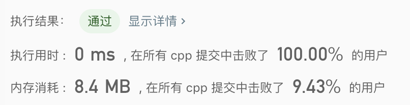

> 原文链接: https://leetcode-cn.com/problems/convert-to-base-2


## 英文原文
<div><p>Given an integer <code>n</code>, return <em>a binary string representing its representation in base</em> <code>-2</code>.</p>

<p><strong>Note</strong> that the returned string should not have leading zeros unless the string is <code>&quot;0&quot;</code>.</p>

<p>&nbsp;</p>
<p><strong>Example 1:</strong></p>

<pre>
<strong>Input:</strong> n = 2
<strong>Output:</strong> &quot;110&quot;
<strong>Explantion:</strong> (-2)<sup>2</sup> + (-2)<sup>1</sup> = 2
</pre>

<p><strong>Example 2:</strong></p>

<pre>
<strong>Input:</strong> n = 3
<strong>Output:</strong> &quot;111&quot;
<strong>Explantion:</strong> (-2)<sup>2</sup> + (-2)<sup>1</sup> + (-2)<sup>0</sup> = 3
</pre>

<p><strong>Example 3:</strong></p>

<pre>
<strong>Input:</strong> n = 4
<strong>Output:</strong> &quot;100&quot;
<strong>Explantion:</strong> (-2)<sup>2</sup> = 4
</pre>

<p>&nbsp;</p>
<p><strong>Constraints:</strong></p>

<ul>
	<li><code>0 &lt;= n &lt;= 10<sup>9</sup></code></li>
</ul>
</div>

## 中文题目
<div><p>给出数字&nbsp;<code>N</code>，返回由若干&nbsp;<code>&quot;0&quot;</code>&nbsp;和&nbsp;<code>&quot;1&quot;</code>组成的字符串，该字符串为 <code>N</code>&nbsp;的<strong>负二进制（<code>base -2</code>）</strong>表示。</p>

<p>除非字符串就是&nbsp;<code>&quot;0&quot;</code>，否则返回的字符串中不能含有前导零。</p>

<p>&nbsp;</p>

<p><strong>示例 1：</strong></p>

<pre><strong>输入：</strong>2
<strong>输出：</strong>&quot;110&quot;
<strong>解释：</strong>(-2) ^ 2 + (-2) ^ 1 = 2
</pre>

<p><strong>示例 2：</strong></p>

<pre><strong>输入：</strong>3
<strong>输出：</strong>&quot;111&quot;
<strong>解释：</strong>(-2) ^ 2 + (-2) ^ 1 + (-2) ^ 0 = 3
</pre>

<p><strong>示例 3：</strong></p>

<pre><strong>输入：</strong>4
<strong>输出：</strong>&quot;100&quot;
<strong>解释：</strong>(-2) ^ 2 = 4
</pre>

<p>&nbsp;</p>

<p><strong>提示：</strong></p>

<ol>
	<li><code>0 &lt;= N &lt;= 10^9</code></li>
</ol>
</div>

## 通过代码
<RecoDemo>
</RecoDemo>


## 高赞题解
通过数学推导可以得到+K/-K进制的通用转化法
```
class Solution {
public:
    // 无论K是正数还是负数都支持（只支持-10～10进制，因为更高进制需要引入字母）
    vector<int> baseK(int N, int K) {
        if (N == 0) return {0};
        vector<int> res;
        while (N != 0) {
            int r = ((N % K) + abs(K)) % abs(K); // 此处为关键
            res.push_back(r);
            N -= r;
            N /= K;
        }
        reverse(res.begin(), res.end());
        return res;
    }
    string baseNeg2(int N) {
        vector<int> nums = baseK(N, -2);
        string res;
        for (auto x : nums) res += to_string(x);
        return res;
    }
};
```



## 统计信息
| 通过次数 | 提交次数 | AC比率 |
| :------: | :------: | :------: |
|    3716    |    6602    |   56.3%   |

## 提交历史
| 提交时间 | 提交结果 | 执行时间 |  内存消耗  | 语言 |
| :------: | :------: | :------: | :--------: | :--------: |


## 相似题目
|                             题目                             | 难度 |
| :----------------------------------------------------------: | :---------: |
| [加密数字](https://leetcode-cn.com/problems/encode-number/) | 中等|
