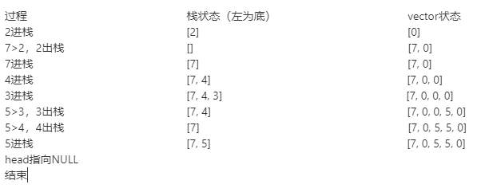

> 原文链接: https://leetcode-cn.com/problems/next-greater-node-in-linked-list


## 英文原文
<div><p>You are given the <code>head</code> of a linked list with <code>n</code> nodes.</p>

<p>For each node in the list, find the value of the <strong>next greater node</strong>. That is, for each node, find the value of the first node that is next to it and has a <strong>strictly larger</strong> value than it.</p>

<p>Return an integer array <code>answer</code> where <code>answer[i]</code> is the value of the next greater node of the <code>i<sup>th</sup></code> node (<strong>1-indexed</strong>). If the <code>i<sup>th</sup></code> node does not have a next greater node, set <code>answer[i] = 0</code>.</p>

<p>&nbsp;</p>
<p><strong>Example 1:</strong></p>

<pre>
<strong>Input:</strong> head = [2,1,5]
<strong>Output:</strong> [5,5,0]
</pre>

<p><strong>Example 2:</strong></p>

<pre>
<strong>Input:</strong> head = [2,7,4,3,5]
<strong>Output:</strong> [7,0,5,5,0]
</pre>

<p>&nbsp;</p>
<p><strong>Constraints:</strong></p>

<ul>
	<li>The number of nodes in the list is <code>n</code>.</li>
	<li><code>1 &lt;= n &lt;= 10<sup>4</sup></code></li>
	<li><code>1 &lt;= Node.val &lt;= 10<sup>9</sup></code></li>
</ul>
</div>

## 中文题目
<div><p>给出一个以头节点&nbsp;<code>head</code>&nbsp;作为第一个节点的链表。链表中的节点分别编号为：<code>node_1, node_2, node_3, ...</code> 。</p>

<p>每个节点都可能有下一个更大值（<em>next larger</em> <strong>value</strong>）：对于&nbsp;<code>node_i</code>，如果其&nbsp;<code>next_larger(node_i)</code>&nbsp;是&nbsp;<code>node_j.val</code>，那么就有&nbsp;<code>j &gt; i</code>&nbsp;且&nbsp;&nbsp;<code>node_j.val &gt; node_i.val</code>，而&nbsp;<code>j</code>&nbsp;是可能的选项中最小的那个。如果不存在这样的&nbsp;<code>j</code>，那么下一个更大值为&nbsp;<code>0</code>&nbsp;。</p>

<p>返回整数答案数组&nbsp;<code>answer</code>，其中&nbsp;<code>answer[i] = next_larger(node_{i+1})</code>&nbsp;。</p>

<p><strong><em>注意：</em></strong>在下面的示例中，诸如 <code>[2,1,5]</code> 这样的<strong>输入</strong>（不是输出）是链表的序列化表示，其头节点的值为&nbsp;2，第二个节点值为 1，第三个节点值为&nbsp;5 。</p>

<p>&nbsp;</p>

<p><strong>示例 1：</strong></p>

<pre><strong>输入：</strong>[2,1,5]
<strong>输出：</strong>[5,5,0]
</pre>

<p><strong>示例 2：</strong></p>

<pre><strong>输入：</strong>[2,7,4,3,5]
<strong>输出：</strong>[7,0,5,5,0]
</pre>

<p><strong>示例 3：</strong></p>

<pre><strong>输入：</strong>[1,7,5,1,9,2,5,1]
<strong>输出：</strong>[7,9,9,9,0,5,0,0]
</pre>

<p>&nbsp;</p>

<p><strong>提示：</strong></p>

<ol>
	<li>对于链表中的每个节点，<code>1 &lt;= node.val&nbsp;&lt;= 10^9</code></li>
	<li>给定列表的长度在 <code>[0, 10000]</code>&nbsp;范围内</li>
</ol>
</div>

## 通过代码
<RecoDemo>
</RecoDemo>


## 高赞题解
### 解题思路：
因为 `vector` 支持扩容，所以可以直接一边扫描一边 `push_back` 直接实现，基础为栈，思路比较简单
我的栈中存储的是元素的 `val` 和下标，每次出栈依靠下标去修改 `vector` 中的值，`val` 则用作比较大小

以示例 $2$ 为例：
`[2,7,4,3,5]`

{:width=550}
{:align=center}


```cpp [-cpp]
class Solution {
public:
    vector<int> nextLargerNodes(ListNode *head)
    {
        int count = 0; //计数，作为下标
        vector<int> result;
        stack<pair<int, int>> tmp; //first为val，second为下标
        while (head)
        {
            result.push_back(0); //给result数组后面+0，1为保证长度，2是默认值（后无更大的值的话）为0
            while (!tmp.empty() &&
                   head->val > tmp.top().first) //栈不为空且head指针的val值大于栈顶的元素的值
            {
                result[tmp.top().second] = head->val; //result数组修改，满足题意要求的最大值，然后出栈，继续循环
                tmp.pop();
            }
            tmp.push(make_pair(head->val, count++)); //count++计数
            head = head->next; //下一个节点
        }
        return result;
    }
};
```


## 统计信息
| 通过次数 | 提交次数 | AC比率 |
| :------: | :------: | :------: |
|    21198    |    35309    |   60.0%   |

## 提交历史
| 提交时间 | 提交结果 | 执行时间 |  内存消耗  | 语言 |
| :------: | :------: | :------: | :--------: | :--------: |
