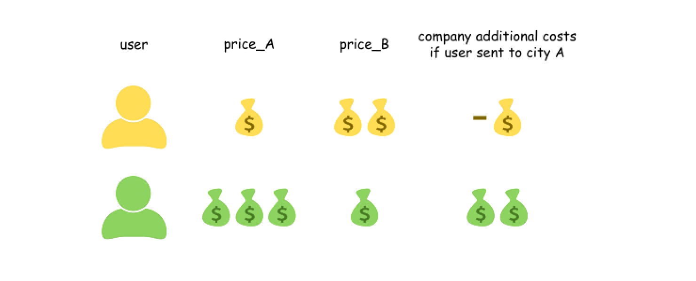

> 原文链接: https://leetcode-cn.com/problems/two-city-scheduling


## 英文原文
<div><p>A company is planning to interview <code>2n</code> people. Given the array <code>costs</code> where <code>costs[i] = [aCost<sub>i</sub>, bCost<sub>i</sub>]</code>,&nbsp;the cost of flying the <code>i<sup>th</sup></code> person to city <code>a</code> is <code>aCost<sub>i</sub></code>, and the cost of flying the <code>i<sup>th</sup></code> person to city <code>b</code> is <code>bCost<sub>i</sub></code>.</p>

<p>Return <em>the minimum cost to fly every person to a city</em> such that exactly <code>n</code> people arrive in each city.</p>

<p>&nbsp;</p>
<p><strong>Example 1:</strong></p>

<pre>
<strong>Input:</strong> costs = [[10,20],[30,200],[400,50],[30,20]]
<strong>Output:</strong> 110
<strong>Explanation: </strong>
The first person goes to city A for a cost of 10.
The second person goes to city A for a cost of 30.
The third person goes to city B for a cost of 50.
The fourth person goes to city B for a cost of 20.

The total minimum cost is 10 + 30 + 50 + 20 = 110 to have half the people interviewing in each city.
</pre>

<p><strong>Example 2:</strong></p>

<pre>
<strong>Input:</strong> costs = [[259,770],[448,54],[926,667],[184,139],[840,118],[577,469]]
<strong>Output:</strong> 1859
</pre>

<p><strong>Example 3:</strong></p>

<pre>
<strong>Input:</strong> costs = [[515,563],[451,713],[537,709],[343,819],[855,779],[457,60],[650,359],[631,42]]
<strong>Output:</strong> 3086
</pre>

<p>&nbsp;</p>
<p><strong>Constraints:</strong></p>

<ul>
	<li><code>2 * n == costs.length</code></li>
	<li><code>2 &lt;= costs.length &lt;= 100</code></li>
	<li><code>costs.length</code> is even.</li>
	<li><code>1 &lt;= aCost<sub>i</sub>, bCost<sub>i</sub> &lt;= 1000</code></li>
</ul>
</div>

## 中文题目
<div><p>公司计划面试 <code>2n</code> 人。给你一个数组 <code>costs</code> ，其中 <code>costs[i] = [aCost<sub>i</sub>, bCost<sub>i</sub>]</code> 。第 <code>i</code> 人飞往 <code>a</code> 市的费用为 <code>aCost<sub>i</sub></code> ，飞往 <code>b</code> 市的费用为 <code>bCost<sub>i</sub></code> 。</p>

<p>返回将每个人都飞到 <code>a</code> 、<code>b</code> 中某座城市的最低费用，要求每个城市都有 <code>n</code> 人抵达<strong>。</strong></p>

<p> </p>

<p><strong>示例 1：</strong></p>

<pre>
<strong>输入：</strong>costs = [[10,20],[30,200],[400,50],[30,20]]
<strong>输出：</strong>110
<strong>解释：</strong>
第一个人去 a 市，费用为 10。
第二个人去 a 市，费用为 30。
第三个人去 b 市，费用为 50。
第四个人去 b 市，费用为 20。

最低总费用为 10 + 30 + 50 + 20 = 110，每个城市都有一半的人在面试。
</pre>

<p><strong>示例 2：</strong></p>

<pre>
<strong>输入：</strong>costs = [[259,770],[448,54],[926,667],[184,139],[840,118],[577,469]]
<strong>输出：</strong>1859
</pre>

<p><strong>示例 3：</strong></p>

<pre>
<strong>输入：</strong>costs = [[515,563],[451,713],[537,709],[343,819],[855,779],[457,60],[650,359],[631,42]]
<strong>输出：</strong>3086
</pre>

<p> </p>

<p><strong>提示：</strong></p>

<ul>
	<li><code>2 * n == costs.length</code></li>
	<li><code>2 <= costs.length <= 100</code></li>
	<li><code>costs.length</code> 为偶数</li>
	<li><code>1 <= aCost<sub>i</sub>, bCost<sub>i</sub> <= 1000</code></li>
</ul>
</div>

## 通过代码
<RecoDemo>
</RecoDemo>


## 官方题解
#### 方法一：贪心

**分析**

我们这样来看这个问题，公司首先将这 $2N$ 个人全都安排飞往 $B$ 市，再选出 $N$ 个人改变它们的行程，让他们飞往 $A$ 市。如果选择改变一个人的行程，那么公司将会额外付出 `price_A - price_B` 的费用，这个费用可正可负。

{:width=600}
{:align=center}

因此最优的方案是，选出 `price_A - price_B` 最小的 $N$ 个人，让他们飞往 `A` 市，其余人飞往 `B` 市。

**算法**

- 按照 `price_A - price_B` 从小到大排序；

- 将前 $N$ 个人飞往 `A` 市，其余人飞往 `B` 市，并计算出总费用。

```Python [sol1]
class Solution:
    def twoCitySchedCost(self, costs: List[List[int]]) -> int:
        # Sort by a gain which company has 
        # by sending a person to city A and not to city B
        costs.sort(key = lambda x : x[0] - x[1])
        
        total = 0
        n = len(costs) // 2
        # To optimize the company expenses,
        # send the first n persons to the city A
        # and the others to the city B
        for i in range(n):
            total += costs[i][0] + costs[i + n][1]
        return total
```

```Java [sol1]
class Solution {
    public int twoCitySchedCost(int[][] costs) {
      // Sort by a gain which company has 
      // by sending a person to city A and not to city B
      Arrays.sort(costs, new Comparator<int[]>() {
          @Override
          public int compare(int[] o1, int[] o2) {
              return o1[0] - o1[1] - (o2[0] - o2[1]);
          }
      });

      int total = 0;
      int n = costs.length / 2;
      // To optimize the company expenses,
      // send the first n persons to the city A
      // and the others to the city B
      for (int i = 0; i < n; ++i) total += costs[i][0] + costs[i + n][1];
      return total;
    }
}
```

```C++ [sol1]
class Solution {
    public:
    int twoCitySchedCost(vector<vector<int>>& costs) {
        // Sort by a gain which company has 
        // by sending a person to city A and not to city B
        sort(begin(costs), end(costs),
                [](const vector<int> &o1, const vector<int> &o2) {
            return (o1[0] - o1[1] < o2[0] - o2[1]);
        });

        int total = 0;
        int n = costs.size() / 2;
        // To optimize the company expenses,
        // send the first n persons to the city A
        // and the others to the city B
        for (int i = 0; i < n; ++i) total += costs[i][0] + costs[i + n][1];
        return total;
    }
};
```

**复杂度分析**

* 时间复杂度：$O(N \log N)$，需要对 `price_A - price_B` 进行排序。

* 空间复杂度：$O(1)$。

## 统计信息
| 通过次数 | 提交次数 | AC比率 |
| :------: | :------: | :------: |
|    17489    |    26532    |   65.9%   |

## 提交历史
| 提交时间 | 提交结果 | 执行时间 |  内存消耗  | 语言 |
| :------: | :------: | :------: | :--------: | :--------: |
