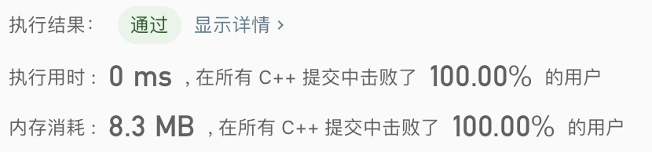

> 原文链接: https://leetcode-cn.com/problems/moving-stones-until-consecutive


## 英文原文
<div><p>There are three stones in different positions on the X-axis. You are given three integers <code>a</code>, <code>b</code>, and <code>c</code>, the positions of the stones.</p>

<p>In one move, you pick up a stone at an endpoint (i.e., either the lowest or highest position stone), and move it to an unoccupied position between those endpoints. Formally, let&#39;s say the stones are currently at positions <code>x</code>, <code>y</code>, and <code>z</code> with <code>x &lt; y &lt; z</code>. You pick up the stone at either position <code>x</code> or position <code>z</code>, and move that stone to an integer position <code>k</code>, with <code>x &lt; k &lt; z</code> and <code>k != y</code>.</p>

<p>The game ends when you cannot make any more moves (i.e., the stones are in three consecutive positions).</p>

<p>Return <em>an integer array </em><code>answer</code><em> of length </em><code>2</code><em> where</em>:</p>

<ul>
	<li><code>answer[0]</code> <em>is the minimum number of moves you can play, and</em></li>
	<li><code>answer[1]</code> <em>is the maximum number of moves you can play</em>.</li>
</ul>

<p>&nbsp;</p>
<p><strong>Example 1:</strong></p>

<pre>
<strong>Input:</strong> a = 1, b = 2, c = 5
<strong>Output:</strong> [1,2]
<strong>Explanation:</strong> Move the stone from 5 to 3, or move the stone from 5 to 4 to 3.
</pre>

<p><strong>Example 2:</strong></p>

<pre>
<strong>Input:</strong> a = 4, b = 3, c = 2
<strong>Output:</strong> [0,0]
<strong>Explanation:</strong> We cannot make any moves.
</pre>

<p><strong>Example 3:</strong></p>

<pre>
<strong>Input:</strong> a = 3, b = 5, c = 1
<strong>Output:</strong> [1,2]
<strong>Explanation:</strong> Move the stone from 1 to 4; or move the stone from 1 to 2 to 4.
</pre>

<p>&nbsp;</p>
<p><strong>Constraints:</strong></p>

<ul>
	<li><code>1 &lt;= a, b, c &lt;= 100</code></li>
	<li><code>a</code>, <code>b</code>, and <code>c</code> have different values.</li>
</ul>
</div>

## 中文题目
<div><p>三枚石子放置在数轴上，位置分别为 <code>a</code>，<code>b</code>，<code>c</code>。</p>

<p>每一回合，你可以从两端之一拿起一枚石子（位置最大或最小），并将其放入两端之间的任一空闲位置。形式上，假设这三枚石子当前分别位于位置 <code>x, y, z</code> 且 <code>x < y < z</code>。那么就可以从位置 <code>x</code> 或者是位置 <code>z</code> 拿起一枚石子，并将该石子移动到某一整数位置 <code>k</code> 处，其中 <code>x < k < z</code> 且 <code>k != y</code>。</p>

<p>当你无法进行任何移动时，即，这些石子的位置连续时，游戏结束。</p>

<p>要使游戏结束，你可以执行的最小和最大移动次数分别是多少？ 以长度为 2 的数组形式返回答案：<code>answer = [minimum_moves, maximum_moves]</code></p>

<p> </p>

<p><strong>示例 1：</strong></p>

<pre>
<strong>输入：</strong>a = 1, b = 2, c = 5
<strong>输出：</strong>[1, 2]
<strong>解释：</strong>将石子从 5 移动到 4 再移动到 3，或者我们可以直接将石子移动到 3。
</pre>

<p><strong>示例 2：</strong></p>

<pre>
<strong>输入：</strong>a = 4, b = 3, c = 2
<strong>输出：</strong>[0, 0]
<strong>解释：</strong>我们无法进行任何移动。
</pre>

<p> </p>

<p><strong>提示：</strong></p>

<ol>
	<li><code>1 <= a <= 100</code></li>
	<li><code>1 <= b <= 100</code></li>
	<li><code>1 <= c <= 100</code></li>
	<li><code>a != b, b != c, c != a</code></li>
</ol>
</div>

## 通过代码
<RecoDemo>
</RecoDemo>


## 高赞题解

分情况讨论即可。
```
class Solution {
public:
    vector<int> numMovesStones(int a, int b, int c) {
        int x=min(min(a,b),c);
        int z=max(max(a,b),c);
        int y=a+b+c-x-z;
        if(y-x==1 && z-y==1) return {0,0};
        if(y-x<=2 || z-y<=2) return {1,z-y+y-x-2};
        else return {2,z-y+y-x-2};
    }
};
```


## 统计信息
| 通过次数 | 提交次数 | AC比率 |
| :------: | :------: | :------: |
|    11246    |    28643    |   39.3%   |

## 提交历史
| 提交时间 | 提交结果 | 执行时间 |  内存消耗  | 语言 |
| :------: | :------: | :------: | :--------: | :--------: |
