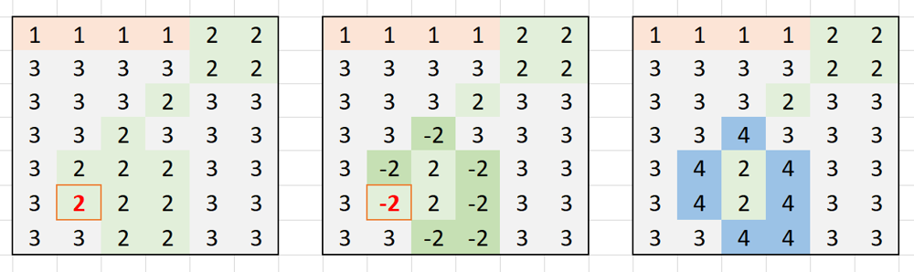

> 原文链接: https://leetcode-cn.com/problems/coloring-a-border


## 英文原文
<div><p>You are given an <code>m x n</code> integer matrix <code>grid</code>, and three integers <code>row</code>, <code>col</code>, and <code>color</code>. Each value in the grid represents the color of the grid square at that location.</p>

<p>Two squares belong to the same <strong>connected component</strong> if they have the same color and are next to each other in any of the 4 directions.</p>

<p>The <strong>border of a connected component</strong> is all the squares in the connected component that are either <strong>4-directionally</strong> adjacent to a square not in the component, or on the boundary of the grid (the first or last row or column).</p>

<p>You should color the <strong>border</strong> of the <strong>connected component</strong> that contains the square <code>grid[row][col]</code> with <code>color</code>.</p>

<p>Return <em>the final grid</em>.</p>

<p>&nbsp;</p>
<p><strong>Example 1:</strong></p>
<pre><strong>Input:</strong> grid = [[1,1],[1,2]], row = 0, col = 0, color = 3
<strong>Output:</strong> [[3,3],[3,2]]
</pre><p><strong>Example 2:</strong></p>
<pre><strong>Input:</strong> grid = [[1,2,2],[2,3,2]], row = 0, col = 1, color = 3
<strong>Output:</strong> [[1,3,3],[2,3,3]]
</pre><p><strong>Example 3:</strong></p>
<pre><strong>Input:</strong> grid = [[1,1,1],[1,1,1],[1,1,1]], row = 1, col = 1, color = 2
<strong>Output:</strong> [[2,2,2],[2,1,2],[2,2,2]]
</pre>
<p>&nbsp;</p>
<p><strong>Constraints:</strong></p>

<ul>
	<li><code>m == grid.length</code></li>
	<li><code>n == grid[i].length</code></li>
	<li><code>1 &lt;= m, n &lt;= 50</code></li>
	<li><code>1 &lt;= grid[i][j], color &lt;= 1000</code></li>
	<li><code>0 &lt;= row &lt; m</code></li>
	<li><code>0 &lt;= col &lt; n</code></li>
</ul>
</div>

## 中文题目
<div><p>给你一个大小为 <code>m x n</code> 的整数矩阵 <code>grid</code> ，表示一个网格。另给你三个整数&nbsp;<code>row</code>、<code>col</code> 和 <code>color</code> 。网格中的每个值表示该位置处的网格块的颜色。</p>

<p>当两个网格块的颜色相同，而且在四个方向中任意一个方向上相邻时，它们属于同一<strong> 连通分量 </strong>。</p>

<p><strong>连通分量的边界</strong><strong> </strong>是指连通分量中的所有与不在分量中的网格块相邻（四个方向上）的所有网格块，或者在网格的边界上（第一行/列或最后一行/列）的所有网格块。</p>

<p>请你使用指定颜色&nbsp;<code>color</code> 为所有包含网格块&nbsp;<code>grid[row][col]</code> 的 <strong>连通分量的边界</strong> 进行着色，并返回最终的网格&nbsp;<code>grid</code> 。</p>

<p>&nbsp;</p>

<p><strong>示例 1：</strong></p>

<pre>
<strong>输入：</strong>grid = [[1,1],[1,2]], row = 0, col = 0, color = 3
<strong>输出：</strong>[[3,3],[3,2]]</pre>

<p><strong>示例 2：</strong></p>

<pre>
<strong>输入：</strong>grid = [[1,2,2],[2,3,2]], row = 0, col = 1, color = 3
<strong>输出：</strong>[[1,3,3],[2,3,3]]</pre>

<p><strong>示例 3：</strong></p>

<pre>
<strong>输入：</strong>grid = [[1,1,1],[1,1,1],[1,1,1]], row = 1, col = 1, color = 2
<strong>输出：</strong>[[2,2,2],[2,1,2],[2,2,2]]</pre>

<p>&nbsp;</p>

<p><strong>提示：</strong></p>

<ul>
	<li><code>m == grid.length</code></li>
	<li><code>n == grid[i].length</code></li>
	<li><code>1 &lt;= m, n &lt;= 50</code></li>
	<li><code>1 &lt;= grid[i][j], color &lt;= 1000</code></li>
	<li><code>0 &lt;= row &lt; m</code></li>
	<li><code>0 &lt;= col &lt; n</code></li>
</ul>

<p>&nbsp;</p>
</div>

## 通过代码
<RecoDemo>
</RecoDemo>


## 高赞题解
### 题意


### DFS

```cpp
class Solution {
private:
    void dfs(vector<vector<int>>& grid, int r, int c, int firstColor) {
        if (r < 0 || r >= grid.size() || c < 0 || c >= grid[0].size() || grid[r][c] != firstColor) {
            return;
        }
        grid[r][c] = -firstColor;   // 标记方格颜色为相反数，表示已经访问过
        dfs(grid, r - 1, c, firstColor);
        dfs(grid, r + 1, c, firstColor);
        dfs(grid, r, c - 1, firstColor);
        dfs(grid, r, c + 1, firstColor);
        // dfs搜索结束之后，判断本单元格是否属于连通分量内部，如果是就将颜色反转为正数
        if (r > 0 && r < grid.size() - 1 && c > 0 && c < grid[0].size() - 1 &&
        firstColor == abs(grid[r - 1][c]) && firstColor == abs(grid[r + 1][c]) &&
        firstColor == abs(grid[r][c - 1]) && firstColor == abs(grid[r][c + 1])) {
            grid[r][c] = firstColor;
        }
    }
public:
    vector<vector<int>> colorBorder(vector<vector<int>>& grid, int r0, int c0, int color) {
        dfs(grid, r0, c0, grid[r0][c0]);
        for (int i = 0; i < grid.size(); ++i) {
            for (int j = 0; j < grid[0].size(); ++j) {
                // 至此，单元格值为负数的都是连通分量的边界，颜色调整为 color
                grid[i][j] = grid[i][j] < 0 ? color : grid[i][j];
            }
        }
        return grid;
    }
};
```

## 统计信息
| 通过次数 | 提交次数 | AC比率 |
| :------: | :------: | :------: |
|    4853    |    11060    |   43.9%   |

## 提交历史
| 提交时间 | 提交结果 | 执行时间 |  内存消耗  | 语言 |
| :------: | :------: | :------: | :--------: | :--------: |


## 相似题目
|                             题目                             | 难度 |
| :----------------------------------------------------------: | :---------: |
| [岛屿的周长](https://leetcode-cn.com/problems/island-perimeter/) | 简单|
