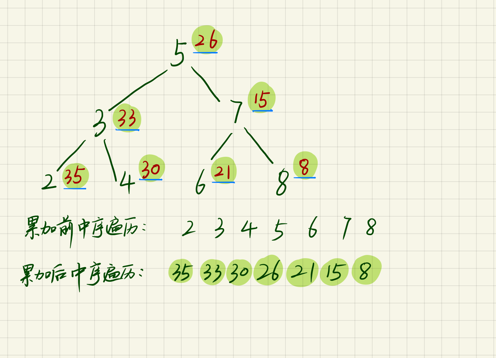

> 原文链接: https://leetcode-cn.com/problems/binary-search-tree-to-greater-sum-tree


## 英文原文
<div><p>Given the <code>root</code> of a Binary Search Tree (BST), convert it to a Greater Tree such that every key of the original BST is changed to the original key plus the sum of all keys greater than the original key in BST.</p>

<p>As a reminder, a <em>binary search tree</em> is a tree that satisfies these constraints:</p>

<ul>
	<li>The left subtree of a node contains only nodes with keys <strong>less than</strong> the node&#39;s key.</li>
	<li>The right subtree of a node contains only nodes with keys <strong>greater than</strong> the node&#39;s key.</li>
	<li>Both the left and right subtrees must also be binary search trees.</li>
</ul>

<p>&nbsp;</p>
<p><strong>Example 1:</strong></p>

<pre>
<strong>Input:</strong> root = [4,1,6,0,2,5,7,null,null,null,3,null,null,null,8]
<strong>Output:</strong> [30,36,21,36,35,26,15,null,null,null,33,null,null,null,8]
</pre>

<p><strong>Example 2:</strong></p>

<pre>
<strong>Input:</strong> root = [0,null,1]
<strong>Output:</strong> [1,null,1]
</pre>

<p><strong>Example 3:</strong></p>

<pre>
<strong>Input:</strong> root = [1,0,2]
<strong>Output:</strong> [3,3,2]
</pre>

<p><strong>Example 4:</strong></p>

<pre>
<strong>Input:</strong> root = [3,2,4,1]
<strong>Output:</strong> [7,9,4,10]
</pre>

<p>&nbsp;</p>
<p><strong>Constraints:</strong></p>

<ul>
	<li>The number of nodes in the tree is in the range <code>[1, 100]</code>.</li>
	<li><code>0 &lt;= Node.val &lt;= 100</code></li>
	<li>All the values in the tree are <strong>unique</strong>.</li>
	<li><code>root</code> is guaranteed to be a valid binary search tree.</li>
</ul>

<p>&nbsp;</p>
<p><strong>Note:</strong> This question is the same as 538: <a href="https://leetcode.com/problems/convert-bst-to-greater-tree/" target="_blank">https://leetcode.com/problems/convert-bst-to-greater-tree/</a></p>
</div>

## 中文题目
<div><p><span style="font-size:10.5pt"><span style="font-family:Calibri"><span style="font-size:10.5000pt"><span style="font-family:宋体"><font face="宋体">给定一个二叉搜索树，请将它的每个</font></span></span></span></span>节点<span style="font-size:10.5pt"><span style="font-family:Calibri"><span style="font-size:10.5000pt"><span style="font-family:宋体"><font face="宋体">的值替换成树中大于或者等于该</font></span></span></span></span>节点<span style="font-size:10.5pt"><span style="font-family:Calibri"><span style="font-size:10.5000pt"><span style="font-family:宋体"><font face="宋体">值的所有</font></span></span></span></span>节点<span style="font-size:10.5pt"><span style="font-family:Calibri"><span style="font-size:10.5000pt"><span style="font-family:宋体"><font face="宋体">值之和。</font></span></span></span></span></p>

<p>提醒一下，二叉搜索树满足下列约束条件：</p>

<ul>
	<li>节点的左子树仅包含键<strong> 小于 </strong>节点键的节点。</li>
	<li>节点的右子树仅包含键<strong> 大于</strong> 节点键的节点。</li>
	<li>左右子树也必须是二叉搜索树。</li>
</ul>

<p><strong>注意：</strong>该题目与 538: <a href="https://leetcode-cn.com/problems/convert-bst-to-greater-tree/">https://leetcode-cn.com/problems/convert-bst-to-greater-tree/  </a>相同</p>

<p> </p>

<p><strong>示例 1：</strong></p>

<p><strong></strong></p>

<pre>
<strong>输入：</strong>[4,1,6,0,2,5,7,null,null,null,3,null,null,null,8]
<strong>输出：</strong>[30,36,21,36,35,26,15,null,null,null,33,null,null,null,8]
</pre>

<p><strong>示例 2：</strong></p>

<pre>
<strong>输入：</strong>root = [0,null,1]
<strong>输出：</strong>[1,null,1]
</pre>

<p><strong>示例 3：</strong></p>

<pre>
<strong>输入：</strong>root = [1,0,2]
<strong>输出：</strong>[3,3,2]
</pre>

<p><strong>示例 4：</strong></p>

<pre>
<strong>输入：</strong>root = [3,2,4,1]
<strong>输出：</strong>[7,9,4,10]
</pre>

<p> </p>

<p><strong>提示：</strong></p>

<ul>
	<li>树中的节点数介于 <code>1</code> 和 <code>100</code> 之间。</li>
	<li>每个节点的值介于 <code>0</code> 和 <code>100</code> 之间。</li>
	<li>树中的所有值 <strong>互不相同</strong> 。</li>
	<li>给定的树为二叉搜索树。</li>
</ul>
</div>

## 通过代码
<RecoDemo>
</RecoDemo>


## 高赞题解
### 解题思路
本题是关于二叉搜索树的问题，那我们第一想到的就是中序遍历，这是二叉搜索树的一个非常重要的性质，**二叉搜索树的中序遍历是一个递增的有序序列**。本道题我们需要将其转换为累加树，使得每个节点的值是原来的节点值加上所有大于它的节点值之和。那我们看下面的例子：




观察**累加前中序遍历**与**累加后中序遍历**，我们会发现，其实后者就是前者的一个从后的累加结果。那问题就迎刃而解了，我们只需反向中序遍历即可,并把每次的节点值进行累加，就能得到最终的累加树。而且这样保证了我们对每个节点只访问了一次。

### 代码

```java
/**
 * Definition for a binary tree node.
 * public class TreeNode {
 *     int val;
 *     TreeNode left;
 *     TreeNode right;
 *     TreeNode(int x) { val = x; }
 * }
 */
class Solution {
    int sum = 0;
    public TreeNode bstToGst(TreeNode root) {
        if(root != null){
            bstToGst(root.right);
            sum = sum + root.val;
            root.val = sum;
            bstToGst(root.left);
        }
        return root;

    }
}
```

## 统计信息
| 通过次数 | 提交次数 | AC比率 |
| :------: | :------: | :------: |
|    26858    |    33813    |   79.4%   |

## 提交历史
| 提交时间 | 提交结果 | 执行时间 |  内存消耗  | 语言 |
| :------: | :------: | :------: | :--------: | :--------: |
