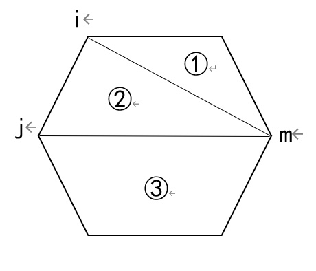
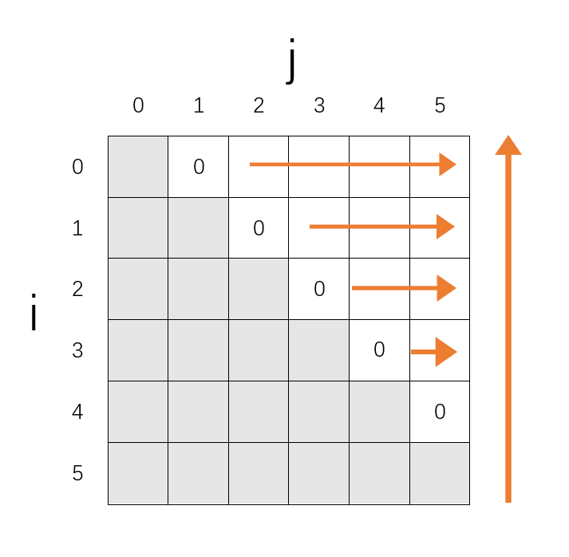

> 原文链接: https://leetcode-cn.com/problems/minimum-score-triangulation-of-polygon


## 英文原文
<div><p>You have a convex <code>n</code>-sided polygon where each vertex has an integer value. You are given an integer array <code>values</code> where <code>values[i]</code> is the value of the <code>i<sup>th</sup></code> vertex (i.e., <strong>clockwise order</strong>).</p>

<p>You will <strong>triangulate</strong> the polygon into <code>n - 2</code> triangles. For each triangle, the value of that triangle is the product of the values of its vertices, and the total score of the triangulation is the sum of these values over all <code>n - 2</code> triangles in the triangulation.</p>

<p>Return <em>the smallest possible total score that you can achieve with some triangulation of the polygon</em>.</p>

<p>&nbsp;</p>
<p><strong>Example 1:</strong></p>

<pre>
<strong>Input:</strong> values = [1,2,3]
<strong>Output:</strong> 6
<strong>Explanation:</strong> The polygon is already triangulated, and the score of the only triangle is 6.
</pre>

<p><strong>Example 2:</strong></p>

<pre>
<strong>Input:</strong> values = [3,7,4,5]
<strong>Output:</strong> 144
<strong>Explanation:</strong> There are two triangulations, with possible scores: 3*7*5 + 4*5*7 = 245, or 3*4*5 + 3*4*7 = 144.
The minimum score is 144.
</pre>

<p><strong>Example 3:</strong></p>

<pre>
<strong>Input:</strong> values = [1,3,1,4,1,5]
<strong>Output:</strong> 13
<strong>Explanation:</strong> The minimum score triangulation has score 1*1*3 + 1*1*4 + 1*1*5 + 1*1*1 = 13.
</pre>

<p>&nbsp;</p>
<p><strong>Constraints:</strong></p>

<ul>
	<li><code>n == values.length</code></li>
	<li><code>3 &lt;= n &lt;= 50</code></li>
	<li><code>1 &lt;= values[i] &lt;= 100</code></li>
</ul>
</div>

## 中文题目
<div><p>给定&nbsp;<code>N</code>，想象一个凸&nbsp;<code>N</code>&nbsp;边多边形，其顶点按顺时针顺序依次标记为&nbsp;<code>A[0], A[i], ..., A[N-1]</code>。</p>

<p>假设您将多边形剖分为 <code>N-2</code> 个三角形。对于每个三角形，该三角形的值是顶点标记的<strong>乘积</strong>，三角剖分的分数是进行三角剖分后所有 <code>N-2</code> 个三角形的值之和。</p>

<p>返回多边形进行三角剖分后可以得到的最低分。<br>
&nbsp;</p>

<ol>
</ol>

<p><strong>示例 1：</strong></p>

<pre><strong>输入：</strong>[1,2,3]
<strong>输出：</strong>6
<strong>解释：</strong>多边形已经三角化，唯一三角形的分数为 6。
</pre>

<p><strong>示例 2：</strong></p>

<p></p>

<pre><strong>输入：</strong>[3,7,4,5]
<strong>输出：</strong>144
<strong>解释：</strong>有两种三角剖分，可能得分分别为：3*7*5 + 4*5*7 = 245，或 3*4*5 + 3*4*7 = 144。最低分数为 144。
</pre>

<p><strong>示例 3：</strong></p>

<pre><strong>输入：</strong>[1,3,1,4,1,5]
<strong>输出：</strong>13
<strong>解释：</strong>最低分数三角剖分的得分情况为 1*1*3 + 1*1*4 + 1*1*5 + 1*1*1 = 13。
</pre>

<p>&nbsp;</p>

<p><strong>提示：</strong></p>

<ol>
	<li><code>3 &lt;= A.length &lt;= 50</code></li>
	<li><code>1 &lt;= A[i] &lt;= 100</code></li>
</ol>
</div>

## 通过代码
<RecoDemo>
</RecoDemo>


## 高赞题解
### 解题思路
dp[i][j]表示从i到j序列的最低分。记底边为ij的三角形顶点为m，三角形imj将多边形分成三部分，总分即为三部分的分数和（如果m=i+1或m=j-1，则对应第一或第三部分分数为0）。
那么m在什么位置分数最低呢，将m从i+1到j-1遍历，分别计算`dp[i][m]+A[i]*A[j]*A[m]+dp[m][j]`,取其中最小值即为dp[i][j]。
`dp[i][j]=min(dp[i][m]+A[i]*A[j]*A[m]+dp[m][j]),for m in range [i+1,j-1]`


dp table只用到右上半部分，初始化相邻两元素序列结果为0（两元素序列不能构成三角形）；采用自底向上、自左向右的方向计算dp table（也可以选择别的遍历顺序，只要保证从左下往右上就行了）。最终输出dp[0][n-1]。


新手小白的介绍和代码希望大家多提意见。


### 代码

```cpp
class Solution {                                                                                                                                                                                               
public:
    int minScoreTriangulation(vector<int>& A) {
        int n = A.size();
	int **dp = new int*[n];
	for (int i = 0; i < n; i++)  dp[i] = new int[n]();//初始化全0
        
        for (int i = n-3; i >= 0; i--) {
            for (int j = i + 2; j < n;j++) {
                for (int m = i + 1; m < j; m++) {
                    if(dp[i][j]==0) 
                        dp[i][j]= A[i] * A[j] * A[m] + dp[i][m] + dp[m][j];
                    else 
                        dp[i][j] = min(dp[i][j],A[i] * A[j] * A[m] + dp[i][m] + dp[m][j]);
                }
            }
        }
        return dp[0][n - 1];
    }
};
```




## 统计信息
| 通过次数 | 提交次数 | AC比率 |
| :------: | :------: | :------: |
|    4714    |    8460    |   55.7%   |

## 提交历史
| 提交时间 | 提交结果 | 执行时间 |  内存消耗  | 语言 |
| :------: | :------: | :------: | :--------: | :--------: |
