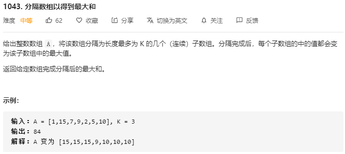
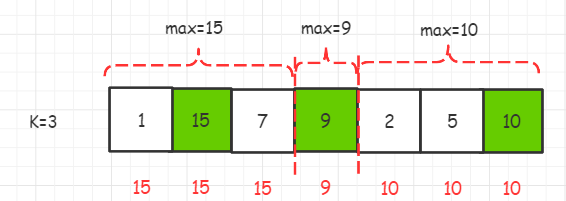
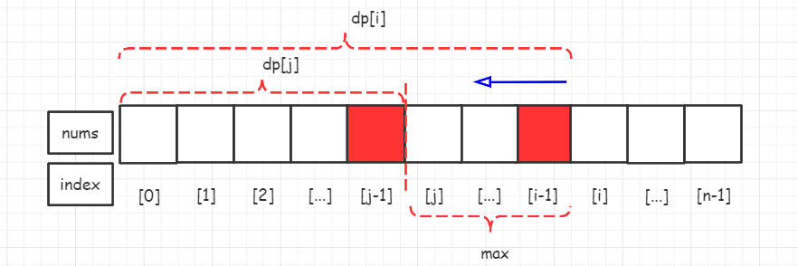

> 原文链接: https://leetcode-cn.com/problems/partition-array-for-maximum-sum


## 英文原文
<div><p>Given an integer array <code>arr</code>, partition the array into (contiguous) subarrays of length <strong>at most</strong> <code>k</code>. After partitioning, each subarray has their values changed to become the maximum value of that subarray.</p>

<p>Return <em>the largest sum of the given array after partitioning. Test cases are generated so that the answer fits in a <strong>32-bit</strong> integer.</em></p>

<p>&nbsp;</p>
<p><strong>Example 1:</strong></p>

<pre>
<strong>Input:</strong> arr = [1,15,7,9,2,5,10], k = 3
<strong>Output:</strong> 84
<strong>Explanation:</strong> arr becomes [15,15,15,9,10,10,10]
</pre>

<p><strong>Example 2:</strong></p>

<pre>
<strong>Input:</strong> arr = [1,4,1,5,7,3,6,1,9,9,3], k = 4
<strong>Output:</strong> 83
</pre>

<p><strong>Example 3:</strong></p>

<pre>
<strong>Input:</strong> arr = [1], k = 1
<strong>Output:</strong> 1
</pre>

<p>&nbsp;</p>
<p><strong>Constraints:</strong></p>

<ul>
	<li><code>1 &lt;= arr.length &lt;= 500</code></li>
	<li><code>0 &lt;= arr[i] &lt;= 10<sup>9</sup></code></li>
	<li><code>1 &lt;= k &lt;= arr.length</code></li>
</ul>
</div>

## 中文题目
<div><p>给你一个整数数组 <code>arr</code>，请你将该数组分隔为长度最多为 k 的一些（连续）子数组。分隔完成后，每个子数组的中的所有值都会变为该子数组中的最大值。</p>

<p>返回将数组分隔变换后能够得到的元素最大和。</p>

<p> </p>

<p><strong>注意，</strong>原数组和分隔后的数组对应顺序应当一致，也就是说，你只能选择分隔数组的位置而不能调整数组中的顺序。</p>

<p> </p>

<p><strong>示例 1：</strong></p>

<pre>
<strong>输入：</strong>arr = [1,15,7,9,2,5,10], k = 3
<strong>输出：</strong>84
<strong>解释：</strong>
因为 k=3 可以分隔成 [1,15,7] [9] [2,5,10]，结果为 [15,15,15,9,10,10,10]，和为 84，是该数组所有分隔变换后元素总和最大的。
若是分隔成 [1] [15,7,9] [2,5,10]，结果就是 [1, 15, 15, 15, 10, 10, 10] 但这种分隔方式的元素总和（76）小于上一种。 </pre>

<p><strong>示例 2：</strong></p>

<pre>
<strong>输入：</strong>arr = [1,4,1,5,7,3,6,1,9,9,3], k = 4
<strong>输出：</strong>83
</pre>

<p><strong>示例 3：</strong></p>

<pre>
<strong>输入：</strong>arr = [1], k = 1
<strong>输出：</strong>1
</pre>

<p> </p>

<p><strong>提示：</strong></p>

<ul>
	<li><code>1 <= arr.length <= 500</code></li>
	<li><code>0 <= arr[i] <= 10<sup>9</sup></code></li>
	<li><code>1 <= k <= arr.length</code></li>
</ul>
</div>

## 通过代码
<RecoDemo>
</RecoDemo>


## 高赞题解
### 解题思路：
写本题，源自看到的官方的一句描述 “**「将数组分割为 m 段，求……」是动态规划题目常见的问法。**”，让我想起了之前写的 **1043. 分隔数组以得到最大和**，早期写的题解，风格更像一种草稿，但还是有很多扣友鼓励似的阅读点赞，感谢感谢，笔芯~






{:width="350px"}{:align="left"}




### 定义状态

**$dp[i]$：数组的前 $i$ 个数即 $nums[0,1...i-1]$，被切了 $Y-1$ 刀，分割成 $Y$ 个数组，满足每个数组的个数最大值不超过 $K$，每个数组的值变成最大值，分割后的最大和**，如上图，当被分成 $Y=3$ 个部分时，第一部分的最大值为 $15$，第二部分为 $9$，第三部分 $10$，每一部分的每个值都上升为当前部分的局部 $max$，红色字体为新的值，累加后，求其最大值

### 转移方程

{:width="450px"}{:align="left"}



要想求 $dp[i]$，这是**数组的前 $i$ 个数即 $nums[0,1...i-1]$，被切了 $Y-1$ 刀，分割成 $Y$ 个数组，满足每个数组的个数最大值不超过 $K$，每个数组的值变成最大值，分割后的最大和**

- 求 $dp[i-1]$，表示数组的前 $i$  个数即 $nums[0,1...i-2]$，第二部分是 $nums[i-1]$，也就是说 $dp[i-1]$ + $max(nums[i-1])$*$(i-(i-1))$
- 求 $dp[i-2]$，表示数组的前 $i-1$ 个数即 $nums[0,1...i-3]$，第二部分是 $nums[i-2...i-1]$，也就是说 $dp[i-2]$ + $max(nums[i-2...i-1])$ * $(i-(i-2))$
- 求 $dp[i-3]$，表示数组的前 $i-2$ 个数即 $nums[0,1...i-4]$，第二部分是 $nums[i-3...i-1]$，也就是说 $dp[i-3]$ + $max(nums[i-3...i-1])$ * $(i-(i-3))$
- ...
- 求 $dp[0]$，表示数组的前 $1$ 个数即 $nums[0,0]$，第二部分是 $nums[0...i-1]$，也就是说 $dp[0]$ + $max(nums[0...i-1])$ * $(i-(0))$

**求上面的的最大值**

可以推导出 $dp[i]$=$max$($dp[i]$，$dp[j]+(i-j)*MAX$)，其中 $MAX$ 是 $nums[j...i-1]$  范围内的局部最大值，一旦找到最大值，该范围内的所有值都改成这个局部最大值 $MAX$，其中 0=<$j$<$i$

### 初始化边界

$i-j$ 如果大于 $K$，后面 $nums[i...n]$ 这部分将没有办法被涵盖进来，一个条件:$i-j$<=$K$

$j$>=0，这个没啥好说的

$dp$ 初始化的时候容量为 $n+1$，要求的 $dp[n]$ 表示**数组的前 $n$ 个数即 $nums[0,1...n]$，被切了 $Y-1$ 刀，分割成 $Y$ 个数组，满足每个数组的个数最大值不超过 $K$，每个数组的值变成最大值，分割后的最大和**

### 编码技巧

- $i$  从左到右遍历，$j$  起始为 $i-1$ 从右往左遍历
- 注意记录局部的最大值  $MAX$

### 完整代码
```Java []
    public int maxSumAfterPartitioning(int[] A, int K) {
        int n = A.length;
        int[] dp = new int[n + 1];
        for (int i = 0; i <= n; i++) {
            int j = i - 1;
            int max = dp[i];
            while ((i - j) <= K && j >= 0) {
                max = Math.max(max, A[j]);
                dp[i] = Math.max(dp[i], dp[j] + (i - j) * max);
                j--;
            }
        }
        return dp[n];
    }
```
```C++ []
class Solution {
public:
    int maxSumAfterPartitioning(vector<int>& A, int K) {
        // f[i] = max(f[j] + (i-j)*max(A[j..i]))

        int n = A.size();
        vector<int> f(n+1);
        for (int i = 0; i <= n; i++) {
            int curMax = 0;
            // consider past integers [j...i]
            for (int j = i-1; (i-j)<=K && j>=0; j--) {
                curMax = max(curMax, A[j]);
                f[i] = max(f[i], f[j] + (i-j)*curMax);
            }
        }
        return f[n];
    }
};
```







### 总结

- 动态规划的题目，需要想到一些基本的情况，可以像数学归纳法一样思考


### 推荐阅读


| 题号 | 链接                                                         | 备注 |
| ---- | ------------------------------------------------------------ | ---- |
| 410  | [动态规划解分割数组I[Red Fox]](https://leetcode-cn.com/problems/split-array-largest-sum/solution/dong-tai-gui-hua-jie-fen-ge-shu-zu-ired-fox-by-a-f/) |      |
| 1043  | [动态规划解分割数组II[Arctic Fox]](https://leetcode-cn.com/problems/partition-array-for-maximum-sum/solution/leetcodebi-ji-java-py-si-ke-yi-dao-ti-1043-fen-ge-/) |      |
|      |           




## 番外：

最近阿飞把链接做成了脑图（下图），整理起来，后期会做成PDF，感兴趣的同学关注下，不迷路，[个人主页【阿飞算法】](https://blog.csdn.net/wat1r/article/details/117533156) ，关注公众号会弹出资料下载地址，每个分支可以点击链接跳转，欢迎交流。









## 统计信息
| 通过次数 | 提交次数 | AC比率 |
| :------: | :------: | :------: |
|    8106    |    11732    |   69.1%   |

## 提交历史
| 提交时间 | 提交结果 | 执行时间 |  内存消耗  | 语言 |
| :------: | :------: | :------: | :--------: | :--------: |
