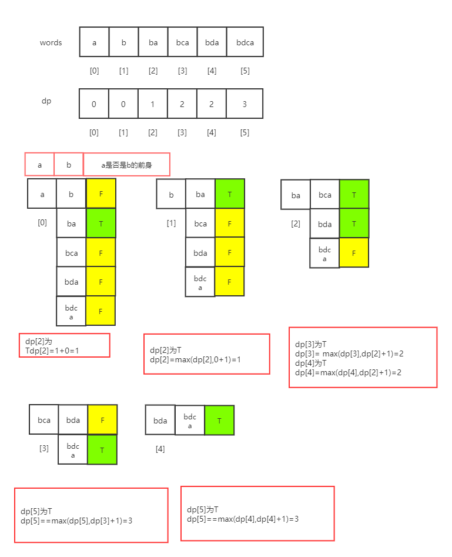
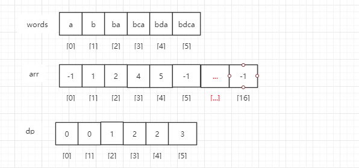
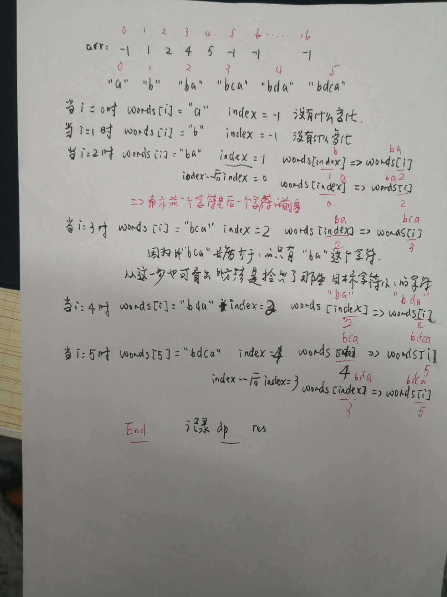

> 原文链接: https://leetcode-cn.com/problems/longest-string-chain


## 英文原文
<div><p>You are given an array of <code>words</code> where each word consists of lowercase English letters.</p>

<p><code>word<sub>A</sub></code> is a <strong>predecessor</strong> of <code>word<sub>B</sub></code> if and only if we can insert <strong>exactly one</strong> letter anywhere in <code>word<sub>A</sub></code> <strong>without changing the order of the other characters</strong> to make it equal to <code>word<sub>B</sub></code>.</p>

<ul>
	<li>For example, <code>&quot;abc&quot;</code> is a <strong>predecessor</strong> of <code>&quot;ab<u>a</u>c&quot;</code>, while <code>&quot;cba&quot;</code> is not a <strong>predecessor</strong> of <code>&quot;bcad&quot;</code>.</li>
</ul>

<p>A <strong>word chain</strong><em> </em>is a sequence of words <code>[word<sub>1</sub>, word<sub>2</sub>, ..., word<sub>k</sub>]</code> with <code>k &gt;= 1</code>, where <code>word<sub>1</sub></code> is a <strong>predecessor</strong> of <code>word<sub>2</sub></code>, <code>word<sub>2</sub></code> is a <strong>predecessor</strong> of <code>word<sub>3</sub></code>, and so on. A single word is trivially a <strong>word chain</strong> with <code>k == 1</code>.</p>

<p>Return <em>the <strong>length</strong> of the <strong>longest possible word chain</strong> with words chosen from the given list of </em><code>words</code>.</p>

<p>&nbsp;</p>
<p><strong>Example 1:</strong></p>

<pre>
<strong>Input:</strong> words = [&quot;a&quot;,&quot;b&quot;,&quot;ba&quot;,&quot;bca&quot;,&quot;bda&quot;,&quot;bdca&quot;]
<strong>Output:</strong> 4
<strong>Explanation</strong>: One of the longest word chains is [&quot;a&quot;,&quot;<u>b</u>a&quot;,&quot;b<u>d</u>a&quot;,&quot;bd<u>c</u>a&quot;].
</pre>

<p><strong>Example 2:</strong></p>

<pre>
<strong>Input:</strong> words = [&quot;xbc&quot;,&quot;pcxbcf&quot;,&quot;xb&quot;,&quot;cxbc&quot;,&quot;pcxbc&quot;]
<strong>Output:</strong> 5
<strong>Explanation:</strong> All the words can be put in a word chain [&quot;xb&quot;, &quot;xb<u>c</u>&quot;, &quot;<u>c</u>xbc&quot;, &quot;<u>p</u>cxbc&quot;, &quot;pcxbc<u>f</u>&quot;].
</pre>

<p><strong>Example 3:</strong></p>

<pre>
<strong>Input:</strong> words = [&quot;abcd&quot;,&quot;dbqca&quot;]
<strong>Output:</strong> 1
<strong>Explanation:</strong> The trivial word chain [&quot;abcd&quot;] is one of the longest word chains.
[&quot;abcd&quot;,&quot;dbqca&quot;] is not a valid word chain because the ordering of the letters is changed.
</pre>

<p>&nbsp;</p>
<p><strong>Constraints:</strong></p>

<ul>
	<li><code>1 &lt;= words.length &lt;= 1000</code></li>
	<li><code>1 &lt;= words[i].length &lt;= 16</code></li>
	<li><code>words[i]</code> only consists of lowercase English letters.</li>
</ul>
</div>

## 中文题目
<div><p>给出一个单词列表，其中每个单词都由小写英文字母组成。</p>

<p>如果我们可以在&nbsp;<code>word1</code>&nbsp;的任何地方添加一个字母使其变成&nbsp;<code>word2</code>，那么我们认为&nbsp;<code>word1</code>&nbsp;是&nbsp;<code>word2</code>&nbsp;的前身。例如，<code>&quot;abc&quot;</code>&nbsp;是&nbsp;<code>&quot;abac&quot;</code>&nbsp;的前身。</p>

<p><strong>词链</strong>是单词&nbsp;<code>[word_1, word_2, ..., word_k]</code>&nbsp;组成的序列，<code>k &gt;= 1</code>，其中&nbsp;<code>word_1</code>&nbsp;是&nbsp;<code>word_2</code>&nbsp;的前身，<code>word_2</code>&nbsp;是&nbsp;<code>word_3</code>&nbsp;的前身，依此类推。</p>

<p>从给定单词列表 <code>words</code> 中选择单词组成词链，返回词链的最长可能长度。<br>
&nbsp;</p>

<p><strong>示例：</strong></p>

<pre><strong>输入：</strong>[&quot;a&quot;,&quot;b&quot;,&quot;ba&quot;,&quot;bca&quot;,&quot;bda&quot;,&quot;bdca&quot;]
<strong>输出：</strong>4
<strong>解释：</strong>最长单词链之一为 &quot;a&quot;,&quot;ba&quot;,&quot;bda&quot;,&quot;bdca&quot;。
</pre>

<p>&nbsp;</p>

<p><strong>提示：</strong></p>

<ol>
	<li><code>1 &lt;= words.length &lt;= 1000</code></li>
	<li><code>1 &lt;= words[i].length &lt;= 16</code></li>
	<li><code>words[i]</code>&nbsp;仅由小写英文字母组成。</li>
</ol>

<p>&nbsp;</p>
</div>

## 通过代码
<RecoDemo>
</RecoDemo>


## 高赞题解
#### 1048. 最长字符串链  Medium


##### 方法1：DP

- `dp[i]`表示从`words[0]`到`words[i]`最长的词链长度

> 将字母按字符长度字典序排序的代码



```java
      Arrays.sort(words, new Comparator<String>() {
            @Override
            public int compare(String o1, String o2) {
                return o1.length() - o2.length();
            }
        });
```




```java []
public int longestStrChain(String[] words) {
    Arrays.sort(words, Comparator.comparingInt(String::length));
    int n = words.length;
    int[] dp = new int[n];
    int res = 0;
    for (int i = 0; i < n; i++) {
        String a = words[i];
        for (int j = i + 1; j < n; j++) {
            String b = words[j];
            if (isPredecessor(a, b)) {
                dp[j] = Math.max(dp[j], dp[i] + 1);
                res = Math.max(dp[j], res);
            }
        }
    }
    return res + 1;
}

/**
 * 判断a是否是b的前身 是返回true 如 "bda" 是"bdca"的前身
 *
 * @param a
 * @param b
 * @return
 */
private boolean isPredecessor(String a, String b) {
    int i = 0, j = 0;
    int m = a.length(), n = b.length();
    if ((m + 1) != n) return false;
    while (i < m && j < n) {
        if (a.charAt(i) == b.charAt(j)) i++;
        j++;
    }
    return i == m;
}
```
```python []
print('Hello world!')
```





##### 方法2：改进版DP

- 根据题意`1 <= words[i].length <= 16` ==>`arr`存放的是`17`个长度的辅助数组，存的是`words`的同一字符长度的最末的下标
- `dp[i]`表示从`words[0]`到`words[i]`最长的词链长度





```java []
public int longestStrChain1st(String[] words) {
    Arrays.sort(words, Comparator.comparingInt(String::length));
    int[] arr = new int[17];
    Arrays.fill(arr, -1);
    int n = words.length;
    for (int i = 0; i < n; i++) {
        arr[words[i].length()] = i;
    }
    int[] dp = new int[n];
    Arrays.fill(dp, 1);
    int res = 0;
    for (int i = 0; i < n; i++) {
        int target = words[i].length() - 1;
        int index = arr[target];
        while (index >= 0 && words[index].length() == target) {
            if (isPredecessor(words[index], words[i])) {
                dp[i] = Math.max(dp[i], dp[index] + 1);
            }
            index--;
        }
        res = Math.max(dp[i], res);
    }
    return res;
}
```
```python []
print('Hello world!')
```





##### 方法3：DFS
```java []
int res = 0;

public int longestStrChain2nd(String[] words) {
    int min = 0, max = 16;//最小字符长度，最大字符长度
    //K为字符长度，Set为该字符长度的word集合
    Map<Integer, Set<String>> map = new HashMap<>();
    for (String word : words) {
        map.putIfAbsent(word.length(), new HashSet<>());
        map.get(word.length()).add(word);
        min = Math.min(min, word.length());
        max = Math.max(max, word.length());
    }
    for (int len = min; len <= max; len++) {
        Set<String> curSet = map.get(len);
        if (curSet == null) continue;//当set没有值时，无需遍历
        if ((max + 1 - len <= res)) continue;//最大长度+1-当前的长度<=res，res更加符合题意
        for (String cur : curSet) {
            findNext(map, len, cur);
        }
    }
    return res;
}

/**
 * @param map
 * @param len 当前字符的长度
 * @param levelStr 当前字符
 */
private void findNext(Map<Integer, Set<String>> map, int len, String levelStr) {
    res = Math.max(res, levelStr.length() + 1 - len);//记录结果集
    Set<String> curSet = map.get(levelStr.length() + 1);//
    if (curSet == null) return;//退出条件
    Iterator<String> it = curSet.iterator();
    while (it.hasNext()) {
        String next = it.next();
        if (isPredecessor(levelStr, next)) {
            findNext(map, len, next);
            it.remove();
        }
    }
}
```
```python []
print('Hello world!')
```


---
---

#### **更多内容，欢迎订阅**


## 统计信息
| 通过次数 | 提交次数 | AC比率 |
| :------: | :------: | :------: |
|    10717    |    23254    |   46.1%   |

## 提交历史
| 提交时间 | 提交结果 | 执行时间 |  内存消耗  | 语言 |
| :------: | :------: | :------: | :--------: | :--------: |
