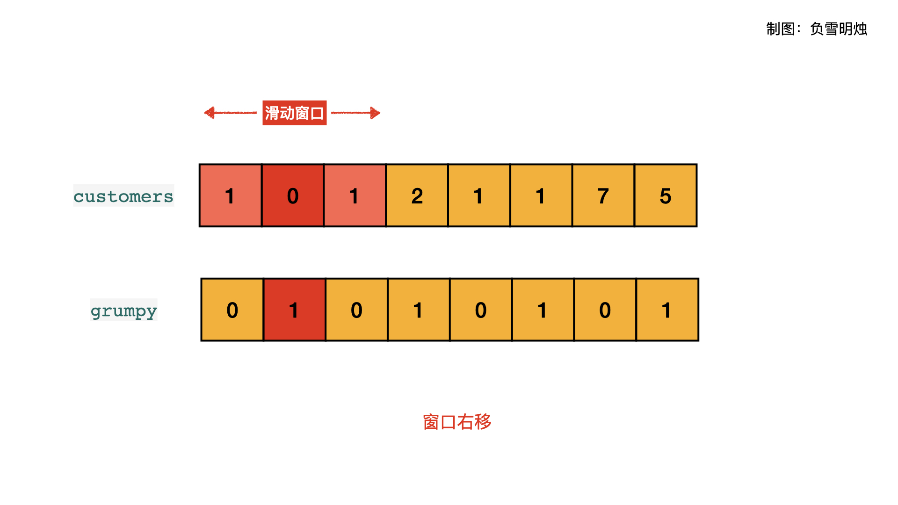
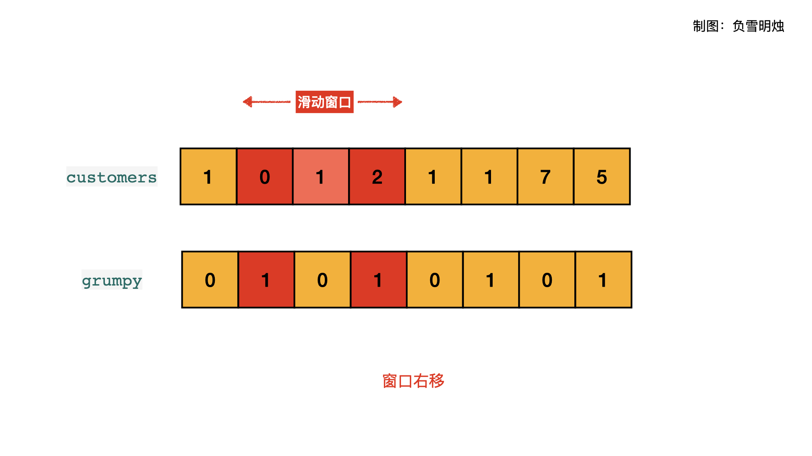
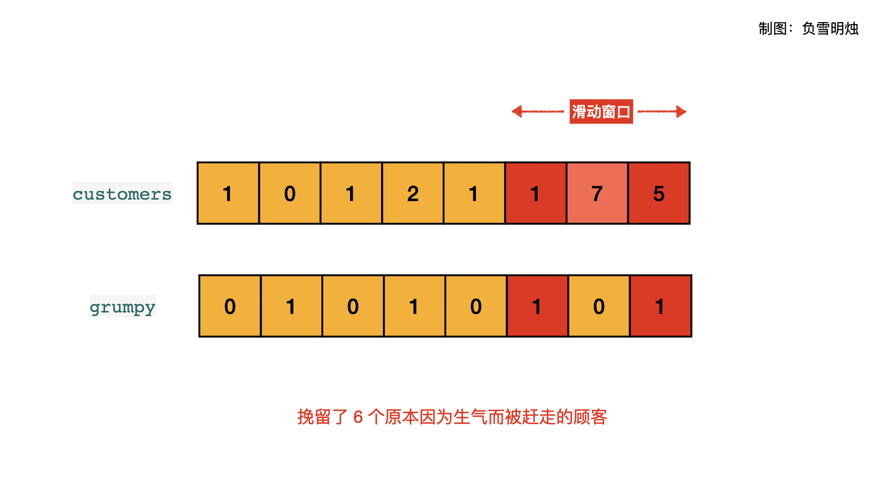

> 原文链接: https://leetcode-cn.com/problems/grumpy-bookstore-owner


## 英文原文
<div><p>There is a bookstore owner that has a store open for <code>n</code> minutes. Every minute, some number of customers enter the store. You are given an integer array <code>customers</code> of length <code>n</code> where <code>customers[i]</code> is the number of the customer that enters the store at the start of the <code>i<sup>th</sup></code> minute and all those customers leave after the end of that minute.</p>

<p>On some minutes, the bookstore owner is grumpy. You are given a binary array grumpy where <code>grumpy[i]</code> is <code>1</code> if the bookstore owner is grumpy during the <code>i<sup>th</sup></code> minute, and is <code>0</code> otherwise.</p>

<p>When the bookstore owner is grumpy, the customers of that minute are not satisfied, otherwise, they are satisfied.</p>

<p>The bookstore owner knows a secret technique to keep themselves not grumpy for <code>minutes</code> consecutive minutes, but can only use it once.</p>

<p>Return <em>the maximum number of customers that can be satisfied throughout the day</em>.</p>

<p>&nbsp;</p>
<p><strong>Example 1:</strong></p>

<pre>
<strong>Input:</strong> customers = [1,0,1,2,1,1,7,5], grumpy = [0,1,0,1,0,1,0,1], minutes = 3
<strong>Output:</strong> 16
<strong>Explanation:</strong> The bookstore owner keeps themselves not grumpy for the last 3 minutes. 
The maximum number of customers that can be satisfied = 1 + 1 + 1 + 1 + 7 + 5 = 16.
</pre>

<p><strong>Example 2:</strong></p>

<pre>
<strong>Input:</strong> customers = [1], grumpy = [0], minutes = 1
<strong>Output:</strong> 1
</pre>

<p>&nbsp;</p>
<p><strong>Constraints:</strong></p>

<ul>
	<li><code>n == customers.length == grumpy.length</code></li>
	<li><code>1 &lt;= minutes &lt;= n &lt;= 2 * 10<sup>4</sup></code></li>
	<li><code>0 &lt;= customers[i] &lt;= 1000</code></li>
	<li><code>grumpy[i]</code> is either <code>0</code> or <code>1</code>.</li>
</ul>
</div>

## 中文题目
<div><p>今天，书店老板有一家店打算试营业 <code>customers.length</code> 分钟。每分钟都有一些顾客（<code>customers[i]</code>）会进入书店，所有这些顾客都会在那一分钟结束后离开。</p>

<p>在某些时候，书店老板会生气。 如果书店老板在第 <code>i</code> 分钟生气，那么 <code>grumpy[i] = 1</code>，否则 <code>grumpy[i] = 0</code>。 当书店老板生气时，那一分钟的顾客就会不满意，不生气则他们是满意的。</p>

<p>书店老板知道一个秘密技巧，能抑制自己的情绪，可以让自己连续 <code>X</code> 分钟不生气，但却只能使用一次。</p>

<p>请你返回这一天营业下来，最多有多少客户能够感到满意。<br />
 </p>

<p><strong>示例：</strong></p>

<pre>
<strong>输入：</strong>customers = [1,0,1,2,1,1,7,5], grumpy = [0,1,0,1,0,1,0,1], X = 3
<strong>输出：</strong>16
<strong>解释：
</strong>书店老板在最后 3 分钟保持冷静。
感到满意的最大客户数量 = 1 + 1 + 1 + 1 + 7 + 5 = 16.
</pre>

<p> </p>

<p><strong>提示：</strong></p>

<ul>
	<li><code>1 <= X <= customers.length == grumpy.length <= 20000</code></li>
	<li><code>0 <= customers[i] <= 1000</code></li>
	<li><code>0 <= grumpy[i] <= 1</code></li>
</ul>
</div>

## 通过代码
<RecoDemo>
</RecoDemo>


## 高赞题解

各位题友大家好！ 今天是 **[@负雪明烛](/u/fuxuemingzhu/)** 坚持日更的第 **30** 天。今天力扣上的每日一题是「[1052. 爱生气的书店老板](https://leetcode-cn.com/problems/grumpy-bookstore-owner/)」。


### 解题思路


**重点**：

- 不生气时顾客会留下，生气时会赶走顾客。
- 「秘密技巧」可以使老板在窗口大小 X 的时间内不生气。我们使用「秘密技巧」的原则是：寻找一个时间长度为 X 的窗口，能**留住更多的**原本因为老板生气而被赶走顾客。
- 使用「秘密技巧」能得到的最终的顾客数 = 所有不生气时间内的顾客总数 + 在窗口 X 内使用「秘密技巧」挽留住的原本因为生气而被赶走顾客数。


因此，可以把题目分为以下两部分求解：

1. **所有不生气时间内的顾客总数**：使用 $i$ 遍历$[0, customers.length)$，累加$grumpy[i] == 0$时的$customers[i]$。
2. **在窗口 X 内因为生气而被赶走的顾客数**：使用大小为 X 的滑动窗口，计算滑动窗口内的$grumpy[i] == 1$时的$customers[i]$，得到在滑动窗口内老板生气时对应的顾客数。


以题目示例 `customers = [1,0,1,2,1,1,7,5], grumpy = [0,1,0,1,0,1,0,1], X = 3` 为例说明。下图中蓝色的是所有不生气时的顾客；滑动窗口内的浅红色是老板不生气时对应的顾客数，深红色是老板生气时对应的顾客数。


上述动图对应的 PPT 如下，可以分布点击观看：

<,,,,,,,,,,,,,,>


下面这个代码是根据 if 判断老板有没有生气。

```Python []
class Solution:
    def maxSatisfied(self, customers: List[int], grumpy: List[int], X: int) -> int:
        N = len(customers)
        sum_ = 0
        # 所有不生气时间内的顾客总数
        for i in range(N):
            if grumpy[i] == 0:
                sum_ += customers[i]
        # 生气的 X 分钟内，会让多少顾客不满意
        curValue = 0
        # 先计算起始的 [0, X) 区间
        for i in range(X):
            if grumpy[i] == 1:
                curValue += customers[i]
        resValue = curValue
        # 然后利用滑动窗口，每次向右移动一步
        for i in range(X, N):
            # 如果新进入窗口的元素是生气的，累加不满意的顾客到滑动窗口中
            if grumpy[i] == 1:
                curValue += customers[i]
            # 如果离开窗口的元素是生气的，则从滑动窗口中减去该不满意的顾客数
            if grumpy[i - X] == 1:
                curValue -= customers[i - X]
            # 求所有窗口内不满意顾客的最大值
            resValue = max(resValue, curValue)
        # 最终结果是：不生气时的顾客总数 + 窗口X内挽留的因为生气被赶走的顾客数
        return sum_ + resValue
```

下面这个代码直接把顾客人数和老板的生气情况想乘，可以简化代码。

```Python []
class Solution:
    def maxSatisfied(self, customers: List[int], grumpy: List[int], X: int) -> int:
        N = len(customers)
        sum_ = 0
        # 所有不生气时间内的顾客总数
        for i in range(N):
            sum_ += customers[i] * (1 - grumpy[i])
        # 生气的 X 分钟内，会让多少顾客不满意
        curValue = 0
        # 先计算起始的 [0, X) 区间
        for i in range(X):
            curValue += customers[i] * grumpy[i]
        resValue = curValue
        # 然后利用滑动窗口，每次向右移动一步
        for i in range(X, N):
            # 如果新进入窗口的元素是生气的，累加不满意的顾客到滑动窗口中
            # 如果离开窗口的元素是生气的，则从滑动窗口中减去该不满意的顾客数
            curValue = curValue + customers[i] * grumpy[i] - customers[i - X] * grumpy[i - X]
            # 求所有窗口内不满意顾客的最大值
            resValue = max(resValue, curValue)
        # 最终结果是：不生气时的顾客总数 + 窗口X内挽留的因为生气被赶走的顾客数
        return sum_ + resValue
```


### 刷题心得

今天这个题本质是固定大小的滑动窗口，但是需要我们对题目做一个抽象，得到我们希望在滑动窗口里面得到什么。


-----


OK，以上就是 [@负雪明烛](https://leetcode-cn.com/u/fuxuemingzhu/) 写的今天题解的全部内容了，如果你觉得有帮助的话，**求赞、求关注、求收藏**。如果有疑问的话，请在下面评论，我会及时解答。


**关注我**，你将不会错过我的精彩动画题解、面试题分享、组队刷题活动，进入主页 [@负雪明烛](https://leetcode-cn.com/u/fuxuemingzhu/) 右侧有刷题组织，从此刷题不再孤单。


祝大家牛年大吉！AC 多多，Offer 多多！我们明天再见！

## 统计信息
| 通过次数 | 提交次数 | AC比率 |
| :------: | :------: | :------: |
|    49498    |    85248    |   58.1%   |

## 提交历史
| 提交时间 | 提交结果 | 执行时间 |  内存消耗  | 语言 |
| :------: | :------: | :------: | :--------: | :--------: |
