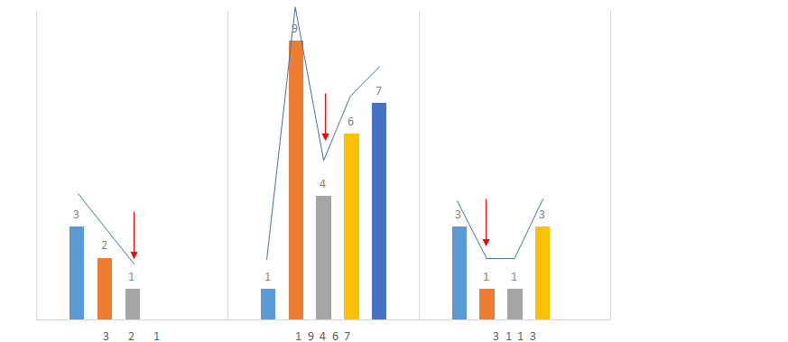
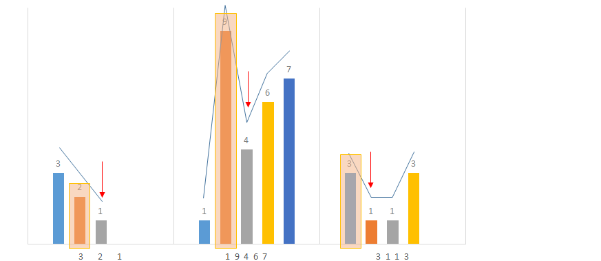
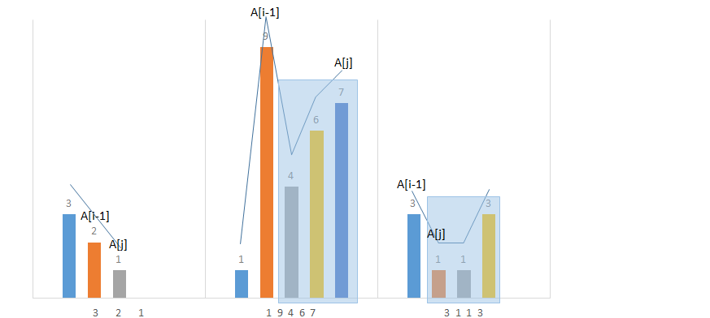

> 原文链接: https://leetcode-cn.com/problems/previous-permutation-with-one-swap


## 英文原文
<div><p>Given an array of positive integers <code>arr</code> (not necessarily distinct), return <em>the lexicographically largest permutation that is smaller than</em> <code>arr</code>, that can be <strong>made with exactly one swap</strong> (A <em>swap</em> exchanges the positions of two numbers <code>arr[i]</code> and <code>arr[j]</code>). If it cannot be done, then return the same array.</p>

<p>&nbsp;</p>
<p><strong>Example 1:</strong></p>

<pre>
<strong>Input:</strong> arr = [3,2,1]
<strong>Output:</strong> [3,1,2]
<strong>Explanation:</strong> Swapping 2 and 1.
</pre>

<p><strong>Example 2:</strong></p>

<pre>
<strong>Input:</strong> arr = [1,1,5]
<strong>Output:</strong> [1,1,5]
<strong>Explanation:</strong> This is already the smallest permutation.
</pre>

<p><strong>Example 3:</strong></p>

<pre>
<strong>Input:</strong> arr = [1,9,4,6,7]
<strong>Output:</strong> [1,7,4,6,9]
<strong>Explanation:</strong> Swapping 9 and 7.
</pre>

<p><strong>Example 4:</strong></p>

<pre>
<strong>Input:</strong> arr = [3,1,1,3]
<strong>Output:</strong> [1,3,1,3]
<strong>Explanation:</strong> Swapping 1 and 3.
</pre>

<p>&nbsp;</p>
<p><strong>Constraints:</strong></p>

<ul>
	<li><code>1 &lt;= arr.length &lt;= 10<sup>4</sup></code></li>
	<li><code>1 &lt;= arr[i] &lt;= 10<sup>4</sup></code></li>
</ul>
</div>

## 中文题目
<div><p>给你一个正整数的数组 <code>A</code>（其中的元素不一定完全不同），请你返回可在 <strong>一次交换</strong>（交换两数字 <code>A[i]</code> 和 <code>A[j]</code> 的位置）后得到的、按字典序排列小于 <code>A</code> 的最大可能排列。</p>

<p>如果无法这么操作，就请返回原数组。</p>

<p> </p>

<p><strong>示例 1：</strong></p>

<pre>
<strong>输入：</strong>arr = [3,2,1]
<strong>输出：</strong>[3,1,2]
<strong>解释：</strong>交换 2 和 1
</pre>

<p><strong>示例 2：</strong></p>

<pre>
<strong>输入：</strong>arr = [1,1,5]
<strong>输出：</strong>[1,1,5]
<strong>解释：</strong>已经是最小排列
</pre>

<p><strong>示例 3：</strong></p>

<pre>
<strong>输入：</strong>arr = [1,9,4,6,7]
<strong>输出：</strong>[1,7,4,6,9]
<strong>解释：</strong>交换 9 和 7
</pre>

<p><strong>示例 4：</strong></p>

<pre>
<strong>输入：</strong>arr = [3,1,1,3]
<strong>输出：</strong>[1,3,1,3]
<strong>解释：</strong>交换 1 和 3
</pre>

<p> </p>

<p><strong>提示：</strong></p>

<ul>
	<li><code>1 <= arr.length <= 10<sup>4</sup></code></li>
	<li><code>1 <= arr[i] <= 10<sup>4</sup></code></li>
</ul>
</div>

## 通过代码
<RecoDemo>
</RecoDemo>


## 高赞题解



审题是最关键的，首先明确以下几点：

1. 正整数的数组A的元素可能存在相同元素
2. 要进行一次交换
3. 找出按字典序排列小于 A 的最大可能排列

根据示例总结规律：

1. 升序排列的数组无需交换

2. 确定需要交换元素的位置：

   对数组元素组成的数据而言，最接近这个数的排列逆序查找，第一次升序的位置，如下图：




   在第一次升序的位置，左侧元素A[i-1]大于当前元素A[i]，即A[i-1]>A[i]，例如：

   - [3,2,1]中箭头左侧2>1
   - [1,9,4,6,7]中箭头左侧9>4
   - [3,1,1,3]中箭头左侧3>1

   所以一定能构造出比当前字典序列小的数据，左侧的元素A[i-1]就是要要交换的元素，如下图框中元素：



3. 从箭头所在的位置开始，查找当前位置和右侧所有元素，且这个元素A[j]要满足以下条件：

   

   - 这个元素值最大且小于要交换的元素的值A[i-1]
   - 这个元素最靠近要交换的元素A[i-1]（主要是考虑右侧元素相等的情况，如3113，交换左侧1以保证元素组成的数据最大）

   可以明确的是，箭头右侧的数据是从右向左是降序排列的，所以可以直接逆序查找。如果第一个小于A[i-1]的元素如果满足与他的左侧数据不相等，那么这个元素就是要交换的元素A[j]。


4. 找出要交换的两个元素A[i-1]和A[j]后，进行交换，则交换后的学列字典序一定是小于当前字典序，且组成的数据是最大的一条。

python3 代码也很简单，参考如下：

```python
class Solution:
    def prevPermOpt1(self, A: List[int]) -> List[int]:
        lenth = len(A)
        for i in range(lenth-1, 0, -1):
            # 第一次升序的位置，左侧元素A[i-1]大于当前元素A[i]
            if A[i-1] > A[i]:
                # 逆序从结尾向第i-1个索引查找A[j]           
                for j in range(lenth-1, i-1, -1):
                    # 元素要满足小于A[i-1]且与左侧元素不相等就是要找的最大元素
                    if A[j] < A[i-1] and A[j] != A[j-1]:
                        A[i-1],A[j] = A[j],A[i-1]
                        return A
        return A
```



## 统计信息
| 通过次数 | 提交次数 | AC比率 |
| :------: | :------: | :------: |
|    6097    |    13277    |   45.9%   |

## 提交历史
| 提交时间 | 提交结果 | 执行时间 |  内存消耗  | 语言 |
| :------: | :------: | :------: | :--------: | :--------: |
