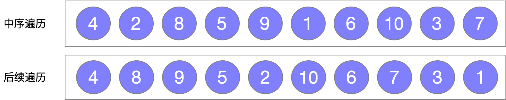
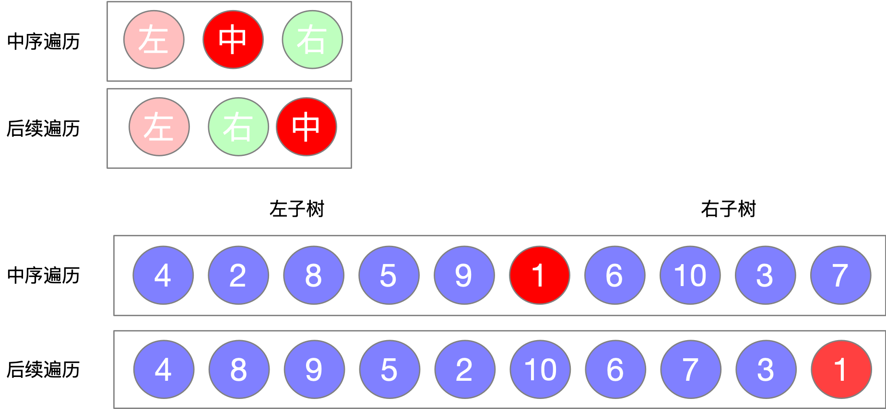
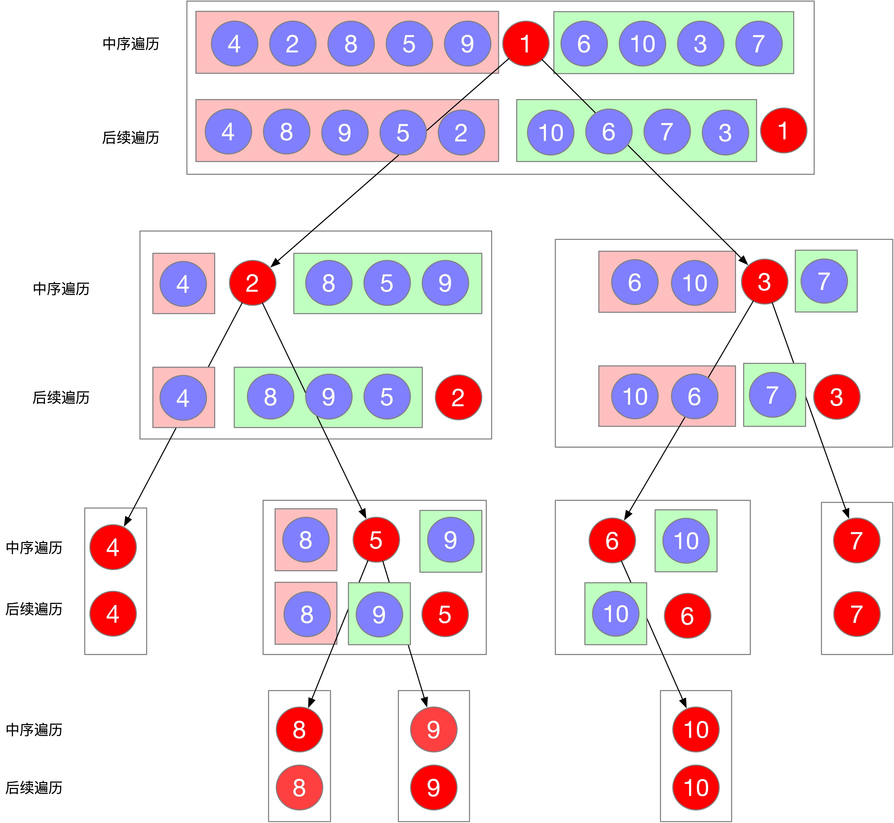

> 原文链接: https://leetcode-cn.com/problems/construct-binary-tree-from-inorder-and-postorder-traversal


## 英文原文
<div><p>Given two integer arrays <code>inorder</code> and <code>postorder</code> where <code>inorder</code> is the inorder traversal of a binary tree and <code>postorder</code> is the postorder traversal of the same tree, construct and return <em>the binary tree</em>.</p>

<p>&nbsp;</p>
<p><strong>Example 1:</strong></p>

<pre>
<strong>Input:</strong> inorder = [9,3,15,20,7], postorder = [9,15,7,20,3]
<strong>Output:</strong> [3,9,20,null,null,15,7]
</pre>

<p><strong>Example 2:</strong></p>

<pre>
<strong>Input:</strong> inorder = [-1], postorder = [-1]
<strong>Output:</strong> [-1]
</pre>

<p>&nbsp;</p>
<p><strong>Constraints:</strong></p>

<ul>
	<li><code>1 &lt;= inorder.length &lt;= 3000</code></li>
	<li><code>postorder.length == inorder.length</code></li>
	<li><code>-3000 &lt;= inorder[i], postorder[i] &lt;= 3000</code></li>
	<li><code>inorder</code> and <code>postorder</code> consist of <strong>unique</strong> values.</li>
	<li>Each value of <code>postorder</code> also appears in <code>inorder</code>.</li>
	<li><code>inorder</code> is <strong>guaranteed</strong> to be the inorder traversal of the tree.</li>
	<li><code>postorder</code> is <strong>guaranteed</strong> to be the postorder traversal of the tree.</li>
</ul>
</div>

## 中文题目
<div><p>根据一棵树的中序遍历与后序遍历构造二叉树。</p>

<p><strong>注意:</strong><br>
你可以假设树中没有重复的元素。</p>

<p>例如，给出</p>

<pre>中序遍历 inorder =&nbsp;[9,3,15,20,7]
后序遍历 postorder = [9,15,7,20,3]</pre>

<p>返回如下的二叉树：</p>

<pre>    3
   / \
  9  20
    /  \
   15   7
</pre>
</div>

## 通过代码
<RecoDemo>
</RecoDemo>


## 高赞题解
### 前提
解决此问题的关键在于要很熟悉树的各种遍历次序代表的什么，最好能够将图画出来。本题解带你先进行中序遍历和后续遍历二叉树，然后再根据遍历结果将二叉树进行还原。
#### 首先，来一棵树
{:width=300}
{:align=center}
#### 然后再看树的遍历结果
{:width=450}
{:align=center}
### 根据中序和后序遍历结果还原二叉树
#### 中序遍历和后续遍历的特性
首先来看题目给出的两个已知条件 **中序遍历序列** 和 **后序遍历序列** 根据这两种遍历的特性我们可以得出两个结论
1. 在后序遍历序列中,最后一个元素为树的根节点
2. 在中序遍历序列中,根节点的左边为左子树，根节点的右边为右子树

如下图所示
{:width=400}
{:align=center}
#### 树的还原过程描述
根据中序遍历和后续遍历的特性我们进行树的还原过程分析
1. 首先在后序遍历序列中找到根节点(最后一个元素)
2. 根据根节点在中序遍历序列中找到根节点的位置
3. 根据根节点的位置将中序遍历序列分为左子树和右子树
4. 根据根节点的位置确定左子树和右子树在中序数组和后续数组中的左右边界位置
5. 递归构造左子树和右子树
6. 返回根节点结束

#### 树的还原过程变量定义
需要定义几个变量帮助我们进行树的还原
1. HashMap memo 需要一个哈希表来保存中序遍历序列中,元素和索引的位置关系.因为从后序序列中拿到根节点后，要在中序序列中查找对应的位置,从而将数组分为左子树和右子树
2. int ri 根节点在中序遍历数组中的索引位置
3. 中序遍历数组的两个位置标记 `[is, ie]`，is 是起始位置，ie 是结束位置
4. 后序遍历数组的两个位置标记 `[ps, pe]` ps 是起始位置，pe 是结束位置
#### 位置关系的计算
在找到根节点位置以后，我们要确定下一轮中，左子树和右子树在中序数组和后续数组中的左右边界的位置。
1. 左子树-中序数组 `is = is`, `ie = ri - 1`
2. 左子树-后序数组 `ps = ps`, `pe = ps + ri - is - 1` (pe计算过程解释，后续数组的起始位置加上左子树长度-1 就是后后序数组结束位置了，左子树的长度 = 根节点索引-左子树)
3. 右子树-中序数组 `is = ri + 1, ie = ie`
4. 右子树-后序数组` ps = ps + ri - is, pe - 1`

听不明白没关系，看图就对了,计算图示如下
{:width=450}
{:align=center}
#### 树的还原过程
{:width=450}
{:align=center}

### 代码如下所示
```Java []
class Solution {

    HashMap<Integer,Integer> memo = new HashMap<>();
    int[] post;

    public TreeNode buildTree(int[] inorder, int[] postorder) {
        for(int i = 0;i < inorder.length; i++) memo.put(inorder[i], i);
        post = postorder;
        TreeNode root = buildTree(0, inorder.length - 1, 0, post.length - 1);
        return root;
    }

    public TreeNode buildTree(int is, int ie, int ps, int pe) {
        if(ie < is || pe < ps) return null;

        int root = post[pe];
        int ri = memo.get(root);

        TreeNode node = new TreeNode(root);
        node.left = buildTree(is, ri - 1, ps, ps + ri - is - 1);
        node.right = buildTree(ri + 1, ie, ps + ri - is, pe - 1);
        return node;
    }
}
```


## 统计信息
| 通过次数 | 提交次数 | AC比率 |
| :------: | :------: | :------: |
|    145137    |    201109    |   72.2%   |

## 提交历史
| 提交时间 | 提交结果 | 执行时间 |  内存消耗  | 语言 |
| :------: | :------: | :------: | :--------: | :--------: |


## 相似题目
|                             题目                             | 难度 |
| :----------------------------------------------------------: | :---------: |
| [从前序与中序遍历序列构造二叉树](https://leetcode-cn.com/problems/construct-binary-tree-from-preorder-and-inorder-traversal/) | 中等|
