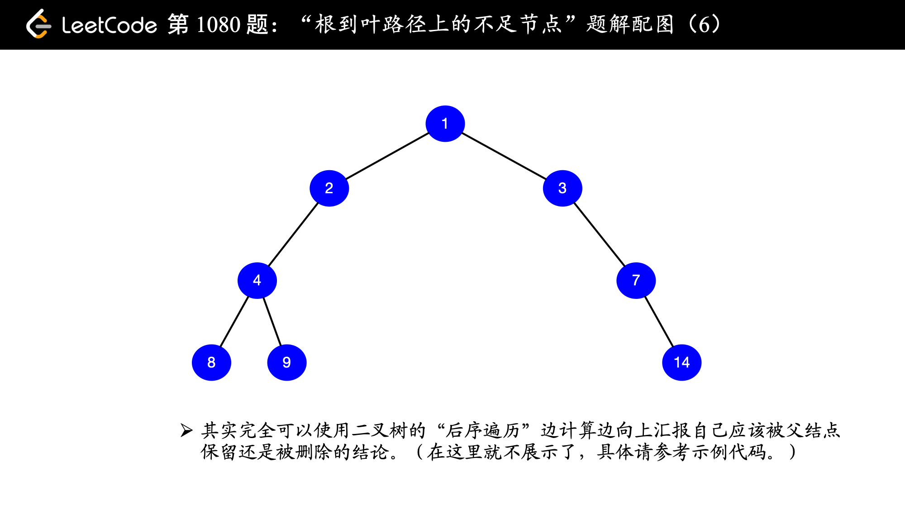

> 原文链接: https://leetcode-cn.com/problems/insufficient-nodes-in-root-to-leaf-paths


## 英文原文
<div><p>Given the <code>root</code> of a binary tree and an integer <code>limit</code>, delete all <strong>insufficient nodes</strong> in the tree simultaneously, and return <em>the root of the resulting binary tree</em>.</p>

<p>A node is <strong>insufficient</strong> if every root to <strong>leaf</strong> path intersecting this node has a sum strictly less than <code>limit</code>.</p>

<p>A <strong>leaf</strong> is a node with no children.</p>

<p>&nbsp;</p>
<p><strong>Example 1:</strong></p>

<pre>
<strong>Input:</strong> root = [1,2,3,4,-99,-99,7,8,9,-99,-99,12,13,-99,14], limit = 1
<strong>Output:</strong> [1,2,3,4,null,null,7,8,9,null,14]
</pre>

<p><strong>Example 2:</strong></p>

<pre>
<strong>Input:</strong> root = [5,4,8,11,null,17,4,7,1,null,null,5,3], limit = 22
<strong>Output:</strong> [5,4,8,11,null,17,4,7,null,null,null,5]
</pre>

<p><strong>Example 3:</strong></p>

<pre>
<strong>Input:</strong> root = [1,2,-3,-5,null,4,null], limit = -1
<strong>Output:</strong> [1,null,-3,4]
</pre>

<p>&nbsp;</p>
<p><strong>Constraints:</strong></p>

<ul>
	<li>The number of nodes in the tree is in the range <code>[1, 5000]</code>.</li>
	<li><code>-10<sup>5</sup> &lt;= Node.val &lt;= 10<sup>5</sup></code></li>
	<li><code>-10<sup>9</sup> &lt;= limit &lt;= 10<sup>9</sup></code></li>
</ul>
</div>

## 中文题目
<div><p>给定一棵二叉树的根 <code>root</code>，请你考虑它所有&nbsp;<strong>从根到叶的路径</strong>：从根到任何叶的路径。（所谓一个叶子节点，就是一个没有子节点的节点）</p>

<p>假如通过节点 <code>node</code> 的每种可能的 &ldquo;根-叶&rdquo; 路径上值的总和全都小于给定的 <code>limit</code>，则该节点被称之为「不足节点」，需要被删除。</p>

<p>请你删除所有不足节点，并返回生成的二叉树的根。</p>

<p>&nbsp;</p>

<p><strong>示例 1：</strong></p>

<pre><strong>
输入：</strong>root = [1,2,3,4,-99,-99,7,8,9,-99,-99,12,13,-99,14], limit = 1
<strong>
输出：</strong>[1,2,3,4,null,null,7,8,9,null,14]
</pre>

<p><strong>示例 2：</strong></p>

<pre><strong>
输入：</strong>root = [5,4,8,11,null,17,4,7,1,null,null,5,3], limit = 22
<strong>
输出：</strong>[5,4,8,11,null,17,4,7,null,null,null,5]</pre>

<p><strong>示例 3：</strong></p>

<pre><strong>
输入：</strong>root = [5,-6,-6], limit = 0<strong>
输出：</strong>[]</pre>

<p>&nbsp;</p>

<p><strong>提示：</strong></p>

<ol>
	<li>给定的树有&nbsp;<code>1</code>&nbsp;到&nbsp;<code>5000</code>&nbsp;个节点</li>
	<li><code>-10^5&nbsp;&lt;= node.val &lt;= 10^5</code></li>
	<li><code>-10^9 &lt;= limit&nbsp;&lt;= 10^9</code></li>
</ol>

<p>&nbsp;</p>
</div>

## 通过代码
<RecoDemo>
</RecoDemo>


## 高赞题解
### 首先考虑结点如何删除

首先我们考虑如何删除结点的问题。已知一个二叉树中的结点要被删除，有两种办法：
1. 自己删除自己；
2. 告诉父亲结点，自己需要从二叉树中被删除。

“自己删除自己” 让我想到了 “单链表删除某个结点”，如果这个要被删除的结点是末尾结点，那还麻烦了。不过第 2 种办法“告诉父亲结点，自己需要从二叉树中被删除”，就很简单了，**父亲结点收到孩子结点这个信号以后，只要把对孩子结点的引用切断即可**。

### 其次考虑使用哪一种遍历方式

二叉树的问题一定离不开遍历，遍历有 DFS 和 BFS，根据题目中的描述 “考虑它所有 从根到叶的路径”，就知道不能用 BFS 了，那么 DFS 又有 3 种，分别如下：

1、先序遍历

（1）先执行当前结点的逻辑；  
（2）如果有左结点，就递归执行左结点的逻辑；  
（3）如果有右结点，就递归执行右结点的逻辑。

2、中序遍历

（1）如果有左结点，就递归执行左结点的逻辑；  
（2）先执行当前结点的逻辑；  
（3）如果有右结点，就递归执行右结点的逻辑。

3、后序遍历

（1）如果有左结点，就递归执行左结点的逻辑；  
（2）如果有右结点，就递归执行右结点的逻辑；  
（3）先执行当前结点的逻辑。

再看看我们首先考虑的问题，“告诉父亲结点，自己是否需要从二叉树中被删除”，那么 **首先两个子结点（如果存在的话）要清楚自己是不是需要被删除**，明显使用 “后序遍历”。

因此，**删除结点（也可以称为 “剪枝”）的过程是从下到上的**。

### 最后编码实现

进行后序遍历的时候，要告诉父亲节点自己是否需要从二叉树中删除，返回一个布尔值就可以了。这里编码要注意几个细节：

1、使用 Python 编码的朋友，尽量少使用 `not`，否定的判断出现太多，比较容易把自己绕晕，我这一版代码是改过几次的，原先我的 `__dfs` 方法设置的返回值的意思是“是否保留”。后来我把返回值的含义改成“是否删除”，就是为了让逻辑中少一些 `not`；  

2、当一个结点不是叶子结点的时候，它是否被删除，也要看它的孩子结点，**只要孩子结点有一个被保留，父亲结点就不能被删，换句话说，父亲结点被删除当且仅当它的两个孩子结点均被删除**；  

（温馨提示：下面的幻灯片中，有几页上有较多的文字，可能需要您停留一下，可以点击右下角的后退 “|◀” 或者前进 “▶|” 按钮控制幻灯片的播放。）

<,,,,,,>

3、**返回值的含义设置成“是否删除”的前提下，左右孩子的默认策略是删除，因为当只有一个孩子结点存在的时候，这个孩子结点的删除与否直接决定了父亲结点是否被删除**，逻辑运算符 `and` 把不存在的那一边设置为 `True` ，就符合这个逻辑，不妨看看真值表，把其中一列全部设置成 `True` ，`and` 的结果就正好和另外一列是一样的。


| 左子树是否被删除 | 右子树是否被删除 | and     | or      |
| ---------------- | ---------------- | ------- | ------- |
| `True`           | `True`           | `True`  | `True`  |
| `True`           | `False`          | `True`  | `False` |
| `False`          | `True`           | `False` | `True`  |
| `False`          | `False`          | `False` | `False` |


如果你把 `__dfs` 方法的返回值意义设置成 `是否保留`，你就得看 `or` 那一列，并且左右孩子的默认策略就是保留。

### 总结
这道题使用后序遍历完成，但更本质上的算法思想是分治法：**把原问题拆解成同样结构且规模更小的子问题，待子问题处理完成以后，原问题就得到了解决**，大家想一想是不是这样。

下面展示了两种后序遍历的返回值意义的示例代码，请读者比较它们二者的差别。

如果 `__dfs()` 方法返回值的意义是“当前结点是否被删除”，参考代码如下。

```Python []
class TreeNode:
    def __init__(self, x):
        self.val = x
        self.left = None
        self.right = None

class Solution:

    def __dfs(self, node, s, limit):
        """
        后序遍历
        :param node: 当前遍历的结点
        :param s: 当前累计的和
        :param limit: 题目中给出的 limit
        :return: 是否要删除 node 这个结点，True 表示要删除，False 表示不删除
        """
        # 先写递归终止条件：如果小于 limit，根据题意，要删除
        if node.left is None and node.right is None:
            return s + node.val < limit

        # 默认为左右结点均剪枝，注意：初值不能设置成 False
        l_tree_deleted = True
        r_tree_deleted = True

        # 如果有左子树，就先递归处理左子树
        if node.left:
            l_tree_deleted = self.__dfs(node.left, s + node.val, limit)

        # 如果有右子树，就先递归处理右子树
        if node.right:
            r_tree_deleted = self.__dfs(node.right, s + node.val, limit)

        # 左右子树是否删除的结论得到了，由自己来执行是否删除它们
        if l_tree_deleted:
            node.left = None
        if r_tree_deleted:
            node.right = None

        # 只有左右子树都被删除了，自己才没有必要保留
        return l_tree_deleted and r_tree_deleted

    def sufficientSubset(self, root: TreeNode, limit: int) -> TreeNode:
        root_deleted = self.__dfs(root, 0, limit)
        if root_deleted:
            return None
        return root
```
```Java []
public class Solution2 {

    /**
     * @param node
     * @param s
     * @param limit
     * @return 返回 node 结点是否被删除（注意：这个返回值的意义，直接影响整个逻辑。）
     */
    private Boolean dfs(TreeNode node, int s, int limit) {
        if (node.left == null && node.right == null) {
            return s + node.val < limit;
        }

        // 注意：如果 dfs 的返回值的意义是这个结点是否被删除，它们的默认值应该设置为 true
        boolean lTreeDeleted = true;
        boolean rTreeDeleted = true;

        // 如果有左子树，就先递归处理左子树
        if (node.left != null) {
            lTreeDeleted = dfs(node.left, s + node.val, limit);
        }
        // 如果有右子树，就先递归处理右子树
        if (node.right != null) {
            rTreeDeleted = dfs(node.right, s + node.val, limit);
        }

        // 左右子树是否保留的结论得到了，由自己来执行是否删除它们
        if (lTreeDeleted) {
            node.left = null;
        }
        if (rTreeDeleted) {
            node.right = null;
        }

        // 只有左右子树都被删除了，自己才没有必要保留
        return lTreeDeleted && rTreeDeleted;
    }

    public TreeNode sufficientSubset(TreeNode root, int limit) {
        boolean rootDeleted = dfs(root, 0, limit);
        if (rootDeleted) {
            return null;
        }
        return root;
    }
}
```

如果 `__dfs()` 方法返回值的意义是“当前结点是否被保留”，参考代码如下。


```Python []
class TreeNode:
    def __init__(self, x):
        self.val = x
        self.left = None
        self.right = None


# 算法思想：分治法
# 后序遍历：dfs 的返回值是：是否保留这个节点

class Solution:
    def __dfs(self, node, s, limit):
        """
        后序遍历
        :param node: 当前遍历的结点
        :param s: 当前累计的和
        :param limit: 题目中给出的 limit
        :return: 是否要保留 node 这个结点，True 表示要保留，False 表示不保留
        """
        # 先写递归终止条件：如果大于等于 limit，根据题意，要保留
        if node.left is None and node.right is None:
            return node.val + s >= limit

        # 默认为左右结点均剪枝
        # 注意：初值不能设置成 True
        # 因为，当左右子树只有一个存在的时候，这个子树的逻辑值直接决定了父结点是否被保留
        ltree_saved = False
        rtree_saved = False

        # 如果有左子树，就先递归处理左子树
        if node.left:
            ltree_saved = self.__dfs(node.left, s + node.val, limit)
        # 如果有右子树，就先递归处理右子树
        if node.right:
            rtree_saved = self.__dfs(node.right, s + node.val, limit)

        # 左右子树是否保留的结论得到了，由自己来执行是否保留它们
        if not ltree_saved:
            node.left = None
        if not rtree_saved:
            node.right = None

        # 只要左右结点有一个被保留，这个结点就得被保留
        return ltree_saved or rtree_saved

    def sufficientSubset(self, root: TreeNode, limit: int) -> TreeNode:
        root_saved = self.__dfs(root, 0, limit)
        if not root_saved:
            return None
        return root

```
```Java []
class TreeNode {
    int val;
    TreeNode left;
    TreeNode right;

    TreeNode(int x) {
        val = x;
    }
}

public class Solution {

    /**
     * @param node
     * @param s
     * @param limit
     * @return 返回 node 结点是否被保留（注意：这个返回值的意义，直接影响整个逻辑。）
     */
    private Boolean dfs(TreeNode node, int s, int limit) {
        if (node.left == null && node.right == null) {
            return s + node.val >= limit;
        }

        // 注意：如果 dfs 的返回值的意义是这个结点是否被保留，它们的默认值应该设置为 false
        boolean ltree_saved = false;
        boolean rtree_saved = false;

        // 如果有左子树，就先递归处理左子树
        if (node.left != null) {
            ltree_saved = dfs(node.left, s + node.val, limit);
        }

        // 如果有右子树，就先递归处理右子树
        if (node.right != null) {
            rtree_saved = dfs(node.right, s + node.val, limit);
        }

        // 左右子树是否保留的结论得到了，由自己来执行是否删除它们
        if (!ltree_saved) {
            node.left = null;
        }

        if (!rtree_saved) {
            node.right = null;
        }

        // 左右子树有一颗被保留，自己就应该被保留
        return ltree_saved || rtree_saved;
    }

    public TreeNode sufficientSubset(TreeNode root, int limit) {
        boolean root_saved = dfs(root, 0, limit);
        if (!root_saved) {
            return null;
        }
        return root;
    }
}
```

**复杂度分析**：

+ 时间复杂度：$O(N)$，$N$ 为二叉树结点的个数。
+ 空间复杂度：$O(1)$。

## 统计信息
| 通过次数 | 提交次数 | AC比率 |
| :------: | :------: | :------: |
|    4496    |    9079    |   49.5%   |

## 提交历史
| 提交时间 | 提交结果 | 执行时间 |  内存消耗  | 语言 |
| :------: | :------: | :------: | :--------: | :--------: |
