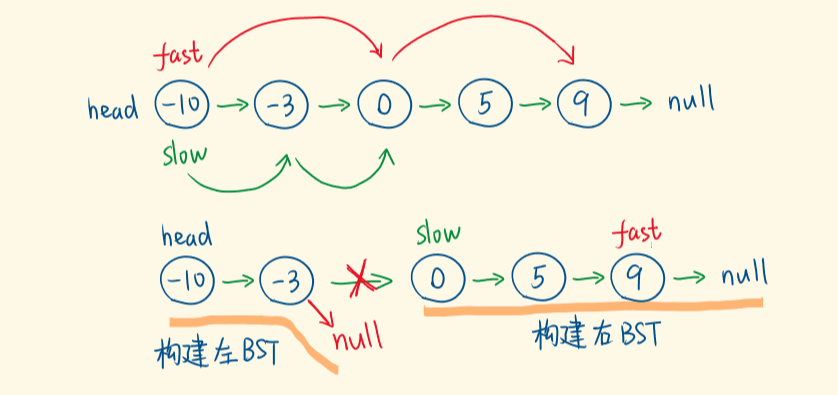
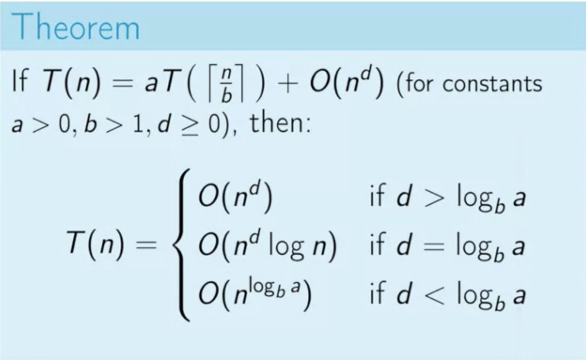
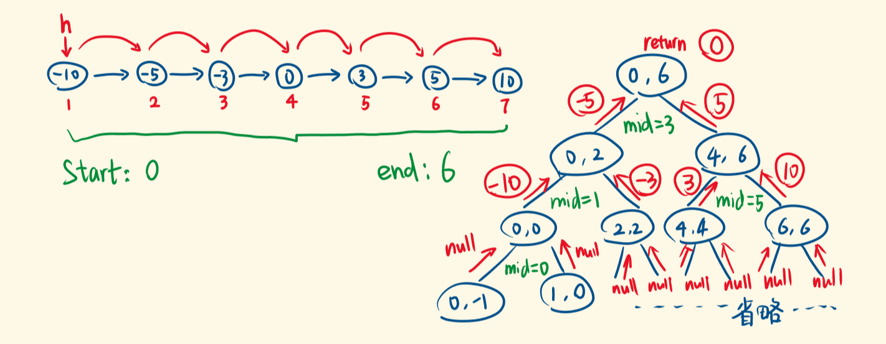

> 原文链接: https://leetcode-cn.com/problems/convert-sorted-list-to-binary-search-tree


## 英文原文
<div><p>Given the <code>head</code> of a singly linked list where elements are <strong>sorted in ascending order</strong>, convert it to a height balanced BST.</p>

<p>For this problem, a height-balanced binary tree is defined as a binary tree in which the depth of the two subtrees of <em>every</em> node never differ by more than 1.</p>

<p>&nbsp;</p>
<p><strong>Example 1:</strong></p>

<pre>
<strong>Input:</strong> head = [-10,-3,0,5,9]
<strong>Output:</strong> [0,-3,9,-10,null,5]
<strong>Explanation:</strong> One possible answer is [0,-3,9,-10,null,5], which represents the shown height balanced BST.
</pre>

<p><strong>Example 2:</strong></p>

<pre>
<strong>Input:</strong> head = []
<strong>Output:</strong> []
</pre>

<p><strong>Example 3:</strong></p>

<pre>
<strong>Input:</strong> head = [0]
<strong>Output:</strong> [0]
</pre>

<p><strong>Example 4:</strong></p>

<pre>
<strong>Input:</strong> head = [1,3]
<strong>Output:</strong> [3,1]
</pre>

<p>&nbsp;</p>
<p><strong>Constraints:</strong></p>

<ul>
	<li>The number of nodes in <code>head</code> is in the range <code>[0, 2 * 10<sup>4</sup>]</code>.</li>
	<li><code>-10<sup>5</sup> &lt;= Node.val &lt;= 10<sup>5</sup></code></li>
</ul>
</div>

## 中文题目
<div><p>给定一个单链表，其中的元素按升序排序，将其转换为高度平衡的二叉搜索树。</p>

<p>本题中，一个高度平衡二叉树是指一个二叉树<em>每个节点&nbsp;</em>的左右两个子树的高度差的绝对值不超过 1。</p>

<p><strong>示例:</strong></p>

<pre>给定的有序链表： [-10, -3, 0, 5, 9],

一个可能的答案是：[0, -3, 9, -10, null, 5], 它可以表示下面这个高度平衡二叉搜索树：

      0
     / \
   -3   9
   /   /
 -10  5
</pre>
</div>

## 通过代码
<RecoDemo>
</RecoDemo>


## 高赞题解
#### 解法1：将有序链表转成有序数组
- 我之前画过下图，想象成一条绳，提起中点作为根节点，分出左右两部分，再提起各自的中点作为根节点……分治下去，这根绳就成了BST的模样。

- 即，将有序链表转成有序数组，递归分治这个数组，构建二叉树，成 BST 的模样。


#### 方法1 代码

有评论说下面代码错了。没有错，提交通过。题目说：给定的有序链表[-10, -3, 0, 5, 9],一个**可能的答案**是[0, -3, 9, -10, null, 5]。**生成的BST形态可能不一样，是BST就行**。
```javascript []
const sortedListToBST = (head) => {
  const arr = [];
  while (head) { // 将链表节点的值逐个推入数组arr
    arr.push(head.val);
    head = head.next;
  }
  // 根据索引start到end的子数组构建子树
  const buildBST = (start, end) => {
    if (start > end) return null;        // 指针交错，形成不了子序列，返回null节点
    const mid = (start + end) >>> 1;     // 求中间索引 中间元素是根节点的值
    const root = new TreeNode(arr[mid]); // 创建根节点
    root.left = buildBST(start, mid - 1); // 递归构建左子树
    root.right = buildBST(mid + 1, end);  // 递归构建右子树
    return root;                          // 返回当前子树
  };

  return buildBST(0, arr.length - 1);  // 根据整个arr数组构建
};
```
```go []
func sortedListToBST(head *ListNode) *TreeNode {
	arr := []int{}
	for head != nil {
		arr = append(arr, head.Val)
		head = head.Next
	}
	return buildBST(arr, 0, len(arr)-1)
}
func buildBST(arr []int, start, end int) *TreeNode {
	if start > end {
		return nil
	}
	mid := (start + end) >> 1
	root := &TreeNode{Val: arr[mid]}
	root.Left = buildBST(arr, start, mid-1)
	root.Right = buildBST(arr, mid+1, end)
	return root
}
```
时间复杂度：$O(n)$，用 O(1) 时间找到数组中间元素，总体复杂度相当于只遍历了一遍数组。
空间复杂度：$O(n)$。


#### 方法2：快慢指针
- 寻找链表的中间点有个小技巧：
- 快慢指针起初都指向头结点，分别一次走两步和一步，当快指针走到尾节点时，慢指针正好走到链表的中间。断成两个链表，分而治之。

- 为了断开，我们需要保存慢指针的前一个节点，因为单向链表的结点没有前驱指针。



#### 方法2 代码
时间复杂度：$O(nlogn)$。一共 logn 层递归，每次找中点 O(n/2)，即 O(n)（我这么解释好像不是很对）。可以参考这个解释：每次递归花 O(n) 时间找到中点，有 T(n) = O(n) + 2T(n/2), 根据主定理推导出 O(nlogn)。主定理（master theorem）见下图：
空间复杂度：$O(logn)$。递归栈的调用深度。

```js []
const sortedListToBST = (head) => {
  if (head == null) return null;
  let slow = head;
  let fast = head;
  let preSlow; // 保存slow的前一个节点

  while (fast && fast.next) {
    preSlow = slow;        // 保存当前slow
    slow = slow.next;      // slow走一步
    fast = fast.next.next; // fast走两步
  }
  const root = new TreeNode(slow.val);     // 根据slow指向的节点值，构建节点

  if (preSlow != null) {   // 如果preSlow有值，即slow左边有节点，需要构建左子树
    preSlow.next = null;   // 切断preSlow和中点slow
    root.left = sortedListToBST(head);     // 递归构建左子树
  }
  root.right = sortedListToBST(slow.next); // 递归构建右子树
  return root;
};
```
```go []
func sortedListToBST(head *ListNode) *TreeNode {
	if head == nil {
		return nil
	}
	slow, fast := head, head
	var preSlow *ListNode = nil
	for fast != nil && fast.Next != nil {
		preSlow = slow
		slow = slow.Next
		fast = fast.Next.Next
	}
	root := &TreeNode{Val: slow.Val}
	if preSlow != nil {
		preSlow.Next = nil
		root.Left = sortedListToBST(head)
	}
	root.Right = sortedListToBST(slow.Next)
	return root
}
```

#### 方法3： 中序遍历策略带来的优化
- 方法1每次获取数组中点：$O(1)$，方法2每次获取链表中点：$O(N)$，所以更慢。

- 其实直接获取链表头结点：$O(1)$，不如直接构建它吧！它对应 BST 最左子树的根节点。
- 于是我们先构建左子树，再构建根节点，再构建右子树。——遵循中序遍历。
- 其实，BST 的中序遍历，打印的节点值正是这个有序链表的节点值顺序。 
- 如下图，维护指针 h，从头结点开始，用 h.val 构建节点，构建一个，指针后移一位。


- 求出链表结点总个数，用于每次二分求出链表的中点。

- 为什么要这么做，因为我们构建的节点值是：从小到大，我们希望在递归中处理节点的顺序和链表结点顺序一一对应
- 看看下图的递归树，感受一下二分法怎么做到的。
- 用二分后的左链，递归构建左子树，然后用 h.val 创建节点，接上创建好的左子树，再用右链构建右子树，再接上。
- 递归中会不断进行二分，直到无法划分就返回 null，即来到递归树的底部

- h.val 创建完结点后，h 指针就后移，锁定出下一个要构建的节点值……




#### 方法3 代码
时间复杂度：$O(n)$。空间复杂度：$O(logn)$。
```js []
const sortedListToBST = (head) => {
  if (head == null) return null;
  let len = 0;
  let h = head;  // h初始指向头结点
  while (head) { // 计算链表节点个数
    len++;
    head = head.next;
  }

  const buildBST = (start, end) => {
    if (start > end) return null;     // 递归出口，返回null节点
    const mid = (start + end) >>> 1;  // 求mid，只是为了分治，不是用它断开链表
    const left = buildBST(start, mid - 1); // 先递归构建左子树

    const root = new TreeNode(h.val);      // 根据 h.val 构建节点
    h = h.next;          // h指针步进              
    root.left = left;    // root接上构建好的左子树        

    root.right = buildBST(mid + 1, end); // 构建当前root的右子树，接上
    return root;
  };

  return buildBST(0, len - 1);
};
```
```go []
var h *ListNode

func sortedListToBST(head *ListNode) *TreeNode {
	if head == nil {
		return nil
	}
	length := 0
	h = head
	for head != nil {
		length++
		head = head.Next
	}
	return buildBST(0, length-1)
}
func buildBST(start, end int) *TreeNode {
	if start > end {
		return nil
	}
	mid := (start + end) >> 1
	left := buildBST(start, mid-1)
	root := &TreeNode{Val: h.Val}
	h = h.Next
	root.Left = left
	root.Right = buildBST(mid+1, end)
	return root
}
```


#### 感谢阅读，喜欢的可以点赞鼓励一波
#### 后记：
这道题让我想到一道题：把二叉树序列化为字符串，再反序列化还原出二叉树。

那道题为了方便定位根节点，使用前序遍历。
这道题其实就是给你中序遍历的结果，让你还原出二叉树。

递归树是个好东西，很多东西变形象了，比如回溯和剪枝，比如记忆化递归，甚至迁移到动态规划。递归搜索是一个基本功，可以发散出很多东西。

**最后修改于：2021-09-16**

## 统计信息
| 通过次数 | 提交次数 | AC比率 |
| :------: | :------: | :------: |
|    99689    |    130802    |   76.2%   |

## 提交历史
| 提交时间 | 提交结果 | 执行时间 |  内存消耗  | 语言 |
| :------: | :------: | :------: | :--------: | :--------: |


## 相似题目
|                             题目                             | 难度 |
| :----------------------------------------------------------: | :---------: |
| [将有序数组转换为二叉搜索树](https://leetcode-cn.com/problems/convert-sorted-array-to-binary-search-tree/) | 简单|
