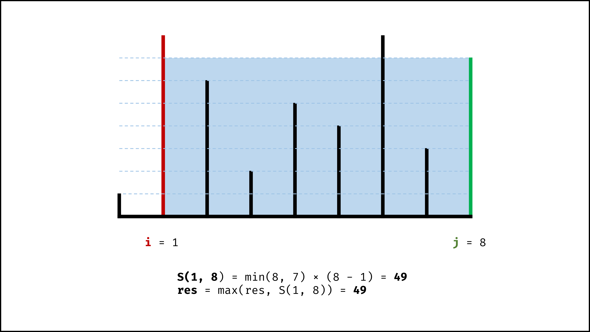
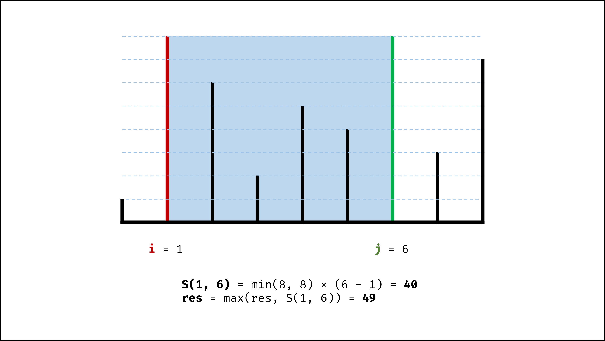

> 原文链接: https://leetcode-cn.com/problems/container-with-most-water


## 英文原文
<div><p>Given <code>n</code> non-negative integers <code>a<sub>1</sub>, a<sub>2</sub>, ..., a<sub>n</sub></code><sub> </sub>, where each represents a point at coordinate <code>(i, a<sub>i</sub>)</code>. <code>n</code> vertical lines are drawn such that the two endpoints of the line <code>i</code> is at <code>(i, a<sub>i</sub>)</code> and <code>(i, 0)</code>. Find two lines, which, together with the x-axis forms a container, such that the container contains the most water.</p>

<p><strong>Notice</strong> that you may not slant the container.</p>

<p>&nbsp;</p>
<p><strong>Example 1:</strong></p>

<pre>
<strong>Input:</strong> height = [1,8,6,2,5,4,8,3,7]
<strong>Output:</strong> 49
<strong>Explanation:</strong> The above vertical lines are represented by array [1,8,6,2,5,4,8,3,7]. In this case, the max area of water (blue section) the container can contain&nbsp;is 49.
</pre>

<p><strong>Example 2:</strong></p>

<pre>
<strong>Input:</strong> height = [1,1]
<strong>Output:</strong> 1
</pre>

<p><strong>Example 3:</strong></p>

<pre>
<strong>Input:</strong> height = [4,3,2,1,4]
<strong>Output:</strong> 16
</pre>

<p><strong>Example 4:</strong></p>

<pre>
<strong>Input:</strong> height = [1,2,1]
<strong>Output:</strong> 2
</pre>

<p>&nbsp;</p>
<p><strong>Constraints:</strong></p>

<ul>
	<li><code>n == height.length</code></li>
	<li><code>2 &lt;= n &lt;= 10<sup>5</sup></code></li>
	<li><code>0 &lt;= height[i] &lt;= 10<sup>4</sup></code></li>
</ul>
</div>

## 中文题目
<div><p>给你 <code>n</code> 个非负整数 <code>a<sub>1</sub>，a<sub>2，</sub>...，a</code><sub><code>n</code>，</sub>每个数代表坐标中的一个点&nbsp;<code>(i,&nbsp;a<sub>i</sub>)</code> 。在坐标内画 <code>n</code> 条垂直线，垂直线 <code>i</code>&nbsp;的两个端点分别为&nbsp;<code>(i,&nbsp;a<sub>i</sub>)</code> 和 <code>(i, 0)</code> 。找出其中的两条线，使得它们与&nbsp;<code>x</code>&nbsp;轴共同构成的容器可以容纳最多的水。</p>

<p><strong>说明：</strong>你不能倾斜容器。</p>

<p>&nbsp;</p>

<p><strong>示例 1：</strong></p>

<p></p>

<pre>
<strong>输入：</strong>[1,8,6,2,5,4,8,3,7]
<strong>输出：</strong>49 
<strong>解释：</strong>图中垂直线代表输入数组 [1,8,6,2,5,4,8,3,7]。在此情况下，容器能够容纳水（表示为蓝色部分）的最大值为&nbsp;49。</pre>

<p><strong>示例 2：</strong></p>

<pre>
<strong>输入：</strong>height = [1,1]
<strong>输出：</strong>1
</pre>

<p><strong>示例 3：</strong></p>

<pre>
<strong>输入：</strong>height = [4,3,2,1,4]
<strong>输出：</strong>16
</pre>

<p><strong>示例 4：</strong></p>

<pre>
<strong>输入：</strong>height = [1,2,1]
<strong>输出：</strong>2
</pre>

<p>&nbsp;</p>

<p><strong>提示：</strong></p>

<ul>
	<li><code>n == height.length</code></li>
	<li><code>2 &lt;= n &lt;= 10<sup>5</sup></code></li>
	<li><code>0 &lt;= height[i] &lt;= 10<sup>4</sup></code></li>
</ul>
</div>

## 通过代码
<RecoDemo>
</RecoDemo>


## 高赞题解
设两指针 $i$ , $j$ ，指向的水槽板高度分别为 $h[i]$ , $h[j]$ ，此状态下水槽面积为 $S(i, j)$  。由于可容纳水的高度由两板中的 **短板** 决定，因此可得如下 **面积公式** ：


$$

S(i, j) = min(h[i], h[j]) × (j - i)

$$


{:width=500}


在每个状态下，无论长板或短板向中间收窄一格，都会导致水槽 **底边宽度** $-1$​ 变短：


- 若向内 **移动短板** ，水槽的短板 $min(h[i], h[j])$ 可能变大，因此下个水槽的面积 **可能增大** 。

- 若向内 **移动长板** ，水槽的短板 $min(h[i], h[j])$​ 不变或变小，因此下个水槽的面积 **一定变小** 。


因此，初始化双指针分列水槽左右两端，循环每轮将短板向内移动一格，并更新面积最大值，直到两指针相遇时跳出；即可获得最大面积。


#### 算法流程：


1. **初始化：** 双指针 $i$ , $j$ 分列水槽左右两端；

2. **循环收窄：** 直至双指针相遇时跳出；

   1. 更新面积最大值 $res$ ；

   2. 选定两板高度中的短板，向中间收窄一格；

3. **返回值：** 返回面积最大值 $res$ 即可；


#### 正确性证明：


若暴力枚举，水槽两板围成面积 $S(i, j)$ 的状态总数为 $C(n, 2)$ 。


假设状态 $S(i, j)$ 下 $h[i] < h[j]$ ，在向内移动短板至 $S(i + 1, j)$ ，则相当于消去了 ${S(i, j - 1), S(i, j - 2), ... , S(i, i + 1)}$ 状态集合。而所有消去状态的面积一定都小于当前面积（即 $< S(i, j)$），因为这些状态：


- 短板高度：相比 $S(i, j)$ 相同或更短（即 $\leq h[i]$ ）；

- 底边宽度：相比 $S(i, j)$ 更短；


因此，每轮向内移动短板，所有消去的状态都 **不会导致面积最大值丢失**  ，证毕。


<,,,,,,,>


#### 复杂度分析：


- **时间复杂度 $O(N)$​ ：** 双指针遍历一次底边宽度 $N$​​ 。

- **空间复杂度 $O(1)$​ ：** 变量 $i$ , $j$ , $res$ 使用常数额外空间。


#### 代码：


```Python []

class Solution:

    def maxArea(self, height: List[int]) -> int:

        i, j, res = 0, len(height) - 1, 0

        while i < j:

            if height[i] < height[j]:

                res = max(res, height[i] * (j - i))

                i += 1

            else:

                res = max(res, height[j] * (j - i))

                j -= 1

        return res

```


```Java []

class Solution {

    public int maxArea(int[] height) {

        int i = 0, j = height.length - 1, res = 0;

        while(i < j) {

            res = height[i] < height[j] ? 

                Math.max(res, (j - i) * height[i++]): 

                Math.max(res, (j - i) * height[j--]); 

        }

        return res;

    }

}

```


```C++ []

class Solution {

public:

    int maxArea(vector<int>& height) {

        int i = 0, j = height.size() - 1, res = 0;

        while(i < j) {

            res = height[i] < height[j] ? 

                max(res, (j - i) * height[i++]): 

                max(res, (j - i) * height[j--]); 

        }

        return res;

    }

};

```

## 统计信息
| 通过次数 | 提交次数 | AC比率 |
| :------: | :------: | :------: |
|    580236    |    930683    |   62.3%   |

## 提交历史
| 提交时间 | 提交结果 | 执行时间 |  内存消耗  | 语言 |
| :------: | :------: | :------: | :--------: | :--------: |


## 相似题目
|                             题目                             | 难度 |
| :----------------------------------------------------------: | :---------: |
| [接雨水](https://leetcode-cn.com/problems/trapping-rain-water/) | 困难|
