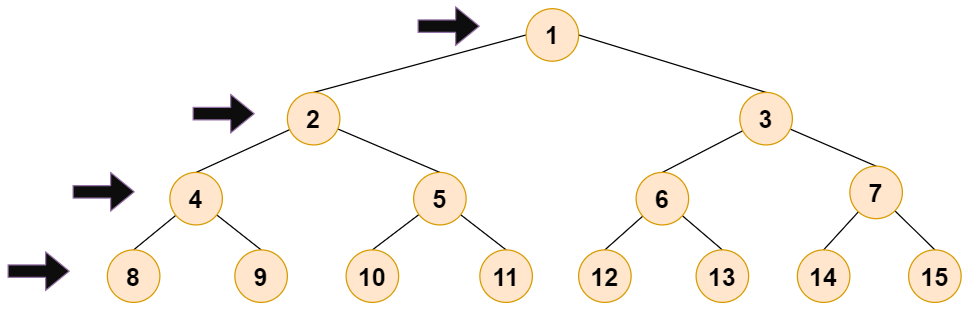
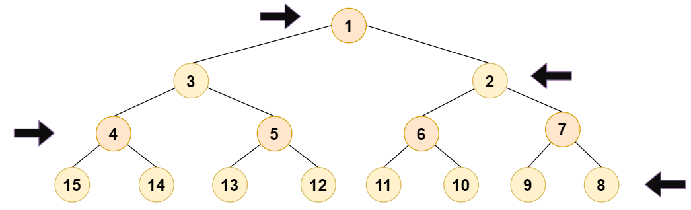
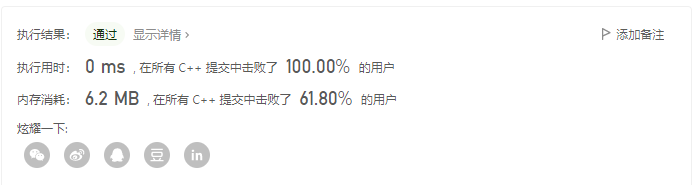

> 原文链接: https://leetcode-cn.com/problems/path-in-zigzag-labelled-binary-tree


## 英文原文
<div><p>In an infinite binary tree where every node has two children, the nodes are labelled in row order.</p>

<p>In the odd numbered rows (ie., the first, third, fifth,...), the labelling is left to right, while in the even numbered rows (second, fourth, sixth,...), the labelling is right to left.</p>

<p></p>

<p>Given the <code>label</code> of a node in this tree, return the labels in the path from the root of the tree to the&nbsp;node with that <code>label</code>.</p>

<p>&nbsp;</p>
<p><strong>Example 1:</strong></p>

<pre>
<strong>Input:</strong> label = 14
<strong>Output:</strong> [1,3,4,14]
</pre>

<p><strong>Example 2:</strong></p>

<pre>
<strong>Input:</strong> label = 26
<strong>Output:</strong> [1,2,6,10,26]
</pre>

<p>&nbsp;</p>
<p><strong>Constraints:</strong></p>

<ul>
	<li><code>1 &lt;= label &lt;= 10^6</code></li>
</ul>
</div>

## 中文题目
<div><p>在一棵无限的二叉树上，每个节点都有两个子节点，树中的节点 <strong>逐行</strong> 依次按&nbsp;&ldquo;之&rdquo; 字形进行标记。</p>

<p>如下图所示，在奇数行（即，第一行、第三行、第五行&hellip;&hellip;）中，按从左到右的顺序进行标记；</p>

<p>而偶数行（即，第二行、第四行、第六行&hellip;&hellip;）中，按从右到左的顺序进行标记。</p>

<p></p>

<p>给你树上某一个节点的标号 <code>label</code>，请你返回从根节点到该标号为 <code>label</code> 节点的路径，该路径是由途经的节点标号所组成的。</p>

<p>&nbsp;</p>

<p><strong>示例 1：</strong></p>

<pre><strong>输入：</strong>label = 14
<strong>输出：</strong>[1,3,4,14]
</pre>

<p><strong>示例 2：</strong></p>

<pre><strong>输入：</strong>label = 26
<strong>输出：</strong>[1,2,6,10,26]
</pre>

<p>&nbsp;</p>

<p><strong>提示：</strong></p>

<ul>
	<li><code>1 &lt;= label &lt;= 10^6</code></li>
</ul>
</div>

## 通过代码
<RecoDemo>
</RecoDemo>


## 高赞题解
**思路：**

我们先不考虑题目中特殊化的二叉树，先思考如何恢复正常的二叉树的路径

> **补充知识：**
> 若已知一节点为 $i$，则该节点的左孩子节点为 $(2 * i)$，右孩子节点为 $(2 * i + 1)$
> 且该节点的父节点为 $(i \,/\, 2)$



对于正常的二叉树，已知节点 $i$，根据上述知识我们便可以求得其路径：

```c++
vector <int> ans;
while(label) {
    ans.push_back(label);
    label >>= 1;
}
```

当 $label = 14$，则 $ans =$ {$14, 7, 3, 1$}

之后我们需要将 $ans$ 转化为题目要求的二叉树的路径



> 令 $deep$ 为深度

观察题目要求的二叉树，其实不难发现：$deep$ 为偶数时和正常的二叉树是对称的，所以我们只需要对 $deep$ 为偶数时进行处理即可

那么我们如何将正常的数转化为我们需要的呢？

> **补充知识：**
> 二叉树中第 $i$ 层一共有 $2 ^ {(i-1)}$ 个数，且前 $i - 1$ 层共有 $2 ^ {(i-1)} - 1$ 个数
> **注意：** 这里的 $i$ 从 $1$ 开始，而在代码实现中 $i$ 从 $0$ 开始

为了和代码一致，下面的推导我们以 $i = 0$ 为第一层

以节点 $10$ 举例，假设节点 $10$ 的深度为 $i$，节点 $10$ 对应的是节点 $13$，首先我们需要第 $i$ 层的节点个数以及第 $i$ 层的第一个节点的编号 $l$ 和最后一个节点的编号 $r$

其实不难发现：

$$
l = 2^i\\
r = 2 * l - 1\\
13 = r - 10 + l
$$

由此我们可以根据节点 $10$ 求得节点 $13$

最后需要注意的是：要对 $ans$ 进行反转

**代码实现：**

```c++
class Solution {
public:
    vector<int> pathInZigZagTree(int label) {
        vector <int> ans;
        while(label) {
            ans.push_back(label);
            label >>= 1;
        }
        reverse(ans.begin(), ans.end());
        int l, r, deep = ans.size();
        for(int i = 0; i < deep; i++) {
            if((deep & 1) != (i & 1)) continue;     // 判断第 i 层是否需要修改
            l = (1 << i);
            r = l + l - 1;
            ans[i] = r - ans[i] + l;
        }
        return ans;
    }
};
```
> 具体解释一下代码中的 $(deep\; \&\; 1)$ $!=$ $(i\; \&\; 1)$
> - 当 $deep$ 为 **偶数** 时，只对 **奇数深度** 进行修改
> - 当 $deep$ 为 **奇数** 时，只对 **偶数深度** 进行修改
>
> 而 $deep$ 为二叉树的总深度，$i$ 为当前遍历的深度，我们可以通过 $deep\; \&\; 1$ 可以判断 $deep$ 的奇偶
> 如果 $(deep\; \&\; 1)$ $!=$ $(i\; \&\; 1)$ 说明 $deep$ 和 $i$ 具有不同的奇偶性，此时需要对第 $i$ 层进行修改，但由于 $i = 0$ 为第一层，所以此时需要将 $i$ 理解为 $i + 1$ 才是当前真实的深度，故当 $(deep\; \&\; 1)$ $!=$ $(i\; \&\; 1)$ 时不需要修改

**复杂度分析**

- 时间复杂度：$O(\log label)$，求二叉树层数需 $O(\log label)$，$ans.size() = \log label$，则反转一次 $ans$ 需 $O(\log label)$，遍历一次 $ans$ 需 $O(\log label)$，总体为 $O(\log label)$

- 空间复杂度：$O(1)$，除返回需要的 $ans$ 外，额外需要的空间为 $O(1)$

**运行结果：**





## 统计信息
| 通过次数 | 提交次数 | AC比率 |
| :------: | :------: | :------: |
|    29039    |    38173    |   76.1%   |

## 提交历史
| 提交时间 | 提交结果 | 执行时间 |  内存消耗  | 语言 |
| :------: | :------: | :------: | :--------: | :--------: |
