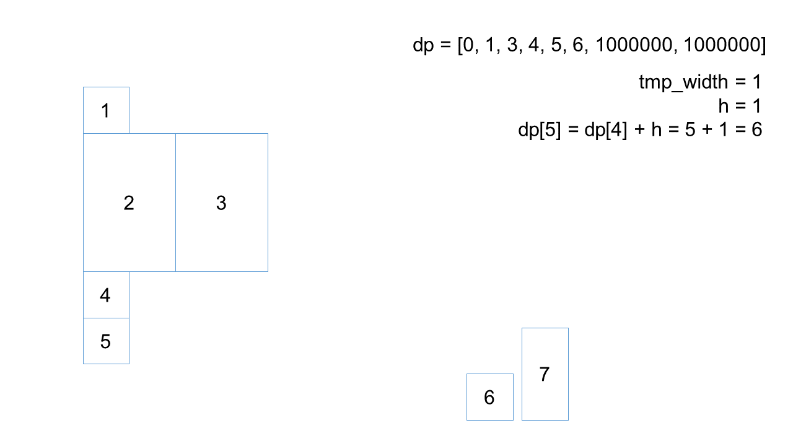

> 原文链接: https://leetcode-cn.com/problems/filling-bookcase-shelves


## 英文原文
<div><p>You are given an array <code>books</code> where <code>books[i] = [thickness<sub>i</sub>, height<sub>i</sub>]</code> indicates the thickness and height of the <code>i<sup>th</sup></code> book. You are also given an integer <code>shelfWidth</code>.</p>

<p>We want to place these books in order onto bookcase shelves that have a total width <code>shelfWidth</code>.</p>

<p>We choose some of the books to place on this shelf such that the sum of their thickness is less than or equal to <code>shelfWidth</code>, then build another level of the shelf of the bookcase so that the total height of the bookcase has increased by the maximum height of the books we just put down. We repeat this process until there are no more books to place.</p>

<p>Note that at each step of the above process, the order of the books we place is the same order as the given sequence of books.</p>

<ul>
	<li>For example, if we have an ordered list of <code>5</code> books, we might place the first and second book onto the first shelf, the third book on the second shelf, and the fourth and fifth book on the last shelf.</li>
</ul>

<p>Return <em>the minimum possible height that the total bookshelf can be after placing shelves in this manner</em>.</p>

<p>&nbsp;</p>
<p><strong>Example 1:</strong></p>

<pre>
<strong>Input:</strong> books = [[1,1],[2,3],[2,3],[1,1],[1,1],[1,1],[1,2]], shelf_width = 4
<strong>Output:</strong> 6
<strong>Explanation:</strong>
The sum of the heights of the 3 shelves is 1 + 3 + 2 = 6.
Notice that book number 2 does not have to be on the first shelf.
</pre>

<p><strong>Example 2:</strong></p>

<pre>
<strong>Input:</strong> books = [[1,3],[2,4],[3,2]], shelfWidth = 6
<strong>Output:</strong> 4
</pre>

<p>&nbsp;</p>
<p><strong>Constraints:</strong></p>

<ul>
	<li><code>1 &lt;= books.length &lt;= 1000</code></li>
	<li><code>1 &lt;= thickness<sub>i</sub> &lt;= shelfWidth &lt;= 1000</code></li>
	<li><code>1 &lt;= height<sub>i</sub> &lt;= 1000</code></li>
</ul>
</div>

## 中文题目
<div><p>附近的家居城促销，你买回了一直心仪的可调节书架，打算把自己的书都整理到新的书架上。</p>

<p>你把要摆放的书 <code>books</code>&nbsp;都整理好，叠成一摞：从上往下，第 <code>i</code>&nbsp;本书的厚度为 <code>books[i][0]</code>，高度为 <code>books[i][1]</code>。</p>

<p><strong>按顺序</strong>&nbsp;将这些书摆放到总宽度为&nbsp;<code>shelf_width</code> 的书架上。</p>

<p>先选几本书放在书架上（它们的厚度之和小于等于书架的宽度 <code>shelf_width</code>），然后再建一层书架。重复这个过程，直到把所有的书都放在书架上。</p>

<p>需要注意的是，在上述过程的每个步骤中，<strong>摆放书的顺序与你整理好的顺序相同</strong>。 例如，如果这里有 5 本书，那么可能的一种摆放情况是：第一和第二本书放在第一层书架上，第三本书放在第二层书架上，第四和第五本书放在最后一层书架上。</p>

<p>每一层所摆放的书的最大高度就是这一层书架的层高，书架整体的高度为各层高之和。</p>

<p>以这种方式布置书架，返回书架整体可能的最小高度。</p>

<p>&nbsp;</p>

<p><strong>示例：</strong></p>

<p></p>

<pre><strong>输入：</strong>books = [[1,1],[2,3],[2,3],[1,1],[1,1],[1,1],[1,2]], shelf_width = 4
<strong>输出：</strong>6
<strong>解释：</strong>
3 层书架的高度和为 1 + 3 + 2 = 6 。
第 2 本书不必放在第一层书架上。
</pre>

<p>&nbsp;</p>

<p><strong>提示：</strong></p>

<ul>
	<li><code>1 &lt;= books.length &lt;= 1000</code></li>
	<li><code>1 &lt;= books[i][0] &lt;= shelf_width &lt;= 1000</code></li>
	<li><code>1 &lt;= books[i][1] &lt;= 1000</code></li>
</ul>
</div>

## 通过代码
<RecoDemo>
</RecoDemo>


## 高赞题解
### 思路：

动态规划，用 `dp[i]` 表示放置前 `i` 本书所需要的书架最小高度，初始值 `dp[0] = 0`，其他为最大值 `1000*1000`。遍历每一本书，把当前这本书作为书架最后一层的最后一本书，将这本书之前的书向后调整，看看是否可以减少之前的书架高度。状态转移方程为 `dp[i] = min(dp[i] ,  dp[j - 1] + h)`，其中 `j` 表示最后一层所能容下书籍的索引，`h` 表示最后一层最大高度。

### 图解：
```
样例输入：books = [[1,1],[2,3],[2,3],[1,1],[1,1],[1,1],[1,2]], shelf_width = 4
```
最后求 `dp[7]`，省略了遍历步骤，直接给出结果。

<,,,,,,,,,,,,,,,>

### 代码：

```python [-Python3]
class Solution:
    def minHeightShelves(self, books: List[List[int]], shelf_width: int) -> int:
        n = len(books)
        dp = [1000000] * (n + 1)
        dp[0] = 0
        for i in range(1, n + 1):
            tmp_width, j, h = 0, i, 0
            while j > 0:
                tmp_width += books[j - 1][0]
                if tmp_width > shelf_width:
                    break
                h = max(h, books[j - 1][1])
                dp[i] = min(dp[i], dp[j - 1] + h)
                j -= 1
        return dp[-1]
```



## 统计信息
| 通过次数 | 提交次数 | AC比率 |
| :------: | :------: | :------: |
|    5329    |    9508    |   56.0%   |

## 提交历史
| 提交时间 | 提交结果 | 执行时间 |  内存消耗  | 语言 |
| :------: | :------: | :------: | :--------: | :--------: |
