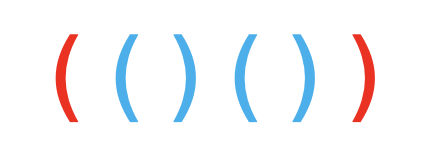
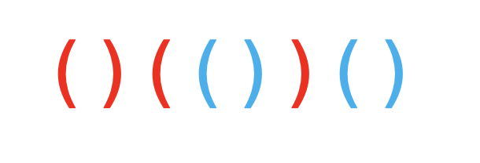
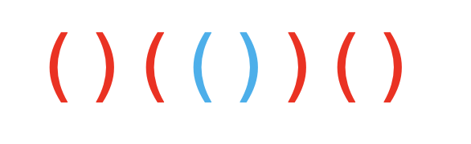

> 原文链接: https://leetcode-cn.com/problems/maximum-nesting-depth-of-two-valid-parentheses-strings


## 英文原文
<div><p>A string is a <em>valid parentheses string</em>&nbsp;(denoted VPS) if and only if it consists of <code>&quot;(&quot;</code> and <code>&quot;)&quot;</code> characters only, and:</p>

<ul>
	<li>It is the empty string, or</li>
	<li>It can be written as&nbsp;<code>AB</code>&nbsp;(<code>A</code>&nbsp;concatenated with&nbsp;<code>B</code>), where&nbsp;<code>A</code>&nbsp;and&nbsp;<code>B</code>&nbsp;are VPS&#39;s, or</li>
	<li>It can be written as&nbsp;<code>(A)</code>, where&nbsp;<code>A</code>&nbsp;is a VPS.</li>
</ul>

<p>We can&nbsp;similarly define the <em>nesting depth</em> <code>depth(S)</code> of any VPS <code>S</code> as follows:</p>

<ul>
	<li><code>depth(&quot;&quot;) = 0</code></li>
	<li><code>depth(A + B) = max(depth(A), depth(B))</code>, where <code>A</code> and <code>B</code> are VPS&#39;s</li>
	<li><code>depth(&quot;(&quot; + A + &quot;)&quot;) = 1 + depth(A)</code>, where <code>A</code> is a VPS.</li>
</ul>

<p>For example,&nbsp; <code>&quot;&quot;</code>,&nbsp;<code>&quot;()()&quot;</code>, and&nbsp;<code>&quot;()(()())&quot;</code>&nbsp;are VPS&#39;s (with nesting depths 0, 1, and 2), and <code>&quot;)(&quot;</code> and <code>&quot;(()&quot;</code> are not VPS&#39;s.</p>

<p>&nbsp;</p>

<p>Given a VPS <font face="monospace">seq</font>, split it into two disjoint subsequences <code>A</code> and <code>B</code>, such that&nbsp;<code>A</code> and <code>B</code> are VPS&#39;s (and&nbsp;<code>A.length + B.length = seq.length</code>).</p>

<p>Now choose <strong>any</strong> such <code>A</code> and <code>B</code> such that&nbsp;<code>max(depth(A), depth(B))</code> is the minimum possible value.</p>

<p>Return an <code>answer</code> array (of length <code>seq.length</code>) that encodes such a&nbsp;choice of <code>A</code> and <code>B</code>:&nbsp; <code>answer[i] = 0</code> if <code>seq[i]</code> is part of <code>A</code>, else <code>answer[i] = 1</code>.&nbsp; Note that even though multiple answers may exist, you may return any of them.</p>

<p>&nbsp;</p>
<p><strong>Example 1:</strong></p>

<pre>
<strong>Input:</strong> seq = &quot;(()())&quot;
<strong>Output:</strong> [0,1,1,1,1,0]
</pre>

<p><strong>Example 2:</strong></p>

<pre>
<strong>Input:</strong> seq = &quot;()(())()&quot;
<strong>Output:</strong> [0,0,0,1,1,0,1,1]
</pre>

<p>&nbsp;</p>
<p><strong>Constraints:</strong></p>

<ul>
	<li><code>1 &lt;= seq.size &lt;= 10000</code></li>
</ul>
</div>

## 中文题目
<div><p><strong>有效括号字符串 </strong>定义：对于每个左括号，都能找到与之对应的右括号，反之亦然。详情参见题末「<strong>有效括号字符串</strong>」部分。</p>

<p><strong>嵌套深度</strong> <code>depth</code> 定义：即有效括号字符串嵌套的层数，<code>depth(A)</code> 表示有效括号字符串 <code>A</code> 的嵌套深度。详情参见题末「<strong>嵌套深度</strong>」部分。</p>

<p>有效括号字符串类型与对应的嵌套深度计算方法如下图所示：</p>

<p></p>

<p>&nbsp;</p>

<p>给你一个「有效括号字符串」 <code>seq</code>，请你将其分成两个不相交的有效括号字符串，<code>A</code> 和&nbsp;<code>B</code>，并使这两个字符串的深度最小。</p>

<ul>
	<li>不相交：每个 <code>seq[i]</code> 只能分给 <code>A</code> 和 <code>B</code> 二者中的一个，不能既属于 <code>A</code> 也属于 <code>B</code> 。</li>
	<li><code>A</code> 或 <code>B</code> 中的元素在原字符串中可以不连续。</li>
	<li><code>A.length + B.length = seq.length</code></li>
	<li>深度最小：<code>max(depth(A), depth(B))</code>&nbsp;的可能取值最小。&nbsp;</li>
</ul>

<p>划分方案用一个长度为 <code>seq.length</code> 的答案数组 <code>answer</code> 表示，编码规则如下：</p>

<ul>
	<li><code>answer[i] = 0</code>，<code>seq[i]</code> 分给 <code>A</code> 。</li>
	<li><code>answer[i] = 1</code>，<code>seq[i]</code> 分给 <code>B</code> 。</li>
</ul>

<p>如果存在多个满足要求的答案，只需返回其中任意 <strong>一个 </strong>即可。</p>

<p>&nbsp;</p>

<p><strong>示例 1：</strong></p>

<pre><strong>输入：</strong>seq = &quot;(()())&quot;
<strong>输出：</strong>[0,1,1,1,1,0]
</pre>

<p><strong>示例 2：</strong></p>

<pre><strong>输入：</strong>seq = &quot;()(())()&quot;
<strong>输出：</strong>[0,0,0,1,1,0,1,1]
<strong>解释：</strong>本示例答案不唯一。
按此输出 A = &quot;()()&quot;, B = &quot;()()&quot;, max(depth(A), depth(B)) = 1，它们的深度最小。
像 [1,1,1,0,0,1,1,1]，也是正确结果，其中 A = &quot;()()()&quot;, B = &quot;()&quot;, max(depth(A), depth(B)) = 1 。 
</pre>

<p>&nbsp;</p>

<p><strong>提示：</strong></p>

<ul>
	<li><code>1 &lt;&nbsp;seq.size &lt;= 10000</code></li>
</ul>

<p>&nbsp;</p>

<p><strong>有效括号字符串：</strong></p>

<pre>仅由&nbsp;<code>&quot;(&quot;</code> 和&nbsp;<code>&quot;)&quot;</code>&nbsp;构成的字符串，对于每个左括号，都能找到与之对应的右括号，反之亦然。
下述几种情况同样属于有效括号字符串：

  1. 空字符串
  2. 连接，可以记作&nbsp;<code>AB</code>（<code>A</code> 与 <code>B</code> 连接），其中&nbsp;<code>A</code>&nbsp;和&nbsp;<code>B</code>&nbsp;都是有效括号字符串
  3. 嵌套，可以记作&nbsp;<code>(A)</code>，其中&nbsp;<code>A</code>&nbsp;是有效括号字符串
</pre>

<p><strong>嵌套深度：</strong></p>

<pre>类似地，我们可以定义任意有效括号字符串 <code>s</code> 的 <strong>嵌套深度</strong>&nbsp;<code>depth(S)</code>：

  1.<code> s</code> 为空时，<code>depth(&quot;&quot;) = 0</code>
<code>  2. s</code> 为 <code>A</code> 与 <code>B</code> 连接时，<code>depth(A + B) = max(depth(A), depth(B))</code>，其中&nbsp;<code>A</code> 和&nbsp;<code>B</code>&nbsp;都是有效括号字符串
<code>  3. s</code> 为嵌套情况，<code>depth(&quot;(&quot; + A + &quot;)&quot;) = 1 + depth(A)</code>，其中 <code>A</code> 是有效括号字符串

例如：<code>&quot;&quot;</code>，<code>&quot;()()&quot;</code>，和&nbsp;<code>&quot;()(()())&quot;</code>&nbsp;都是有效括号字符串，嵌套深度分别为 0，1，2，而&nbsp;<code>&quot;)(&quot;</code> 和&nbsp;<code>&quot;(()&quot;</code>&nbsp;都不是有效括号字符串。
</pre>
</div>

## 通过代码
<RecoDemo>
</RecoDemo>


## 高赞题解
#### 解题思路：
这道题题意说的其实有点啰嗦的。首先你要知道有效括号的意思，一句话概括就是每个左括号都可以找到在它右边的与其对应的右括号。不知道有效括号的概念的，或者没有刷过判断有效括号题目的，建议可以移步这里： [有效的括号](https://leetcode-cn.com/problems/valid-parentheses/)。

题面最后 answer 的意思就是，为 0 的部分对应 seq 的括号是 A 字符串，为 1 的部分对应 seq 的括号是 B 字符串。

示例 1：
```
输入：seq = "(()())"
输出：[0,1,1,1,1,0]
```
answer 的意思是下面这个样子。红色部分是 A 串，蓝色部分是 B 串。
{:height="30%" width="30%"}


示例 2：
```
输入：seq = "()(())()"
输出：[0,0,0,1,1,0,1,1]
```
对应的 answer 的图示：
{:height="30%" width="30%"}

题面也说了 answer 的答案是不唯一的，下面这样也是可以的：
{:height="30%" width="30%"}


下面说做法：

我假设你已经做过上面的题目了，知道需要用栈辅助判断。题面中的 depth 其实就是栈的最大深度。“你需要从中选出任意一组有效括号字符串 A 和 B，使 max(depth(A), depth(B)) 的可能取值最小”。这句话其实相当于让 A 字符串和 B 字符串的 depth 尽可能的接近。为什么呢？因为 seq 对应的栈上，每个左括号都对应一个深度，而这个左括号，要么是 A 的，要么是 B 的。所以，栈上的左括号只要按奇偶分配给A和B就可以啦！时间复杂度很明显是 $O(n)$ 的，空间复杂度也是 $O(n)$（如果算返回的变量的话）。

```Java []
public class Solution {
    public int[] maxDepthAfterSplit(String seq) {
        int[] ans = new int [seq.length()];
        int idx = 0;
        for(char c: seq.toCharArray()) {
            ans[idx++] = c == '(' ? idx & 1 : ((idx + 1) & 1);
        }
        return ans;
    }
}
```

以上谢谢大家，**求赞求赞求赞！**


## 统计信息
| 通过次数 | 提交次数 | AC比率 |
| :------: | :------: | :------: |
|    24441    |    31686    |   77.1%   |

## 提交历史
| 提交时间 | 提交结果 | 执行时间 |  内存消耗  | 语言 |
| :------: | :------: | :------: | :--------: | :--------: |
