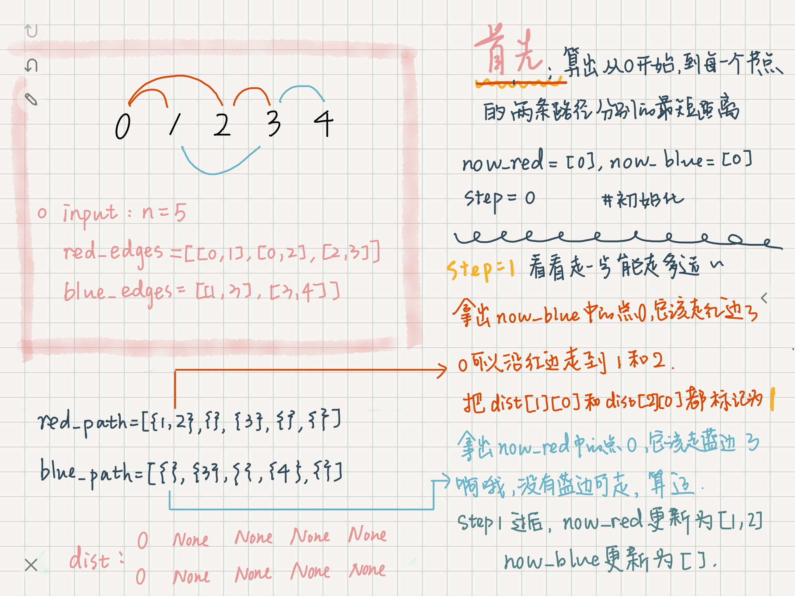

> 原文链接: https://leetcode-cn.com/problems/shortest-path-with-alternating-colors


## 英文原文
<div><p>Consider a directed graph, with nodes labelled <code>0, 1, ..., n-1</code>.&nbsp; In this graph, each edge is either red or blue, and there could&nbsp;be self-edges or parallel edges.</p>

<p>Each <code>[i, j]</code> in <code>red_edges</code> denotes a red directed edge from node <code>i</code> to node <code>j</code>.&nbsp; Similarly, each <code>[i, j]</code> in <code>blue_edges</code> denotes a blue directed edge from node <code>i</code> to node <code>j</code>.</p>

<p>Return an array <code>answer</code>&nbsp;of length <code>n</code>,&nbsp;where each&nbsp;<code>answer[X]</code>&nbsp;is&nbsp;the length of the shortest path from node <code>0</code>&nbsp;to node <code>X</code>&nbsp;such that the edge colors alternate along the path (or <code>-1</code> if such a path doesn&#39;t exist).</p>

<p>&nbsp;</p>
<p><strong>Example 1:</strong></p>
<pre><strong>Input:</strong> n = 3, red_edges = [[0,1],[1,2]], blue_edges = []
<strong>Output:</strong> [0,1,-1]
</pre><p><strong>Example 2:</strong></p>
<pre><strong>Input:</strong> n = 3, red_edges = [[0,1]], blue_edges = [[2,1]]
<strong>Output:</strong> [0,1,-1]
</pre><p><strong>Example 3:</strong></p>
<pre><strong>Input:</strong> n = 3, red_edges = [[1,0]], blue_edges = [[2,1]]
<strong>Output:</strong> [0,-1,-1]
</pre><p><strong>Example 4:</strong></p>
<pre><strong>Input:</strong> n = 3, red_edges = [[0,1]], blue_edges = [[1,2]]
<strong>Output:</strong> [0,1,2]
</pre><p><strong>Example 5:</strong></p>
<pre><strong>Input:</strong> n = 3, red_edges = [[0,1],[0,2]], blue_edges = [[1,0]]
<strong>Output:</strong> [0,1,1]
</pre>
<p>&nbsp;</p>
<p><strong>Constraints:</strong></p>

<ul>
	<li><code>1 &lt;= n &lt;= 100</code></li>
	<li><code>red_edges.length &lt;= 400</code></li>
	<li><code>blue_edges.length &lt;= 400</code></li>
	<li><code>red_edges[i].length == blue_edges[i].length == 2</code></li>
	<li><code>0 &lt;= red_edges[i][j], blue_edges[i][j] &lt; n</code></li>
</ul></div>

## 中文题目
<div><p>在一个有向图中，节点分别标记为&nbsp;<code>0, 1, ..., n-1</code>。这个图中的每条边不是红色就是蓝色，且存在自环或平行边。</p>

<p><code>red_edges</code>&nbsp;中的每一个&nbsp;<code>[i, j]</code>&nbsp;对表示从节点 <code>i</code> 到节点 <code>j</code> 的红色有向边。类似地，<code>blue_edges</code>&nbsp;中的每一个&nbsp;<code>[i, j]</code>&nbsp;对表示从节点 <code>i</code> 到节点 <code>j</code> 的蓝色有向边。</p>

<p>返回长度为 <code>n</code> 的数组&nbsp;<code>answer</code>，其中&nbsp;<code>answer[X]</code>&nbsp;是从节点&nbsp;<code>0</code>&nbsp;到节点&nbsp;<code>X</code>&nbsp;的红色边和蓝色边交替出现的最短路径的长度。如果不存在这样的路径，那么 <code>answer[x] = -1</code>。</p>

<p>&nbsp;</p>

<p><strong>示例 1：</strong></p>

<pre><strong>输入：</strong>n = 3, red_edges = [[0,1],[1,2]], blue_edges = []
<strong>输出：</strong>[0,1,-1]
</pre>

<p><strong>示例 2：</strong></p>

<pre><strong>输入：</strong>n = 3, red_edges = [[0,1]], blue_edges = [[2,1]]
<strong>输出：</strong>[0,1,-1]
</pre>

<p><strong>示例 3：</strong></p>

<pre><strong>输入：</strong>n = 3, red_edges = [[1,0]], blue_edges = [[2,1]]
<strong>输出：</strong>[0,-1,-1]
</pre>

<p><strong>示例 4：</strong></p>

<pre><strong>输入：</strong>n = 3, red_edges = [[0,1]], blue_edges = [[1,2]]
<strong>输出：</strong>[0,1,2]
</pre>

<p><strong>示例 5：</strong></p>

<pre><strong>输入：</strong>n = 3, red_edges = [[0,1],[0,2]], blue_edges = [[1,0]]
<strong>输出：</strong>[0,1,1]
</pre>

<p>&nbsp;</p>

<p><strong>提示：</strong></p>

<ul>
	<li><code>1 &lt;= n &lt;= 100</code></li>
	<li><code>red_edges.length &lt;= 400</code></li>
	<li><code>blue_edges.length &lt;= 400</code></li>
	<li><code>red_edges[i].length == blue_edges[i].length == 2</code></li>
	<li><code>0 &lt;= red_edges[i][j], blue_edges[i][j] &lt; n</code></li>
</ul>
</div>

## 通过代码
<RecoDemo>
</RecoDemo>


## 高赞题解
- main idea：BFS，从节点0起，每次take one step，这样保证到达每个节点时路径是最短的。而我们并不知道节点0到达节点i的最短路径，是'红蓝红...'还是'蓝红蓝...'，所以我们需要都找出来，用nx2的数组`dist`保存，最后再选短的那个。

<,,,,>


```python []
class Solution:
    def shortestAlternatingPaths(self, n: int, red_edges: List[List[int]], blue_edges: List[List[int]]) -> List[int]:
        red_path = [set() for i in range(n)]
        blue_path = [set() for i in range(n)]
        dist = [[None, None] for i in range(n)]
        dist[0] = [0, 0]
        step = 0
        now_red = [0]
        now_blue = [0]
        for start, end in red_edges:
            red_path[start].add(end)
        for start, end in blue_edges:
            blue_path[start].add(end)
        # step 1 找到分别以红边开始和以蓝边开始的两条最短路径
        while len(now_red) != 0 or len(now_blue) != 0 :
            new_red, new_blue = [], []
            step += 1
            if len(now_blue) != 0:
                for point in now_blue:
                    for next_point in red_path[point]:
                        if dist[next_point][0] is None:
                            new_red.append(next_point)
                            dist[next_point][0] = step
            if len(now_red) != 0:
                for point in now_red:
                    for next_point in blue_path[point]:
                        if dist[next_point][1] is None:
                            new_blue.append(next_point)
                            dist[next_point][1] = step
            now_red, now_blue = new_red, new_blue
        # step 2 在这两条最短路径中选择小的，merge成我们的答案
        ans = []
        for i in range(n):
            if dist[i][0] is None and dist[i][1] is None:
                ans.append(-1)
            elif dist[i][0] is not None and dist[i][1] is not None:
                ans.append(min(dist[i][0], dist[i][1]))
            elif dist[i][0] is not None:
                ans.append(dist[i][0])
            else:
                ans.append(dist[i][1])
        return ans
```

## 统计信息
| 通过次数 | 提交次数 | AC比率 |
| :------: | :------: | :------: |
|    6546    |    17082    |   38.3%   |

## 提交历史
| 提交时间 | 提交结果 | 执行时间 |  内存消耗  | 语言 |
| :------: | :------: | :------: | :--------: | :--------: |
