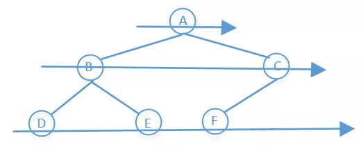

> 原文链接: https://leetcode-cn.com/problems/path-sum-ii


## 英文原文
<div><p>Given the <code>root</code> of a binary tree and an integer <code>targetSum</code>, return <em>all <strong>root-to-leaf</strong> paths where the sum of the node values in the path equals </em><code>targetSum</code><em>. Each path should be returned as a list of the node <strong>values</strong>, not node references</em>.</p>

<p>A <strong>root-to-leaf</strong> path is a path starting from the root and ending at any leaf node. A <strong>leaf</strong> is a node with no children.</p>

<p>&nbsp;</p>
<p><strong>Example 1:</strong></p>

<pre>
<strong>Input:</strong> root = [5,4,8,11,null,13,4,7,2,null,null,5,1], targetSum = 22
<strong>Output:</strong> [[5,4,11,2],[5,8,4,5]]
<strong>Explanation:</strong> There are two paths whose sum equals targetSum:
5 + 4 + 11 + 2 = 22
5 + 8 + 4 + 5 = 22
</pre>

<p><strong>Example 2:</strong></p>

<pre>
<strong>Input:</strong> root = [1,2,3], targetSum = 5
<strong>Output:</strong> []
</pre>

<p><strong>Example 3:</strong></p>

<pre>
<strong>Input:</strong> root = [1,2], targetSum = 0
<strong>Output:</strong> []
</pre>

<p>&nbsp;</p>
<p><strong>Constraints:</strong></p>

<ul>
	<li>The number of nodes in the tree is in the range <code>[0, 5000]</code>.</li>
	<li><code>-1000 &lt;= Node.val &lt;= 1000</code></li>
	<li><code>-1000 &lt;= targetSum &lt;= 1000</code></li>
</ul>
</div>

## 中文题目
<div><p>给你二叉树的根节点 <code>root</code> 和一个整数目标和 <code>targetSum</code> ，找出所有 <strong>从根节点到叶子节点</strong> 路径总和等于给定目标和的路径。</p>

<p><strong>叶子节点</strong> 是指没有子节点的节点。</p>

<div class="original__bRMd">
<div>
<p> </p>

<p><strong>示例 1：</strong></p>

<pre>
<strong>输入：</strong>root = [5,4,8,11,null,13,4,7,2,null,null,5,1], targetSum = 22
<strong>输出：</strong>[[5,4,11,2],[5,8,4,5]]
</pre>

<p><strong>示例 2：</strong></p>

<pre>
<strong>输入：</strong>root = [1,2,3], targetSum = 5
<strong>输出：</strong>[]
</pre>

<p><strong>示例 3：</strong></p>

<pre>
<strong>输入：</strong>root = [1,2], targetSum = 0
<strong>输出：</strong>[]
</pre>

<p> </p>

<p><strong>提示：</strong></p>

<ul>
	<li>树中节点总数在范围 <code>[0, 5000]</code> 内</li>
	<li><code>-1000 <= Node.val <= 1000</code></li>
	<li><code>-1000 <= targetSum <= 1000</code></li>
</ul>
</div>
</div>
</div>

## 通过代码
<RecoDemo>
</RecoDemo>


## 高赞题解


### 1，递归

这题没说sum是正数还是负数，也没说树中节点的值有没有负数。我们要做的是从根节点到叶子节点遍历他所有的路径，返回他所有路径中和等于sum的节点，这里有两种实现方式，一种是减，一种是加。**减就是从根节点开始，用sum不断的减去遍历到的每一个节点，一直到叶子节点**，在减去叶子节点之前查看sum是否等于叶子节点，如果等于说明我们找到了一组，画个图看一下


```java

public List<List<Integer>> pathSum(TreeNode root, int sum) {

    List<List<Integer>> result = new ArrayList<>();

    dfs(root, sum, new ArrayList<>(), result);

    return result;

}


public void dfs(TreeNode root, int sum, List<Integer> list,

                List<List<Integer>> result) {

    //如果节点为空直接返回

    if (root == null)

        return;

    //因为list是引用传递，为了防止递归的时候分支污染，我们要在每个路径

    //中都要新建一个subList

    List<Integer> subList = new ArrayList<>(list);

    //把当前节点值加入到subList中

    subList.add(new Integer(root.val));

    //如果到达叶子节点，就不能往下走了，直接return

    if (root.left == null && root.right == null) {

        //如果到达叶子节点，并且sum等于叶子节点的值，说明我们找到了一组，

        //要把它放到result中

        if (sum == root.val)

            result.add(subList);

        //到叶子节点之后直接返回，因为在往下就走不动了

        return;

    }

    //如果没到达叶子节点，就继续从他的左右两个子节点往下找，注意到

    //下一步的时候，sum值要减去当前节点的值

    dfs(root.left, sum - root.val, subList, result);

    dfs(root.right, sum - root.val, subList, result);

}

```

看下运行结果，这种不停的创建list，其实效率很差


<br>


### 2，回溯，往下减

上面只是对二叉树的深度优先搜索（DFS），并没有使用**回溯**，之前讲递归的时候提到过为了防止分支污染我们还可以把使用过的值在返回的时候把它给remove掉，这就是大家常提的**回溯算法**，也可以看下之前讲的[426，什么是递归，通过这篇文章，让你彻底搞懂递归](https://mp.weixin.qq.com/s?__biz=MzU0ODMyNDk0Mw==&mid=2247487910&idx=1&sn=2670aec7139c6b98e83ff66114ac1cf7&chksm=fb418286cc360b90741ed54fecd62fd45571b2caba3e41473a7ea0934f918d4b31537689c664&scene=21#wechat_redirect)，看下代码

```java

public List<List<Integer>> pathSum(TreeNode root, int sum) {

    List<List<Integer>> result = new ArrayList<>();

    dfs(root, sum, new ArrayList<>(), result);

    return result;

}


public void dfs(TreeNode root, int sum, List<Integer> list,

                List<List<Integer>> result) {

    //如果节点为空直接返回

    if (root == null)

        return;

    //把当前节点值加入到list中

    list.add(new Integer(root.val));

    //如果到达叶子节点，就不能往下走了，直接return

    if (root.left == null && root.right == null) {

        //如果到达叶子节点，并且sum等于叶子节点的值，说明我们找到了一组，

        //要把它放到result中

        if (sum == root.val)

            result.add(new ArrayList(list));

        //注意别忘了把最后加入的结点值给移除掉，因为下一步直接return了，

        //不会再走最后一行的remove了，所以这里在rerurn之前提前把最后

        //一个结点的值给remove掉。

        list.remove(list.size() - 1);

        //到叶子节点之后直接返回，因为在往下就走不动了

        return;

    }

    //如果没到达叶子节点，就继续从他的左右两个子节点往下找，注意到

    //下一步的时候，sum值要减去当前节点的值

    dfs(root.left, sum - root.val, list, result);

    dfs(root.right, sum - root.val, list, result);

    //我们要理解递归的本质，当递归往下传递的时候他最后还是会往回走，

    //我们把这个值使用完之后还要把它给移除，这就是回溯

    list.remove(list.size() - 1);

}

```

再来看下运行结果


<br>


### 3，回溯，往下累加

上面是减的方式，我们再来看一个加的方式，其实他就是从根节点开始到叶子节点把这个路径上的所有节点都加起来，最后查看是否等于sum，画个图看一下


代码就很简单了，来看下

```java

public List<List<Integer>> pathSum(TreeNode root, int sum) {

    List<List<Integer>> result = new ArrayList<>();

    dfs(root, sum, 0, new ArrayList<>(), result);

    return result;

}


public void dfs(TreeNode root, int sum, int toal, List<Integer> list,

                List<List<Integer>> result) {

    //如果节点为空直接返回

    if (root == null)

        return;

    //把当前节点值加入到list中

    list.add(new Integer(root.val));

    //没往下走一步就要计算走过的路径和

    toal += root.val;

    //如果到达叶子节点，就不能往下走了，直接return

    if (root.left == null && root.right == null) {

        //如果到达叶子节点，并且sum等于toal，说明我们找到了一组，

        //要把它放到result中

        if (sum == toal)

            result.add(new ArrayList(list));

        //注意别忘了把最后加入的结点值给移除掉，因为下一步直接return了，

        //不会再走最后一行的remove了，所以这里在rerurn之前提前把最后

        //一个结点的值给remove掉。

        list.remove(list.size() - 1);

        //到叶子节点之后直接返回，因为在往下就走不动了

        return;

    }

    //如果没到达叶子节点，就继续从他的左右两个子节点往下找

    dfs(root.left, sum, toal, list, result);

    dfs(root.right, sum, toal, list, result);

    //我们要理解递归的本质，当递归往下传递的时候他最后还是会往回走，

    //我们把这个值使用完之后还要把它给移除，这就是回溯

    list.remove(list.size() - 1);

}

```

再来看下运行结果


<br>


### 4，BFS解决

上面几种方式无论加还是减，都是二叉树的DFS，这里还可以使用二叉树的BFS解决，就是一行一行的遍历




```java

    public List<List<Integer>> pathSum(TreeNode root, int sum) {

        List<List<Integer>> res = new ArrayList<>();

        //如果节点为空直接返回

        if (root == null)

            return res;

        //使用两个队列，一个存储结点，一个存储从更结点到当前节点的路径

        Queue<TreeNode> queueNode = new LinkedList<>();

        Queue<List<Integer>> queueList = new LinkedList<>();

        //根节点入队

        queueNode.add(root);

        //根节点的路径入队

        List<Integer> list = new ArrayList<>();

        list.add(root.val);

        queueList.add(list);


        while (!queueNode.isEmpty()) {

            //当前节点出队

            TreeNode node = queueNode.poll();

            //当前节点的路径出队

            List<Integer> tempList = queueList.poll();

            if (node.left == null && node.right == null && node.val == sum) {

                //如果满足条件，就把路径存储到res中

                res.add(tempList);

            }

            //左子节点不为空，左子节点和路径入队

            if (node.left != null) {

                tempList.add(node.left.val);

                queueList.add(new ArrayList<>(tempList));

                node.left.val += node.val;

                queueNode.add(node.left);

                tempList.remove(tempList.size() - 1);

            }

            //右子节点不为空，右子节点和路径入队

            if (node.right != null) {

                tempList.add(node.right.val);

                queueList.add(new ArrayList<>(tempList));

                node.right.val += node.val;

                queueNode.add(node.right);

            }

        }

        return res;

    }

```


看一下运行结果，效率很差


<br>


### 5，深度优先搜索非递归解决

树的dfs递归代码比较简单，我们来看一下树的dfs非递归的写法

```java

    public void treeDFS(TreeNode root) {

        Stack<TreeNode> stack = new Stack<>();

        stack.add(root);

        while (!stack.empty()) {

            TreeNode node = stack.pop();

            System.out.println(node.val);

            if (node.right != null) {

                stack.push(node.right);

            }

            if (node.left != null) {

                stack.push(node.left);

            }

        }

    }

```

可以参照上面的代码进行修改，代码和第4种方式相似度比较高，不同的是第4种方式使用的是队列，而这里使用的是栈


```java

    public List<List<Integer>> pathSum(TreeNode root, int sum) {

        List<List<Integer>> res = new ArrayList<>();

        //如果节点为空直接返回

        if (root == null)

            return res;

        Stack<TreeNode> stackNode = new Stack<>();

        Stack<List<Integer>> stackList = new Stack<>();

        stackNode.add(root);


        List<Integer> list = new ArrayList<>();

        list.add(root.val);

        stackList.add(list);

        while (!stackNode.empty()) {

            TreeNode node = stackNode.pop();

            List<Integer> tempList = stackList.pop();

            if (node.left == null && node.right == null && node.val == sum) {

                //如果满足条件，就把路径存储到res中

                res.add(tempList);

            }


            if (node.right != null) {

                tempList.add(node.right.val);

                stackList.add(new ArrayList<>(tempList));

                node.right.val += node.val;

                stackNode.push(node.right);

                tempList.remove(tempList.size() - 1);


            }

            if (node.left != null) {

                tempList.add(node.left.val);

                stackList.add(new ArrayList<>(tempList));

                node.left.val += node.val;

                stackNode.push(node.left);

                tempList.remove(tempList.size() - 1);

            }

        }

        return res;

    }

```


<br>


我把部分算法题整理成了PDF文档，截止目前总共有**900多页**，大家可以下载阅读

**链接**：https://pan.baidu.com/s/1hjwK0ZeRxYGB8lIkbKuQgQ 

**提取码**：6666 


#### 如果觉得有用就给个赞吧，还可以关注我的[LeetCode主页](https://leetcode-cn.com/u/sdwwld/)查看更多的详细题解

## 统计信息
| 通过次数 | 提交次数 | AC比率 |
| :------: | :------: | :------: |
|    194804    |    310565    |   62.7%   |

## 提交历史
| 提交时间 | 提交结果 | 执行时间 |  内存消耗  | 语言 |
| :------: | :------: | :------: | :--------: | :--------: |


## 相似题目
|                             题目                             | 难度 |
| :----------------------------------------------------------: | :---------: |
| [路径总和](https://leetcode-cn.com/problems/path-sum/) | 简单|
| [二叉树的所有路径](https://leetcode-cn.com/problems/binary-tree-paths/) | 简单|
| [路径总和 III](https://leetcode-cn.com/problems/path-sum-iii/) | 中等|
| [路径总和 IV](https://leetcode-cn.com/problems/path-sum-iv/) | 中等|
