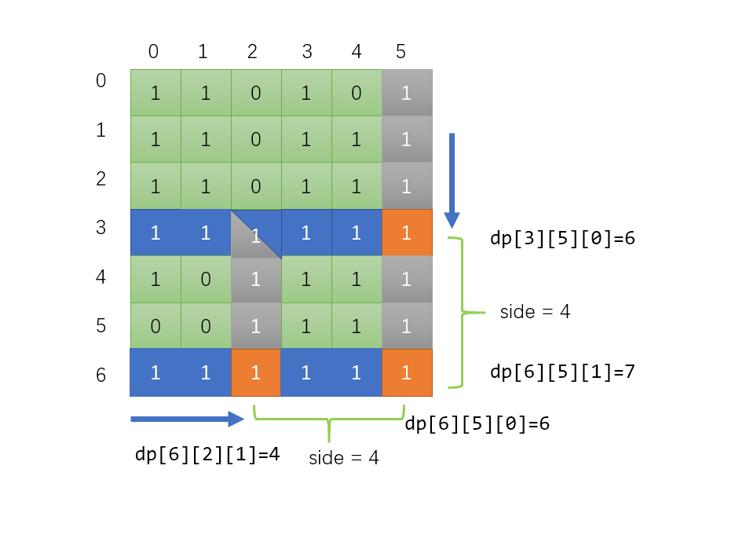

> 原文链接: https://leetcode-cn.com/problems/largest-1-bordered-square


## 英文原文
<div><p>Given a 2D <code>grid</code> of <code>0</code>s and <code>1</code>s, return the number of elements in&nbsp;the largest <strong>square</strong>&nbsp;subgrid that has all <code>1</code>s on its <strong>border</strong>, or <code>0</code> if such a subgrid&nbsp;doesn&#39;t exist in the <code>grid</code>.</p>

<p>&nbsp;</p>
<p><strong>Example 1:</strong></p>

<pre>
<strong>Input:</strong> grid = [[1,1,1],[1,0,1],[1,1,1]]
<strong>Output:</strong> 9
</pre>

<p><strong>Example 2:</strong></p>

<pre>
<strong>Input:</strong> grid = [[1,1,0,0]]
<strong>Output:</strong> 1
</pre>

<p>&nbsp;</p>
<p><strong>Constraints:</strong></p>

<ul>
	<li><code>1 &lt;= grid.length &lt;= 100</code></li>
	<li><code>1 &lt;= grid[0].length &lt;= 100</code></li>
	<li><code>grid[i][j]</code> is <code>0</code> or <code>1</code></li>
</ul></div>

## 中文题目
<div><p>给你一个由若干 <code>0</code> 和 <code>1</code> 组成的二维网格&nbsp;<code>grid</code>，请你找出边界全部由 <code>1</code> 组成的最大 <strong>正方形</strong> 子网格，并返回该子网格中的元素数量。如果不存在，则返回 <code>0</code>。</p>

<p>&nbsp;</p>

<p><strong>示例 1：</strong></p>

<pre><strong>输入：</strong>grid = [[1,1,1],[1,0,1],[1,1,1]]
<strong>输出：</strong>9
</pre>

<p><strong>示例 2：</strong></p>

<pre><strong>输入：</strong>grid = [[1,1,0,0]]
<strong>输出：</strong>1
</pre>

<p>&nbsp;</p>

<p><strong>提示：</strong></p>

<ul>
	<li><code>1 &lt;= grid.length &lt;= 100</code></li>
	<li><code>1 &lt;= grid[0].length &lt;= 100</code></li>
	<li><code>grid[i][j]</code> 为&nbsp;<code>0</code>&nbsp;或&nbsp;<code>1</code></li>
</ul>
</div>

## 通过代码
<RecoDemo>
</RecoDemo>


## 高赞题解
### 思路


首先定义DP数组
```java
dp[i][j][0]: i,j左边连续的1的个数（包括自身）
dp[i][j][1]: i,j上边连续的1的个数（包括自身）
```
然后递推预处理这一部分
```java []
int[][][] dp = new int[m+1][n+1][2];
for (int i = 1; i <= m; i++) {
    for (int j = 1; j <= n; j++) {
        if (grid[i-1][j-1] == 1){
            dp[i][j][0] = 1 + dp[i][j-1][0];
            dp[i][j][1] = 1 + dp[i-1][j][1];
        }
    }
}
```
简单画了个图（和实际代码有一点出入，实际代码为了方便初始化，`dp[i][j]`代表的其实是`grid[i-1][j-1]`）




求以某个点为右下角的正方形，首先我们考虑这个点为右下角可能构成的最大正方形边长是多大

很明显应该是该点左边和上边连续1个数的**最小值**，如上图的（6，5）点，最大的可能边长就应该是6，然后我们枚举所有的小于等于6大于等于1的边长`side`，验证`side`能否构成正方形

验证`side`是否合法也很容易，如上图，我们只需要考虑（6，5）**上边**距离为`side`的点的**左边**连续1的个数是否大于等于`side`（`dp[i-side+1][j][0] >= side`），以及**左边**距离为`side`的点的**上边**连续的1的个数是否大于等于`side`（`dp[i][j-side+1][1] >= side`），如果都大于等于`side`那么该`side`就是合法的，我们统计这些合法的`side`的最大值就ok了

### Code

```java []
public int largest1BorderedSquare(int[][] grid) {
    int m = grid.length;
    int n = grid[0].length;
    //dp[i][j][0]: i,j左边连续的1的个数
    //dp[i][j][1]: i,j上边连续的1的个数
    int[][][] dp = new int[m+1][n+1][2];
    for (int i = 1; i <= m; i++) {
        for (int j = 1; j <= n; j++) {
            if (grid[i-1][j-1] == 1){
                dp[i][j][0] = 1 + dp[i][j-1][0];
                dp[i][j][1] = 1 + dp[i-1][j][1];
            }
        }
    }
    int res = 0;
    for (int i = 1; i <= m; i++) {
        for (int j = 1; j <= n; j++) {
            //最短的那条边不一定是合法的边长，如果该边长不合法就需要缩减边长，直到找到合法的
            for (int side = Math.min(dp[i][j][0], dp[i][j][1]); side >= 1; side--){
                if (dp[i][j-side+1][1] >= side && dp[i-side+1][j][0] >= side){
                    res = Math.max(res, side);
                    break; //更短的就没必要考虑了
                }
            }
        }
    }
    return res * res;
}
```



## 统计信息
| 通过次数 | 提交次数 | AC比率 |
| :------: | :------: | :------: |
|    9744    |    20310    |   48.0%   |

## 提交历史
| 提交时间 | 提交结果 | 执行时间 |  内存消耗  | 语言 |
| :------: | :------: | :------: | :--------: | :--------: |
