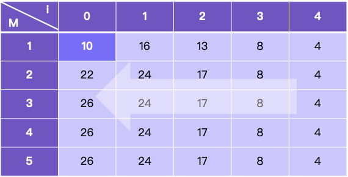

> 原文链接: https://leetcode-cn.com/problems/stone-game-ii


## 英文原文
<div><p>Alice and Bob continue their&nbsp;games with piles of stones.&nbsp; There are a number of&nbsp;piles&nbsp;<strong>arranged in a row</strong>, and each pile has a positive integer number of stones&nbsp;<code>piles[i]</code>.&nbsp; The objective of the game is to end with the most&nbsp;stones.&nbsp;</p>

<p>Alice&nbsp;and Bob take turns, with Alice starting first.&nbsp; Initially, <code>M = 1</code>.</p>

<p>On each player&#39;s turn, that player&nbsp;can take <strong>all the stones</strong> in the <strong>first</strong> <code>X</code> remaining piles, where <code>1 &lt;= X &lt;= 2M</code>.&nbsp; Then, we set&nbsp;<code>M = max(M, X)</code>.</p>

<p>The game continues until all the stones have been taken.</p>

<p>Assuming Alice and Bob play optimally, return the maximum number of stones Alice&nbsp;can get.</p>

<p>&nbsp;</p>
<p><strong>Example 1:</strong></p>

<pre>
<strong>Input:</strong> piles = [2,7,9,4,4]
<strong>Output:</strong> 10
<strong>Explanation:</strong>  If Alice takes one pile at the beginning, Bob takes two piles, then Alice takes 2 piles again. Alice can get 2 + 4 + 4 = 10 piles in total. If Alice takes two piles at the beginning, then Bob can take all three piles left. In this case, Alice get 2 + 7 = 9 piles in total. So we return 10 since it&#39;s larger. 
</pre>

<p><strong>Example 2:</strong></p>

<pre>
<strong>Input:</strong> piles = [1,2,3,4,5,100]
<strong>Output:</strong> 104
</pre>

<p>&nbsp;</p>
<p><strong>Constraints:</strong></p>

<ul>
	<li><code>1 &lt;= piles.length &lt;= 100</code></li>
	<li><code>1 &lt;= piles[i]&nbsp;&lt;= 10<sup>4</sup></code></li>
</ul>
</div>

## 中文题目
<div><p>亚历克斯和李继续他们的石子游戏。许多堆石子&nbsp;<strong>排成一行</strong>，每堆都有正整数颗石子&nbsp;<code>piles[i]</code>。游戏以谁手中的石子最多来决出胜负。</p>

<p>亚历克斯和李轮流进行，亚历克斯先开始。最初，<code>M = 1</code>。</p>

<p>在每个玩家的回合中，该玩家可以拿走剩下的&nbsp;<strong>前</strong>&nbsp;<code>X</code>&nbsp;堆的所有石子，其中&nbsp;<code>1 &lt;= X &lt;= 2M</code>。然后，令&nbsp;<code>M = max(M, X)</code>。</p>

<p>游戏一直持续到所有石子都被拿走。</p>

<p>假设亚历克斯和李都发挥出最佳水平，返回亚历克斯可以得到的最大数量的石头。</p>

<p>&nbsp;</p>

<p><strong>示例：</strong></p>

<pre><strong>输入：</strong>piles = [2,7,9,4,4]
<strong>输出：</strong>10
<strong>解释：
</strong>如果亚历克斯在开始时拿走一堆石子，李拿走两堆，接着亚历克斯也拿走两堆。在这种情况下，亚历克斯可以拿到 2 + 4 + 4 = 10 颗石子。 
如果亚历克斯在开始时拿走两堆石子，那么李就可以拿走剩下全部三堆石子。在这种情况下，亚历克斯可以拿到 2 + 7 = 9 颗石子。
所以我们返回更大的 10。 
</pre>

<p>&nbsp;</p>

<p><strong>提示：</strong></p>

<ul>
	<li><code>1 &lt;= piles.length &lt;= 100</code></li>
	<li><code>1 &lt;= piles[i]&nbsp;&lt;= 10 ^ 4</code></li>
</ul>
</div>

## 通过代码
<RecoDemo>
</RecoDemo>


## 高赞题解
# 思路
本题很明显要用记忆化搜索或者动态规划来求解，如果直接使用动态规划的话，我们要想清楚有哪些子状态需要存储。

首先一定要存储的是取到**某一个位置**时，已经得到的最大值或者后面能得到的最大值，但是光有位置是不够的，相同的位置有不同数量的堆可以取，所以我们还需存储**当前的M值**。

由于本题中的状态是从后往前递推的，如：假如最后只剩一堆，一定能算出来最佳方案，但是剩很多堆时不好算（依赖后面的状态）。所以我们选择从后往前递推。

# 递推公式
有了思路之后，我们就能很方便地定义dp数组了：

**dp[i][j]表示剩余[i : len - 1]堆时，M = j的情况下，先取的人能获得的最多石子数**

1. i + 2M >= len, dp[i][M] = sum[i : len - 1], 剩下的堆数能够直接全部取走，那么最优的情况就是剩下的石子总和
2. i + 2M < len, dp[i][M] = max(dp[i][M], sum[i : len - 1] - dp[i + x][max(M, x)]), 其中 1 <= x <= 2M，剩下的堆数不能全部取走，那么最优情况就是让下一个人取的更少。对于我所有的x取值，下一个人从x开始取起，M变为max(M, x)，所以下一个人能取dp[i + x][max(M, x)]，我最多能取sum[i : len - 1] - dp[i + x][max(M, x)]。

# 示例演示
对于piles = [2,7,9,4,4]，我们可以得到下图所示的dp数组，结果为dp[0][1]

是不是非常清晰呢

# 代码
有了递推公式之后，代码就很好写了：
```java []
public int stoneGameII(int[] piles) {
    int len = piles.length, sum = 0;
    int[][] dp = new int[len][len + 1];
    for (int i = len - 1; i >= 0; i--) {
        sum += piles[i];
        for (int M = 1; M <= len; M++) {
            if (i + 2 * M >= len) {
                dp[i][M] = sum;
            } else {
                for (int x = 1; x <= 2 * M; x++) {
                    dp[i][M] = Math.max(dp[i][M], sum - dp[i + x][Math.max(M, x)]);
                }
            }
        }
    }
    return dp[0][1];
}
```


## 统计信息
| 通过次数 | 提交次数 | AC比率 |
| :------: | :------: | :------: |
|    7078    |    10855    |   65.2%   |

## 提交历史
| 提交时间 | 提交结果 | 执行时间 |  内存消耗  | 语言 |
| :------: | :------: | :------: | :--------: | :--------: |
