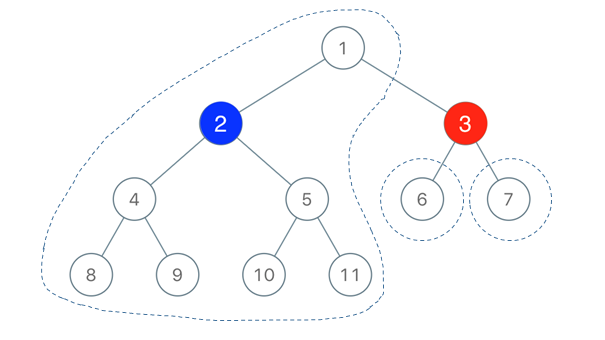

> 原文链接: https://leetcode-cn.com/problems/binary-tree-coloring-game


## 英文原文
<div><p>Two players play a turn based game on a binary tree. We are given the <code>root</code> of this binary tree, and the number of nodes <code>n</code> in the tree. <code>n</code> is odd, and each node has a distinct value from <code>1</code> to <code>n</code>.</p>

<p>Initially, the first player names a value <code>x</code> with <code>1 &lt;= x &lt;= n</code>, and the second player names a value <code>y</code> with <code>1 &lt;= y &lt;= n</code> and <code>y != x</code>. The first player colors the node with value <code>x</code> red, and the second player colors the node with value <code>y</code> blue.</p>

<p>Then, the players take turns starting with the first player. In each turn, that player chooses a node of their color (red if player 1, blue if player 2) and colors an <strong>uncolored</strong> neighbor of the chosen node (either the left child, right child, or parent of the chosen node.)</p>

<p>If (and only if) a player cannot choose such a node in this way, they must pass their turn. If both players pass their turn, the game ends, and the winner is the player that colored more nodes.</p>

<p>You are the second player. If it is possible to choose such a <code>y</code> to ensure you win the game, return <code>true</code>. If it is not possible, return <code>false</code>.</p>

<p>&nbsp;</p>
<p><strong>Example 1:</strong></p>

<pre>
<strong>Input:</strong> root = [1,2,3,4,5,6,7,8,9,10,11], n = 11, x = 3
<strong>Output:</strong> true
<strong>Explanation: </strong>The second player can choose the node with value 2.
</pre>

<p><strong>Example 2:</strong></p>

<pre>
<strong>Input:</strong> root = [1,2,3], n = 3, x = 1
<strong>Output:</strong> false
</pre>

<p>&nbsp;</p>
<p><strong>Constraints:</strong></p>

<ul>
	<li>The number of nodes in the tree is <code>n</code>.</li>
	<li><code>1 &lt;= x &lt;= n &lt;= 100</code></li>
	<li><code>n</code> is odd.</li>
	<li>1 &lt;= Node.val &lt;= n</li>
	<li>All the values of the tree are <strong>unique</strong>.</li>
</ul>
</div>

## 中文题目
<div><p>有两位极客玩家参与了一场「二叉树着色」的游戏。游戏中，给出二叉树的根节点&nbsp;<code>root</code>，树上总共有 <code>n</code> 个节点，且 <code>n</code> 为奇数，其中每个节点上的值从&nbsp;<code>1</code> 到&nbsp;<code>n</code>&nbsp;各不相同。</p>

<p>&nbsp;</p>

<p>游戏从「一号」玩家开始（「一号」玩家为红色，「二号」玩家为蓝色），最开始时，</p>

<p>「一号」玩家从 <code>[1, n]</code>&nbsp;中取一个值&nbsp;<code>x</code>（<code>1 &lt;= x &lt;= n</code>）；</p>

<p>「二号」玩家也从&nbsp;<code>[1, n]</code>&nbsp;中取一个值&nbsp;<code>y</code>（<code>1 &lt;= y &lt;= n</code>）且&nbsp;<code>y != x</code>。</p>

<p>「一号」玩家给值为&nbsp;<code>x</code>&nbsp;的节点染上红色，而「二号」玩家给值为&nbsp;<code>y</code>&nbsp;的节点染上蓝色。</p>

<p>&nbsp;</p>

<p>之后两位玩家轮流进行操作，每一回合，玩家选择一个他之前涂好颜色的节点，将所选节点一个 <strong>未着色 </strong>的邻节点（即左右子节点、或父节点）进行染色。</p>

<p>如果当前玩家无法找到这样的节点来染色时，他的回合就会被跳过。</p>

<p>若两个玩家都没有可以染色的节点时，游戏结束。着色节点最多的那位玩家获得胜利 ✌️。</p>

<p>&nbsp;</p>

<p>现在，假设你是「二号」玩家，根据所给出的输入，假如存在一个&nbsp;<code>y</code>&nbsp;值可以确保你赢得这场游戏，则返回&nbsp;<code>true</code>；若无法获胜，就请返回 <code>false</code>。</p>

<p>&nbsp;</p>

<p><strong>示例：</strong></p>

<p><strong></strong></p>

<pre><strong>输入：</strong>root = [1,2,3,4,5,6,7,8,9,10,11], n = 11, x = 3
<strong>输出：</strong>True
<strong>解释：</strong>第二个玩家可以选择值为 2 的节点。
</pre>

<p>&nbsp;</p>

<p><strong>提示：</strong></p>

<ul>
	<li>二叉树的根节点为&nbsp;<code>root</code>，树上由 <code>n</code> 个节点，节点上的值从 <code>1</code> 到 <code>n</code> 各不相同。</li>
	<li><code>n</code> 为奇数。</li>
	<li><code>1 &lt;= x &lt;= n&nbsp;&lt;= 100</code></li>
</ul>
</div>

## 通过代码
<RecoDemo>
</RecoDemo>


## 高赞题解
**思路：**



如图所示，当一号玩家选择了一个红色的结点，可能会将二叉树切割为 3 个部分（连通分量），如果选择的是根结点，则可能是 2 个部分或 1 个部分，如果选择叶结点，则是 1 个部分。不过无论哪种情况都无关紧要，我们都可以当成 3 个部分来对待，例如一号玩家选择了一个叶结点，我们也可以把叶结点的左右两个空指针看成大小为 0 的两个部分。

下面我们就来思考，**二号玩家怎样选择蓝色结点才是最优呢**？答案是：选择离红色结点最近，且所属连通分量规模最大的那个点。也就是示例图中的 1 号结点。如果我们选择了 1 号结点为蓝色结点，那么可以染成红色的点就只剩下 6 号点和 7 号点了，而蓝色可以把根结点和其左子树全部占据。

如何确定蓝色是否有必胜策略，就可以转换为，被红色点切割的三个连通分量中，**是否存在一个连通分量，大小大于所有结点数目的一半**。统计三个连通分量大小的过程，可以用深度优先搜索（DFS）来实现。当遍历到某一结点，其结点值等于选定的红色结点时，我们统计这个结点的左子树 `red_left` 和右子树 `red_right` 的大小，那么我们就已经找到两个连通分量的大小了，最后一个父结点连通分量的大小，可以用结点总数减去这两个连通分量大小，再减去红色所占结点，即 `parent = n - red_left - red_right - 1`。


**代码：**
```python
# Definition for a binary tree node.
# class TreeNode:
#     def __init__(self, x):
#         self.val = x
#         self.left = None
#         self.right = None

class Solution:
    def btreeGameWinningMove(self, root: TreeNode, n: int, x: int) -> bool:
        self.red_left, self.red_right = 0, 0
        
        def dfs(root):
            if not root:
                return 0
            left = dfs(root.left)
            right = dfs(root.right)
            if root.val == x:
                self.red_left = left
                self.red_right = right
            return left + right + 1
        
        dfs(root)
        parent = n - self.red_left - self.red_right - 1
        judge = [parent, self.red_left, self.red_right]
        return any([j > n // 2 for j in judge])
```


## 统计信息
| 通过次数 | 提交次数 | AC比率 |
| :------: | :------: | :------: |
|    6891    |    14689    |   46.9%   |

## 提交历史
| 提交时间 | 提交结果 | 执行时间 |  内存消耗  | 语言 |
| :------: | :------: | :------: | :--------: | :--------: |
