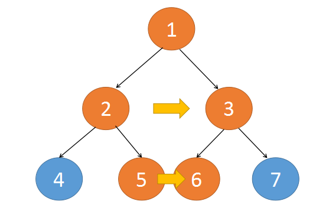

> 原文链接: https://leetcode-cn.com/problems/populating-next-right-pointers-in-each-node


## 英文原文
<div><p>You are given a <strong>perfect binary tree</strong> where all leaves are on the same level, and every parent has two children. The binary tree has the following definition:</p>

<pre>
struct Node {
  int val;
  Node *left;
  Node *right;
  Node *next;
}
</pre>

<p>Populate each next pointer to point to its next right node. If there is no next right node, the next pointer should be set to <code>NULL</code>.</p>

<p>Initially, all next pointers are set to <code>NULL</code>.</p>

<p>&nbsp;</p>
<p><strong>Example 1:</strong></p>

<pre>
<strong>Input:</strong> root = [1,2,3,4,5,6,7]
<strong>Output:</strong> [1,#,2,3,#,4,5,6,7,#]
<strong>Explanation: </strong>Given the above perfect binary tree (Figure A), your function should populate each next pointer to point to its next right node, just like in Figure B. The serialized output is in level order as connected by the next pointers, with &#39;#&#39; signifying the end of each level.
</pre>

<p><strong>Example 2:</strong></p>

<pre>
<strong>Input:</strong> root = []
<strong>Output:</strong> []
</pre>

<p>&nbsp;</p>
<p><strong>Constraints:</strong></p>

<ul>
	<li>The number of nodes in the tree is in the range <code>[0, 2<sup>12</sup> - 1]</code>.</li>
	<li><code>-1000 &lt;= Node.val &lt;= 1000</code></li>
</ul>

<p>&nbsp;</p>
<p><strong>Follow-up:</strong></p>

<ul>
	<li>You may only use constant extra space.</li>
	<li>The recursive approach is fine. You may assume implicit stack space does not count as extra space for this problem.</li>
</ul>
</div>

## 中文题目
<div><p>给定一个 <strong>完美二叉树 </strong>，其所有叶子节点都在同一层，每个父节点都有两个子节点。二叉树定义如下：</p>

<pre>
struct Node {
  int val;
  Node *left;
  Node *right;
  Node *next;
}</pre>

<p>填充它的每个 next 指针，让这个指针指向其下一个右侧节点。如果找不到下一个右侧节点，则将 next 指针设置为 <code>NULL</code>。</p>

<p>初始状态下，所有 next 指针都被设置为 <code>NULL</code>。</p>

<p> </p>

<p><strong>进阶：</strong></p>

<ul>
	<li>你只能使用常量级额外空间。</li>
	<li>使用递归解题也符合要求，本题中递归程序占用的栈空间不算做额外的空间复杂度。</li>
</ul>

<p> </p>

<p><strong>示例：</strong></p>

<p></p>

<pre>
<b>输入：</b>root = [1,2,3,4,5,6,7]
<b>输出：</b>[1,#,2,3,#,4,5,6,7,#]
<b>解释：</b>给定二叉树如图 A 所示，你的函数应该填充它的每个 next 指针，以指向其下一个右侧节点，如图 B 所示。序列化的输出按层序遍历排列，同一层节点由 next 指针连接，'#' 标志着每一层的结束。
</pre>

<p> </p>

<p><strong>提示：</strong></p>

<ul>
	<li>树中节点的数量少于 <code>4096</code></li>
	<li><code>-1000 <= node.val <= 1000</code></li>
</ul>
</div>

## 通过代码
<RecoDemo>
</RecoDemo>


## 高赞题解
### 迭代解法一

回想一下二叉树的层次遍历，用广度优先实现的时候，就是层层遍历，每层临时遍历的节点都会放到一个队列中。   

队列中保存了第 `i` 层节点的信息，我们利用这个特点，将队列中的元素都串联一遍就可以了。   

{:width=400}

{:align=center}


时间复杂度： $O(n)$ 

空间复杂度： $O(n)$  

   

代码实现:

```Java []

class Solution {

	public Node connect(Node root) {

		if(root==null) {

			return root;

		}

		LinkedList<Node> queue = new LinkedList<Node>();

		queue.add(root);

		while(queue.size()>0) {

			int size = queue.size();

			//将队列中的元素串联起来

			Node tmp = queue.get(0);

			for(int i=1;i<size;++i) {

				tmp.next = queue.get(i);

				tmp = queue.get(i);

			}

			//遍历队列中的每个元素，将每个元素的左右节点也放入队列中

			for(int i=0;i<size;++i) {

				tmp = queue.remove();

				if(tmp.left!=null) {

					queue.add(tmp.left);

				}

				if(tmp.right!=null) {

					queue.add(tmp.right);

				}

			}

		}

		return root;

	}

}

```

```Python []

class Solution(object):

	def connect(self, root):

		"""

		:type root: Node

		:rtype: Node

		"""

		if not root:

			return root

		queue = [root]

		while queue:

			size = len(queue)

			# 将队列中的元素串联起来

			tmp = queue[0]

			for i in xrange(1,size):

				tmp.next = queue[i]

				tmp = queue[i]

			# 遍历队列中的每个元素，将每个元素的左右节点也放入队列中

			for _ in xrange(size):

				tmp = queue.pop(0)

				if tmp.left:

					queue.append(tmp.left)

				if tmp.right:

					queue.append(tmp.right)

		return root

```

   

   

   

### 迭代解法二

题目要求是常量的辅助空间，所以第一种解法并不符合要求，下面来看下 $O(1)$空间复杂度的实现细节。    

注意，题目说的二叉树是一棵完美二叉树，即每一层的节点都是满的。     

仔细看下完成后的串联树，其连接的方式有两种:   

**第一种** 是这两个串联的节点都有一个共同的父节点，通过父节点就可以将这两个子节点串联起来     

 

{:width=400}

{:align=center}


**第二种** 是这两个串联的节点的父节点不同，对于这种情况，如果我们能将这一层的上一层串联好。那么可以通过父节点的```next```找到邻居，完成串联。   


{:width=400}

{:align=center}


即   

```c

root.right.next => root.next.left

```

这里我们需要保证 ```root.next``` 不为空就可以了。   

也就是说当我们要串联第 ```i``` 层节点时，需要先完成第 ```i-1``` 层的节点串联  

第一层最多只有一个节点，不需要串联   

第二层最多只有两个节点，借助根节点就可以完成串联了   

第三层串联时，上一层已经串联完了，所以第三层可以完成串联   

同理，可以完成第四层，第五层，第N层的串联   


{:width=400}

{:align=center}


时间复杂度：$O(n)$   

空间复杂度：$O(1)$   


代码实现:

```Java []

class Solution {

	public Node connect(Node root) {

		if(root==null) {

			return root;

		}

		Node pre = root;

		//循环条件是当前节点的left不为空，当只有根节点

		//或所有叶子节点都出串联完后循环就退出了

		while(pre.left!=null) {

			Node tmp = pre;

			while(tmp!=null) {

				//将tmp的左右节点都串联起来

				//注:外层循环已经判断了当前节点的left不为空

				tmp.left.next = tmp.right;

				//下一个不为空说明上一层已经帮我们完成串联了

				if(tmp.next!=null) {

					tmp.right.next = tmp.next.left;

				}

				//继续右边遍历

				tmp = tmp.next;

			}

			//从下一层的最左边开始遍历

			pre = pre.left;

		}

		return root;

	}

}

```

```Python []

class Solution(object):

	def connect(self, root):

		"""

		:type root: Node

		:rtype: Node

		"""

		if not root:

			return root

		pre = root

		# 循环条件是当前节点的left不为空，当只有根节点

		# 或所有叶子节点都出串联完后循环就退出了

		while pre.left:

			tmp = pre

			while tmp:

				# 将tmp的左右节点都串联起来

				# 注:外层循环已经判断了当前节点的left不为空

				tmp.left.next = tmp.right

				# 下一个不为空说明上一层已经帮我们完成串联了

				if tmp.next:

					tmp.right.next = tmp.next.left

				# 继续右边遍历

				tmp = tmp.next

			# 从下一层的最左边开始遍历	

			pre = pre.left

		return root

```


### 递归

上面两种方式是属于横向的视角，而递归则像是一个深度的视角。   

以从上往下的方向看，```1```，```2```，```3```，```5```，```6```这几个节点在位置上都是紧挨着的，同时这几个节点都是左右串联的。   


{:width=400}

{:align=center}


我们以当前节```root```点为起始，左右节点不断的深入下面，```left```节点不断往右走，```right```节点不断往左走，当这两个节点走到底后，整个纵深这段就完成了串联。   

递归函数实现如下：   

1. 终止条件：当前节点为空时

2. 函数内：以当前节点为起始，完成从上往下的纵深串联，再递归的调用当前节点```left```和```right```   


{:width=400}

{:align=center}


时间复杂度：$O(n)$   

空间复杂度：$O(h)$，$h$ 是树的高度   


更多二叉树相关文章，请点击 [这里](https://mp.weixin.qq.com/mp/appmsgalbum?action=getalbum&album_id=1377493411015819266&__biz=MzI2NDE1MzY3Mw==#wechat_redirect) 查看

   

代码实现:

```Java []

class Solution {

	public Node connect(Node root) {

		dfs(root);

		return root;

	}

	

	void dfs(Node root) {

		if(root==null) {

			return;

		}

		Node left = root.left;

		Node right = root.right;

		//配合动画演示理解这段，以root为起点，将整个纵深这段串联起来

		while(left!=null) {

			left.next = right;

			left = left.right;

			right = right.left;

		}

		//递归的调用左右节点，完成同样的纵深串联

		dfs(root.left);

		dfs(root.right);

	}

}

```

```Python []

class Solution(object):

	def connect(self, root):

		"""

		:type root: Node

		:rtype: Node

		"""

		def dfs(root):

			if not root:

				return

			left = root.left

			right = root.right

			# 配合动画演示理解这段，以root为起点，将整个纵深这段串联起来

			while left:

				left.next = right

				left = left.right

				right = right.left

			# 递归的调用左右节点，完成同样的纵深串联

			dfs(root.left)

			dfs(root.right)

		dfs(root)

		return root

```

 


## 统计信息
| 通过次数 | 提交次数 | AC比率 |
| :------: | :------: | :------: |
|    178680    |    253010    |   70.6%   |

## 提交历史
| 提交时间 | 提交结果 | 执行时间 |  内存消耗  | 语言 |
| :------: | :------: | :------: | :--------: | :--------: |


## 相似题目
|                             题目                             | 难度 |
| :----------------------------------------------------------: | :---------: |
| [填充每个节点的下一个右侧节点指针 II](https://leetcode-cn.com/problems/populating-next-right-pointers-in-each-node-ii/) | 中等|
| [二叉树的右视图](https://leetcode-cn.com/problems/binary-tree-right-side-view/) | 中等|
