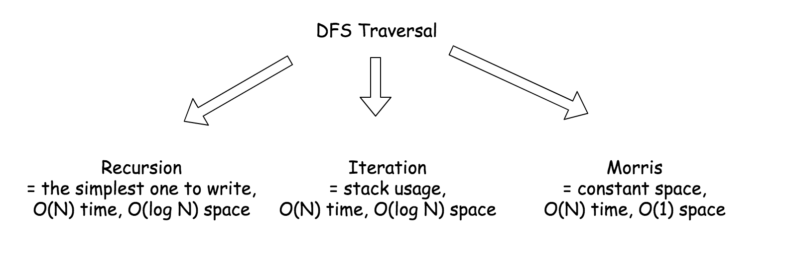
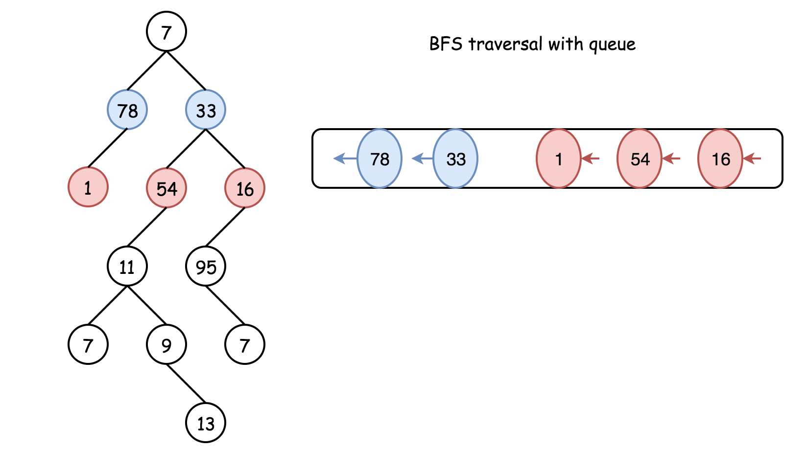

> 原文链接: https://leetcode-cn.com/problems/maximum-level-sum-of-a-binary-tree


## 英文原文
<div><p>Given the <code>root</code> of a binary tree, the level of its root is <code>1</code>, the level of its children is <code>2</code>, and so on.</p>

<p>Return the <strong>smallest</strong> level <code>x</code> such that the sum of all the values of nodes at level <code>x</code> is <strong>maximal</strong>.</p>

<p>&nbsp;</p>
<p><strong>Example 1:</strong></p>

<pre>
<strong>Input:</strong> root = [1,7,0,7,-8,null,null]
<strong>Output:</strong> 2
<strong>Explanation: </strong>
Level 1 sum = 1.
Level 2 sum = 7 + 0 = 7.
Level 3 sum = 7 + -8 = -1.
So we return the level with the maximum sum which is level 2.
</pre>

<p><strong>Example 2:</strong></p>

<pre>
<strong>Input:</strong> root = [989,null,10250,98693,-89388,null,null,null,-32127]
<strong>Output:</strong> 2
</pre>

<p>&nbsp;</p>
<p><strong>Constraints:</strong></p>

<ul>
	<li>The number of nodes in the tree is in the range <code>[1, 10<sup>4</sup>]</code>.</li>
	<li><code>-10<sup>5</sup> &lt;= Node.val &lt;= 10<sup>5</sup></code></li>
</ul>
</div>

## 中文题目
<div><p>给你一个二叉树的根节点&nbsp;<code>root</code>。设根节点位于二叉树的第 <code>1</code> 层，而根节点的子节点位于第 <code>2</code> 层，依此类推。</p>

<p>请你找出层内元素之和 <strong>最大</strong> 的那几层（可能只有一层）的层号，并返回其中&nbsp;<strong>最小</strong> 的那个。</p>

<p>&nbsp;</p>

<p><strong>示例 1：</strong></p>

<p><strong></strong></p>

<pre><strong>输入：</strong>root = [1,7,0,7,-8,null,null]
<strong>输出：</strong>2
<strong>解释：</strong>
第 1 层各元素之和为 1，
第 2 层各元素之和为 7 + 0 = 7，
第 3 层各元素之和为 7 + -8 = -1，
所以我们返回第 2 层的层号，它的层内元素之和最大。
</pre>

<p><strong>示例 2：</strong></p>

<pre><strong>输入：</strong>root = [989,null,10250,98693,-89388,null,null,null,-32127]
<strong>输出：</strong>2
</pre>

<p>&nbsp;</p>

<p><strong>提示：</strong></p>

<ul>
	<li>树中的节点数介于&nbsp;<code>1</code>&nbsp;和&nbsp;<code>10^4</code>&nbsp;之间</li>
	<li><code>-10^5 &lt;= node.val &lt;= 10^5</code></li>
</ul>
</div>

## 通过代码
<RecoDemo>
</RecoDemo>


## 官方题解
#### 概述

 遍历树的两种通用策略：
     
- *深度优先遍历*（`DFS`）

    这种方法以深度 `depth` 优先为策略，从根节点开始一直遍历到某个叶子节点，然后回到根节点，再遍历另外一个分支。

    根据根节点，左子节点和右子节点的访问顺序又可以将 DFS 细分为先序遍历 `preorder`，中序遍历 `inorder` 和后序遍历 `postorder`。

    DFS 遍历通常有三种实现方式：递归 `recursion`，迭代 `iteration`，`Morris`，其中最简单的是递归。

{:width=500}


- *广度优先遍历*（`BFS`）

    按照高度顺序，从上往下逐层遍历节点。先遍历上层节点再遍历下层节点。

    最标准的实现方法是使用队列进行迭代。
   
下图中按照不同的方法遍历对应子树，得到的遍历顺序都是 `1-2-3-4-5`。根据不同子树结构比较不同遍历方法的特点。

{:width=500}

本题可以使用两种策略解决：DFS 和 BFS。这里使用 DFS 的中序遍历和队列实现的 BFS 解答。


#### 方法一：DFS：递归实现的中序遍历

递归实现的中序遍历非常简单：遵循 `Left->Node->Right` 的顺序。例如：首先递归访问 *左孩子*，然后访问父节点，再递归访问 *右孩子*。

遍历时需要记录当前层节点之和。由于 Java 中 HashMap 的性能问题，在 Java 中使用数组，在 Python 中使用 hashmap。

**算法**

- 创建方法 `inorder(node, level)`，实现递归的中序遍历。该方法输入当前节点和当前节点层级，然后递归更新 `level_sum[level]`。

- 返回数组 `level_sum` 的最大值。

```python [solution1-Pyhton]
from collections import defaultdict
class Solution:
    def maxLevelSum(self, root: TreeNode) -> int:
        def inorder(node, level):
            if node:
                inorder(node.left, level + 1)
                level_sum[level] += node.val
                inorder(node.right, level + 1)
            
        level_sum = defaultdict(int)
        inorder(root, 1)
        return max(level_sum, key = level_sum.get)
```

```java [solution1-Java]
class Solution {
  int n = 10000;
  int[] levelSum = new int[n];

  public void inorder(TreeNode node, int level) {
    if (node != null) {
      inorder(node.left, level + 1);
      levelSum[level] += node.val;
      inorder(node.right, level + 1);
    }
  }
  
  public int maxLevelSum(TreeNode root) {
    inorder(root, 1);

    int maxIdx = 0;
    for (int i = 0; i < n; ++i)
      maxIdx = levelSum[i] > levelSum[maxIdx] ? i : maxIdx;
    return maxIdx;
  }
}
```

**复杂度分析**

* 时间复杂度：$\mathcal{O}(N)$，中序遍历每个节点只访问一次，然后遍历 `level_sum`。

* 空间复杂度：$\mathcal{O}(10000) = \mathcal{O}(1)$ 为 Java 中 `level_sum` 的空间。$\mathcal{O}(D)$ 为 Python 的空间，其中 $D$ 是树的深度。树是平衡的情况下，空间复杂度为 $\mathcal{O}(\log N)$ ，最坏情况下为 $\mathcal{O}(N)$。


#### 方法二：BFS：使用队列实现的层序遍历

DFS 的缺点是必须保存所有层节点之和，BFS 逐层计算之和不需要同时保存每层之和：

- 初始 `max_sum = 0`。

- 使用 BFS 逐层遍历，计算每层的累加和 `curr_sum`，在每层结束时更新 `max_sum = max(max_sum, curr_sum)`。

使用队列（先进先出结构）实现 BFS：

1. 把当前层所有的节点压入队列。

2. 遍历队列。每从队列中弹出一个节点，就将该节点的子节点压入队列。

{:width=500}

这种方法可以从根节点逐层遍历到叶节点，不过需要设置标记在每层末尾计算该层节点的累加和。

> 面试技巧。可以使用 *标记* 分离队列/链表/树中的节点。
   例子：LRU Cache。

这里使用空节点作为每层结束的标记。

**算法** 

- 初始化变量：

    - 令当前层级与最大累加和层级为 1。
    
    - 令当前累加和为 0，最大累加和为根节点的值。
    
    - 使用空节点作为标记，初始化队列：压入根节点和标记节点，标记当前层数为 1。
    
- 当前队列长度大于 1：

    - 从队列左端弹出一个节点。
    
    - 如果它不是标记节点，则在当前层继续：
        
        - 更新当前层累加和。
        
        - 将该节点的子节点压入队列右端。
    
    - 如果它是标记节点，则当前层结束。
        
        - 根据当前层累加和更新最大和。
        
        - 设置当前累加和为 0。
        
        - 层数加 1，向队列中压入标记节点，表示下一层节点结束。
        
- 返回最大累加和层序号。

```python [solution2-Python]
from collections import deque
class Solution:
    def maxLevelSum(self, root: TreeNode) -> int:
        curr_level = max_level = 1
        max_sum = float('-inf')
        curr_sum = 0
        
        marker = None
        queue = deque([root, marker])
        
        while len(queue) > 1:
            x = queue.popleft()
            # continue current level
            if x != marker:
                curr_sum += x.val
                if x.left:
                    queue.append(x.left)
                if x.right:
                    queue.append(x.right)
            # end of current level, go to the next level
            else:
                if curr_sum > max_sum:
                    max_sum, max_level = curr_sum, curr_level  
                curr_sum = 0
                curr_level += 1
                queue.append(marker)
            
        return max_level
```

```java [solution2-Java]
class Solution {
  public int maxLevelSum(TreeNode root) {
    int currLevel = 1, maxLevel = 1;
    int maxSum = root.val, currSum = 0;

    LinkedList<TreeNode> queue = new LinkedList();
    TreeNode marker = null, x = root;
    queue.addLast(root);
    queue.addLast(marker);

    while (queue.size() > 1) {
      x = queue.removeFirst();
      // continue current level
      if (x != marker) {
        currSum += x.val;
        if (x.left != null) queue.addLast(x.left);
        if (x.right != null) queue.addLast(x.right);
      }
      // end of current level, go to the next level
      else {
        if (currSum > maxSum) {
          maxSum = currSum;
          maxLevel = currLevel;
        }
        currSum = 0;
        currLevel++;
        queue.addLast(marker);
      }
    }

    return maxLevel;
  }
}
```

**复杂度分析**

* 时间复杂度：$\mathcal{O}(N)$，每个节点只被访问两次，入队列和出队列。

* 空间复杂度：$\mathcal{O}(N)$，队列的存储空间。任意时刻，队列最多只包含一层的所有节点。完美树中一层节点最多有 $(N + 1)/2$ 个。


#### 方法三：BFS：简洁的 Python 解法

重写方法二中 Python 代码。

```python [solution3-Python]
class Solution:
    def maxLevelSum(self, root: TreeNode) -> int:
        curr_level = max_level = 1
        max_sum = float('-inf')
        queue = [root, ]
        
        while queue:
            # sum up all the nodes on the current level
            curr_sum = sum([x.val for x in queue])
            # update max_sum 
            if curr_sum > max_sum:
                max_sum, max_level = curr_sum, curr_level
            # build next level
            queue = [y for x in queue for y in [x.left, x.right] if y]
            curr_level += 1
            
        return max_level
```

**复杂度分析**

* 时间复杂度：$\mathcal{O}(N)$。

* 空间复杂度：$\mathcal{O}(N)$，队列的存储空间。任意时刻，队列最多只包含一层的所有节点。完美树中一层节点最多有 $(N + 1)/2$ 个。

## 统计信息
| 通过次数 | 提交次数 | AC比率 |
| :------: | :------: | :------: |
|    10975    |    17340    |   63.3%   |

## 提交历史
| 提交时间 | 提交结果 | 执行时间 |  内存消耗  | 语言 |
| :------: | :------: | :------: | :--------: | :--------: |
