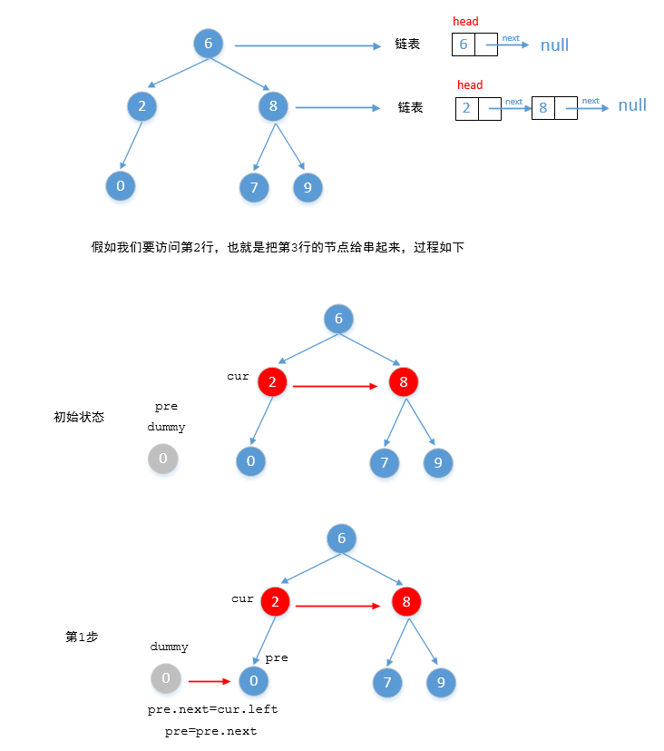
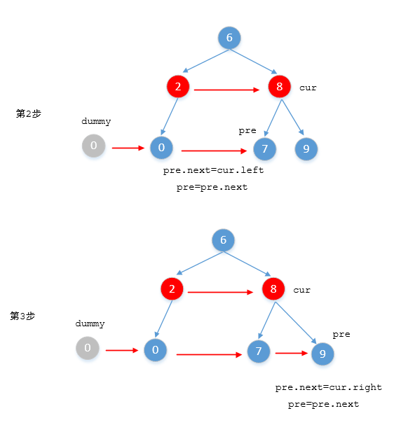

> 原文链接: https://leetcode-cn.com/problems/populating-next-right-pointers-in-each-node-ii


## 英文原文
<div><p>Given a binary tree</p>

<pre>
struct Node {
  int val;
  Node *left;
  Node *right;
  Node *next;
}
</pre>

<p>Populate each next pointer to point to its next right node. If there is no next right node, the next pointer should be set to <code>NULL</code>.</p>

<p>Initially, all next pointers are set to <code>NULL</code>.</p>

<p>&nbsp;</p>
<p><strong>Example 1:</strong></p>

<pre>
<strong>Input:</strong> root = [1,2,3,4,5,null,7]
<strong>Output:</strong> [1,#,2,3,#,4,5,7,#]
<strong>Explanation: </strong>Given the above binary tree (Figure A), your function should populate each next pointer to point to its next right node, just like in Figure B. The serialized output is in level order as connected by the next pointers, with &#39;#&#39; signifying the end of each level.
</pre>

<p><strong>Example 2:</strong></p>

<pre>
<strong>Input:</strong> root = []
<strong>Output:</strong> []
</pre>

<p>&nbsp;</p>
<p><strong>Constraints:</strong></p>

<ul>
	<li>The number of nodes in the tree is in the range <code>[0, 6000]</code>.</li>
	<li><code>-100 &lt;= Node.val &lt;= 100</code></li>
</ul>

<p>&nbsp;</p>
<p><strong>Follow-up:</strong></p>

<ul>
	<li>You may only use constant extra space.</li>
	<li>The recursive approach is fine. You may assume implicit stack space does not count as extra space for this problem.</li>
</ul>
</div>

## 中文题目
<div><p>给定一个二叉树</p>

<pre>
struct Node {
  int val;
  Node *left;
  Node *right;
  Node *next;
}</pre>

<p>填充它的每个 next 指针，让这个指针指向其下一个右侧节点。如果找不到下一个右侧节点，则将 next 指针设置为 <code>NULL</code>。</p>

<p>初始状态下，所有 next 指针都被设置为 <code>NULL</code>。</p>

<p> </p>

<p><strong>进阶：</strong></p>

<ul>
	<li>你只能使用常量级额外空间。</li>
	<li>使用递归解题也符合要求，本题中递归程序占用的栈空间不算做额外的空间复杂度。</li>
</ul>

<p> </p>

<p><strong>示例：</strong></p>

<p></p>

<pre>
<strong>输入</strong>：root = [1,2,3,4,5,null,7]
<strong>输出：</strong>[1,#,2,3,#,4,5,7,#]
<strong>解释：</strong>给定二叉树如图 A 所示，你的函数应该填充它的每个 next 指针，以指向其下一个右侧节点，如图 B 所示。序列化输出按层序遍历顺序（由 next 指针连接），'#' 表示每层的末尾。</pre>

<p> </p>

<p><strong>提示：</strong></p>

<ul>
	<li>树中的节点数小于 <code>6000</code></li>
	<li><code>-100 <= node.val <= 100</code></li>
</ul>

<p> </p>

<ul>
</ul>
</div>

## 通过代码
<RecoDemo>
</RecoDemo>


## 高赞题解


### 1，BFS解决


看到关于二叉树的问题，首先要想到关于二叉树的一些常见遍历方式，

对于二叉树的遍历有


1. **前序遍历**

2. **中序遍历**

3. **后续遍历**

4. **深度优先搜索（DFS）**

5. **宽度优先搜索（BFS）**


除了上面介绍的5种以外，还有```Morris（莫里斯）的前中后3种遍历方式```，总共也就这8种。所以只要遇到二叉树相关的算法题，首先想到的就是上面的几种遍历方式，然后再稍加修改，基本上也就这个套路。


这题让求的就是让把二叉树中每行都串联起来，对于这道题来说最适合的就是BFS。也就是一行一行的遍历，如下图所示


他的代码如下

```

    public void levelOrder(TreeNode tree) {

        if (tree == null)

            return;

        Queue<TreeNode> queue = new LinkedList<>();

        queue.add(tree);//相当于把数据加入到队列尾部

        while (!queue.isEmpty()) {

            //poll方法相当于移除队列头部的元素

            TreeNode node = queue.poll();

            System.out.println(node.val);

            if (node.left != null)

                queue.add(node.left);

            if (node.right != null)

                queue.add(node.right);

        }

    }

```


在遍历每一行的时候，只要把他们串联起来就OK，下面就来把上面的代码改造一下


```

    public Node connect(Node root) {

        if (root == null)

            return root;

        Queue<Node> queue = new LinkedList<>();

        queue.add(root);

        while (!queue.isEmpty()) {

            //每一层的数量

            int levelCount = queue.size();

            //前一个节点

            Node pre = null;

            for (int i = 0; i < levelCount; i++) {

                //出队

                Node node = queue.poll();

                //如果pre为空就表示node节点是这一行的第一个，

                //没有前一个节点指向他，否则就让前一个节点指向他

                if (pre != null) {

                    pre.next = node;

                }

                //然后再让当前节点成为前一个节点

                pre = node;

                //左右子节点如果不为空就入队

                if (node.left != null)

                    queue.add(node.left);

                if (node.right != null)

                    queue.add(node.right);

            }

        }

        return root;

    }

```

看一下运行结果


<br>


上面运行效率并不是很高，这是因为我们把节点不同的入队然后再不停的出队，其实可以不需要队列，每一行都可以看成一个链表比如第一行就是只有一个节点的链表，第二行是只有两个节点的链表（假如根节点的左右两个子节点都不为空）……







```

    public Node connect(Node root) {

        if (root == null)

            return root;

        //cur我们可以把它看做是每一层的链表

        Node cur = root;

        while (cur != null) {

            //遍历当前层的时候，为了方便操作在下一

            //层前面添加一个哑结点（注意这里是访问

            //当前层的节点，然后把下一层的节点串起来）

            Node dummy = new Node(0);

            //pre表示访下一层节点的前一个节点

            Node pre = dummy;

            //然后开始遍历当前层的链表

            while (cur != null) {

                if (cur.left != null) {

                    //如果当前节点的左子节点不为空，就让pre节点

                    //的next指向他，也就是把它串起来

                    pre.next = cur.left;

                    //然后再更新pre

                    pre = pre.next;

                }

                //同理参照左子树

                if (cur.right != null) {

                    pre.next = cur.right;

                    pre = pre.next;

                }

                //继续访问这一行的下一个节点

                cur = cur.next;

            }

            //把下一层串联成一个链表之后，让他赋值给cur，

            //后续继续循环，直到cur为空为止

            cur = dummy.next;

        }

        return root;

    }

```

看一下运行结果


<br>


我把部分算法题整理成了PDF文档，截止目前总共有**900多页**，大家可以下载阅读

**链接**：https://pan.baidu.com/s/1hjwK0ZeRxYGB8lIkbKuQgQ 

**提取码**：6666 


#### 如果觉得有用就给个赞吧，还可以关注我的[LeetCode主页](https://leetcode-cn.com/u/sdwwld/)查看更多的详细题解

## 统计信息
| 通过次数 | 提交次数 | AC比率 |
| :------: | :------: | :------: |
|    99607    |    160885    |   61.9%   |

## 提交历史
| 提交时间 | 提交结果 | 执行时间 |  内存消耗  | 语言 |
| :------: | :------: | :------: | :--------: | :--------: |


## 相似题目
|                             题目                             | 难度 |
| :----------------------------------------------------------: | :---------: |
| [填充每个节点的下一个右侧节点指针](https://leetcode-cn.com/problems/populating-next-right-pointers-in-each-node/) | 中等|
