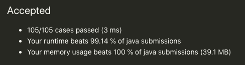

> 原文链接: https://leetcode-cn.com/problems/remove-zero-sum-consecutive-nodes-from-linked-list


## 英文原文
<div><p>Given the <code>head</code> of a linked list, we repeatedly delete consecutive sequences of nodes that sum to <code>0</code> until there are no such sequences.</p>

<p>After doing so, return the head of the final linked list.&nbsp; You may return any such answer.</p>

<p>&nbsp;</p>
<p>(Note that in the examples below, all sequences are serializations of <code>ListNode</code> objects.)</p>

<p><strong>Example 1:</strong></p>

<pre>
<strong>Input:</strong> head = [1,2,-3,3,1]
<strong>Output:</strong> [3,1]
<strong>Note:</strong> The answer [1,2,1] would also be accepted.
</pre>

<p><strong>Example 2:</strong></p>

<pre>
<strong>Input:</strong> head = [1,2,3,-3,4]
<strong>Output:</strong> [1,2,4]
</pre>

<p><strong>Example 3:</strong></p>

<pre>
<strong>Input:</strong> head = [1,2,3,-3,-2]
<strong>Output:</strong> [1]
</pre>

<p>&nbsp;</p>
<p><strong>Constraints:</strong></p>

<ul>
	<li>The given linked list will contain between <code>1</code> and <code>1000</code> nodes.</li>
	<li>Each node in the linked list has <code>-1000 &lt;= node.val &lt;= 1000</code>.</li>
</ul>
</div>

## 中文题目
<div><p>给你一个链表的头节点&nbsp;<code>head</code>，请你编写代码，反复删去链表中由 <strong>总和</strong>&nbsp;值为 <code>0</code> 的连续节点组成的序列，直到不存在这样的序列为止。</p>

<p>删除完毕后，请你返回最终结果链表的头节点。</p>

<p>&nbsp;</p>

<p>你可以返回任何满足题目要求的答案。</p>

<p>（注意，下面示例中的所有序列，都是对&nbsp;<code>ListNode</code>&nbsp;对象序列化的表示。）</p>

<p><strong>示例 1：</strong></p>

<pre><strong>输入：</strong>head = [1,2,-3,3,1]
<strong>输出：</strong>[3,1]
<strong>提示：</strong>答案 [1,2,1] 也是正确的。
</pre>

<p><strong>示例 2：</strong></p>

<pre><strong>输入：</strong>head = [1,2,3,-3,4]
<strong>输出：</strong>[1,2,4]
</pre>

<p><strong>示例 3：</strong></p>

<pre><strong>输入：</strong>head = [1,2,3,-3,-2]
<strong>输出：</strong>[1]
</pre>

<p>&nbsp;</p>

<p><strong>提示：</strong></p>

<ul>
	<li>给你的链表中可能有 <code>1</code> 到&nbsp;<code>1000</code>&nbsp;个节点。</li>
	<li>对于链表中的每个节点，节点的值：<code>-1000 &lt;= node.val &lt;= 1000</code>.</li>
</ul>
</div>

## 通过代码
<RecoDemo>
</RecoDemo>


## 高赞题解
```Java
class Solution {
    public ListNode removeZeroSumSublists(ListNode head) {
        ListNode dummy = new ListNode(0);
        dummy.next = head;

        Map<Integer, ListNode> map = new HashMap<>();

        // 首次遍历建立 节点处链表和<->节点 哈希表
        // 若同一和出现多次会覆盖，即记录该sum出现的最后一次节点
        int sum = 0;
        for (ListNode d = dummy; d != null; d = d.next) {
            sum += d.val;
            map.put(sum, d);
        }

        // 第二遍遍历 若当前节点处sum在下一处出现了则表明两结点之间所有节点和为0 直接删除区间所有节点
        sum = 0;
        for (ListNode d = dummy; d != null; d = d.next) {
            sum += d.val;
            d.next = map.get(sum).next;
        }

        return dummy.next;
    }
}
```



## 统计信息
| 通过次数 | 提交次数 | AC比率 |
| :------: | :------: | :------: |
|    13489    |    28358    |   47.6%   |

## 提交历史
| 提交时间 | 提交结果 | 执行时间 |  内存消耗  | 语言 |
| :------: | :------: | :------: | :--------: | :--------: |
