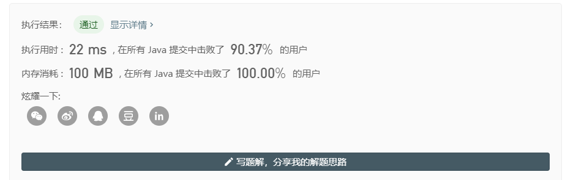

> 原文链接: https://leetcode-cn.com/problems/can-make-palindrome-from-substring


## 英文原文
<div><p>You are given a string <code>s</code> and array <code>queries</code> where <code>queries[i] = [left<sub>i</sub>, right<sub>i</sub>, k<sub>i</sub>]</code>. We may rearrange the substring <code>s[left<sub>i</sub>...right<sub>i</sub>]</code> for each query and then choose up to <code>k<sub>i</sub></code> of them to replace with any lowercase English letter.</p>

<p>If the substring is possible to be a palindrome string after the operations above, the result of the query is <code>true</code>. Otherwise, the result is <code>false</code>.</p>

<p>Return a boolean array <code>answer</code> where <code>answer[i]</code> is the result of the <code>i<sup>th</sup></code> query <code>queries[i]</code>.</p>

<p>Note that each letter is counted individually for replacement, so if, for example <code>s[left<sub>i</sub>...right<sub>i</sub>] = &quot;aaa&quot;</code>, and <code>k<sub>i</sub> = 2</code>, we can only replace two of the letters. Also, note that no query modifies the initial string <code>s</code>.</p>

<p>&nbsp;</p>
<p><strong>Example :</strong></p>

<pre>
<strong>Input:</strong> s = &quot;abcda&quot;, queries = [[3,3,0],[1,2,0],[0,3,1],[0,3,2],[0,4,1]]
<strong>Output:</strong> [true,false,false,true,true]
<strong>Explanation:</strong>
queries[0]: substring = &quot;d&quot;, is palidrome.
queries[1]: substring = &quot;bc&quot;, is not palidrome.
queries[2]: substring = &quot;abcd&quot;, is not palidrome after replacing only 1 character.
queries[3]: substring = &quot;abcd&quot;, could be changed to &quot;abba&quot; which is palidrome. Also this can be changed to &quot;baab&quot; first rearrange it &quot;bacd&quot; then replace &quot;cd&quot; with &quot;ab&quot;.
queries[4]: substring = &quot;abcda&quot;, could be changed to &quot;abcba&quot; which is palidrome.
</pre>

<p><strong>Example 2:</strong></p>

<pre>
<strong>Input:</strong> s = &quot;lyb&quot;, queries = [[0,1,0],[2,2,1]]
<strong>Output:</strong> [false,true]
</pre>

<p>&nbsp;</p>
<p><strong>Constraints:</strong></p>

<ul>
	<li><code>1 &lt;= s.length, queries.length &lt;= 10<sup>5</sup></code></li>
	<li><code>0 &lt;= left<sub>i</sub> &lt;= right<sub>i</sub> &lt; s.length</code></li>
	<li><code>0 &lt;= k<sub>i</sub> &lt;= s.length</code></li>
	<li><code>s</code> consists of lowercase English letters.</li>
</ul>
</div>

## 中文题目
<div><p>给你一个字符串&nbsp;<code>s</code>，请你对&nbsp;<code>s</code>&nbsp;的子串进行检测。</p>

<p>每次检测，待检子串都可以表示为&nbsp;<code>queries[i] = [left, right, k]</code>。我们可以 <strong>重新排列</strong> 子串&nbsp;<code>s[left], ..., s[right]</code>，并从中选择 <strong>最多</strong> <code>k</code>&nbsp;项替换成任何小写英文字母。&nbsp;</p>

<p>如果在上述检测过程中，子串可以变成回文形式的字符串，那么检测结果为&nbsp;<code>true</code>，否则结果为&nbsp;<code>false</code>。</p>

<p>返回答案数组&nbsp;<code>answer[]</code>，其中&nbsp;<code>answer[i]</code>&nbsp;是第&nbsp;<code>i</code>&nbsp;个待检子串&nbsp;<code>queries[i]</code>&nbsp;的检测结果。</p>

<p>注意：在替换时，子串中的每个字母都必须作为 <strong>独立的</strong> 项进行计数，也就是说，如果&nbsp;<code>s[left..right] = &quot;aaa&quot;</code>&nbsp;且&nbsp;<code>k = 2</code>，我们只能替换其中的两个字母。（另外，任何检测都不会修改原始字符串 <code>s</code>，可以认为每次检测都是独立的）</p>

<p>&nbsp;</p>

<p><strong>示例：</strong></p>

<pre><strong>输入：</strong>s = &quot;abcda&quot;, queries = [[3,3,0],[1,2,0],[0,3,1],[0,3,2],[0,4,1]]
<strong>输出：</strong>[true,false,false,true,true]
<strong>解释：</strong>
queries[0] : 子串 = &quot;d&quot;，回文。
queries[1] :&nbsp;子串 = &quot;bc&quot;，不是回文。
queries[2] :&nbsp;子串 = &quot;abcd&quot;，只替换 1 个字符是变不成回文串的。
queries[3] :&nbsp;子串 = &quot;abcd&quot;，可以变成回文的 &quot;abba&quot;。 也可以变成 &quot;baab&quot;，先重新排序变成 &quot;bacd&quot;，然后把 &quot;cd&quot; 替换为 &quot;ab&quot;。
queries[4] :&nbsp;子串 = &quot;abcda&quot;，可以变成回文的 &quot;abcba&quot;。
</pre>

<p>&nbsp;</p>

<p><strong>提示：</strong></p>

<ul>
	<li><code>1 &lt;= s.length,&nbsp;queries.length&nbsp;&lt;= 10^5</code></li>
	<li><code>0 &lt;= queries[i][0] &lt;= queries[i][1] &lt;&nbsp;s.length</code></li>
	<li><code>0 &lt;= queries[i][2] &lt;= s.length</code></li>
	<li><code>s</code> 中只有小写英文字母</li>
</ul>
</div>

## 通过代码
<RecoDemo>
</RecoDemo>


## 高赞题解
### 解题思路



### 代码

```java
class Solution {
    public List<Boolean> canMakePaliQueries(String s, int[][] queries) {
        List<Boolean> result = new ArrayList<>();
        int cur = 0;
        int[] states = new int[s.length()];
        for (int i = 0; i < s.length(); i++) {
            cur ^= (1 << (s.charAt(i) - 'a'));
            states[i] = cur;
        }
        for (int i = 0; i < queries.length; i++) {
            int ostate = queries[i][0] > 0 ? states[queries[i][0] - 1] : 0;
            int state = ostate ^ states[queries[i][1]];
            int cnt = 0;
            while (state != 0) {
                if ((state & 1) == 1) cnt++;
                state >>= 1;
            }
//            System.out.println(cnt);
            result.add(cnt / 2 <= queries[i][2]);
        }
        return result;
    }
}
```

## 统计信息
| 通过次数 | 提交次数 | AC比率 |
| :------: | :------: | :------: |
|    6339    |    23613    |   26.8%   |

## 提交历史
| 提交时间 | 提交结果 | 执行时间 |  内存消耗  | 语言 |
| :------: | :------: | :------: | :--------: | :--------: |
