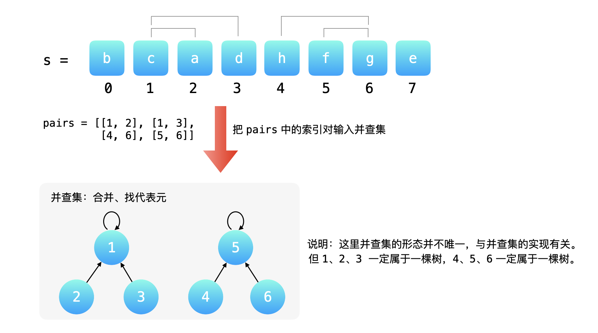
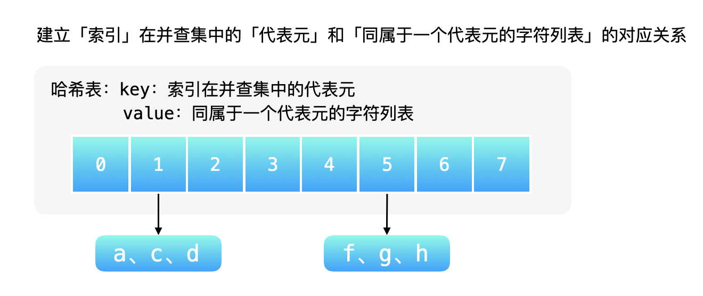
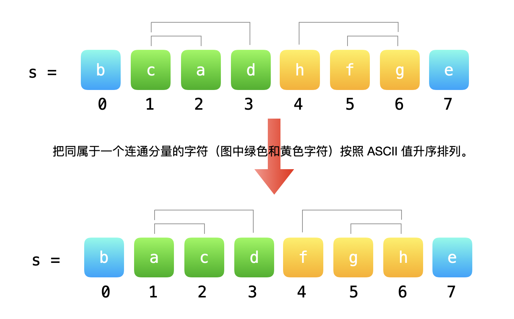

> 原文链接: https://leetcode-cn.com/problems/smallest-string-with-swaps


## 英文原文
<div><p>You are given a string <code>s</code>, and an array of pairs of indices in the string&nbsp;<code>pairs</code>&nbsp;where&nbsp;<code>pairs[i] =&nbsp;[a, b]</code>&nbsp;indicates 2 indices(0-indexed) of the string.</p>

<p>You can&nbsp;swap the characters at any pair of indices in the given&nbsp;<code>pairs</code>&nbsp;<strong>any number of times</strong>.</p>

<p>Return the&nbsp;lexicographically smallest string that <code>s</code>&nbsp;can be changed to after using the swaps.</p>

<p>&nbsp;</p>
<p><strong>Example 1:</strong></p>

<pre>
<strong>Input:</strong> s = &quot;dcab&quot;, pairs = [[0,3],[1,2]]
<strong>Output:</strong> &quot;bacd&quot;
<strong>Explaination:</strong> 
Swap s[0] and s[3], s = &quot;bcad&quot;
Swap s[1] and s[2], s = &quot;bacd&quot;
</pre>

<p><strong>Example 2:</strong></p>

<pre>
<strong>Input:</strong> s = &quot;dcab&quot;, pairs = [[0,3],[1,2],[0,2]]
<strong>Output:</strong> &quot;abcd&quot;
<strong>Explaination: </strong>
Swap s[0] and s[3], s = &quot;bcad&quot;
Swap s[0] and s[2], s = &quot;acbd&quot;
Swap s[1] and s[2], s = &quot;abcd&quot;</pre>

<p><strong>Example 3:</strong></p>

<pre>
<strong>Input:</strong> s = &quot;cba&quot;, pairs = [[0,1],[1,2]]
<strong>Output:</strong> &quot;abc&quot;
<strong>Explaination: </strong>
Swap s[0] and s[1], s = &quot;bca&quot;
Swap s[1] and s[2], s = &quot;bac&quot;
Swap s[0] and s[1], s = &quot;abc&quot;
</pre>

<p>&nbsp;</p>
<p><strong>Constraints:</strong></p>

<ul>
	<li><code>1 &lt;= s.length &lt;= 10^5</code></li>
	<li><code>0 &lt;= pairs.length &lt;= 10^5</code></li>
	<li><code>0 &lt;= pairs[i][0], pairs[i][1] &lt;&nbsp;s.length</code></li>
	<li><code>s</code>&nbsp;only contains lower case English letters.</li>
</ul>
</div>

## 中文题目
<div><p>给你一个字符串&nbsp;<code>s</code>，以及该字符串中的一些「索引对」数组&nbsp;<code>pairs</code>，其中&nbsp;<code>pairs[i] =&nbsp;[a, b]</code>&nbsp;表示字符串中的两个索引（编号从 0 开始）。</p>

<p>你可以 <strong>任意多次交换</strong> 在&nbsp;<code>pairs</code>&nbsp;中任意一对索引处的字符。</p>

<p>返回在经过若干次交换后，<code>s</code>&nbsp;可以变成的按字典序最小的字符串。</p>

<p>&nbsp;</p>

<p><strong>示例 1:</strong></p>

<pre><strong>输入：</strong>s = &quot;dcab&quot;, pairs = [[0,3],[1,2]]
<strong>输出：</strong>&quot;bacd&quot;
<strong>解释：</strong> 
交换 s[0] 和 s[3], s = &quot;bcad&quot;
交换 s[1] 和 s[2], s = &quot;bacd&quot;
</pre>

<p><strong>示例 2：</strong></p>

<pre><strong>输入：</strong>s = &quot;dcab&quot;, pairs = [[0,3],[1,2],[0,2]]
<strong>输出：</strong>&quot;abcd&quot;
<strong>解释：</strong>
交换 s[0] 和 s[3], s = &quot;bcad&quot;
交换 s[0] 和 s[2], s = &quot;acbd&quot;
交换 s[1] 和 s[2], s = &quot;abcd&quot;</pre>

<p><strong>示例 3：</strong></p>

<pre><strong>输入：</strong>s = &quot;cba&quot;, pairs = [[0,1],[1,2]]
<strong>输出：</strong>&quot;abc&quot;
<strong>解释：</strong>
交换 s[0] 和 s[1], s = &quot;bca&quot;
交换 s[1] 和 s[2], s = &quot;bac&quot;
交换 s[0] 和 s[1], s = &quot;abc&quot;
</pre>

<p>&nbsp;</p>

<p><strong>提示：</strong></p>

<ul>
	<li><code>1 &lt;= s.length &lt;= 10^5</code></li>
	<li><code>0 &lt;= pairs.length &lt;= 10^5</code></li>
	<li><code>0 &lt;= pairs[i][0], pairs[i][1] &lt;&nbsp;s.length</code></li>
	<li><code>s</code>&nbsp;中只含有小写英文字母</li>
</ul>
</div>

## 通过代码
<RecoDemo>
</RecoDemo>


## 官方题解
### 📺 视频讲解 

>力扣君温馨小贴士：觉得视频时间长的扣友，可以在视频右下角的「设置」按钮处选择 1.5 倍速或者 2 倍速观看。

 


### 📖 文字解析
关于字典序的定义，大家可以查阅 [字典序 - 百度百科](https://baike.baidu.com/item/%E5%AD%97%E5%85%B8%E5%BA%8F/7786229?fr=aladdin)。根据定义，**ASCII 值越小的字符位于字符串中的位置越靠前**，**整个字符串的字典序就越靠前**。

改变字符串中字符位置的操作是输入数组 `pairs` 中的「索引对」，每一个「索引对」表示一次「交换索引对应的字符」操作。我们需要想办法让 ASCII 值小的字符交换到字符串中靠前的位置。

#### 分析示例

**示例 1**：输入：`s = "dcab", pairs = [[0, 3], [1, 2]]`：

+ 交换 `s[0]` 和 `s[3]`，让 ASCII 值小的字符 `b` 靠前；
+ 交换 `s[1]` 和 `s[2]`，让 ASCII 值小的字符 `a` 靠前；

这样得到的字符串 `"bacd"` 字典序最小。

**示例 2**：输入 `s = "dcab", pairs = [[0, 3], [1, 2], [0, 2]]`

示例 2 与示例 1 的输入是一样的，`pairs` 多了一对索引对 `[0, 2]`，由于多了这个索引对，`s` 的 $4$ 个索引可以任意交换，这是因为 **交换关系具有传递性**。

理解「交换关系具有传递性」：

+ `[0, 3]` 和 `[0, 2]` 有共同索引 `0` ，说明索引 `0`、`2`、`3` 可以任意交换；
+ `[1, 2]` 和 `[0, 2]` 有共同索引 `2` ，说明索引 `0`、`1`、`2` 可以任意交换； 因此 `[0, 2]` 把 `[0, 3]` 和 `[1, 2]` 中出现的索引 `0`、`1`、`2`、`3` **连在了一起**。

题目中说「可以 **任意多次交换** 在 pairs 中任意一对索引处的字符」。于是我们可以将 `0`、`1`、`2`、`3` 这 $4$ 个索引位置上的字符按照 ASCII 值升序排序。采用基于比较的原地排序算法（选择排序、插入排序、冒泡排序、快速排序）均可。

（示例 3 与示例 2 的分析一样，这里省略。）

通过对示例的分析，我们知道，当前问题是一个图论的问题，我们需要找出同属于一个连通分量的所有字符。把「连在一起」的索引按照字符的 ASCII 值升序排序。交换关系具有传递性、找哪些索引连在一起、数组 `pairs` 给出的是数对的形式，这三点提示我们可以使用并查集。

### 方法：并查集

根据上面的分析，我们设计算法步骤如下：

**第 1 步**：先遍历 `pairs` 中的索引对，将索引对中成对的索引输入并查集，并查集会帮助我们实现同属于一个连通分量中的元素的合并工作。注意：并查集管理的是「索引」不是「字符」。

{:width=500}


**第 2 步**：遍历输入字符串 `s`，对于每一个索引，找到这个索引在并查集中的代表元，把同属于一个代表元的字符放在一起。这一步需要建立一个映射关系。键：并查集中的代表元，值：同属于一个代表元的 `s` 中的字符。可以使用哈希表建立映射关系。

{:width=500}


**第 3 步**：分组排序。即对同属于一个连通分量中的字符进行排序。

{:width=500}

这一步实现可以这样做：重新生成一个长度和 `s` 相同的字符串，对于每一个索引，查询索引在并查集中的代表元，再从哈希表中获得这个代表元对应的字符集列表，从中移除 ASCII 值最小的字符依次拼接起来。
这一步我们每一次需要从一个集合中选出 ASCII 值最小的字符，选出以后不再用它，带排序功能的集合有「平衡树（二叉搜索树）」和「优先队列（堆）」等，可以使用「优先队列」。


**参考代码**：

```Java []
import java.util.HashMap;
import java.util.List;
import java.util.Map;
import java.util.PriorityQueue;

public class Solution {

    public String smallestStringWithSwaps(String s, List<List<Integer>> pairs) {
        if (pairs.size() == 0) {
            return s;
        }

        // 第 1 步：将任意交换的结点对输入并查集
        int len = s.length();
        UnionFind unionFind = new UnionFind(len);
        for (List<Integer> pair : pairs) {
            int index1 = pair.get(0);
            int index2 = pair.get(1);
            unionFind.union(index1, index2);
        }

        // 第 2 步：构建映射关系
        char[] charArray = s.toCharArray();
        // key：连通分量的代表元，value：同一个连通分量的字符集合（保存在一个优先队列中）
        Map<Integer, PriorityQueue<Character>> hashMap = new HashMap<>(len);
        for (int i = 0; i < len; i++) {
            int root = unionFind.find(i);
//            if (hashMap.containsKey(root)) {
//                hashMap.get(root).offer(charArray[i]);
//            } else {
//                PriorityQueue<Character> minHeap = new PriorityQueue<>();
//                minHeap.offer(charArray[i]);
//                hashMap.put(root, minHeap);
//            }
            // 上面六行代码等价于下面一行代码，JDK 1.8 以及以后支持下面的写法
            hashMap.computeIfAbsent(root, key -> new PriorityQueue<>()).offer(charArray[i]);
        }

        // 第 3 步：重组字符串
        StringBuilder stringBuilder = new StringBuilder();
        for (int i = 0; i < len; i++) {
            int root = unionFind.find(i);
            stringBuilder.append(hashMap.get(root).poll());
        }
        return stringBuilder.toString();
    }

    private class UnionFind {

        private int[] parent;
        /**
         * 以 i 为根结点的子树的高度（引入了路径压缩以后该定义并不准确）
         */
        private int[] rank;

        public UnionFind(int n) {
            this.parent = new int[n];
            this.rank = new int[n];
            for (int i = 0; i < n; i++) {
                this.parent[i] = i;
                this.rank[i] = 1;
            }
        }

        public void union(int x, int y) {
            int rootX = find(x);
            int rootY = find(y);
            if (rootX == rootY) {
                return;
            }

            if (rank[rootX] == rank[rootY]) {
                parent[rootX] = rootY;
                // 此时以 rootY 为根结点的树的高度仅加了 1
                rank[rootY]++;
            } else if (rank[rootX] < rank[rootY]) {
                parent[rootX] = rootY;
                // 此时以 rootY 为根结点的树的高度不变
            } else {
                // 同理，此时以 rootX 为根结点的树的高度不变
                parent[rootY] = rootX;
            }
        }

        public int find(int x) {
            if (x != parent[x]) {
                parent[x] = find(parent[x]);
            }
            return parent[x];
        }
    }
}
```

**说明**：

+ 这一版并查集引入了「按秩合并」，「按秩合并」在这个问题里不是必需的。「按秩合并」又叫「启发式合并」，「启发」的意思是：「依据经验」、「尝试」、「探测」，在可接受误差的情况下行之有效的算法策略。简而言之：虽然不精确、达不到最优，但好过没有；
+ 「路径压缩」和「按秩合并」一起使用的时候，难以维护「秩」准确的定义，但依然具有参考价值。这是因为：虽然 `rank` 不是此时树的精确高度，但是不会出现树 `a` 的高度比树 `b` 结点高，但是树 `a` 的 `rank` 却比树 `b` 的 `rank` 低的情况。


**复杂度分析**：

+ 时间复杂度：$O((M + N) \alpha (N) + N \log N)$，这里 $M$是数组 `pairs` 的长度，$N$ 是输入字符串 `s` 的长度，这里 $\alpha$ 是 Ackermann 函数的反函数（请见参考资料）；
  + 第 1 步：遍历数组 `pairs` 需要 $O(M)$，，并查集每一次合并（按秩合并）的同时还有路径压缩，时间复杂度为 $O(\alpha(N))$，这一部分总的时间复杂度为 $O(M \alpha(N))$；
  + 第 2 步：并查集每一次查询的时间复杂度为 $O(\alpha(N))$，一共 $N$ 次查询，时间复杂度为 $O(N \alpha(N))$，每一个字符加入优先队列。极端情况下，所有字符都在一个优先队列里，每一次调整堆的时间复杂度为 $O(\log N)$，这一部分总的时间复杂度为 $O\left(N (\alpha(N) + \log N)\right)$；
  + 第 3 步：极端情况下，所有的字符都在一个连通分量里（所有字符都在一个优先队列里），并查集每一次查询的时间复杂度为 $O(\alpha(N))$，在优先队列里选出字典序最小的字符时间复杂度为 $O(\log N)$，一共 $N$ 次调整堆，这一部分总的时间复杂度也为 $O\left(N (\alpha(N) + \log N)\right)$。

+ 空间复杂度：$O(N)$：并查集的长度为 $N$ ，哈希表的长度为 $N$，所有的优先队列中加起来一共有 $N$ 个字符，保存结果需要 $N$ 个字符。

---

### 同时使用「路径压缩」和「按秩合并」的时间复杂度


同时使用了「按秩合并」和「路径压缩」的「并查集」，单次「合并」与「查询」操作的时间复杂度为 [Ackermann 函数](https://en.wikipedia.org/wiki/Ackermann_function) 的反函数，记为 $\alpha$。此时并查集的时间复杂度使用 $\alpha$ 表示。大家可以在「参考资料」里阅读关于该函数的介绍。需要知道的结论如下：

$\alpha(N)$ 的增长极其缓慢，对于实际应用中可能出现的所有 $N$ 值均小于 $5$  （来自《算法（第 4 版）》提高题 1.5.13）。

下面是一个经验，并不绝对，仅供大家参考：在实际解决问题的时候，一般只用「路径压缩」。如果「路径压缩」的结果不太理想，再考虑使用「按秩合并」。虽然「路径压缩」和「按秩合并」同时使用在理论上会使得时间复杂度降低，但在数据规模有限的情况下，这种优化可能不能加快程序的执行时间。具体情况需要具体分析。

### 参考资料

+ 《算法导论（第 3 版）》第 21 章：用于不相交集合的数据结构；
+ 《算法》（第 4 版）第 1 章第 5 节：案例研究：union-find 算法；
+ [OI Wiki - 数据结构 - 并查集](https://oi-wiki.org/ds/dsu/#_6)。


## 统计信息
| 通过次数 | 提交次数 | AC比率 |
| :------: | :------: | :------: |
|    27304    |    54310    |   50.3%   |

## 提交历史
| 提交时间 | 提交结果 | 执行时间 |  内存消耗  | 语言 |
| :------: | :------: | :------: | :--------: | :--------: |
