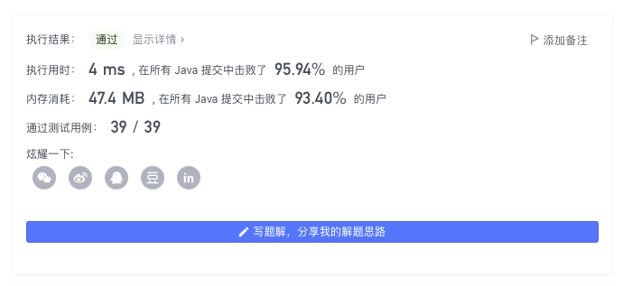

> 原文链接: https://leetcode-cn.com/problems/longest-arithmetic-subsequence-of-given-difference


## 英文原文
<div><p>Given an integer array <code>arr</code> and an integer <code>difference</code>, return the length of the longest subsequence in <code>arr</code> which is an arithmetic sequence such that the difference between adjacent elements in the subsequence equals <code>difference</code>.</p>

<p>A <strong>subsequence</strong> is a sequence that can be derived from <code>arr</code> by deleting some or no elements without changing the order of the remaining elements.</p>

<p>&nbsp;</p>
<p><strong>Example 1:</strong></p>

<pre>
<strong>Input:</strong> arr = [1,2,3,4], difference = 1
<strong>Output:</strong> 4
<strong>Explanation: </strong>The longest arithmetic subsequence is [1,2,3,4].</pre>

<p><strong>Example 2:</strong></p>

<pre>
<strong>Input:</strong> arr = [1,3,5,7], difference = 1
<strong>Output:</strong> 1
<strong>Explanation: </strong>The longest arithmetic subsequence is any single element.
</pre>

<p><strong>Example 3:</strong></p>

<pre>
<strong>Input:</strong> arr = [1,5,7,8,5,3,4,2,1], difference = -2
<strong>Output:</strong> 4
<strong>Explanation: </strong>The longest arithmetic subsequence is [7,5,3,1].
</pre>

<p>&nbsp;</p>
<p><strong>Constraints:</strong></p>

<ul>
	<li><code>1 &lt;= arr.length &lt;= 10<sup>5</sup></code></li>
	<li><code>-10<sup>4</sup> &lt;= arr[i], difference &lt;= 10<sup>4</sup></code></li>
</ul>
</div>

## 中文题目
<div><p>给你一个整数数组 <code>arr</code> 和一个整数 <code>difference</code>，请你找出并返回 <code>arr</code> 中最长等差子序列的长度，该子序列中相邻元素之间的差等于 <code>difference</code> 。</p>

<p><strong>子序列</strong> 是指在不改变其余元素顺序的情况下，通过删除一些元素或不删除任何元素而从 <code>arr</code> 派生出来的序列。</p>

<p> </p>

<p><strong>示例 1：</strong></p>

<pre>
<strong>输入：</strong>arr = [1,2,3,4], difference = 1
<strong>输出：</strong>4
<strong>解释：</strong>最长的等差子序列是 [1,2,3,4]。</pre>

<p><strong>示例 2：</strong></p>

<pre>
<strong>输入：</strong>arr = [1,3,5,7], difference = 1
<strong>输出：</strong>1
<strong>解释：</strong>最长的等差子序列是任意单个元素。
</pre>

<p><strong>示例 3：</strong></p>

<pre>
<strong>输入：</strong>arr = [1,5,7,8,5,3,4,2,1], difference = -2
<strong>输出：</strong>4
<strong>解释：</strong>最长的等差子序列是 [7,5,3,1]。
</pre>

<p> </p>

<p><strong>提示：</strong></p>

<ul>
	<li><code>1 <= arr.length <= 10<sup>5</sup></code></li>
	<li><code>-10<sup>4</sup> <= arr[i], difference <= 10<sup>4</sup></code></li>
</ul>
</div>

## 通过代码
<RecoDemo>
</RecoDemo>


## 高赞题解
## 序列 DP + 哈希表

**定义 $f[i][j]$（$j$ 非 $0$ 即 $1$） 为代表考虑前 $i$ 个数，且第 $i$ 个数的选择情况为 $j$ 时，得到的最长定差子序列长度。**

最终答案为 $\max(f[n - 1][0], f[n - 1][1])$，同时我们有显然的初始化条件 $f[0][0] = 0$ 和 $f[0][1] = 1$。

不失一般性考虑 $f[i][j]$ 如何转移：

* $f[i][0]$：明确了第 $i$ 个不选，那么此时最大长度为前一个位置的结果。即有：

$$
f[i][0] = \max(f[i - 1][0], f[i - 1][1])
$$

* $f[i][1]$：明确了第 $i$ 个要选，此时进行分情况讨论：
    
    * $arr[i]$ 独立成为一个子序列，此时有：$f[i][1] = 1$；
    * $arr[i]$ 接在某一个数的后面，由于给定了差值 $difference$，可直接算得上一位的值为 $prev = arr[i] - difference$，此时应当找到值为 $prev$，下标最大（下标小于 $i$）的位置，然后从该位置转移过来，即有：$f[i][1] = f[hash[prev]][1] + 1$;
    
    > 容易证明：如果存在多个位置的值为 $prev$，从中选择一个下标最大的位置（下标小于 $i$）进行转移，结果相比于最优位置不会变差。因此我们「贪心」选择下标最大的位置（下标小于 $i$）即可，这引导我们在转移过程中使用「哈希表」记录处理过的位置的值信息。

    综上，我们有：

$$
f[i][1] = \begin{cases}
1 & hash[arr[i] - difference] = -1 \\
f[hash[prev]][1] + 1 & hash[arr[i] - difference] \neq -1
\end{cases}
$$


代码（使用数组充当哈希表的代码在 $P2$）：
```Java []
class Solution {
    public int longestSubsequence(int[] arr, int d) {
        int n = arr.length;
        Map<Integer, Integer> map = new HashMap<>();
        int[][] f = new int[n][2];
        f[0][1] = 1;
        map.put(arr[0], 0);
        for (int i = 1; i < n; i++) {
            f[i][0] = Math.max(f[i - 1][0], f[i - 1][1]);
            f[i][1] = 1;
            int prev = arr[i] - d;
            if (map.containsKey(prev)) f[i][1] = Math.max(f[i][1], f[map.get(prev)][1] + 1);
            map.put(arr[i], i);
        }
        return Math.max(f[n - 1][0], f[n - 1][1]);
    }
}
```
```Java []
class Solution {
    int N = 40009, M = N / 2;
    public int longestSubsequence(int[] arr, int d) {
        int n = arr.length;
        int[] hash = new int[N];
        Arrays.fill(hash, -1);
        int[][] f = new int[n][2];
        f[0][1] = 1;
        hash[arr[0] + M] = 0;
        for (int i = 1; i < n; i++) {
            f[i][0] = Math.max(f[i - 1][0], f[i - 1][1]);
            f[i][1] = 1;
            int prev = arr[i] - d;
            if (hash[prev + M] != -1) f[i][1] = Math.max(f[i][1], f[hash[prev + M]][1] + 1);
            hash[arr[i] + M] = i;
        }
        return Math.max(f[n - 1][0], f[n - 1][1]);
    }
}
```
* 时间复杂度：令 $n$ 为数组长度，共有 $n * 2$ 个状态需要被计算，每个状态转移的复杂度为 $O(1)$。整体复杂度为 $O(n)$
* 空间复杂度：$O(n)$

---

## 优化状态定义

不难发现，我们多定义一维状态来区分某个位置的值是否被选择，目的是为了正确转移出第 $i$ 位被选择的情况。

事实上，利用哈希表本身我们就能轻松做到这一点。

我们调整状态定义为：**$f[i]$ 为考虑前 $i$ 个数（第 $i$ 个数必选）时，得到的最长定差子序列长度。**

不失一般性考虑 $f[i]$ 该如何转移，分情况讨论：

* $arr[i]$ 独立成为一个子序列，此时有：$f[i] = 1$；
* $arr[i]$ 接在某一个数的后面，由于给定了差值 $difference$，可直接算得上一位的值为 $prev = arr[i] - difference$，此时应当找到 $arr[j]$ 为 $prev$ 的最新位置（下标最大，同时满足 $j < i$）当时的转移结果，在此基础上加一即可，即有：$f[i] = hash[prev] + 1$;
    
综上，我们有（$hash$ 初始化为 $0$）：

$$
f[i] = hash[prev] + 1
$$



代码（使用数组充当哈希表的代码在 $P2$）：
```Java []
class Solution {
    public int longestSubsequence(int[] arr, int d) {
        int ans = 1;
        Map<Integer, Integer> map = new HashMap<>();
        for (int i : arr) {
            map.put(i, map.getOrDefault(i - d, 0) + 1);
            ans = Math.max(ans, map.get(i));
        }
        return ans;
    }
}
```
```Java []
class Solution {
    int N = 40009, M = N / 2;
    public int longestSubsequence(int[] arr, int d) {
        int ans = 1;
        int[] hash = new int[N];
        for (int i : arr) {
            hash[i + M] = hash[i - d + M] + 1;
            ans = Math.max(ans, hash[i + M]);
        }
        return ans;
    }
}
```
* 时间复杂度：令 $n$ 为数组长度，共有 $n$ 个状态需要被计算，每个状态转移的复杂度为 $O(1)$。整体复杂度为 $O(n)$
* 空间复杂度：$O(n)$


---

## 其他

意犹未尽？考虑加练如下「序列 DP」内容 🍭🍭🍭

| 题目                                                         | 题解                                                         | 难度 | 推荐指数 |
| ------------------------------------------------------------ | ------------------------------------------------------------ | ---- | -------- |
| [354. 俄罗斯套娃信封问题](https://leetcode-cn.com/problems/russian-doll-envelopes/) | [LeetCode 题解链接](https://leetcode-cn.com/problems/russian-doll-envelopes/solution/zui-chang-shang-sheng-zi-xu-lie-bian-xin-6s8d/) | 困难 | 🤩🤩🤩🤩🤩    |
| [368. 最大整除子集](https://leetcode-cn.com/problems/largest-divisible-subset/) | [LeetCode 题解链接](https://leetcode-cn.com/problems/largest-divisible-subset/solution/gong-shui-san-xie-noxiang-xin-ke-xue-xi-0a3jc/) | 中等 | 🤩🤩🤩🤩     |
| [446. 等差数列划分 II - 子序列](https://leetcode-cn.com/problems/arithmetic-slices-ii-subsequence/) | [LeetCode 题解链接](https://leetcode-cn.com/problems/arithmetic-slices-ii-subsequence/solution/gong-shui-san-xie-xiang-jie-ru-he-fen-xi-ykvk/) | 困难 | 🤩🤩🤩🤩🤩    |
| [583. 两个字符串的删除操作](https://leetcode-cn.com/problems/delete-operation-for-two-strings/) | [LeetCode 题解链接](https://leetcode-cn.com/problems/delete-operation-for-two-strings/solution/gong-shui-san-xie-cong-liang-chong-xu-li-wqv7/) | 中等 | 🤩🤩🤩🤩     |
| [673. 最长递增子序列的个数](https://leetcode-cn.com/problems/number-of-longest-increasing-subsequence/) | [LeetCode 题解链接](https://leetcode-cn.com/problems/number-of-longest-increasing-subsequence/solution/gong-shui-san-xie-lis-de-fang-an-shu-wen-obuz/) | 中等 | 🤩🤩🤩🤩     |
| [740. 删除并获得点数](https://leetcode-cn.com/problems/delete-and-earn/) | [LeetCode 题解链接](https://leetcode-cn.com/problems/delete-and-earn/solution/gong-shui-san-xie-zhuan-huan-wei-xu-lie-6c9t0/) | 中等 | 🤩🤩🤩🤩🤩    |
| [978. 最长湍流子数组](https://leetcode-cn.com/problems/longest-turbulent-subarray/) | [LeetCode 题解链接](https://leetcode-cn.com/problems/longest-turbulent-subarray/solution/xiang-jie-dong-tai-gui-hua-ru-he-cai-dp-3spgj/) | 中等 | 🤩🤩🤩      |
| [1035. 不相交的线](https://leetcode-cn.com/problems/uncrossed-lines/) | [LeetCode 题解链接](https://leetcode-cn.com/problems/uncrossed-lines/solution/gong-shui-san-xie-noxiang-xin-ke-xue-xi-bkaas/) | 中等 | 🤩🤩🤩🤩     |
| [1143. 最长公共子序列](https://leetcode-cn.com/problems/longest-common-subsequence/) | [LeetCode 题解链接](https://leetcode-cn.com/problems/longest-common-subsequence/solution/gong-shui-san-xie-zui-chang-gong-gong-zi-xq0h/) | 中等 | 🤩🤩🤩🤩     |
| [1473. 粉刷房子 III](https://leetcode-cn.com/problems/paint-house-iii/) | [LeetCode 题解链接](https://leetcode-cn.com/problems/paint-house-iii/solution/gong-shui-san-xie-san-wei-dong-tai-gui-h-ud7m/) | 困难 | 🤩🤩🤩🤩     |
| [1713. 得到子序列的最少操作次数](https://leetcode-cn.com/problems/minimum-operations-to-make-a-subsequence/) | [LeetCode 题解链接](https://leetcode-cn.com/problems/minimum-operations-to-make-a-subsequence/solution/gong-shui-san-xie-noxiang-xin-ke-xue-xi-oj7yu/) | 困难 | 🤩🤩🤩🤩🤩    |

**注：以上目录整理来自 [wiki](https://github.com/SharingSource/LogicStack-LeetCode/wiki/序列-DP)，任何形式的转载引用请保留出处。**

---

## 最后

**如果有帮助到你，请给题解点个赞和收藏，让更多的人看到 ~ ("▔□▔)/**

也欢迎你 [关注我](https://oscimg.oschina.net/oscnet/up-19688dc1af05cf8bdea43b2a863038ab9e5.png)（公主号后台回复「送书」即可参与长期看题解学算法送实体书活动）或 加入[「组队打卡」](https://leetcode-cn.com/u/ac_oier/)小群 ，提供写「证明」&「思路」的高质量题解。

所有题解已经加入 [刷题指南](https://github.com/SharingSource/LogicStack-LeetCode/wiki)，欢迎 star 哦 ~ 

## 统计信息
| 通过次数 | 提交次数 | AC比率 |
| :------: | :------: | :------: |
|    36706    |    71394    |   51.4%   |

## 提交历史
| 提交时间 | 提交结果 | 执行时间 |  内存消耗  | 语言 |
| :------: | :------: | :------: | :--------: | :--------: |
