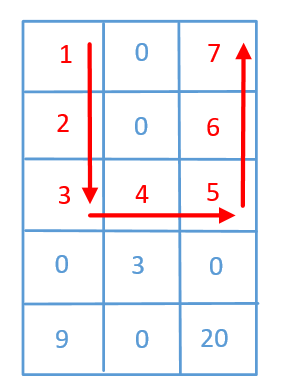
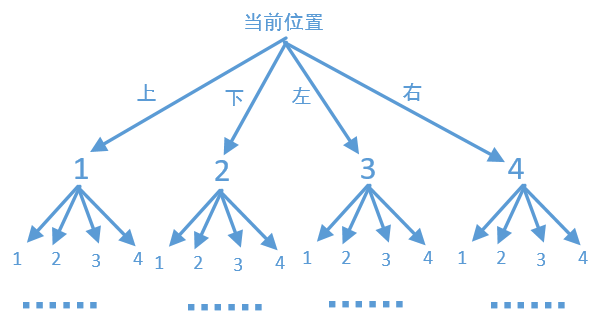

> 原文链接: https://leetcode-cn.com/problems/path-with-maximum-gold


## 英文原文
<div><p>In a gold mine <code>grid</code> of size <code>m x n</code>, each cell in this mine has an integer representing the amount of gold in that cell, <code>0</code> if it is empty.</p>

<p>Return the maximum amount of gold you can collect under the conditions:</p>

<ul>
	<li>Every time you are located in a cell you will collect all the gold in that cell.</li>
	<li>From your position, you can walk one step to the left, right, up, or down.</li>
	<li>You can&#39;t visit the same cell more than once.</li>
	<li>Never visit a cell with <code>0</code> gold.</li>
	<li>You can start and stop collecting gold from <strong>any </strong>position in the grid that has some gold.</li>
</ul>

<p>&nbsp;</p>
<p><strong>Example 1:</strong></p>

<pre>
<strong>Input:</strong> grid = [[0,6,0],[5,8,7],[0,9,0]]
<strong>Output:</strong> 24
<strong>Explanation:</strong>
[[0,6,0],
 [5,8,7],
 [0,9,0]]
Path to get the maximum gold, 9 -&gt; 8 -&gt; 7.
</pre>

<p><strong>Example 2:</strong></p>

<pre>
<strong>Input:</strong> grid = [[1,0,7],[2,0,6],[3,4,5],[0,3,0],[9,0,20]]
<strong>Output:</strong> 28
<strong>Explanation:</strong>
[[1,0,7],
 [2,0,6],
 [3,4,5],
 [0,3,0],
 [9,0,20]]
Path to get the maximum gold, 1 -&gt; 2 -&gt; 3 -&gt; 4 -&gt; 5 -&gt; 6 -&gt; 7.
</pre>

<p>&nbsp;</p>
<p><strong>Constraints:</strong></p>

<ul>
	<li><code>m == grid.length</code></li>
	<li><code>n == grid[i].length</code></li>
	<li><code>1 &lt;= m, n &lt;= 15</code></li>
	<li><code>0 &lt;= grid[i][j] &lt;= 100</code></li>
	<li>There are at most <strong>25 </strong>cells containing gold.</li>
</ul>
</div>

## 中文题目
<div><p>你要开发一座金矿，地质勘测学家已经探明了这座金矿中的资源分布，并用大小为&nbsp;<code>m * n</code> 的网格 <code>grid</code> 进行了标注。每个单元格中的整数就表示这一单元格中的黄金数量；如果该单元格是空的，那么就是 <code>0</code>。</p>

<p>为了使收益最大化，矿工需要按以下规则来开采黄金：</p>

<ul>
	<li>每当矿工进入一个单元，就会收集该单元格中的所有黄金。</li>
	<li>矿工每次可以从当前位置向上下左右四个方向走。</li>
	<li>每个单元格只能被开采（进入）一次。</li>
	<li><strong>不得开采</strong>（进入）黄金数目为 <code>0</code> 的单元格。</li>
	<li>矿工可以从网格中 <strong>任意一个</strong> 有黄金的单元格出发或者是停止。</li>
</ul>

<p>&nbsp;</p>

<p><strong>示例 1：</strong></p>

<pre><strong>输入：</strong>grid = [[0,6,0],[5,8,7],[0,9,0]]
<strong>输出：</strong>24
<strong>解释：</strong>
[[0,6,0],
 [5,8,7],
 [0,9,0]]
一种收集最多黄金的路线是：9 -&gt; 8 -&gt; 7。
</pre>

<p><strong>示例 2：</strong></p>

<pre><strong>输入：</strong>grid = [[1,0,7],[2,0,6],[3,4,5],[0,3,0],[9,0,20]]
<strong>输出：</strong>28
<strong>解释：</strong>
[[1,0,7],
 [2,0,6],
 [3,4,5],
 [0,3,0],
 [9,0,20]]
一种收集最多黄金的路线是：1 -&gt; 2 -&gt; 3 -&gt; 4 -&gt; 5 -&gt; 6 -&gt; 7。
</pre>

<p>&nbsp;</p>

<p><strong>提示：</strong></p>

<ul>
	<li><code>1 &lt;= grid.length,&nbsp;grid[i].length &lt;= 15</code></li>
	<li><code>0 &lt;= grid[i][j] &lt;= 100</code></li>
	<li>最多 <strong>25 </strong>个单元格中有黄金。</li>
</ul>
</div>

## 通过代码
<RecoDemo>
</RecoDemo>


## 高赞题解

这题上面说了一大堆，其实就是在一个二维数组中从任一位置开始，可以往他的上下左右4个方向走，然后返回走过的路线中值最大的，0其实就相当于障碍物，不能往位置为0的地方走，画个简单的图看一下

我们需要遍历每一个位置，从任何一个位置开始找到最大路径，所以代码大致轮廓如下
```
public int getMaximumGold(int[][] grid) {
    //边界条件判断
    if (grid == null || grid.length == 0)
        return 0;
    //保存最大路径值
    int res = 0;
    //两个for循环，遍历每一个位置，让他们当做起点
    //查找最大路径值
    for (int i = 0; i < grid.length; i++) {
        for (int j = 0; j < grid[0].length; j++) {
            //函数dfs是以坐标(i,j)为起点，查找最大路径值
            res = Math.max(res, dfs(grid, i, j));
        }
    }
    //返回最大路径值
    return res;
}
```
代码的大致轮廓写出来了，这里主要是dfs这个函数，他表示的是以(i，j)为坐标点，沿着他的上下左右4个方向查找最大路径，这里我们很容易把它想象成为一颗4叉树，就像下面这样

看到这个图，很容易想到之前讲的[426，什么是递归，通过这篇文章，让你彻底搞懂递归](https://mp.weixin.qq.com/s?__biz=MzU0ODMyNDk0Mw==&mid=2247487910&idx=1&sn=2670aec7139c6b98e83ff66114ac1cf7&chksm=fb418286cc360b90741ed54fecd62fd45571b2caba3e41473a7ea0934f918d4b31537689c664&scene=21#wechat_redirect)。他会沿着每一个分支一直走下去，直到遇到终止条件，并且把走过的位置全部置为0，表示不能再走这个位置了。终止条件是什么呢，很明显，i和j都不能越界，并且当前位置不能是0，也就是下面这样
```
if (i < 0 || i >= grid.length || j < 0 || j >= grid[0].length || grid[i][j] == 0)
    return 0;
```
因为使用的是递归，往下走的时候把当前的值给置为0了，当递归往回走的时候我们当前位置的值给还原，所以上面dfs的最终代码如下
```
public int dfs(int[][] grid, int x, int y) {
    //边界条件的判断，x,y都不能越界，同时当前坐标的位置如果是0，表示有障碍物
    //或者遍历过了
    if (x < 0 || x >= grid.length || y < 0 || y >= grid[0].length || grid[x][y] == 0)
        return 0;
    //先把当前坐标的值保存下来，最后再还原
    int temp = grid[x][y];
    //当前坐标已经访问过了，要把他标记为0，防止再次访问
    grid[x][y] = 0;
    //然后沿着当前坐标的上下左右4个方向查找
    int up = dfs(grid, x, y - 1);//往上找
    int down = dfs(grid, x, y + 1);//往下找
    int left = dfs(grid, x - 1, y);//往左找
    int right = dfs(grid, x + 1, y);//往右找
    //这里只要4个方向的最大值即可
    int max = Math.max(left, Math.max(right, Math.max(up, down)));
    //然后再把当前位置的值还原
    grid[x][y] = temp;
    //返回最大路径值
    return grid[x][y] + max;
}
```

最终完整代码如下

```
    public int getMaximumGold(int[][] grid) {
        //边界条件判断
        if (grid == null || grid.length == 0)
            return 0;
        //保存最大路径值
        int res = 0;
        //两个for循环，遍历每一个位置，让他们当做起点
        //查找最大路径值
        for (int i = 0; i < grid.length; i++) {
            for (int j = 0; j < grid[0].length; j++) {
                //函数dfs是以坐标(i,j)为起点，查找最大路径值
                res = Math.max(res, dfs(grid, i, j));
            }
        }
        //返回最大路径值
        return res;
    }

    public int dfs(int[][] grid, int i, int j) {
        //边界条件的判断，x,y都不能越界，同时当前坐标的位置如果是0，表示有障碍物
        //或者遍历过了
    if (i < 0 || i >= grid.length || j < 0 || j >= grid[0].length || grid[i][j] == 0)
        return 0;
        //先把当前坐标的值保存下来，最后再还原
        int temp = grid[i][j];
        //当前坐标已经访问过了，要把他标记为0，防止再次访问
        grid[i][j] = 0;
        //然后沿着当前坐标的上下左右4个方向查找
        int up = dfs(grid, i, j - 1);//往上找
        int down = dfs(grid, i, j + 1);//往下找
        int left = dfs(grid, i - 1, j);//往左找
        int right = dfs(grid, i + 1, j);//往右找
        //这里只要4个方向的最大值即可
        int max = Math.max(left, Math.max(right, Math.max(up, down)));
        //然后再把当前位置的值还原
        grid[i][j] = temp;
        //返回最大路径值
        return grid[i][j] + max;
    }
```
看一下运行结果


<br>

我把部分算法题整理成了PDF文档，截止目前总共有**900多页**，大家可以下载阅读
**链接**：https://pan.baidu.com/s/1hjwK0ZeRxYGB8lIkbKuQgQ 
**提取码**：6666 

#### 如果觉得有用就给个赞吧，还可以关注我的[LeetCode主页](https://leetcode-cn.com/u/sdwwld/)查看更多的详细题解


## 统计信息
| 通过次数 | 提交次数 | AC比率 |
| :------: | :------: | :------: |
|    12604    |    20060    |   62.8%   |

## 提交历史
| 提交时间 | 提交结果 | 执行时间 |  内存消耗  | 语言 |
| :------: | :------: | :------: | :--------: | :--------: |
