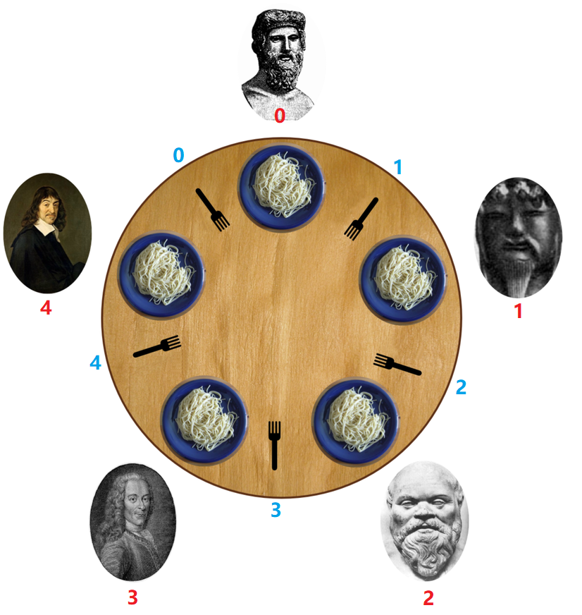

> 原文链接: https://leetcode-cn.com/problems/the-dining-philosophers


## 英文原文
<div><p>Five silent philosophers&nbsp;sit at a round table with bowls of spaghetti. Forks are placed between each pair of adjacent philosophers.</p>

<p>Each philosopher must alternately think and eat. However, a philosopher can only eat spaghetti when they have both left and right forks. Each fork can be held by only one philosopher and so a philosopher can use the fork only if it is not being used by another philosopher. After an individual philosopher finishes eating, they need to put down both forks so that the forks become available to others. A philosopher can take the fork on their right or the one on their left as they become available, but cannot start eating before getting both forks.</p>

<p>Eating is not limited by the remaining amounts of spaghetti or stomach space; an infinite supply and an infinite demand are assumed.</p>

<p>Design a discipline of behaviour (a concurrent algorithm) such that no philosopher will starve;&nbsp;<i>i.e.</i>, each can forever continue to alternate between eating and thinking, assuming that no philosopher can know when others may want to eat or think.</p>

<p style="text-align: center"></p>

<p style="text-align: center"><em>The problem statement and the image above are taken from <a href="https://en.wikipedia.org/wiki/Dining_philosophers_problem" target="_blank">wikipedia.org</a></em></p>

<p>&nbsp;</p>

<p>The philosophers&#39; ids are numbered from <strong>0</strong> to <strong>4</strong> in a <strong>clockwise</strong> order. Implement the function&nbsp;<code>void wantsToEat(philosopher, pickLeftFork, pickRightFork, eat, putLeftFork, putRightFork)</code> where:</p>

<ul>
	<li><code>philosopher</code>&nbsp;is the id of the philosopher who wants to eat.</li>
	<li><code>pickLeftFork</code>&nbsp;and&nbsp;<code>pickRightFork</code>&nbsp;are functions you can call to pick the corresponding forks of that philosopher.</li>
	<li><code>eat</code>&nbsp;is a function you can call to let the philosopher eat once he has picked&nbsp;both forks.</li>
	<li><code>putLeftFork</code>&nbsp;and&nbsp;<code>putRightFork</code>&nbsp;are functions you can call to put down the corresponding forks of that philosopher.</li>
	<li>The philosophers are assumed to be thinking as long as they are not asking to eat (the function is not being called with their number).</li>
</ul>

<p>Five threads, each representing a philosopher, will&nbsp;simultaneously use one object of your class to simulate the process. The function may be called for the same philosopher more than once, even before the last call ends.</p>

<p>&nbsp;</p>
<p><strong>Example 1:</strong></p>

<pre>
<strong>Input:</strong> n = 1
<strong>Output:</strong> [[4,2,1],[4,1,1],[0,1,1],[2,2,1],[2,1,1],[2,0,3],[2,1,2],[2,2,2],[4,0,3],[4,1,2],[0,2,1],[4,2,2],[3,2,1],[3,1,1],[0,0,3],[0,1,2],[0,2,2],[1,2,1],[1,1,1],[3,0,3],[3,1,2],[3,2,2],[1,0,3],[1,1,2],[1,2,2]]
<strong>Explanation:</strong>
n is the number of times each philosopher will call the function.
The output array describes the calls you made to the functions controlling the forks and the eat function, its format is:
output[i] = [a, b, c] (three integers)
- a is the id of a philosopher.
- b specifies the fork: {1 : left, 2 : right}.
- c specifies the operation: {1 : pick, 2 : put, 3 : eat}.</pre>

<p>&nbsp;</p>
<p><strong>Constraints:</strong></p>

<ul>
	<li><code>1 &lt;= n &lt;= 60</code></li>
</ul>
</div>

## 中文题目
<div><p>5 个沉默寡言的哲学家围坐在圆桌前，每人面前一盘意面。叉子放在哲学家之间的桌面上。（5 个哲学家，5 根叉子）</p>

<p>所有的哲学家都只会在思考和进餐两种行为间交替。哲学家只有同时拿到左边和右边的叉子才能吃到面，而同一根叉子在同一时间只能被一个哲学家使用。每个哲学家吃完面后都需要把叉子放回桌面以供其他哲学家吃面。只要条件允许，哲学家可以拿起左边或者右边的叉子，但在没有同时拿到左右叉子时不能进食。</p>

<p>假设面的数量没有限制，哲学家也能随便吃，不需要考虑吃不吃得下。</p>

<p>设计一个进餐规则（并行算法）使得每个哲学家都不会挨饿；也就是说，在没有人知道别人什么时候想吃东西或思考的情况下，每个哲学家都可以在吃饭和思考之间一直交替下去。</p>

<p></p>

<p><em>问题描述和图片来自维基百科&nbsp;<a href="https://en.wikipedia.org/wiki/Dining_philosophers_problem" target="_blank">wikipedia.org</a></em></p>

<p>&nbsp;</p>

<p>哲学家从&nbsp;<strong>0</strong> 到 <strong>4</strong> 按 <strong>顺时针</strong> 编号。请实现函数&nbsp;<code>void wantsToEat(philosopher, pickLeftFork, pickRightFork, eat, putLeftFork, putRightFork)</code>：</p>

<ul>
	<li><code>philosopher</code>&nbsp;哲学家的编号。</li>
	<li><code>pickLeftFork</code>&nbsp;和&nbsp;<code>pickRightFork</code>&nbsp;表示拿起左边或右边的叉子。</li>
	<li><code>eat</code>&nbsp;表示吃面。</li>
	<li><code>putLeftFork</code>&nbsp;和&nbsp;<code>putRightFork</code>&nbsp;表示放下左边或右边的叉子。</li>
	<li>由于哲学家不是在吃面就是在想着啥时候吃面，所以思考这个方法没有对应的回调。</li>
</ul>

<p>给你 5 个线程，每个都代表一个哲学家，请你使用类的同一个对象来模拟这个过程。在最后一次调用结束之前，可能会为同一个哲学家多次调用该函数。</p>

<p>&nbsp;</p>

<p><strong>示例：</strong></p>

<pre><strong>输入：</strong>n = 1
<strong>输出：</strong>[[4,2,1],[4,1,1],[0,1,1],[2,2,1],[2,1,1],[2,0,3],[2,1,2],[2,2,2],[4,0,3],[4,1,2],[0,2,1],[4,2,2],[3,2,1],[3,1,1],[0,0,3],[0,1,2],[0,2,2],[1,2,1],[1,1,1],[3,0,3],[3,1,2],[3,2,2],[1,0,3],[1,1,2],[1,2,2]]
<strong>解释:</strong>
n 表示每个哲学家需要进餐的次数。
输出数组描述了叉子的控制和进餐的调用，它的格式如下：
output[i] = [a, b, c] (3个整数)
- a 哲学家编号。
- b 指定叉子：{1 : 左边, 2 : 右边}.
- c 指定行为：{1 : 拿起, 2 : 放下, 3 : 吃面}。
如 [4,2,1] 表示 4 号哲学家拿起了右边的叉子。
</pre>

<p>&nbsp;</p>

<p><strong>提示：</strong></p>

<ul>
	<li><code>1 &lt;= n &lt;= 60</code></li>
</ul>
</div>

## 通过代码
<RecoDemo>
</RecoDemo>


## 高赞题解
这道题本质上其实是想考察**如何避免死锁**。
易知：当 $5$ 个哲学家都拿着其左边(或右边)的叉子时，会进入死锁。

PS：死锁的 $4$ 个必要条件：
1. 互斥条件：一个资源每次只能被一个进程使用，即在一段时间内某 资源仅为一个进程所占有。此时若有其他进程请求该资源，则请求进程只能等待。
2. 请求与保持条件：进程已经保持了至少一个资源，但又提出了新的资源请求，而该资源 已被其他进程占有，此时请求进程被阻塞，但对自己已获得的资源保持不放。
3. 不可剥夺条件:进程所获得的资源在未使用完毕之前，不能被其他进程强行夺走，即只能 由获得该资源的进程自己来释放（只能是主动释放)。
4. 循环等待条件: 若干进程间形成首尾相接循环等待资源的关系。

故**最多**只允许 $4$ 个哲学家去持有叉子，可保证至少有 $1$ 个哲学家能吃上意大利面（即获得到 $2$ 个叉子）。
因为最差情况下是：$4$ 个哲学家都各自持有1个叉子，此时还 **剩余 $1$ 个叉子** 可供使用，这 $4$ 个哲学家中必然有1人能获取到这个 **剩余的 $1$ 个叉子**，从而手持 $2$ 个叉子，可以吃意大利面。
即：$4$ 个人中，$1$ 个人有 $2$ 个叉子，$3$ 个人各持 $1$ 个叉子，共计 $5$ 个叉子。

既然**最多**只允许4个哲学家去持有叉子，那么如果只允许3个哲学家去持有叉子是否可行呢？

当然可行，$3$个哲学家可以先都各自持有$1$把叉子，此时还剩余$2$把叉子；

当这$3$个哲学家刚好都相邻(比如：编号为图中的`0, 1, 2`)，可能会造成只有$1$个哲学家能吃到意面的情况，具体而言即`0`号哲学家拿到了其左侧的叉子(编号为`1`)，`1`号哲学家也拿到了其左侧的叉子(编号为`2`)，`2`号哲学家也拿到了其左侧的叉子(编号为`3`)，此时只有`0`号哲学家能拿到其右侧的叉子(编号为`0`)，因此只有`0`号哲学家能吃到意面。
而其余情况下，`3`个哲学家中都能有`2`人吃到意面。
即：$3$ 个人中，$2$ 个人各自持有 $2$ 个叉子，$1$ 个人持有 $1$ 个叉子，共计 $5$ 个叉子。

并且仔细想想，叉子的数目是**固定**的(个数为`5`)，直觉上来讲`3`个人去抢`5`个叉子 比 `4`个人去抢`5`个叉子效率高。

用`Semaphore`去实现上述的限制：`Semaphore eatLimit = new Semaphore(4);`
一共有5个叉子，视为5个`ReentrantLock`，并将它们全放入1个数组中。

给叉子编号 $0, 1, 2, 3, 4$（对应数组下标）。
具体编号我是如下图这般设计的：

{:width=300}


有了这些思路，代码实现就变得清晰起来。

代码具体实现：
```java [-方法1]
class DiningPhilosophers {
    //1个Fork视为1个ReentrantLock，5个叉子即5个ReentrantLock，将其都放入数组中
    private final ReentrantLock[] lockList = {new ReentrantLock(),
            new ReentrantLock(),
            new ReentrantLock(),
            new ReentrantLock(),
            new ReentrantLock()};

    //限制 最多只有4个哲学家去持有叉子
    private Semaphore eatLimit = new Semaphore(4);

    public DiningPhilosophers() {

    }

    // call the run() method of any runnable to execute its code
    public void wantsToEat(int philosopher,
                           Runnable pickLeftFork,
                           Runnable pickRightFork,
                           Runnable eat,
                           Runnable putLeftFork,
                           Runnable putRightFork) throws InterruptedException {

        int leftFork = (philosopher + 1) % 5;    //左边的叉子 的编号
        int rightFork = philosopher;    //右边的叉子 的编号

        eatLimit.acquire();    //限制的人数 -1

        lockList[leftFork].lock();    //拿起左边的叉子
        lockList[rightFork].lock();    //拿起右边的叉子

        pickLeftFork.run();    //拿起左边的叉子 的具体执行
        pickRightFork.run();    //拿起右边的叉子 的具体执行

        eat.run();    //吃意大利面 的具体执行

        putLeftFork.run();    //放下左边的叉子 的具体执行
        putRightFork.run();    //放下右边的叉子 的具体执行

        lockList[leftFork].unlock();    //放下左边的叉子
        lockList[rightFork].unlock();    //放下右边的叉子

        eatLimit.release();//限制的人数 +1
    }
}
```


接下来的2个方法转自：
作者：mike-meng
链接：[https://leetcode-cn.com/problems/the-dining-philosophers/solution/zhe-xue-jia-jiu-can-wen-ti-by-mike-meng/](https://leetcode-cn.com/problems/the-dining-philosophers/solution/zhe-xue-jia-jiu-can-wen-ti-by-mike-meng/)

他是用C++实现的，将其转为Java代码如下：

**方法 $2$：**
设置 $1$ 个临界区以实现 $1$ 个哲学家 “**同时**”拿起左右  **$2$ 把叉子**的效果。
即进入临界区之后，保证**成功获取**到左右 **$2$ 把叉子** 并 执行相关代码后，才退出临界区。

评论区看到有题友说方法2就是“只让1个哲学家就餐”的思路，无需将叉子视为`ReentrantLock`。

下面我也给出了“只允许1个哲学家就餐”的代码。

但是2者之间还是有**细微**的**差别**：
方法2是在成功**拿起左右叉子之后**就退出临界区，而“只让1个哲学家就餐”是在**拿起左右叉子 + 吃意面 + 放下左右叉子** 一套流程走完之后才退出临界区。

前者的情况可大概分为2种，举具体例子说明(可参照上面给出的图片)：
1. `1`号哲学家拿起左右叉子(`1`号叉子 + `2`号叉子)后就退出临界区，此时`4`号哲学家成功挤进临界区，他也成功拿起了左右叉子(`0`号叉子和`4`号叉子)，然后就退出临界区。
2. `1`号哲学家拿起左右叉子(`1`号叉子 + `2`号叉子)后就退出临界区，此时`2`号哲学家成功挤进临界区，他需要拿起`2`号叉子和`3`号叉子，但`2`号叉子有一定的概率还被`1`号哲学家持有(`1`号哲学家意面还没吃完)，因此`2`号哲学家进入临界区后还需要等待`2`号叉子。至于`3`号叉子，根本没其他人跟`2`号哲学家争夺，因此可以将该种情况视为“`2`号哲学家只拿起了1只叉子，在等待另1只叉子”的情况。

总之，第1种情况即**先后进入临界区**的**2位哲学家**的左右叉子不存在竞争情况，因此先后进入临界区的2位哲学家进入临界区后都不用等待叉子，直接就餐。此时可视为2个哲学家在同时就餐(当然前1个哲学家有可能已经吃完了，但姑且当作是2个人同时就餐)。

第2种情况即先后进入临界区的2位哲学家的左右叉子存在竞争情况(说明这2位哲学家的**编号相邻**)，因此**后进入临界区**的哲学家还需要等待1只叉子，才能就餐。此时可视为只有1个哲学家在就餐。

至于“只允许1个哲学家就餐”的代码，很好理解，每次严格地只让1个哲学家就餐，由于过于严格，以至于都不需要将叉子视为`ReentrantLock`。

方法`2`有一定的概率是“并行”，“只允许1个哲学家就餐”是严格的“串行”。

代码如下：
```java [-方法2]
class DiningPhilosophers {
    //1个Fork视为1个ReentrantLock，5个叉子即5个ReentrantLock，将其都放入数组中
    private final ReentrantLock[] lockList = {new ReentrantLock(),
            new ReentrantLock(),
            new ReentrantLock(),
            new ReentrantLock(),
            new ReentrantLock()};

    //让 1个哲学家可以 “同时”拿起2个叉子(搞个临界区)
    private ReentrantLock pickBothForks = new ReentrantLock();

    public DiningPhilosophers() {

    }

    // call the run() method of any runnable to execute its code
    public void wantsToEat(int philosopher,
                           Runnable pickLeftFork,
                           Runnable pickRightFork,
                           Runnable eat,
                           Runnable putLeftFork,
                           Runnable putRightFork) throws InterruptedException {

        int leftFork = (philosopher + 1) % 5;    //左边的叉子 的编号
        int rightFork = philosopher;    //右边的叉子 的编号

        pickBothForks.lock();    //进入临界区

        lockList[leftFork].lock();    //拿起左边的叉子
        lockList[rightFork].lock();    //拿起右边的叉子

        pickLeftFork.run();    //拿起左边的叉子 的具体执行
        pickRightFork.run();    //拿起右边的叉子 的具体执行

        pickBothForks.unlock();    //退出临界区

        eat.run();    //吃意大利面 的具体执行

        putLeftFork.run();    //放下左边的叉子 的具体执行
        putRightFork.run();    //放下右边的叉子 的具体执行

        lockList[leftFork].unlock();    //放下左边的叉子
        lockList[rightFork].unlock();    //放下右边的叉子
    }
}
```
```java [-只允许1个哲学家就餐]
class DiningPhilosophers {
    //只允许1个哲学家就餐
    private ReentrantLock pickBothForks = new ReentrantLock();

    public DiningPhilosophers() {

    }

    // call the run() method of any runnable to execute its code
    public void wantsToEat(int philosopher,
                           Runnable pickLeftFork,
                           Runnable pickRightFork,
                           Runnable eat,
                           Runnable putLeftFork,
                           Runnable putRightFork) throws InterruptedException {

        int leftFork = (philosopher + 1) % 5;    //左边的叉子 的编号
        int rightFork = philosopher;    //右边的叉子 的编号

        pickBothForks.lock();    //进入临界区

        pickLeftFork.run();    //拿起左边的叉子 的具体执行
        pickRightFork.run();    //拿起右边的叉子 的具体执行

        eat.run();    //吃意大利面 的具体执行

        putLeftFork.run();    //放下左边的叉子 的具体执行
        putRightFork.run();    //放下右边的叉子 的具体执行

        pickBothForks.unlock();    //退出临界区
    }
}
```


**方法 $3$：**
前面说过，该题的本质是考察 **如何避免死锁**。
而当5个哲学家都**左手持有**其**左边的叉子** 或 当5个哲学家都**右手持有**其**右边的叉子**时，会发生**死锁**。
故只需设计1个避免发生上述情况发生的策略即可。

即可以让**一部分哲学家**优先去获取其左边的叉子，再去获取其右边的叉子；再让**剩余哲学家**优先去获取其右边的叉子，再去获取其左边的叉子。

代码如下：
```java [-方法3]
class DiningPhilosophers {
    //1个Fork视为1个ReentrantLock，5个叉子即5个ReentrantLock，将其都放入数组中
    private final ReentrantLock[] lockList = {new ReentrantLock(),
            new ReentrantLock(),
            new ReentrantLock(),
            new ReentrantLock(),
            new ReentrantLock()};

    public DiningPhilosophers() {

    }

    // call the run() method of any runnable to execute its code
    public void wantsToEat(int philosopher,
                           Runnable pickLeftFork,
                           Runnable pickRightFork,
                           Runnable eat,
                           Runnable putLeftFork,
                           Runnable putRightFork) throws InterruptedException {

        int leftFork = (philosopher + 1) % 5;    //左边的叉子 的编号
        int rightFork = philosopher;    //右边的叉子 的编号

        //编号为偶数的哲学家，优先拿起左边的叉子，再拿起右边的叉子
        if (philosopher % 2 == 0) {
            lockList[leftFork].lock();    //拿起左边的叉子
            lockList[rightFork].lock();    //拿起右边的叉子
        }
        //编号为奇数的哲学家，优先拿起右边的叉子，再拿起左边的叉子
        else {
            lockList[rightFork].lock();    //拿起右边的叉子
            lockList[leftFork].lock();    //拿起左边的叉子
        }

        pickLeftFork.run();    //拿起左边的叉子 的具体执行
        pickRightFork.run();    //拿起右边的叉子 的具体执行

        eat.run();    //吃意大利面 的具体执行

        putLeftFork.run();    //放下左边的叉子 的具体执行
        putRightFork.run();    //放下右边的叉子 的具体执行

        lockList[leftFork].unlock();    //放下左边的叉子
        lockList[rightFork].unlock();    //放下右边的叉子
    }
}
```

# 改进:
**位运算**就可以表示`5`个叉子的**使用状态**，只需用1个`volatile`修饰的`int`变量即可 + `CAS`操作即可。
而`volatile`修饰的`int`变量 + `CAS`操作 `->` `AtomicInteger`类

```java [-改进的方法1]
class DiningPhilosophers {
    //初始化为0, 二进制表示则为00000, 说明当前所有叉子都未被使用
    private AtomicInteger fork = new AtomicInteger(0);
    //每个叉子的int值(即二进制的00001, 00010, 00100, 01000, 10000)
    private final int[] forkMask = new int[]{1, 2, 4, 8, 16};
    //限制 最多只有4个哲学家去持有叉子
    private Semaphore eatLimit = new Semaphore(4);

    public DiningPhilosophers() {

    }

    // call the run() method of any runnable to execute its code
    public void wantsToEat(int philosopher,
                           Runnable pickLeftFork,
                           Runnable pickRightFork,
                           Runnable eat,
                           Runnable putLeftFork,
                           Runnable putRightFork) throws InterruptedException {

        int leftMask = forkMask[(philosopher + 1) % 5], rightMask = forkMask[philosopher];
        eatLimit.acquire();    //限制的人数 -1

        while (!pickFork(leftMask)) Thread.sleep(1);    //拿起左边的叉子
        while (!pickFork(rightMask)) Thread.sleep(1);   //拿起右边的叉子

        pickLeftFork.run();    //拿起左边的叉子 的具体执行
        pickRightFork.run();    //拿起右边的叉子 的具体执行

        eat.run();    //吃意大利面 的具体执行

        putLeftFork.run();    //放下左边的叉子 的具体执行
        putRightFork.run();    //放下右边的叉子 的具体执行

        while (!putFork(leftMask)) Thread.sleep(1);     //放下左边的叉子
        while (!putFork(rightMask)) Thread.sleep(1);    //放下右边的叉子

        eatLimit.release(); //限制的人数 +1
    }

    private boolean pickFork(int mask) {
        int expect = fork.get();
        return (expect & mask) > 0 ? false : fork.compareAndSet(expect, expect ^ mask);
    }

    private boolean putFork(int mask) {
        int expect = fork.get();
        return fork.compareAndSet(expect, expect ^ mask);
    }
}
```
```java [-改进的方法2]
class DiningPhilosophers {
    //初始化为0, 二进制表示则为00000, 说明当前所有叉子都未被使用
    private AtomicInteger fork = new AtomicInteger(0), both = new AtomicInteger(0);
    //每个叉子的int值(即二进制的00001, 00010, 00100, 01000, 10000)
    private final int[] forkMask = new int[]{1, 2, 4, 8, 16};

    public DiningPhilosophers() {

    }

    // call the run() method of any runnable to execute its code
    public void wantsToEat(int philosopher,
                           Runnable pickLeftFork,
                           Runnable pickRightFork,
                           Runnable eat,
                           Runnable putLeftFork,
                           Runnable putRightFork) throws InterruptedException {

        int leftMask = forkMask[(philosopher + 1) % 5], rightMask = forkMask[philosopher];

        while (!both.compareAndSet(0, 1)) Thread.sleep(1);     //进入临界区

        while (!pickFork(leftMask)) Thread.sleep(1);    //拿起左边的叉子
        while (!pickFork(rightMask)) Thread.sleep(1);   //拿起右边的叉子

        pickLeftFork.run();    //拿起左边的叉子 的具体执行
        pickRightFork.run();    //拿起右边的叉子 的具体执行

        while (!both.compareAndSet(1, 0)) Thread.sleep(1);    //退出临界区

        eat.run();    //吃意大利面 的具体执行

        putLeftFork.run();    //放下左边的叉子 的具体执行
        putRightFork.run();    //放下右边的叉子 的具体执行

        while (!putFork(rightMask)) Thread.sleep(1);   //放下右边的叉子
        while (!putFork(leftMask)) Thread.sleep(1);    //放下左边的叉子
    }

    private boolean pickFork(int mask) {
        int expect = fork.get();
        return (expect & mask) > 0 ? false : fork.compareAndSet(expect, expect ^ mask);
    }

    private boolean putFork(int mask) {
        int expect = fork.get();
        return fork.compareAndSet(expect, expect ^ mask);
    }
}
```
```java [-改进的方法3]
class DiningPhilosophers {
    //初始化为0, 二进制表示则为00000, 说明当前所有叉子都未被使用
    private AtomicInteger fork = new AtomicInteger(0);
    //每个叉子的int值(即二进制的00001, 00010, 00100, 01000, 10000)
    private final int[] forkMask = new int[]{1, 2, 4, 8, 16};

    public DiningPhilosophers() {

    }

    // call the run() method of any runnable to execute its code
    public void wantsToEat(int philosopher,
                           Runnable pickLeftFork,
                           Runnable pickRightFork,
                           Runnable eat,
                           Runnable putLeftFork,
                           Runnable putRightFork) throws InterruptedException {

        int leftMask = forkMask[(philosopher + 1) % 5], rightMask = forkMask[philosopher];

        //编号为偶数的哲学家，优先拿起左边的叉子，再拿起右边的叉子
        if (philosopher % 2 == 0) {
            while (!pickFork(leftMask)) Thread.sleep(1);     //拿起左边的叉子
            while (!pickFork(rightMask)) Thread.sleep(1);    //拿起右边的叉子
        }//编号为奇数的哲学家，优先拿起右边的叉子，再拿起左边的叉子
        else {
            while (!pickFork(rightMask)) Thread.sleep(1);    //拿起右边的叉子
            while (!pickFork(leftMask)) Thread.sleep(1);     //拿起左边的叉子
        }

        pickLeftFork.run();    //拿起左边的叉子 的具体执行
        pickRightFork.run();    //拿起右边的叉子 的具体执行

        eat.run();    //吃意大利面 的具体执行

        putLeftFork.run();    //放下左边的叉子 的具体执行
        putRightFork.run();    //放下右边的叉子 的具体执行

        while (!putFork(rightMask)) Thread.sleep(1);    //放下右边的叉子
        while (!putFork(leftMask)) Thread.sleep(1);     //放下左边的叉子
    }

    private boolean pickFork(int mask) {
        int expect = fork.get();
        return (expect & mask) > 0 ? false : fork.compareAndSet(expect, expect ^ mask);
    }

    private boolean putFork(int mask) {
        int expect = fork.get();
        return fork.compareAndSet(expect, expect ^ mask);
    }
}
```

## 统计信息
| 通过次数 | 提交次数 | AC比率 |
| :------: | :------: | :------: |
|    12378    |    20825    |   59.4%   |

## 提交历史
| 提交时间 | 提交结果 | 执行时间 |  内存消耗  | 语言 |
| :------: | :------: | :------: | :--------: | :--------: |
