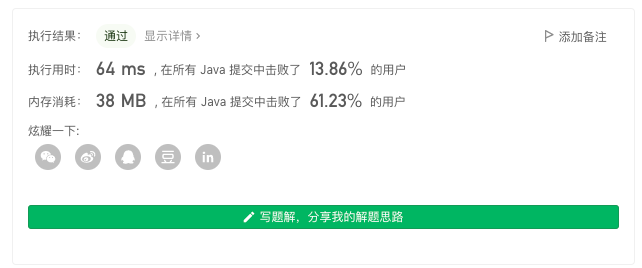

> 原文链接: https://leetcode-cn.com/problems/maximum-length-of-a-concatenated-string-with-unique-characters


## 英文原文
<div><p>You are given an array of strings <code>arr</code>. A string <code>s</code> is formed by the <strong>concatenation</strong> of a <strong>subsequence</strong> of <code>arr</code> that has <strong>unique characters</strong>.</p>

<p>Return <em>the <strong>maximum</strong> possible length</em> of <code>s</code>.</p>

<p>A <strong>subsequence</strong> is an array that can be derived from another array by deleting some or no elements without changing the order of the remaining elements.</p>

<p>&nbsp;</p>
<p><strong>Example 1:</strong></p>

<pre>
<strong>Input:</strong> arr = [&quot;un&quot;,&quot;iq&quot;,&quot;ue&quot;]
<strong>Output:</strong> 4
<strong>Explanation:</strong> All the valid concatenations are:
- &quot;&quot;
- &quot;un&quot;
- &quot;iq&quot;
- &quot;ue&quot;
- &quot;uniq&quot; (&quot;un&quot; + &quot;iq&quot;)
- &quot;ique&quot; (&quot;iq&quot; + &quot;ue&quot;)
Maximum length is 4.
</pre>

<p><strong>Example 2:</strong></p>

<pre>
<strong>Input:</strong> arr = [&quot;cha&quot;,&quot;r&quot;,&quot;act&quot;,&quot;ers&quot;]
<strong>Output:</strong> 6
<strong>Explanation:</strong> Possible longest valid concatenations are &quot;chaers&quot; (&quot;cha&quot; + &quot;ers&quot;) and &quot;acters&quot; (&quot;act&quot; + &quot;ers&quot;).
</pre>

<p><strong>Example 3:</strong></p>

<pre>
<strong>Input:</strong> arr = [&quot;abcdefghijklmnopqrstuvwxyz&quot;]
<strong>Output:</strong> 26
<strong>Explanation:</strong> The only string in arr has all 26 characters.
</pre>

<p><strong>Example 4:</strong></p>

<pre>
<strong>Input:</strong> arr = [&quot;aa&quot;,&quot;bb&quot;]
<strong>Output:</strong> 0
<strong>Explanation:</strong> Both strings in arr do not have unique characters, thus there are no valid concatenations.
</pre>

<p>&nbsp;</p>
<p><strong>Constraints:</strong></p>

<ul>
	<li><code>1 &lt;= arr.length &lt;= 16</code></li>
	<li><code>1 &lt;= arr[i].length &lt;= 26</code></li>
	<li><code>arr[i]</code> contains only lowercase English letters.</li>
</ul>
</div>

## 中文题目
<div><p>给定一个字符串数组 <code>arr</code>，字符串 <code>s</code> 是将 <code>arr</code> 某一子序列字符串连接所得的字符串，如果 <code>s</code> 中的每一个字符都只出现过一次，那么它就是一个可行解。</p>

<p>请返回所有可行解 <code>s</code> 中最长长度。</p>

<p>&nbsp;</p>

<p><strong>示例 1：</strong></p>

<pre><strong>输入：</strong>arr = [&quot;un&quot;,&quot;iq&quot;,&quot;ue&quot;]
<strong>输出：</strong>4
<strong>解释：</strong>所有可能的串联组合是 &quot;&quot;,&quot;un&quot;,&quot;iq&quot;,&quot;ue&quot;,&quot;uniq&quot; 和 &quot;ique&quot;，最大长度为 4。
</pre>

<p><strong>示例 2：</strong></p>

<pre><strong>输入：</strong>arr = [&quot;cha&quot;,&quot;r&quot;,&quot;act&quot;,&quot;ers&quot;]
<strong>输出：</strong>6
<strong>解释：</strong>可能的解答有 &quot;chaers&quot; 和 &quot;acters&quot;。
</pre>

<p><strong>示例 3：</strong></p>

<pre><strong>输入：</strong>arr = [&quot;abcdefghijklmnopqrstuvwxyz&quot;]
<strong>输出：</strong>26
</pre>

<p>&nbsp;</p>

<p><strong>提示：</strong></p>

<ul>
	<li><code>1 &lt;= arr.length &lt;= 16</code></li>
	<li><code>1 &lt;= arr[i].length &lt;= 26</code></li>
	<li><code>arr[i]</code>&nbsp;中只含有小写英文字母</li>
</ul>
</div>

## 通过代码
<RecoDemo>
</RecoDemo>


## 高赞题解
### 基本分析

根据题意，可以将本题看做一类特殊的「数独问题」：在给定的 `arr` 字符数组中选择，尽可能多的覆盖一个 $1 * 26$ 的矩阵。

对于此类「精确覆盖」问题，换个角度也可以看做「组合问题」。

通常有几种做法：`DFS`、剪枝 `DFS`、二进制枚举、模拟退火、`DLX`。

其中一头一尾解法过于简单和困难，有兴趣的同学自行了解与实现。

---

### 剪枝 DFS

根据题意，可以有如下的剪枝策略：

1. 预处理掉「本身具有重复字符」的无效字符串，并去重；
2. 由于只关心某个字符是否出现，而不关心某个字符在原字符串的位置，因此可以将字符串使用 `int` 进行表示；
3. 由于使用 `int` 进行表示，因而可以使用「位运算」来判断某个字符是否可以被追加到当前状态中；
4. `DFS` 过程中维护一个 `total`，代表后续未经处理的字符串所剩余的“最大价值”是多少，从而实现剪枝；
5. 使用 `lowbit` 计算某个状态对应的字符长度是多少；
6. 使用「全局哈希表」记录某个状态对应的字符长度是多少（使用 `static` 修饰，确保某个状态在所有测试数据中只会被计算一次）；
7. 【未应用】由于存在第 $4$ 点这样的「更优性剪枝」，理论上我们可以根据「字符串所包含字符数量」进行从大到小排序，然后再进行 `DFS` 这样效果理论上会更好。想象一下如果存在一个包含所有字母的字符串，先选择该字符串，后续所有字符串将不能被添加，那么由它出发的分支数量为 $0$；而如果一个字符串只包含单个字母，先决策选择该字符串，那么由它出发的分支数量必然大于 $0$。但该策略实测效果不好，没有添加到代码中。


代码：
```Java []
class Solution {
    // 本来想使用如下逻辑将「所有可能用到的状态」打表，实现 O(1) 查询某个状态有多少个字符，但是被卡了
    // static int N = 26, M = (1 << N);
    // static int[] cnt = new int[M];
    // static {
    //     for (int i = 0; i < M; i++) {
    //         for (int j = 0; j < 26; j++) {
    //             if (((i >> j) & 1) == 1) cnt[i]++;
    //         }
    //     }
    // }

    static Map<Integer, Integer> map = new HashMap<>();
    int get(int cur) {
        if (map.containsKey(cur)) {
            return map.get(cur);
        }
        int ans = 0;
        for (int i = cur; i > 0; i -= lowbit(i)) ans++;
        map.put(cur, ans);
        return ans;
    }
    int lowbit(int x) {
        return x & -x;
    }

    int n;
    int ans = Integer.MIN_VALUE;
    int[] hash;
    public int maxLength(List<String> _ws) {
        n = _ws.size();
        HashSet<Integer> set = new HashSet<>();
        for (String s : _ws) {
            int val = 0;
            for (char c : s.toCharArray()) {
                int t = (int)(c - 'a');
                if (((val >> t) & 1) != 0) {
                    val = -1;
                    break;
                } 
                val |= (1 << t);
            }
            if (val != -1) set.add(val);
        }

        n = set.size();
        if (n == 0) return 0;
        hash = new int[n];

        int idx = 0;
        int total = 0;
        for (Integer i : set) {
            hash[idx++] = i;
            total |= i;
        }
        dfs(0, 0, total);
        return ans;
    }
    void dfs(int u, int cur, int total) {
        if (get(cur | total) <= ans) return;
        if (u == n) {
            ans = Math.max(ans, get(cur));
            return;
        }
        // 在原有基础上，选择该数字（如果可以）
        if ((hash[u] & cur) == 0) {
            dfs(u + 1, hash[u] | cur, total - (total & hash[u]));
        }
        // 不选择该数字
        dfs(u + 1, cur, total);
    }
}
```

---

### 二进制枚举

首先还是对所有字符串进行预处理。

然后使用「二进制枚举」的方式，枚举某个字符串是否被选择。

举个🌰，$(110)_{2}$ 代表选择前两个字符串，$(011)_{2}$ 代表选择后两个字符串，这样我们便可以枚举出所有组合方案。



代码：
```Java []
class Solution {
    static Map<Integer, Integer> map = new HashMap<>();
    int get(int cur) {
        if (map.containsKey(cur)) {
            return map.get(cur);
        }
        int ans = 0;
        for (int i = cur; i > 0; i -= lowbit(i)) ans++;
        map.put(cur, ans);
        return ans;
    }
    int lowbit(int x) {
        return x & -x;
    }

    int n;
    int ans = Integer.MIN_VALUE;
    Integer[] hash;
    public int maxLength(List<String> _ws) {
        n = _ws.size();
        HashSet<Integer> set = new HashSet<>();
        for (String s : _ws) {
            int val = 0;
            for (char c : s.toCharArray()) {
                int t = (int)(c - 'a');
                if (((val >> t) & 1) != 0) {
                    val = -1;
                    break;
                } 
                val |= (1 << t);
            }
            if (val != -1) set.add(val);
        }

        n = set.size();
        if (n == 0) return 0;
        hash = new Integer[n];
        int idx = 0;
        for (Integer i : set) hash[idx++] = i;

        for (int i = 0; i < (1 << n); i++) {
            int cur = 0, val = 0;
            for (int j = 0; j < n; j++) {
                if (((i >> j) & 1) == 1) {
                    if ((cur & hash[j]) == 0) {
                        cur |= hash[j];
                        val += get(hash[j]);
                    } else {
                        cur = -1;
                        break;
                    }
                }
            }
            if (cur != -1) ans = Math.max(ans, val);
        }
        return ans;
    }
}
```

---

### 模拟退火

事实上，可以将原问题看作求「最优前缀序列」问题，从而使用「模拟退火」进行求解。

具体的，我们可以定义「最优前缀序列」为 **组成最优解所用到的字符串均出现在排列的前面。**

举个🌰，假如构成最优解使用到的字符串集合为 `[a,b,c]`，那么对应 `[a,b,c,...]`、`[a,c,b,...]` 均称为「最优前缀序列」。

不难发现，答案与最优前缀序列是一对多关系，这指导我们可以将「参数」调得宽松一些。

**具有「一对多」关系的问题十分适合使用「模拟退火」，使用「模拟退火」可以轻松将本题 `arr.length` 数据范围上升到 $60$ 甚至以上（非严谨计算，只是以前见过数据范围大到只能使用「模拟退火」**

调整成比较宽松的参数可以跑赢「二进制枚举」，但为了以后增加数据不容易被 hack，还是使用 `N=400` & `fa=0.90` 的搭配。

「模拟退火」的几个参数的作用在 [这里](https://leetcode-cn.com/problems/find-minimum-time-to-finish-all-jobs/solution/gong-shui-san-xie-yi-ti-shuang-jie-jian-4epdd/) 说过了，不再赘述。


代码：
```Java []
class Solution {
    static Map<Integer, Integer> map = new HashMap<>();
    int get(int cur) {
        if (map.containsKey(cur)) {
            return map.get(cur);
        }
        int ans = 0;
        for (int i = cur; i > 0; i -= lowbit(i)) ans++;
        map.put(cur, ans);
        return ans;
    }
    int lowbit(int x) {
        return x & -x;
    }

    int n;
    int ans = Integer.MIN_VALUE;    
    Random random = new Random(20210619);
    double hi = 1e4, lo = 1e-4, fa = 0.90; 
    int N = 400; 
    int calc() {
        int mix = 0, cur = 0;
        for (int i = 0; i < n; i++) {
            int hash = ws[i];
            if ((mix & hash) == 0) {
                mix |= hash;
                cur += get(hash);
            } else {
                break;
            }
        }
        ans = Math.max(ans, cur);
        return cur;
    }
    void swap(int[] arr, int i, int j) {
        int c = arr[i];
        arr[i] = arr[j];
        arr[j] = c;
    }
    void sa() {
        for (double t = hi; t > lo; t *= fa) {
            int a = random.nextInt(n), b = random.nextInt(n);
            int prev = calc(); 
            swap(ws, a, b);
            int cur = calc(); 
            int diff = prev - cur;
            if (Math.log(diff / t) >= random.nextDouble()) { 
                swap(ws, a, b);
            }
        }
    }
    int[] ws;
    public int maxLength(List<String> _ws) {
        // 预处理字符串：去重，剔除无效字符
        // 结果这一步后：N 可以下降到 100；fa 可以下降到 0.70，耗时约为 78 ms
        // 为了预留将来添加测试数据，题解还是保持 N = 400 & fa = 0.90 的配置
        n = _ws.size();
        HashSet<Integer> set = new HashSet<>();
        for (String s : _ws) {
            int val = 0;
            for (char c : s.toCharArray()) {
                int t = (int)(c - 'a');
                if (((val >> t) & 1) != 0) {
                    val = -1;
                    break;
                } 
                val |= (1 << t);
            }
            if (val != -1) set.add(val);
        }

        n = set.size();
        if (n == 0) return 0;
        ws = new int[n];
        int idx = 0;
        for (Integer i : set) ws[idx++] = i;

        while (N-- > 0) sa();
        return ans;
    }
}
```

---

## 最后

**如果有帮助到你，请给题解点个赞和收藏，让更多的人看到 ~ ("▔□▔)/**

也欢迎你 [关注我](https://oscimg.oschina.net/oscnet/up-19688dc1af05cf8bdea43b2a863038ab9e5.png)（公主号后台回复「送书」即可参与长期看题解学算法送实体书活动）或 加入[「组队打卡」](https://leetcode-cn.com/u/ac_oier/)小群 ，提供写「证明」&「思路」的高质量题解。

所有题解已经加入 [刷题指南](https://github.com/SharingSource/LogicStack-LeetCode/wiki)，欢迎 star 哦 ~ 

## 统计信息
| 通过次数 | 提交次数 | AC比率 |
| :------: | :------: | :------: |
|    35435    |    72164    |   49.1%   |

## 提交历史
| 提交时间 | 提交结果 | 执行时间 |  内存消耗  | 语言 |
| :------: | :------: | :------: | :--------: | :--------: |
