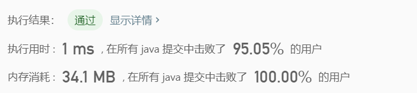
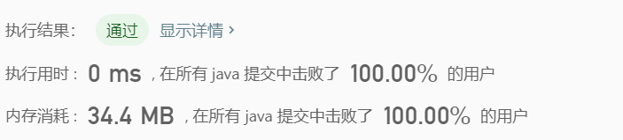

> 原文链接: https://leetcode-cn.com/problems/minimum-swaps-to-make-strings-equal


## 英文原文
<div><p>You are given two strings <code>s1</code> and <code>s2</code> of equal length consisting of letters <code>&quot;x&quot;</code> and <code>&quot;y&quot;</code> <strong>only</strong>. Your task is to make these two strings equal to each other. You can swap any two characters that belong to <strong>different</strong> strings, which means: swap <code>s1[i]</code> and <code>s2[j]</code>.</p>

<p>Return the minimum number of swaps required to make <code>s1</code> and <code>s2</code> equal, or return <code>-1</code> if it is impossible to do so.</p>

<p>&nbsp;</p>
<p><strong>Example 1:</strong></p>

<pre>
<strong>Input:</strong> s1 = &quot;xx&quot;, s2 = &quot;yy&quot;
<strong>Output:</strong> 1
<strong>Explanation: 
</strong>Swap s1[0] and s2[1], s1 = &quot;yx&quot;, s2 = &quot;yx&quot;.</pre>

<p><strong>Example 2:</strong></p>

<pre>
<strong>Input:</strong> s1 = &quot;xy&quot;, s2 = &quot;yx&quot;
<strong>Output:</strong> 2
<strong>Explanation: 
</strong>Swap s1[0] and s2[0], s1 = &quot;yy&quot;, s2 = &quot;xx&quot;.
Swap s1[0] and s2[1], s1 = &quot;xy&quot;, s2 = &quot;xy&quot;.
Note that you can&#39;t swap s1[0] and s1[1] to make s1 equal to &quot;yx&quot;, cause we can only swap chars in different strings.</pre>

<p><strong>Example 3:</strong></p>

<pre>
<strong>Input:</strong> s1 = &quot;xx&quot;, s2 = &quot;xy&quot;
<strong>Output:</strong> -1
</pre>

<p><strong>Example 4:</strong></p>

<pre>
<strong>Input:</strong> s1 = &quot;xxyyxyxyxx&quot;, s2 = &quot;xyyxyxxxyx&quot;
<strong>Output:</strong> 4
</pre>

<p>&nbsp;</p>
<p><strong>Constraints:</strong></p>

<ul>
	<li><code>1 &lt;= s1.length, s2.length &lt;= 1000</code></li>
	<li><code>s1, s2</code> only contain <code>&#39;x&#39;</code> or <code>&#39;y&#39;</code>.</li>
</ul>
</div>

## 中文题目
<div><p>有两个长度相同的字符串&nbsp;<code>s1</code> 和&nbsp;<code>s2</code>，且它们其中&nbsp;<strong>只含有</strong>&nbsp;字符&nbsp;<code>&quot;x&quot;</code> 和&nbsp;<code>&quot;y&quot;</code>，你需要通过「交换字符」的方式使这两个字符串相同。</p>

<p>每次「交换字符」的时候，你都可以在两个字符串中各选一个字符进行交换。</p>

<p>交换只能发生在两个不同的字符串之间，绝对不能发生在同一个字符串内部。也就是说，我们可以交换&nbsp;<code>s1[i]</code> 和&nbsp;<code>s2[j]</code>，但不能交换&nbsp;<code>s1[i]</code> 和&nbsp;<code>s1[j]</code>。</p>

<p>最后，请你返回使 <code>s1</code> 和 <code>s2</code> 相同的最小交换次数，如果没有方法能够使得这两个字符串相同，则返回&nbsp;<code>-1</code> 。</p>

<p>&nbsp;</p>

<p><strong>示例 1：</strong></p>

<pre><strong>输入：</strong>s1 = &quot;xx&quot;, s2 = &quot;yy&quot;
<strong>输出：</strong>1
<strong>解释：
</strong>交换 s1[0] 和 s2[1]，得到 s1 = &quot;yx&quot;，s2 = &quot;yx&quot;。</pre>

<p><strong>示例 2：</strong></p>

<pre><strong>输入：</strong>s1 = &quot;xy&quot;, s2 = &quot;yx&quot;
<strong>输出：</strong>2
<strong>解释：
</strong>交换 s1[0] 和 s2[0]，得到 s1 = &quot;yy&quot;，s2 = &quot;xx&quot; 。
交换 s1[0] 和 s2[1]，得到 s1 = &quot;xy&quot;，s2 = &quot;xy&quot; 。
注意，你不能交换 s1[0] 和 s1[1] 使得 s1 变成 &quot;yx&quot;，因为我们只能交换属于两个不同字符串的字符。</pre>

<p><strong>示例 3：</strong></p>

<pre><strong>输入：</strong>s1 = &quot;xx&quot;, s2 = &quot;xy&quot;
<strong>输出：</strong>-1
</pre>

<p><strong>示例 4：</strong></p>

<pre><strong>输入：</strong>s1 = &quot;xxyyxyxyxx&quot;, s2 = &quot;xyyxyxxxyx&quot;
<strong>输出：</strong>4
</pre>

<p>&nbsp;</p>

<p><strong>提示：</strong></p>

<ul>
	<li><code>1 &lt;= s1.length, s2.length &lt;= 1000</code></li>
	<li><code>s1, s2</code>&nbsp;只包含&nbsp;<code>&#39;x&#39;</code>&nbsp;或&nbsp;<code>&#39;y&#39;</code>。</li>
</ul>
</div>

## 通过代码
<RecoDemo>
</RecoDemo>


## 高赞题解
### 1. 题目分析
- 第一步：普遍规律
    由于要求**交换次数尽量少**，故：
    - 本来相同位置就有相同的字符，不需要交换。
    - 本来相同位置字符不同，需要交换。交换为**两组字符交换**，本质上只有两种情形：<br>
        (a)  2组相同(2组`xy`或2组`yx`，等价于示例1)：
            此时，`s1[0]`与`s2[1]`交换即可，需要进行$1$次交换
        (b)  2组不同(1组`xy`，1组`yx`，等价于示例2)：
            此时，将`s1[0]`与`s2[0]`交换后与a)相同，需要进行$2$次交换
        <br>综上所述，我们可以得出如下结论：
        -  `xy`与`yx`的组数之和必须为偶数，否则返回`-1`(**两两交换**)
        -  优先进行(a)类交换，剩余的进行(b)类交换(**贪心算法**)
- 第二步：得出结论
    由于匹配是两两进行，因此，在确定有$M$对`xy`，$N$对`yx`，且$M+N$为偶数后：
    - 若$M$为偶数，则$N$也为偶数，则**全部为(a)类交换**。总匹配数为：
        $$\frac{M + N}{2}$$
    - 若$M$为奇数，则$N$也为奇数，则**各拿一组进行(b)类交换，其余(a)类交换**。总匹配数为：
        $$\frac{M - 1}{2} + \frac{N - 1}{2} + 2 = \frac{M + N}{2} + 1$$
	- 两者均可写作：
		$$\frac{M + 1}{2} + \frac{N + 1}{2}$$

### 2. Coding
```java
public int minimumSwap(String s1, String s2) {
    int len = s1.length(), xy = 0, yx = 0;
    for(int i = 0; i < len; i ++) {
        if(s1.charAt(i) == s2.charAt(i)) {
            continue;
        }
        else if(s1.charAt(i) == 120) {
            xy ++;
        }
        else {
            yx ++;
        }
    }
    return ((xy + yx) & 1) == 1 ? -1 : (xy + 1) / 2 + (yx + 1) / 2;
}
```
时间复杂度：$O(n)$，空间复杂度：$O(1)$
<br>注1：代码中判断是否为奇数的方法经常会用到，也可以将其抽取为一个方法进行调用：
```
private boolean isOdd(int t) {
    return (t & 1) == 1;
}
```
注2：上面的代码执行的结果为1ms，使用`toCharArray()`方法代替`charAt()`方法，可以实现0ms
```java
public int minimumSwap(String s1, String s2) {
    int len = s1.length(), xy = 0, yx = 0;
    char[] cs1 = s1.toCharArray();
    char[] cs2 = s2.toCharArray();
    for(int i = 0; i < len; i ++) {
        if(cs1[i] == cs2[i]) {
            continue;
        }
        else if(cs1[i] == 120) {
            xy ++;
        }
        else {
            yx ++;
        }
    }
    return ((xy + yx) & 1) == 1 ? -1 : (xy + 1) / 2 + (yx + 1) / 2;
}
```
此时，时间复杂度：$O(n)$，空间复杂度：$O(n)$
### 3. 执行结果
- 方法一

- 方法二



## 统计信息
| 通过次数 | 提交次数 | AC比率 |
| :------: | :------: | :------: |
|    9325    |    15031    |   62.0%   |

## 提交历史
| 提交时间 | 提交结果 | 执行时间 |  内存消耗  | 语言 |
| :------: | :------: | :------: | :--------: | :--------: |
