> 原文链接: https://leetcode-cn.com/problems/minimum-remove-to-make-valid-parentheses


## 英文原文
<div><p>Given a string <font face="monospace">s</font> of <code>&#39;(&#39;</code> , <code>&#39;)&#39;</code> and lowercase English characters.</p>

<p>Your task is to remove the minimum number of parentheses ( <code>&#39;(&#39;</code> or <code>&#39;)&#39;</code>, in any positions ) so that the resulting <em>parentheses string</em> is valid and return <strong>any</strong> valid string.</p>

<p>Formally, a <em>parentheses string</em> is valid if and only if:</p>

<ul>
	<li>It is the empty string, contains only lowercase characters, or</li>
	<li>It can be written as <code>AB</code> (<code>A</code> concatenated with <code>B</code>), where <code>A</code> and <code>B</code> are valid strings, or</li>
	<li>It can be written as <code>(A)</code>, where <code>A</code> is a valid string.</li>
</ul>

<p>&nbsp;</p>
<p><strong>Example 1:</strong></p>

<pre>
<strong>Input:</strong> s = &quot;lee(t(c)o)de)&quot;
<strong>Output:</strong> &quot;lee(t(c)o)de&quot;
<strong>Explanation:</strong> &quot;lee(t(co)de)&quot; , &quot;lee(t(c)ode)&quot; would also be accepted.
</pre>

<p><strong>Example 2:</strong></p>

<pre>
<strong>Input:</strong> s = &quot;a)b(c)d&quot;
<strong>Output:</strong> &quot;ab(c)d&quot;
</pre>

<p><strong>Example 3:</strong></p>

<pre>
<strong>Input:</strong> s = &quot;))((&quot;
<strong>Output:</strong> &quot;&quot;
<strong>Explanation:</strong> An empty string is also valid.
</pre>

<p><strong>Example 4:</strong></p>

<pre>
<strong>Input:</strong> s = &quot;(a(b(c)d)&quot;
<strong>Output:</strong> &quot;a(b(c)d)&quot;
</pre>

<p>&nbsp;</p>
<p><strong>Constraints:</strong></p>

<ul>
	<li><code>1 &lt;= s.length &lt;= 10<sup>5</sup></code></li>
	<li><code>s[i]</code> is either<code>&#39;(&#39;</code> , <code>&#39;)&#39;</code>, or lowercase English letter<code>.</code></li>
</ul>
</div>

## 中文题目
<div><p>给你一个由 <code>&#39;(&#39;</code>、<code>&#39;)&#39;</code> 和小写字母组成的字符串 <code>s</code>。</p>

<p>你需要从字符串中删除最少数目的 <code>&#39;(&#39;</code> 或者 <code>&#39;)&#39;</code>&nbsp;（可以删除任意位置的括号)，使得剩下的「括号字符串」有效。</p>

<p>请返回任意一个合法字符串。</p>

<p>有效「括号字符串」应当符合以下&nbsp;<strong>任意一条&nbsp;</strong>要求：</p>

<ul>
	<li>空字符串或只包含小写字母的字符串</li>
	<li>可以被写作&nbsp;<code>AB</code>（<code>A</code>&nbsp;连接&nbsp;<code>B</code>）的字符串，其中&nbsp;<code>A</code>&nbsp;和&nbsp;<code>B</code>&nbsp;都是有效「括号字符串」</li>
	<li>可以被写作&nbsp;<code>(A)</code>&nbsp;的字符串，其中&nbsp;<code>A</code>&nbsp;是一个有效的「括号字符串」</li>
</ul>

<p>&nbsp;</p>

<p><strong>示例 1：</strong></p>

<pre><strong>输入：</strong>s = &quot;lee(t(c)o)de)&quot;
<strong>输出：</strong>&quot;lee(t(c)o)de&quot;
<strong>解释：</strong>&quot;lee(t(co)de)&quot; , &quot;lee(t(c)ode)&quot; 也是一个可行答案。
</pre>

<p><strong>示例 2：</strong></p>

<pre><strong>输入：</strong>s = &quot;a)b(c)d&quot;
<strong>输出：</strong>&quot;ab(c)d&quot;
</pre>

<p><strong>示例 3：</strong></p>

<pre><strong>输入：</strong>s = &quot;))((&quot;
<strong>输出：</strong>&quot;&quot;
<strong>解释：</strong>空字符串也是有效的
</pre>

<p><strong>示例 4：</strong></p>

<pre><strong>输入：</strong>s = &quot;(a(b(c)d)&quot;
<strong>输出：</strong>&quot;a(b(c)d)&quot;
</pre>

<p>&nbsp;</p>

<p><strong>提示：</strong></p>

<ul>
	<li><code>1 &lt;= s.length &lt;= 10^5</code></li>
	<li><code>s[i]</code>&nbsp;可能是&nbsp;<code>&#39;(&#39;</code>、<code>&#39;)&#39;</code>&nbsp;或英文小写字母</li>
</ul>
</div>

## 通过代码
<RecoDemo>
</RecoDemo>


## 官方题解
#### 方法一：使用栈和 StringBuilder

**思路**

首先分析 *有效* 字符串的含义。

*当且仅当* 满足以下条件时，字符串中的括号是平衡的：

1. 字符串中有相同数量的 `"("` 和 `")"`。
2. 从左至右遍历字符串，统计当前 `"("` 和 `")"` 的数量，永远不会出现 `")"` 的数量大于 `"("` 的数量，称 `count("(") - count(")")` 为字符串的余量。

这是一段简单的伪代码，从左向右扫描字符串，每次遇到 `"("` 时，余量递增，遇到 `")"` 时，余量递减。在任何时候如果余量为负（`")"` 的数量多于 `"("`），则返回 `false`。如果扫描到字符串末尾时余量为 0，说明 `")"` 的数量等于 `"("` 的数量，返回 `true`。

``` python [snippet1-Python]
function is_balanced_parentheses(string)
    balance = 0
    for each char in the string
        if char == "("
            balance = balance + 1
        if char == ")"
            balance = balance - 1
        if balance < 0
            return false
    return balance == 0
```

例如，`"L(ee)(t(()co)d)e"` 是一个 *平衡* 的字符串。下图展示该字符串的余量变化情况。

{:width=500}

字符串 `"L(e)e(t)c)o)(d)e"` 是无效的，因为 *余量变为负数*。

{:width=500}

字符串 `"L(e)e(t()c(o(d)e"` 是无效的，因为扫描到字符串末尾时，余量等于 1，而不是 0。

{:width=500}

该问题要求删除最少括号，使得字符串有效。如何实现该目标？对于初学者，需要知道在删除任意个 `")"` 后，使得余量为 0。不删除 `")"` 是不可能的，因为可能在 `")"` 之前没有足够的 `"("` 与之匹配。

以上面第二个例子为例，删除 `")"` 后，余量变为负数。

{:width=500}

因为现在余量以 0 结束，所以字符串是有效的。

但这不是完整的解法。例如从字符串 `"L(e)))et((co)d(e"` 中删除所有导致余量为负的 `")"`，但余量 *最终仍然非零*。

{:width=500}

存在 `"("` 没有 `")"` 与之匹配时，最终余量非零。显然，需要删除一些 `"("` 使余量减少到 0。但是应该删除哪个？如果随机选择两个 `"("` 会怎样？

这是上面的字符串，随机选择 2 个 `"("` 删除，检查新字符串的余量。

{:width=500}

再次检查时，发现余量仍然为负。即使字符串中具有相同数量的 `"("` 和 `")"`，但是最后一个 `")"` 位于最后一个 `"("` 之前，还是不匹配。我们不想再删除一轮括号，因为这不是最少删除方法。实际上，我们应该确定哪个 `"("` 与哪个 `")"` 匹配。这里用不同的颜色显示每一对括号，其中 `")"` 总是与它 *最接近* 的 `"("` 的匹配。


{:width=500}

应该删除两个没有匹配的 `"("`。这样余量不会成为负数。

应该让每个 `")"` 都与离它最近且尚未匹配的 `"("` 匹配。如何在代码中做到这一点？需要知道未匹配的 `"("` 的索引。

使用 *栈*，每次遇到 `"("`，都将它的索引压入栈中。每次遇到 `")"`，都从栈中移除一个索引，用该 `")"` 与栈顶的 `"("` 匹配。栈的深度等于余量。需要执行以下操作：

1. 如果在栈为空时遇到 `")"`，则删除该 `")"`，防止余量为负。
2. 如果扫描到字符串结尾有 `"("`，则删除它，防止余量不为 0。

这是一个使用栈修复字符串的过程。

<,,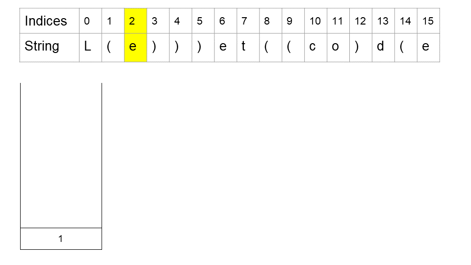,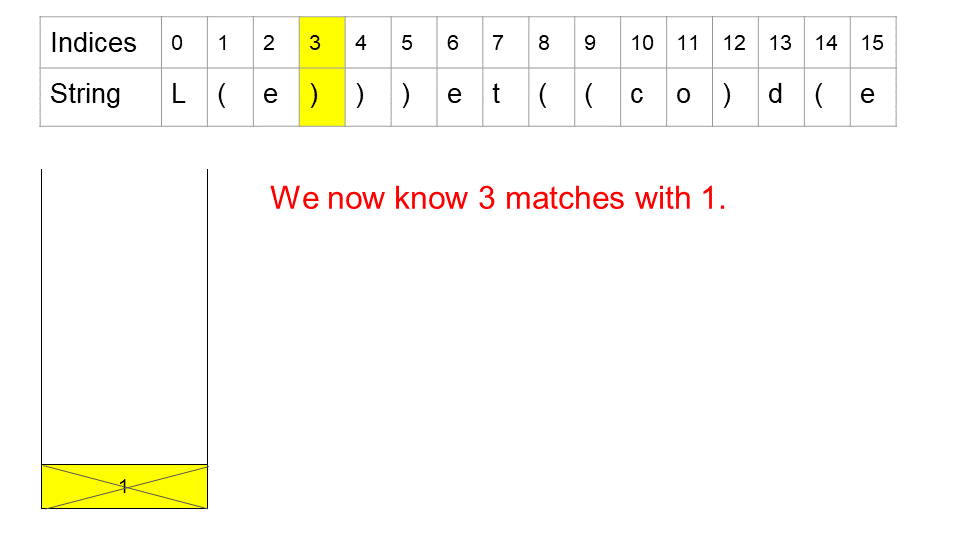,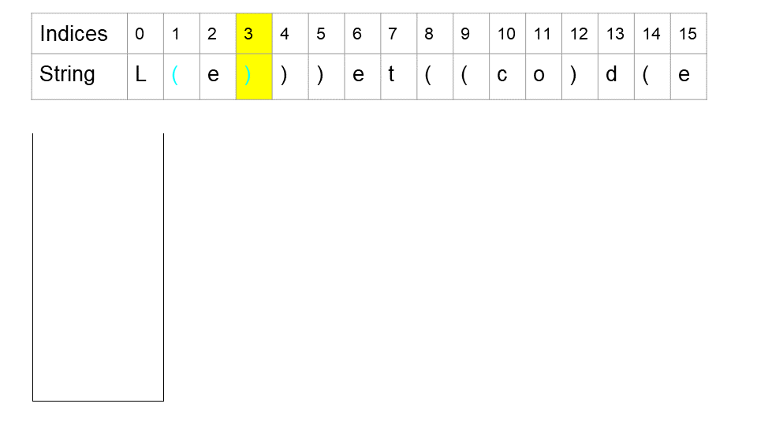,,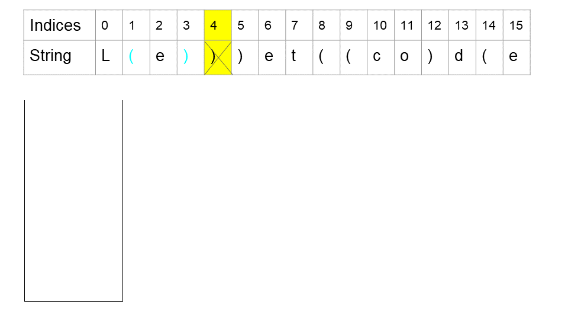,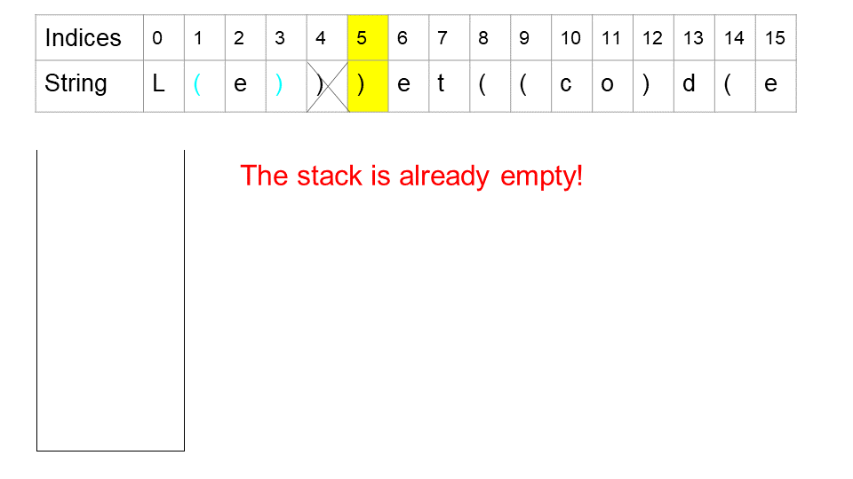,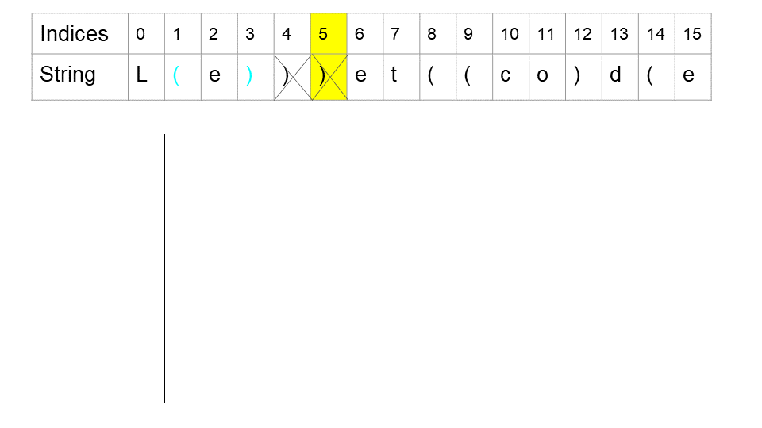,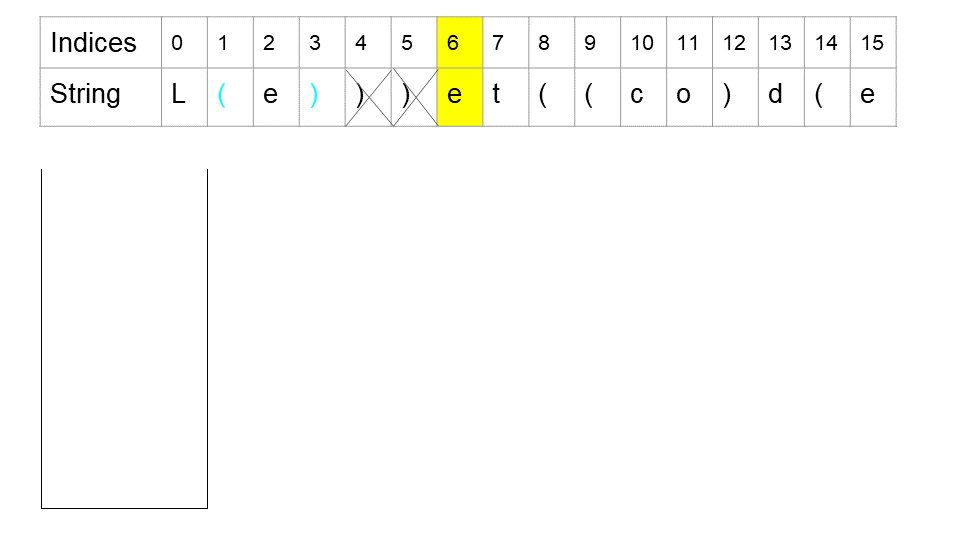,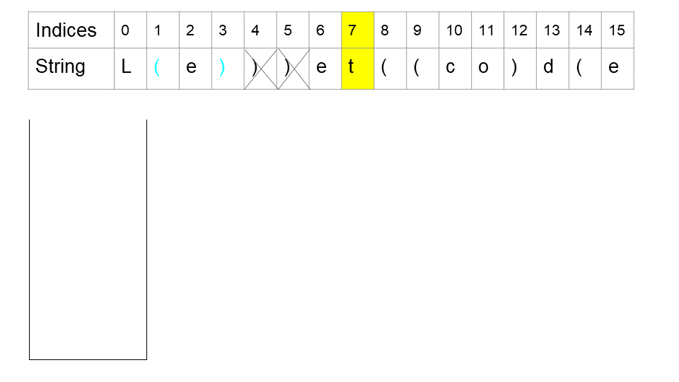,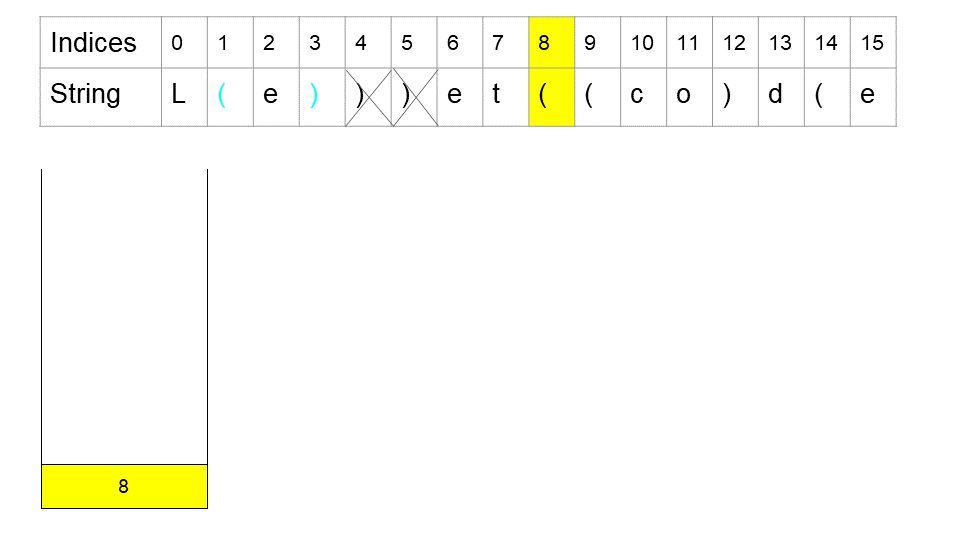,,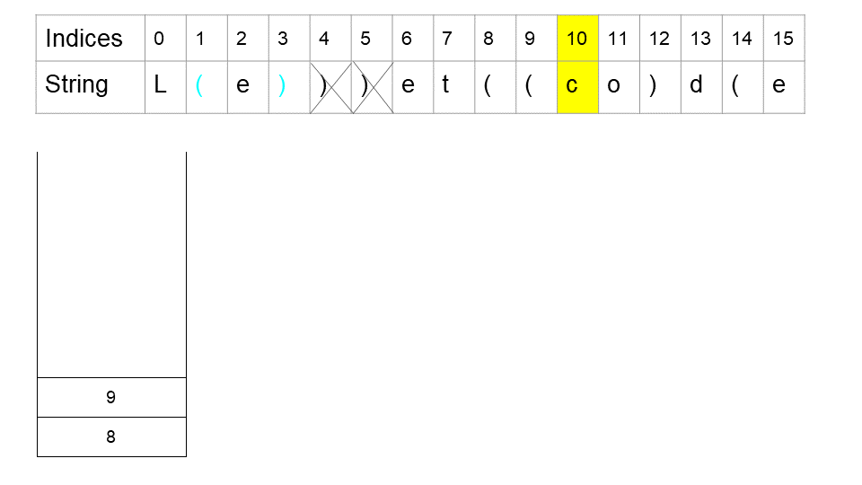,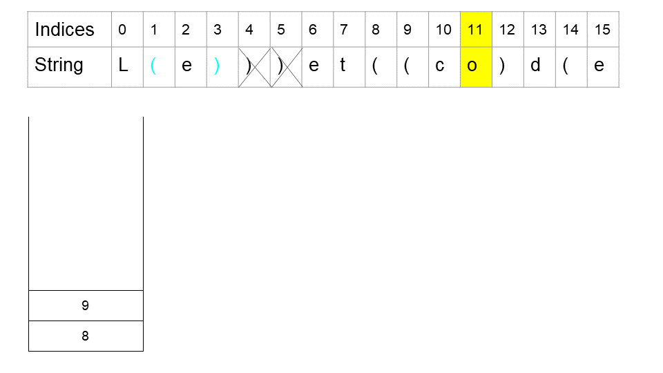,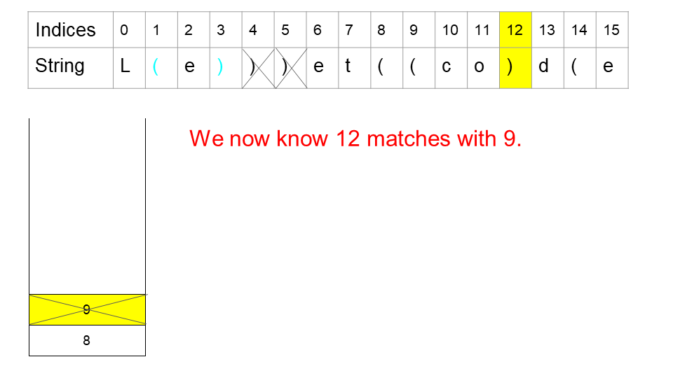,,,,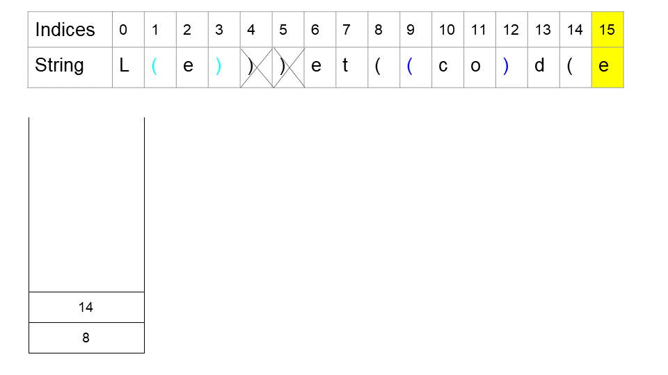,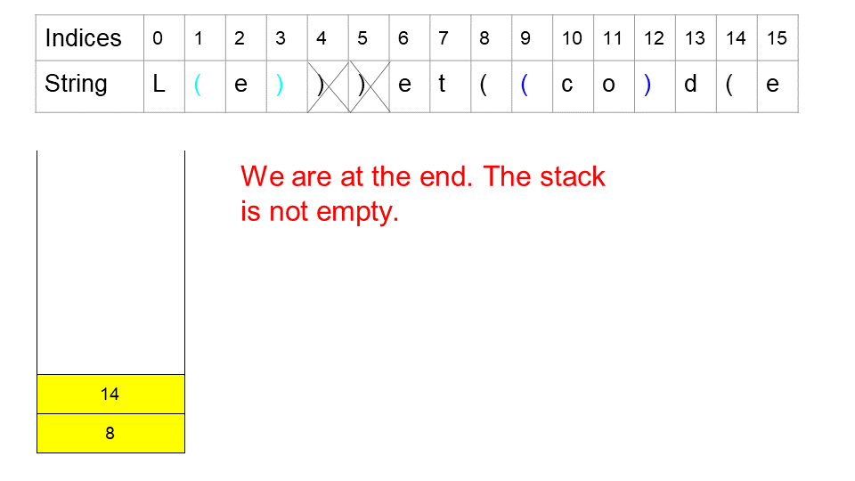,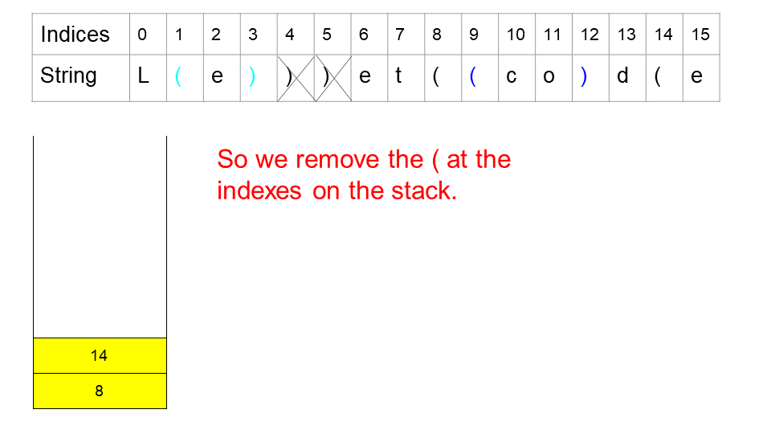,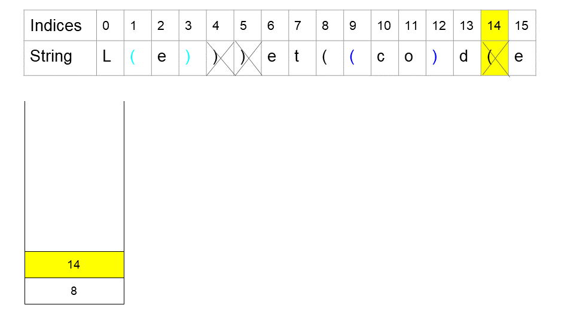,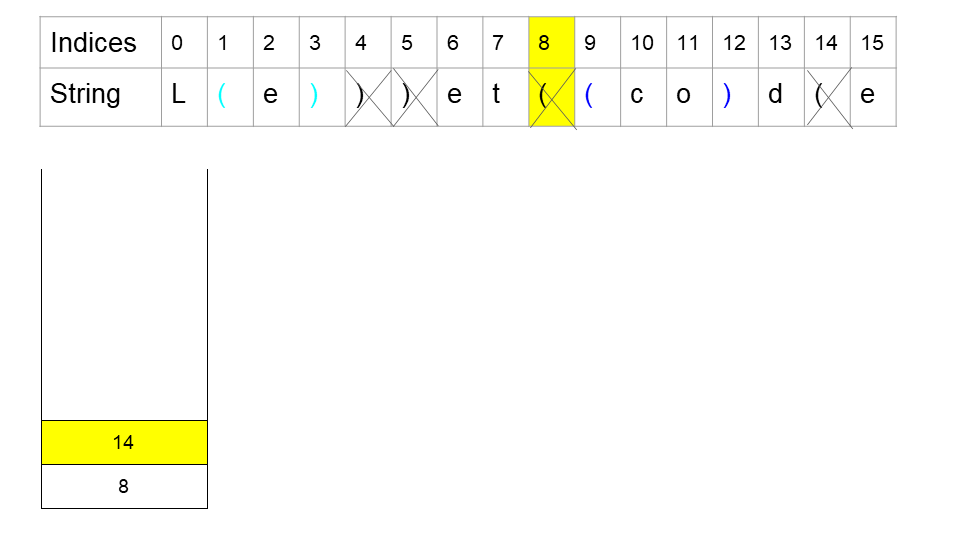,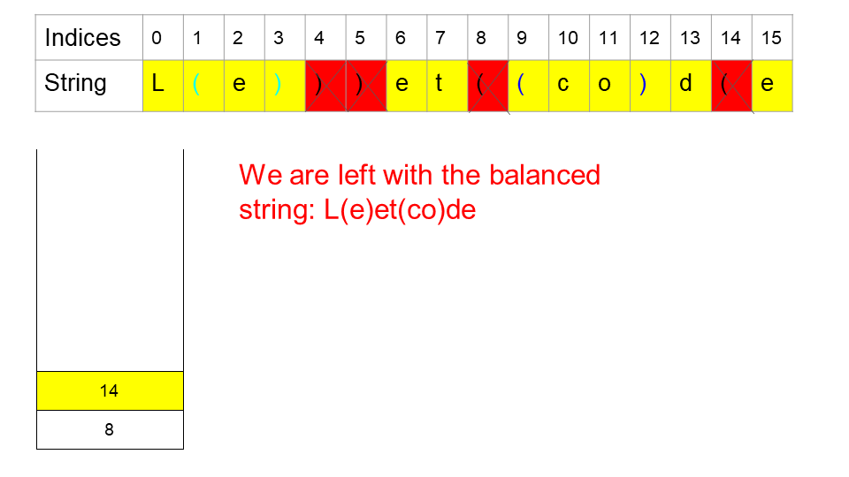>

这种贪心方法是否安全，即为什么不删除前面的 `")"`？可以这样做，但是不，因为这不会对删除的 `")"` 总数有任何影响。

删除无效的 `")"` 后，`"("` 的数量是确保满足 `count("(") == count(")")` 的最小值。

**算法**

将思路的所有内容转换为两步算法：

1. 确定所有需要删除字符的索引。
2. 根据删除字符的索引创建一个新字符串。

如上所述，使用 **栈** 存储所有 `"("` 的索引。扫描到字符串末尾时，栈中剩余的所有索引都是没有匹配的 `"("`。还需要使用一个 **集合** 跟踪不匹配的 `")"`。然后根据索引删除每个需要删除的字符，返回重新创建的字符串。

尽管可以在 $O(n)$ 的时间内完成删除操作，但是必须小心，因为一些意外情况会导致 $O(n^2)$。如果在面试中出现这些错误非常不好。一些 $O(n)$ 的操作有时也会被误认为是 $O(1)$。

- 在 **字符串** 的 **任意一个位置** 添加、删除或更改一个字符的操作都是 $O(n)$ 的，因为 String 是 **不可变的**。每次修改整个字符串都会重建。

- 从 *list，vector，array* 的非最后一个位置添加或删除元素也是 $O(n)$ 的，因为在其他索引操作需要创建新的空间或者填充空间。

- 检查一个元素是否在 list 中，常使用 **线性查找**，即使二分查找也要 $O(\log n)$ 的复杂度，这并不是理想的效率。

一种安全策略是遍历字符串，然后将要保留的字符插入到 **list**（Python）或 **StringBuilder**（Java）中。遍历完所有字符后，只需要一步 $O(n)$ 的操作将其转换为字符串。

检查某个元素是否在 **集合** 中需要 $O(1)$。如果需要删除的所有索引都在集合中，那么可以遍历字符串的每个索引，检查当前索引是否在集合中。如果不是，则将该索引处的字符添加到 StringBuilder 中。

```java [solution1-Java]
class Solution {
    public String minRemoveToMakeValid(String s) {
        Set<Integer> indexesToRemove = new HashSet<>();
        Stack<Integer> stack = new Stack<>();
        for (int i = 0; i < s.length(); i++) {
            if (s.charAt(i) == '(') {
                stack.push(i);
            } if (s.charAt(i) == ')') {
                if (stack.isEmpty()) {
                    indexesToRemove.add(i);
                } else {
                    stack.pop();
                }
            }
        }
        // Put any indexes remaining on stack into the set.
        while (!stack.isEmpty()) indexesToRemove.add(stack.pop());
        StringBuilder sb = new StringBuilder();
        for (int i = 0; i < s.length(); i++) {
            if (!indexesToRemove.contains(i)) {
                sb.append(s.charAt(i));
            }
        }
        return sb.toString();
    }
}
```

```python [solution1-Python]
def minRemoveToMakeValid(self, s: str) -> str:
    indexes_to_remove = set()
    stack = []
    for i, c in enumerate(s):
        if c not in "()":
            continue
        if c == "(":
            stack.append(i)
        elif not stack:
            indexes_to_remove.add(i)
        else:
            stack.pop()
    indexes_to_remove = indexes_to_remove.union(set(stack))
    string_builder = []
    for i, c in enumerate(s):
        if i not in indexes_to_remove:
            string_builder.append(c)
    return "".join(string_builder)
```

**复杂度分析**

* 时间复杂度：$O(n)$，其中 $n$ 是输入字符串的长度。

    需要分析 3 个循环，并检查所有不是恒定时间的库函数。  

    第一个循环遍历字符串。对于每个字符，要么什么都不做，要么压入栈或添加到集合。压入栈和添加到集合的复杂度都是 $O(1)$。因为对每个字符操作的复杂度都是 $O(1)$，所以操作整个字符串的复杂度为 $O(n)$。

    第二个循环（隐藏在 Python 的库函数调用中）从栈中弹出每个元素添加到集合中。同样，从栈中弹出一个元素的复杂度是 $O(1)$，栈中最多有 $n$ 个元素，因此复杂度也是 $O(n)$。

    第三个循环是再次遍历字符串，并把字符添加到 StringBuilder/list。检查每个字符是否在集合中，如果不在将它添加到 StringBuilder/list 末尾，这个操作是 $O(1)$ 的。总体是 $O(n)$。
    
方法 `StringBuilder.toString()` 和 `"".join(...)` 的复杂度都是 $O(n)$，一共是 $O(4n)$，因为 $4$ 是常数，所以是 $O(n)$。
   
* 空间复杂度：$O(n)$，其中 $n$ 是输入字符串的长度。

    使用的 **stack**，**set** 和 **StringBuilder**，每个最多存储 $n$ 个元素。因此总共也是 $O(n)$ 空间。

检查方法实现时，请注意循环内是否有 $O(n)$ 的方法调用，这可能会使复杂度达到 $O(n^2)$。


#### 方法二：使用 StringBuilder 的两步法

**思路**

从方法一中可知，根据栈中是否有可匹配的 `"("`，可以立即知道当前每个 `")"` 是否有效。但是无法立即知道每个 `"("` 是否有效，必须要等到字符串扫描结束，根据栈中是否有剩余的 `"("` 确定。可以在第一个循环中创建一个字符串，包含所有无效的 `")"`。这步操作具有 $O(n)$ 的复杂度。第一个循环已经解决了问题的一半。

回到上面的例子，首先删除所有有问题的 `")"`。

{:width=500}

完成第一步后，留下来的所有字符构成了新的字符串。

{:width=500}

反向扫描字符串，用相同的方法删除无效的 `"("`。最后反转字符串的顺序即可。

{:width=500}

删除无效的 `")"`，然后翻转字符串，再次扫描删除无效的 `"("`，就得到了最终结果。

{:width=500}

{:width=500}

**算法**

代码中，抽取这两步的共同操作创建一个方法，避免几乎相同的代码写两次。该方法输入一个字符串，一个“开放”括号，一个“关闭”括号，返回一个删除了所有无效“关闭”括号的新字符串。第二步操作中，为该方法传入一个翻转后的字符串和相反的“开放”括号和“关闭”括号。

```java [solution2-Java]
class Solution {

    private StringBuilder removeInvalidClosing(CharSequence string, char open, char close) {
        StringBuilder sb = new StringBuilder();
        int balance = 0;
        for (int i = 0; i < string.length(); i++) {
            char c = string.charAt(i);
            if (c == open) {
                balance++;
            } if (c == close) {
                if (balance == 0) continue;
                balance--;
            }
            sb.append(c);
        }  
        return sb;
    }

    public String minRemoveToMakeValid(String s) {
        StringBuilder result = removeInvalidClosing(s, '(', ')');
        result = removeInvalidClosing(result.reverse(), ')', '(');
        return result.reverse().toString();
    }
}
```

```python [solution2-Python]
def minRemoveToMakeValid(self, s: str) -> str:

    def delete_invalid_closing(string, open_symbol, close_symbol):
        sb = []
        balance = 0
        for c in string:
            if c == open_symbol:
                balance += 1
            if c == close_symbol:
                if balance == 0:
                    continue
                balance -= 1
            sb.append(c)
        return "".join(sb)

    # Note that s[::-1] gets the reverse of s.
    s = delete_invalid_closing(s, "(", ")")
    print(s)
    s = delete_invalid_closing(s[::-1], ")", "(")
    print(s)
    return s[::-1]
```

**复杂度分析**

* 时间复杂度：$O(n)$，其中 $n$ 是输入字符串的长度。

    需要分析方法 `removeInvalidClosing` 和其他代码的复杂度。
    
    `removeInvalidClosing` 对每个字符只处理一次，修改余量并返回新的字符串。在 StringBuilder 末尾添加字符的复杂度为 $O(1)$。最多处理 $n$ 个字符，因此总的复杂度为 $O(n)$。

    其他部分代码调用方法 `removeInvalidClosing` 两次，对字符串做了两次翻转，并做了一个从 StringBuilder 到 String 的转换。这些操作都是 $O(n)$ 的，总的计算成本为 $O(3n)$，因为 3 是常数，所以总的复杂度为 $O(n)$。

    每一步的复杂度均为 $O(n)$，因此总复杂度也是 $O(n)$。

* 空间复杂度：$O(n)$，其中 $n$ 是输入字符串的长度。

    StringBuilder 需要 $O(n)$ 的空间。虽然该方法与方法一的复杂度属于同一个量级，但是常数更小，且不需要栈或者集合。
    
    该复杂度无法再改进，因为输入的字符串是不可变的，输出的字符串也是不可变的。因此，字符串不可能原地操作，必须需要 $O(n)$ 的空间完成字符串修改。

检查方法实现时，请注意循环内是否有 $O(n)$ 的方法调用，这可能会使复杂度达到 $O(n^2)$。


#### 方法三：改进的使用 StringBuilder 的两步法

**思路**

这是方法二的简化版本，只需要保持平衡即可，不需要栈，也不需要执行两次完整的字符串扫描。在完成第一步扫描后，查看有多少个需要删除的 `"("`，然后从右侧开始扫描，删除对应个数的 `"("` 即可。事实证明，如果删除最右边的 `"("`，一定可以保证字符串平衡。

这样可能很难理解，请看以下分析。

完成第一步扫描后，字符串中就不包含无效的 `")"`。接下来考虑一种算法可以删除多余的 `"("`，使字符串有效。

{:width=500}

要让一个 `"("` 有效，必须在该 `"("` 后面有比 `"("` 数量更多的 `")"`。在 `s` 中如果所有的 `"("` 和 `")"` 都一一匹配，则 `s` 是有效的。

因此，从右边开始根据余量删除 `"("`，每次删除都可以在保证字符串有效的情况下，修改余量。如果任何的 `"("` 都是无效的，则说明在第一个 `"("` 之前就存在 `")"` 了，但是无效的 `")"` 在第一步时就已经删除了，所以第二步中不存在这样的情况。

综上，这是一个可行的方法。

**算法**

为了避免第二步迭代（这会增加算法的复杂性），需要记录第一步扫描中字符串有多少个 `"("`。这样就可以在第二次扫描时计算出保留的 `"("` 数量和删除的 `"("` 数量。一旦达到足够数量的 `"("`，就可以直接删除后面的 `"("`。

```java [solution3-Java]
class Solution {

    public String minRemoveToMakeValid(String s) {

        // Parse 1: Remove all invalid ")"
        StringBuilder sb = new StringBuilder();
        int openSeen = 0;
        int balance = 0;
        for (int i = 0; i < s.length(); i++) {
            char c = s.charAt(i);
            if (c == '(') {
                openSeen++;
                balance++;
            } if (c == ')') {
                if (balance == 0) continue;
                balance--;
            }
            sb.append(c);
        }

        // Parse 2: Remove the rightmost "("
        StringBuilder result = new StringBuilder();
        int openToKeep = openSeen - balance;
        for (int i = 0; i < sb.length(); i++) {
            char c = sb.charAt(i);
            if (c == '(') {
                openToKeep--;
                if (openToKeep < 0) continue;
            }
            result.append(c);
        }

        return result.toString();
    }
}
```

```python [solution3-Python]
def minRemoveToMakeValid(self, s: str) -> str:

    # Parse 1: Remove all invalid ")"
    first_parse_chars = []
    balance = 0
    open_seen = 0
    for c in s:
        if c == "(":
            balance += 1
            open_seen += 1
        if c == ")":
            if balance == 0:
                continue
            balance -= 1
        first_parse_chars.append(c)

    # Parse 2: Remove the rightmost "("
    result = []
    open_to_keep = open_seen - balance
    for c in first_parse_chars:
        if c == "(":
            open_to_keep -= 1
            if open_to_keep < 0:
                continue
        result.append(c)

    return "".join(result)
```

**复杂度分析**

* 时间复杂度：$O(n)$，其中 $n$ 是输入字符串长度。

    与方法二相同。一共有两个循环，每次循环操作 $n$ 个字符，每次操作 $O(1)$。循环之外，还有一些 $O(n)$ 的库函数调用。

* 空间复杂度：$O(n)$，其中 $n$ 是输入字符串长度。

    与方法二相同，StringBuilder 需要 $O(n)$ 的空间。

检查方法实现时，请注意循环内是否有 $O(n)$ 的方法调用，这可能会使复杂度达到 $O(n^2)$。

## 统计信息
| 通过次数 | 提交次数 | AC比率 |
| :------: | :------: | :------: |
|    24861    |    43053    |   57.7%   |

## 提交历史
| 提交时间 | 提交结果 | 执行时间 |  内存消耗  | 语言 |
| :------: | :------: | :------: | :--------: | :--------: |
