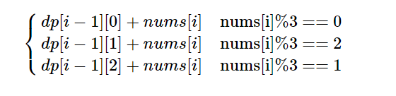
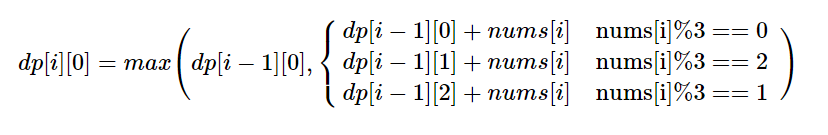
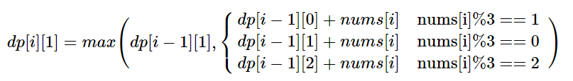
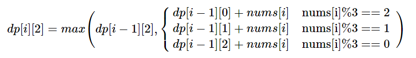

> 原文链接: https://leetcode-cn.com/problems/greatest-sum-divisible-by-three


## 英文原文
<div><p>Given an array&nbsp;<code>nums</code>&nbsp;of integers, we need to find the maximum possible sum of elements of the array such that it is divisible by three.</p>

<ol>
</ol>

<p>&nbsp;</p>
<p><strong>Example 1:</strong></p>

<pre>
<strong>Input:</strong> nums = [3,6,5,1,8]
<strong>Output:</strong> 18
<strong>Explanation:</strong> Pick numbers 3, 6, 1 and 8 their sum is 18 (maximum sum divisible by 3).</pre>

<p><strong>Example 2:</strong></p>

<pre>
<strong>Input:</strong> nums = [4]
<strong>Output:</strong> 0
<strong>Explanation:</strong> Since 4 is not divisible by 3, do not pick any number.
</pre>

<p><strong>Example 3:</strong></p>

<pre>
<strong>Input:</strong> nums = [1,2,3,4,4]
<strong>Output:</strong> 12
<strong>Explanation:</strong> Pick numbers 1, 3, 4 and 4 their sum is 12 (maximum sum divisible by 3).
</pre>

<p>&nbsp;</p>
<p><strong>Constraints:</strong></p>

<ul>
	<li><code>1 &lt;= nums.length &lt;= 4 * 10^4</code></li>
	<li><code>1 &lt;= nums[i] &lt;= 10^4</code></li>
</ul>
</div>

## 中文题目
<div><p>给你一个整数数组&nbsp;<code>nums</code>，请你找出并返回能被三整除的元素最大和。</p>

<ol>
</ol>

<p>&nbsp;</p>

<p><strong>示例 1：</strong></p>

<pre><strong>输入：</strong>nums = [3,6,5,1,8]
<strong>输出：</strong>18
<strong>解释：</strong>选出数字 3, 6, 1 和 8，它们的和是 18（可被 3 整除的最大和）。</pre>

<p><strong>示例 2：</strong></p>

<pre><strong>输入：</strong>nums = [4]
<strong>输出：</strong>0
<strong>解释：</strong>4 不能被 3 整除，所以无法选出数字，返回 0。
</pre>

<p><strong>示例 3：</strong></p>

<pre><strong>输入：</strong>nums = [1,2,3,4,4]
<strong>输出：</strong>12
<strong>解释：</strong>选出数字 1, 3, 4 以及 4，它们的和是 12（可被 3 整除的最大和）。
</pre>

<p>&nbsp;</p>

<p><strong>提示：</strong></p>

<ul>
	<li><code>1 &lt;= nums.length &lt;= 4 * 10^4</code></li>
	<li><code>1 &lt;= nums[i] &lt;= 10^4</code></li>
</ul>
</div>

## 通过代码
<RecoDemo>
</RecoDemo>


## 高赞题解
### 解题思路
根据题意很容易想到用`状态转移与动态规划`的思路来解决
### 定义
- dp[i][0]表示nums[0...i]模三余零的最大和
- dp[i][1]表示nums[0...i]模三余一的最大和
- dp[i][2]表示nums[0...i]模三余二的最大和
- `零状态`：当前数字最大和模三余零
- `一状态`：当前数字最大和模三余一
- `二状态`：当前数字最大和模三余二
### 动态规划的思路
对于任意一种状态，下一步我们都有两种选择，**一是选择当前元素**，**二是不选择当前元素**
``` latex
	dp[i][*] = max{dp[i-1][*],dp[i-1][*] + nums[i]}  (* 取值为 0,1,2)
```
以上是常见的动态规划的递推结构

### 状态转移
本题的状态转移显而易见，以当前状态是`零状态`为例。我们可以想到，前一个状态无非是`零状态``一状态``二状态`，三种情况，针对这三种情况我们分类讨论即可
	



### 动态规划与状态转移结合
显然可以直接两种方法直接结合起来


所以`零状态`如何转移我们理解了之后，可以一次写出`一状态`的转移，`二状态`的转移



### 我的题解
[LeetCode1262 可被三整除的最大和](https://leetcode-cn.com/problems/greatest-sum-divisible-by-three/solution/dong-tai-gui-hua-yu-zhuang-tai-zhuan-yi-by-christm/)
[LeetCode688 “马”在棋盘上的概率](https://leetcode-cn.com/problems/knight-probability-in-chessboard/solution/zhuang-tai-ji-de-zai-ci-ying-yong-by-christmas_wan/)
[LeetCode967 连续差相同的数字](https://leetcode-cn.com/problems/numbers-with-same-consecutive-differences/solution/cun-chu-kong-jian-ke-bian-de-dpshu-zu-by-christmas/)
[LeetCode873 最长的斐波那契子序列的长度](https://leetcode-cn.com/problems/length-of-longest-fibonacci-subsequence/solution/zhuang-tai-ding-yi-hen-shi-zhong-yao-by-christmas_/)
[LeetCode1218 最长定差子序列](https://leetcode-cn.com/problems/longest-arithmetic-subsequence-of-given-difference/solution/yi-dao-jian-dan-de-dong-tai-gui-hua-de-you-hua-wen/)
[LeetCode523 连续子数组和](https://leetcode-cn.com/problems/continuous-subarray-sum/solution/qian-zhui-he-yu-intmapde-zai-ci-ying-yong-by-chris/)
[LeetCode576 出界的路径数](https://leetcode-cn.com/problems/out-of-boundary-paths/solution/zhuang-tai-ji-du-shi-zhuang-tai-ji-by-christmas_wa/)
[LeetCode1220 统计元音字母序列的数目](https://leetcode-cn.com/problems/count-vowels-permutation/solution/dang-wo-men-zai-tan-dong-tai-gui-hua-de-shi-hou-wo/)
### 代码

```cpp
class Solution {
public:
    int maxSumDivThree(vector<int>& nums) {
       int n = nums.size();
	vector<vector<int>> dp(n + 1, vector<int>(3, 0));
	dp[0][0] = 0; dp[0][1] = INT_MIN; dp[0][2] = INT_MIN;


	for (int i = 1; i <= n; i++) {
		if (nums[i - 1] % 3 == 0) {
			dp[i][0] = max(dp[i - 1][0], dp[i - 1][0] + nums[i - 1]);
			dp[i][1] = max(dp[i - 1][1], dp[i - 1][1] + nums[i - 1]);
			dp[i][2] = max(dp[i - 1][2], dp[i - 1][2] + nums[i - 1]);
		}
		else if (nums[i - 1] % 3 == 1) {
			dp[i][0] = max(dp[i - 1][0], dp[i - 1][2] + nums[i - 1]);
			dp[i][1] = max(dp[i - 1][1], dp[i - 1][0] + nums[i - 1]);
			dp[i][2] = max(dp[i - 1][2], dp[i - 1][1] + nums[i - 1]);
		}
		else if (nums[i - 1] % 3 == 2) {
			dp[i][0] = max(dp[i - 1][0], dp[i - 1][1] + nums[i - 1]);
			dp[i][1] = max(dp[i - 1][1], dp[i - 1][2] + nums[i - 1]);
			dp[i][2] = max(dp[i - 1][2], dp[i - 1][0] + nums[i - 1]);
		}
	}
	return dp[n][0];
    }
};
```

## 统计信息
| 通过次数 | 提交次数 | AC比率 |
| :------: | :------: | :------: |
|    13904    |    26375    |   52.7%   |

## 提交历史
| 提交时间 | 提交结果 | 执行时间 |  内存消耗  | 语言 |
| :------: | :------: | :------: | :--------: | :--------: |
