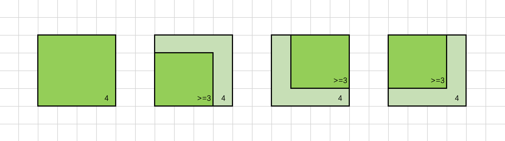

> 原文链接: https://leetcode-cn.com/problems/count-square-submatrices-with-all-ones


## 英文原文
<div><p>Given a <code>m * n</code> matrix of ones and zeros, return how many <strong>square</strong> submatrices have all ones.</p>

<p>&nbsp;</p>
<p><strong>Example 1:</strong></p>

<pre>
<strong>Input:</strong> matrix =
[
&nbsp; [0,1,1,1],
&nbsp; [1,1,1,1],
&nbsp; [0,1,1,1]
]
<strong>Output:</strong> 15
<strong>Explanation:</strong> 
There are <strong>10</strong> squares of side 1.
There are <strong>4</strong> squares of side 2.
There is  <strong>1</strong> square of side 3.
Total number of squares = 10 + 4 + 1 = <strong>15</strong>.
</pre>

<p><strong>Example 2:</strong></p>

<pre>
<strong>Input:</strong> matrix = 
[
  [1,0,1],
  [1,1,0],
  [1,1,0]
]
<strong>Output:</strong> 7
<strong>Explanation:</strong> 
There are <b>6</b> squares of side 1.  
There is <strong>1</strong> square of side 2. 
Total number of squares = 6 + 1 = <b>7</b>.
</pre>

<p>&nbsp;</p>
<p><strong>Constraints:</strong></p>

<ul>
	<li><code>1 &lt;= arr.length&nbsp;&lt;= 300</code></li>
	<li><code>1 &lt;= arr[0].length&nbsp;&lt;= 300</code></li>
	<li><code>0 &lt;= arr[i][j] &lt;= 1</code></li>
</ul>
</div>

## 中文题目
<div><p>给你一个&nbsp;<code>m * n</code>&nbsp;的矩阵，矩阵中的元素不是 <code>0</code> 就是 <code>1</code>，请你统计并返回其中完全由 <code>1</code> 组成的 <strong>正方形</strong> 子矩阵的个数。</p>

<p>&nbsp;</p>

<p><strong>示例 1：</strong></p>

<pre><strong>输入：</strong>matrix =
[
&nbsp; [0,1,1,1],
&nbsp; [1,1,1,1],
&nbsp; [0,1,1,1]
]
<strong>输出：</strong>15
<strong>解释：</strong> 
边长为 1 的正方形有 <strong>10</strong> 个。
边长为 2 的正方形有 <strong>4</strong> 个。
边长为 3 的正方形有 <strong>1</strong> 个。
正方形的总数 = 10 + 4 + 1 = <strong>15</strong>.
</pre>

<p><strong>示例 2：</strong></p>

<pre><strong>输入：</strong>matrix = 
[
  [1,0,1],
  [1,1,0],
  [1,1,0]
]
<strong>输出：</strong>7
<strong>解释：</strong>
边长为 1 的正方形有 <strong>6</strong> 个。 
边长为 2 的正方形有 <strong>1</strong> 个。
正方形的总数 = 6 + 1 = <strong>7</strong>.
</pre>

<p>&nbsp;</p>

<p><strong>提示：</strong></p>

<ul>
	<li><code>1 &lt;= arr.length&nbsp;&lt;= 300</code></li>
	<li><code>1 &lt;= arr[0].length&nbsp;&lt;= 300</code></li>
	<li><code>0 &lt;= arr[i][j] &lt;= 1</code></li>
</ul>
</div>

## 通过代码
<RecoDemo>
</RecoDemo>


## 高赞题解
### 方法一：递推

本题和 [221. 最大正方形](https://leetcode-cn.com/problems/maximal-square/) 非常类似，使用的方法也几乎相同。

我们用 `f[i][j]` 表示以 `(i, j)` 为右下角的正方形的最大边长，那么除此定义之外，`f[i][j] = x` 也表示以 `(i, j)` 为右下角的正方形的数目为 `x`（即边长为 `1, 2, ..., x` 的正方形各一个）。在计算出所有的 `f[i][j]` 后，我们将它们进行累加，就可以得到矩阵中正方形的数目。

我们尝试挖掘 `f[i][j]` 与相邻位置的关系来计算出 `f[i][j]` 的值。

{:width=600}

如上图所示，若对于位置 `(i, j)` 有 `f[i][j] = 4`，我们将以 `(i, j)` 为右下角、边长为 `4` 的正方形涂上色，可以发现其左侧位置 `(i, j - 1)`，上方位置 `(i - 1, j)` 和左上位置 `(i - 1, j - 1)` 均可以作为一个边长为 `4 - 1 = 3` 的正方形的右下角。也就是说，这些位置的的 `f` 值至少为 `3`，即：

```
f[i][j - 1] >= f[i][j] - 1
f[i - 1][j] >= f[i][j] - 1
f[i - 1][j - 1] >= f[i][j] - 1
```

将这三个不等式联立，可以得到：

$$
\min\big(f[i][j - 1], f[i - 1][j], f[i - 1][j - 1]\big) \geq f[i][j] - 1
$$

这是我们通过固定 `f[i][j]` 的值，判断其相邻位置与之的关系得到的不等式。同理，我们也可以固定 `f[i][j]` 相邻位置的值，得到另外的限制条件。

{:width=600}

如上图所示，假设 `f[i][j - 1]`，`f[i - 1][j]` 和 `f[i - 1][j - 1]` 中的最小值为 `3`，也就是说，`(i, j - 1)`，`(i - 1, j)` 和 `(i - 1, j - 1)` 均可以作为一个边长为 `3` 的正方形的右下角。我们将这些边长为 `3` 的正方形依次涂上色，可以发现，如果位置 `(i, j)` 的元素为 `1`，那么它可以作为一个边长为 `4` 的正方形的右下角，`f` 值至少为 `4`，即：

$$
f[i][j] \geq \min\big(f[i][j - 1], f[i - 1][j], f[i - 1][j - 1]\big) + 1
$$

将其与上一个不等式联立，可以得到：

$$
f[i][j] = \min\big(f[i][j - 1], f[i - 1][j], f[i - 1][j - 1]\big) + 1
$$

这样我们就得到了 `f[i][j]` 的递推式。此外还要考虑边界（`i = 0` 或 `j = 0`）以及位置 `(i, j)` 的元素为 `0` 的情况，可以得到如下完整的递推式：

$$
f[i][j] =
\begin{cases}
\text{matrix}[i][j] & ,\text{if~} i == 0 \text{~or~} j == 0 \\
0 & ,\text{if~} \text{matrix[i][j]} == 0 \\
\min\big(f[i][j - 1], f[i - 1][j], f[i - 1][j - 1]\big) + 1 & ,\text{otherwise}
\end{cases}
$$

我们按照行优先的顺序依次计算 `f[i][j]` 的值，就可以得到最终的答案。

```C++ [sol1]
class Solution {
public:
    int countSquares(vector<vector<int>>& matrix) {
        int m = matrix.size(), n = matrix[0].size();
        vector<vector<int>> f(m, vector<int>(n));
        int ans = 0;
        for (int i = 0; i < m; ++i) {
            for (int j = 0; j < n; ++j) {
                if (i == 0 || j == 0) {
                    f[i][j] = matrix[i][j];
                }
                else if (matrix[i][j] == 0) {
                    f[i][j] = 0;
                }
                else {
                    f[i][j] = min(min(f[i][j - 1], f[i - 1][j]), f[i - 1][j - 1]) + 1;
                }
                ans += f[i][j];
            }
        }
        return ans;
    }
};
```

```Python [sol1]
class Solution:
    def countSquares(self, matrix: List[List[int]]) -> int:
        m, n = len(matrix), len(matrix[0])
        f = [[0] * n for _ in range(m)]
        ans = 0
        for i in range(m):
            for j in range(n):
                if i == 0 or j == 0:
                    f[i][j] = matrix[i][j]
                elif matrix[i][j] == 0:
                    f[i][j] = 0
                else:
                    f[i][j] = min(f[i][j - 1], f[i - 1][j], f[i - 1][j - 1]) + 1
                ans += f[i][j]
        return ans
```

**复杂度分析**

- 时间复杂度：$O(MN)$。

- 空间复杂度：$O(MN)$。由于递推式中 `f[i][j]` 只与本行和上一行的若干个值有关，因此空间复杂度可以优化至 $O(N)$。

## 统计信息
| 通过次数 | 提交次数 | AC比率 |
| :------: | :------: | :------: |
|    20012    |    27518    |   72.7%   |

## 提交历史
| 提交时间 | 提交结果 | 执行时间 |  内存消耗  | 语言 |
| :------: | :------: | :------: | :--------: | :--------: |
