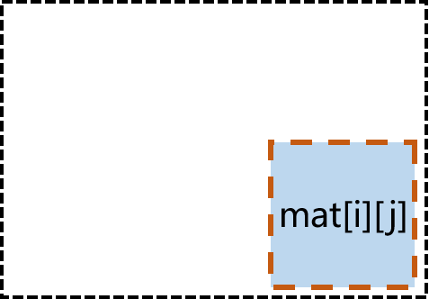
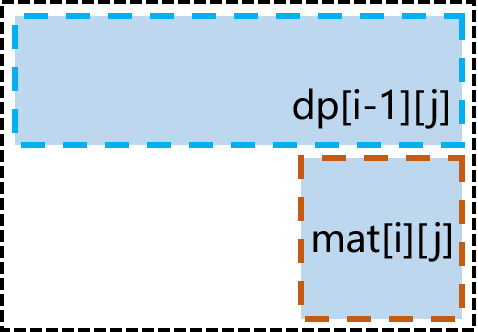
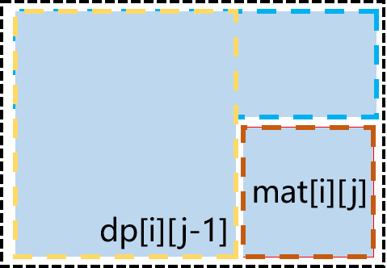
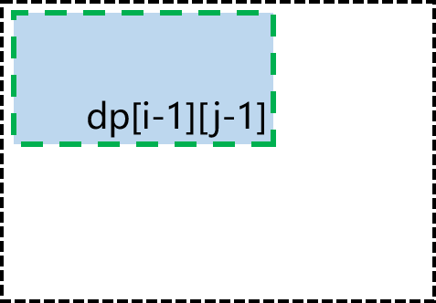
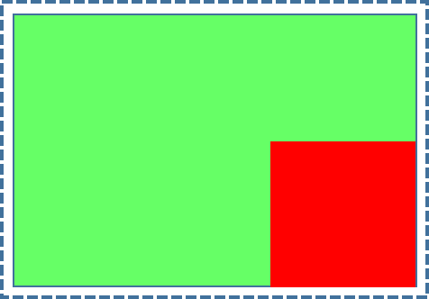
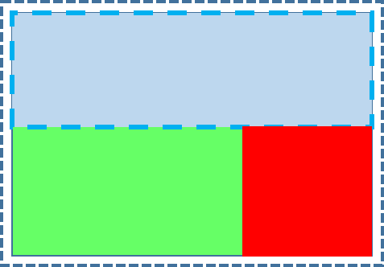
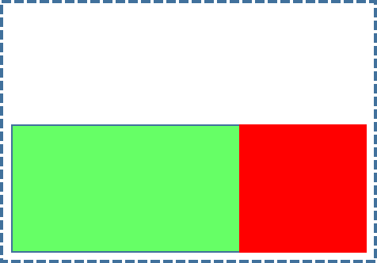
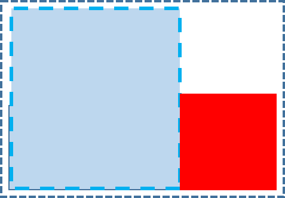
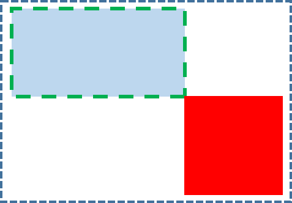

> 原文链接: https://leetcode-cn.com/problems/maximum-side-length-of-a-square-with-sum-less-than-or-equal-to-threshold


## 英文原文
<div><p>Given a <code>m x n</code>&nbsp;matrix <code>mat</code> and an integer <code>threshold</code>. Return the maximum side-length of a square with a sum less than or equal to <code>threshold</code> or return <strong>0</strong> if there is no such square.</p>

<p>&nbsp;</p>
<p><strong>Example 1:</strong></p>

<pre>
<strong>Input:</strong> mat = [[1,1,3,2,4,3,2],[1,1,3,2,4,3,2],[1,1,3,2,4,3,2]], threshold = 4
<strong>Output:</strong> 2
<strong>Explanation:</strong> The maximum side length of square with sum less than 4 is 2 as shown.
</pre>

<p><strong>Example 2:</strong></p>

<pre>
<strong>Input:</strong> mat = [[2,2,2,2,2],[2,2,2,2,2],[2,2,2,2,2],[2,2,2,2,2],[2,2,2,2,2]], threshold = 1
<strong>Output:</strong> 0
</pre>

<p><strong>Example 3:</strong></p>

<pre>
<strong>Input:</strong> mat = [[1,1,1,1],[1,0,0,0],[1,0,0,0],[1,0,0,0]], threshold = 6
<strong>Output:</strong> 3
</pre>

<p><strong>Example 4:</strong></p>

<pre>
<strong>Input:</strong> mat = [[18,70],[61,1],[25,85],[14,40],[11,96],[97,96],[63,45]], threshold = 40184
<strong>Output:</strong> 2
</pre>

<p>&nbsp;</p>
<p><strong>Constraints:</strong></p>

<ul>
	<li><code>1 &lt;= m, n &lt;= 300</code></li>
	<li><code>m == mat.length</code></li>
	<li><code>n == mat[i].length</code></li>
	<li><code>0 &lt;= mat[i][j] &lt;= 10000</code></li>
	<li><code>0 &lt;= threshold&nbsp;&lt;= 10^5</code></li>
</ul>
</div>

## 中文题目
<div><p>给你一个大小为 <code>m x n</code> 的矩阵 <code>mat</code> 和一个整数阈值 <code>threshold</code>。</p>

<p>请你返回元素总和小于或等于阈值的正方形区域的最大边长；如果没有这样的正方形区域，则返回 <strong>0 </strong>。<br />
 </p>

<p><strong>示例 1：</strong></p>

<p></p>

<pre>
<strong>输入：</strong>mat = [[1,1,3,2,4,3,2],[1,1,3,2,4,3,2],[1,1,3,2,4,3,2]], threshold = 4
<strong>输出：</strong>2
<strong>解释：</strong>总和小于或等于 4 的正方形的最大边长为 2，如图所示。
</pre>

<p><strong>示例 2：</strong></p>

<pre>
<strong>输入：</strong>mat = [[2,2,2,2,2],[2,2,2,2,2],[2,2,2,2,2],[2,2,2,2,2],[2,2,2,2,2]], threshold = 1
<strong>输出：</strong>0
</pre>

<p><strong>示例 3：</strong></p>

<pre>
<strong>输入：</strong>mat = [[1,1,1,1],[1,0,0,0],[1,0,0,0],[1,0,0,0]], threshold = 6
<strong>输出：</strong>3
</pre>

<p><strong>示例 4：</strong></p>

<pre>
<strong>输入：</strong>mat = [[18,70],[61,1],[25,85],[14,40],[11,96],[97,96],[63,45]], threshold = 40184
<strong>输出：</strong>2
</pre>

<p> </p>

<p><strong>提示：</strong></p>

<ul>
	<li><code>1 <= m, n <= 300</code></li>
	<li><code>m == mat.length</code></li>
	<li><code>n == mat[i].length</code></li>
	<li><code>0 <= mat[i][j] <= 10000</code></li>
	<li><code>0 <= threshold <= 10^5</code></li>
</ul>
</div>

## 通过代码
<RecoDemo>
</RecoDemo>


## 高赞题解
## 解法一 前缀和

### 思路

遍历所有**可能**的正方形区域，具体的算法流程是：1.考虑正方形的**边长**从 1 到 $Min(M,N)$（M 为矩阵长度，N 为矩阵宽度）2.考虑正方形**右下角的坐标**从 (0, 0) 到 (M, N) 3.判断正方形是否存在（可能会**超出边界**，通过**左上角坐标**判断），如果存在则验证该正方形区域的**元素总和**。

 下面引入**二维前缀和**的计算方法，通过**预处理**可以在 $O(1)$ 时间内计算出一块区域内元素的总和。

首先是预处理，在 $O(N^2)$ 时间内计算出二维前缀和 `dp[i][j]`：从 **(0, 0)** 到 **(i, j)** 内元素的总和。

已知 `dp[i][j]` 必定包含一个元素 `mat[i][j]`，假设我们已经计算出部分前缀和 `dp[x][y]`（x < i 且 y < j），那么 `dp[i][j] = mat[i][j] + dp[i - 1][j] + dp[i][j - 1] - dp[i - 1][j - 1]`。

下面通过一组动画来理解这个过程（图片较大，请点击**左下角播放**）：

我们需要计算**黑色虚线区域**即 `dp[i][j]`，先加上右下角元素`mat[i][j]`，接着加上`mat[i][j]`上方区域的前缀和`dp[i - 1][j]`以及左边区域的前缀和`dp[i][j - 1]`，但左上角一块区域被加了**两**次，因此还要再扣去这块区域`dp[i - 1][j - 1]`。

<,,,>


预处理完**二维前缀和**，我们可以**逆向**这个过程，计算出某一块特定区域内元素总和。例如计算下面的**红色区域**，其右下角坐标为 **(i, j)**，长度和宽度为 **k**，则可以将绿色区域 `dp[i][j]` 减去红色区域相邻的上方区域`dp[i - k][j]`以及相邻的左边区域`dp[i][j - k]`，最后补上被**多减一次**的左上方区域`dp[i - k][j - k]`。

图示（图片较大，请点击**左下角播放**）：

<,,,,>


### 代码

```java
class Solution {
    public int maxSideLength(int[][] mat, int threshold) {
        int m = mat.length, n = mat[0].length;
        int[][] dp = new int[m + 1][n + 1];
        for (int i = 1; i <= m; i++) {
            for (int j = 1; j <= n; j++) {
                dp[i][j] = mat[i - 1][j - 1] + dp[i - 1][j] + dp[i][j - 1] - dp[i - 1][j - 1];
            }
        }
        int ans = 0;
        for (int k = 1; k <= Math.min(m, n); k++) {
            for (int i = 1; i <= m; i++) {
                for (int j = 1; j <= n; j++) {
                    if (i - k < 0 || j - k < 0) {
                        continue;
                    }
                    int tmp = dp[i][j] - dp[i - k][j] - dp[i][j - k] + dp[i - k][j - k];
                    if (tmp <= threshold) {
                        ans = Math.max(ans, k);
                    }
                }
            }
        }
        return ans;
    }
}
```

#### 复杂度分析

- 时间复杂度：$O(min(M, N) * M * N)$，其中 M 为矩阵长度，N 为矩阵宽度。

## 解法二 前缀和 + 二分

### 思路

查找的正方形的边长越长，其计算出来的元素总和越大。

我们可以二分正方形的边长，在满足**阈值条件**下尽可能地扩大正方形的边长，其等价于在升序数组中查找一个小于等于 k 的最大元素。

二分的具体思路：

- 控制 l 到 h 都是可能可能的值
- 如果 mid 满足**阈值条件**，则 l = mid，l 可能是答案，不能直接舍去。
- 如果 mid 不满足**阈值条件**，则 h = mid - 1。
- 当 l = h 或 l + 1 = h 时跳出循环（小提示：l = mid 可能造成**死循环**，通过 l + 1 == h 条件跳出），判断 l 和 h 两个是最优解。

### 代码

```java
class Solution {
    int m, n;
    int[][] dp;
    public int maxSideLength(int[][] mat, int threshold) {
        m = mat.length;
        n = mat[0].length;
        dp = new int[m + 1][n + 1];
        for (int i = 1; i <= m; i++) {
            for (int j = 1; j <= n; j++) {
                dp[i][j] = mat[i - 1][j - 1] + dp[i - 1][j] + dp[i][j - 1] - dp[i - 1][j - 1];
            }
        }
        int l = 0, h = Math.min(m, n);
        while (l <= h) {
            int mid = l + (h - l) / 2;
            if (l == h || l + 1 == h) {
                break;
            }
            if (help(mid, threshold)) {
                l = mid;
            } else {
                h = mid - 1;
            }
        }
        if (help(h, threshold)) {
            return h;
        } else {
            return l;
        }
    }
    public boolean help(int k, int threshold) {
        for (int i = 1; i <= m; i++) {
            for (int j = 1; j <= n; j++) {
                if (i - k < 0 || j - k < 0) {
                    continue;
                }
                if (dp[i][j] - dp[i - k][j] - dp[i][j - k] + dp[i - k][j - k] <= threshold) {
                    return true;
                }
            }
        }
        return false;
    }
}
```

### 复杂度分析

- 时间复杂度：$O(log(min(M, N)) * M * N)$，其中 M 为矩阵长度，N 为矩阵宽度。

<br/>

---

如果该题解对你有帮助，点个赞再走呗~

## 统计信息
| 通过次数 | 提交次数 | AC比率 |
| :------: | :------: | :------: |
|    6379    |    13446    |   47.4%   |

## 提交历史
| 提交时间 | 提交结果 | 执行时间 |  内存消耗  | 语言 |
| :------: | :------: | :------: | :--------: | :--------: |
