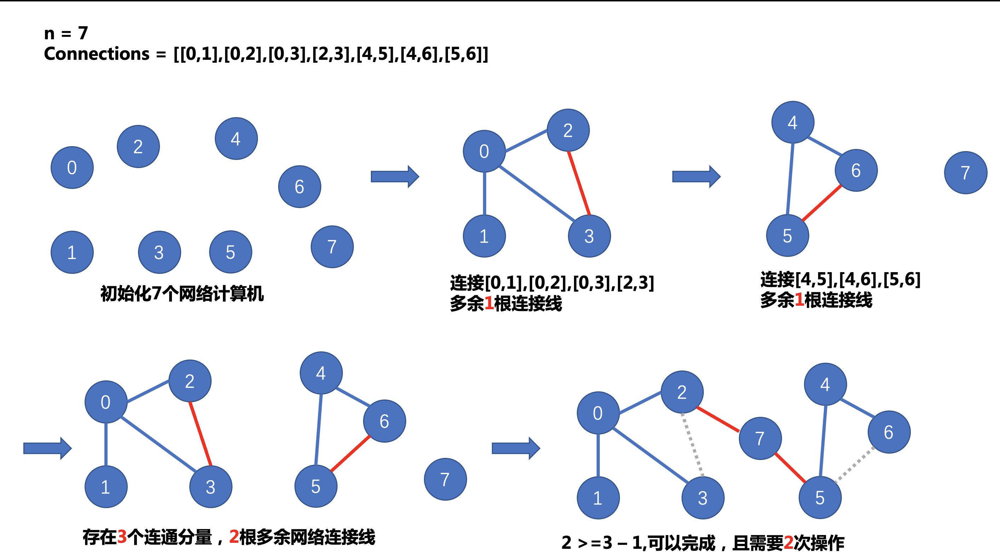
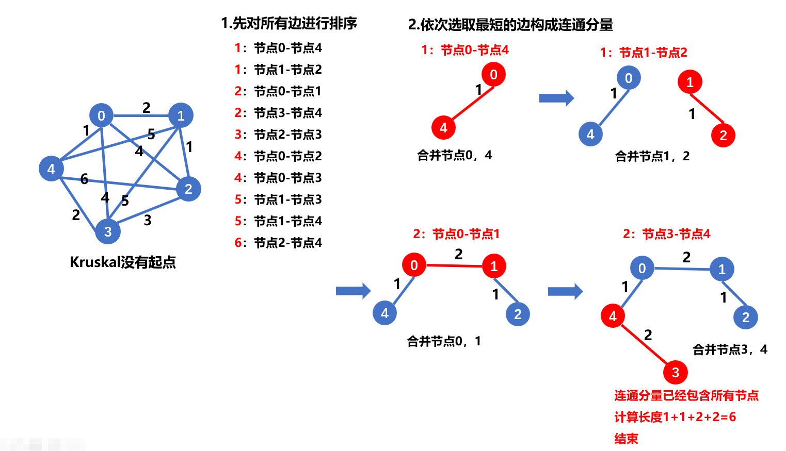

> 原文链接: https://leetcode-cn.com/problems/number-of-operations-to-make-network-connected


## 英文原文
<div><p>There are&nbsp;<code>n</code>&nbsp;computers numbered from&nbsp;<code>0</code>&nbsp;to&nbsp;<code>n-1</code>&nbsp;connected by&nbsp;ethernet cables&nbsp;<code>connections</code>&nbsp;forming a network where&nbsp;<code>connections[i] = [a, b]</code>&nbsp;represents a connection between computers&nbsp;<code>a</code>&nbsp;and&nbsp;<code>b</code>. Any computer&nbsp;can reach any other computer directly or indirectly through the network.</p>

<p>Given an initial computer network <code>connections</code>. You can extract certain cables between two directly connected computers, and place them between any pair of disconnected computers to make them directly connected. Return the <em>minimum number of times</em> you need to do this in order to make all the computers connected. If it&#39;s not possible, return -1.&nbsp;</p>

<p>&nbsp;</p>
<p><strong>Example 1:</strong></p>

<p><strong></strong></p>

<pre>
<strong>Input:</strong> n = 4, connections = [[0,1],[0,2],[1,2]]
<strong>Output:</strong> 1
<strong>Explanation:</strong> Remove cable between computer 1 and 2 and place between computers 1 and 3.
</pre>

<p><strong>Example 2:</strong></p>

<p><strong></strong></p>

<pre>
<strong>Input:</strong> n = 6, connections = [[0,1],[0,2],[0,3],[1,2],[1,3]]
<strong>Output:</strong> 2
</pre>

<p><strong>Example 3:</strong></p>

<pre>
<strong>Input:</strong> n = 6, connections = [[0,1],[0,2],[0,3],[1,2]]
<strong>Output:</strong> -1
<strong>Explanation:</strong> There are not enough cables.
</pre>

<p><strong>Example 4:</strong></p>

<pre>
<strong>Input:</strong> n = 5, connections = [[0,1],[0,2],[3,4],[2,3]]
<strong>Output:</strong> 0
</pre>

<p>&nbsp;</p>
<p><strong>Constraints:</strong></p>

<ul>
	<li><code>1 &lt;= n &lt;= 10^5</code></li>
	<li><code>1 &lt;= connections.length &lt;= min(n*(n-1)/2, 10^5)</code></li>
	<li><code>connections[i].length == 2</code></li>
	<li><code>0 &lt;= connections[i][0], connections[i][1]&nbsp;&lt; n</code></li>
	<li><code>connections[i][0] != connections[i][1]</code></li>
	<li>There are no repeated connections.</li>
	<li>No two computers are connected by more than one cable.</li>
</ul>
</div>

## 中文题目
<div><p>用以太网线缆将&nbsp;<code>n</code>&nbsp;台计算机连接成一个网络，计算机的编号从&nbsp;<code>0</code>&nbsp;到&nbsp;<code>n-1</code>。线缆用&nbsp;<code>connections</code>&nbsp;表示，其中&nbsp;<code>connections[i] = [a, b]</code>&nbsp;连接了计算机&nbsp;<code>a</code>&nbsp;和&nbsp;<code>b</code>。</p>

<p>网络中的任何一台计算机都可以通过网络直接或者间接访问同一个网络中其他任意一台计算机。</p>

<p>给你这个计算机网络的初始布线&nbsp;<code>connections</code>，你可以拔开任意两台直连计算机之间的线缆，并用它连接一对未直连的计算机。请你计算并返回使所有计算机都连通所需的最少操作次数。如果不可能，则返回&nbsp;-1 。&nbsp;</p>

<p>&nbsp;</p>

<p><strong>示例 1：</strong></p>

<p><strong></strong></p>

<pre><strong>输入：</strong>n = 4, connections = [[0,1],[0,2],[1,2]]
<strong>输出：</strong>1
<strong>解释：</strong>拔下计算机 1 和 2 之间的线缆，并将它插到计算机 1 和 3 上。
</pre>

<p><strong>示例 2：</strong></p>

<p><strong></strong></p>

<pre><strong>输入：</strong>n = 6, connections = [[0,1],[0,2],[0,3],[1,2],[1,3]]
<strong>输出：</strong>2
</pre>

<p><strong>示例 3：</strong></p>

<pre><strong>输入：</strong>n = 6, connections = [[0,1],[0,2],[0,3],[1,2]]
<strong>输出：</strong>-1
<strong>解释：</strong>线缆数量不足。
</pre>

<p><strong>示例 4：</strong></p>

<pre><strong>输入：</strong>n = 5, connections = [[0,1],[0,2],[3,4],[2,3]]
<strong>输出：</strong>0
</pre>

<p>&nbsp;</p>

<p><strong>提示：</strong></p>

<ul>
	<li><code>1 &lt;= n &lt;= 10^5</code></li>
	<li><code>1 &lt;= connections.length &lt;= min(n*(n-1)/2, 10^5)</code></li>
	<li><code>connections[i].length == 2</code></li>
	<li><code>0 &lt;= connections[i][0], connections[i][1]&nbsp;&lt; n</code></li>
	<li><code>connections[i][0] != connections[i][1]</code></li>
	<li>没有重复的连接。</li>
	<li>两台计算机不会通过多条线缆连接。</li>
</ul>
</div>

## 通过代码
<RecoDemo>
</RecoDemo>


## 高赞题解
### 前言
很简单，题目需要用到网络的连通性，没错，并查集。

如果您对【并查集】相关知识还不是太了解，可以看看我之前的题解[【详解并查集】](https://leetcode-cn.com/problems/most-stones-removed-with-same-row-or-column/solution/tu-jie-bing-cha-ji-by-yexiso-nbcz/)

有问题欢迎留言交流！

### 解题思路


分析题意，**需要将所有网络连接成同一个网络。**

假设最后形成了`n`个网络，说明存在`n`个连通分量，要将`n`个连通分量合并，很明显至少需要`n-1`个网络连接线。

那么，这`n-1`根网络连接线从哪来呢，只有从各个网络中多余的连接线拔过来。

所以在遍历`Connections`数组时，需要记录有多少根多余的网络连接线。

### 步骤
> 1. 存在`n`个计算机，所以最开始建立`n`个连通分量，每个网络计算机是一个连通分量
> 2. 遍历`Connections`数组，将相应的网络计算机（连通分量）合并成同一个网络
> 合并时，作以下判断：
> 如果两个连通分量不同源（根节点不相同），合并；
> 如果两个连通分量同源（根节点相同），说明该连接多余，则将多余的连接线数量+1
> 3. 最后可以计算得出网络中要多少个连通分量，假设有`n`个。要将`n`个连通分量连接到一起，至少需要`n-1`根多余的网络连接线


### 举例


### 代码
使用封装好的并查集代码，轻而易举地完成代码。
```cpp
// 注意：使用该代码，并不能使得所有的元素都直接指向根节点，仍然存在间接的指向
class Djset {
private:
    vector<int> parent;  // 记录节点的根
    vector<int> rank;  // 记录根节点的深度（用于优化）
    int count;         // 记录连通分量的个数
    int rest;          // 记录多余的连接数
public:
    Djset(int n): parent(vector<int>(n)), rank(vector<int>(n)), count(n), rest(0) {
        for (int i = 0; i < n; i++) {
            parent[i] = i;
        }
    }
    
    int find(int x) {
        // 压缩方式：直接指向根节点
        if (x != parent[x]) {
            parent[x] = find(parent[x]);
        }
        return parent[x];
    }
    
    void merge(int x, int y) {
        int rootx = find(x);
        int rooty = find(y);
        if (rootx != rooty) {
            // 按秩合并
            if (rank[rootx] < rank[rooty]) {
                swap(rootx, rooty);
            }
            parent[rooty] = rootx;
            if (rank[rootx] == rank[rooty]) rank[rootx] += 1;
            count--;
        } else {
            rest++;
        }
    }
    int getCount() {
        return count;
    }
    int getRest() {
        return rest;
    }
};

class Solution {
public:
    int makeConnected(int n, vector<vector<int>>& connections) {
        Djset ds(n);
        for (auto& e :connections) {
            ds.merge(e[0], e[1]);
        }
        if (ds.getRest() < ds.getCount() - 1) return -1;
        return ds.getCount() - 1;
    }
};
```
### 结果


在并查集的基础上，添加一些辅助变量，便可以使用在不同的场景
> - 添加`count`变量保存连通分量的数量
> 如题目 [【岛屿数量】](https://leetcode-cn.com/problems/number-of-islands/)[【省份数量】](https://leetcode-cn.com/problems/number-of-provinces/)
> - 添加`size`数组保存每个连通分量中的节点个数，可解决连通图的合并与拆分类问题
> 如题目 [【打砖块】](https://leetcode-cn.com/problems/bricks-falling-when-hit/solution/bing-cha-ji-by-yexiso-cp6z/)
> - 添加`len`数组保存每个连通分量中的边权值和，可解决最小生成树问题（Kruskal算法）
> 如 计算图的最小生成树[【连接所有点的最小费用】](https://leetcode-cn.com/problems/min-cost-to-connect-all-points/solution/prim-and-kruskal-by-yexiso-c500/)

> - 有时也需要保存并查集中的连通分量的根节点，可添加`map`进行辅助

并查集的适用方式层出不穷，适用场景也多种多样，我们要善于发现其中隐藏的key point。

## 统计信息
| 通过次数 | 提交次数 | AC比率 |
| :------: | :------: | :------: |
|    31932    |    51695    |   61.8%   |

## 提交历史
| 提交时间 | 提交结果 | 执行时间 |  内存消耗  | 语言 |
| :------: | :------: | :------: | :--------: | :--------: |
