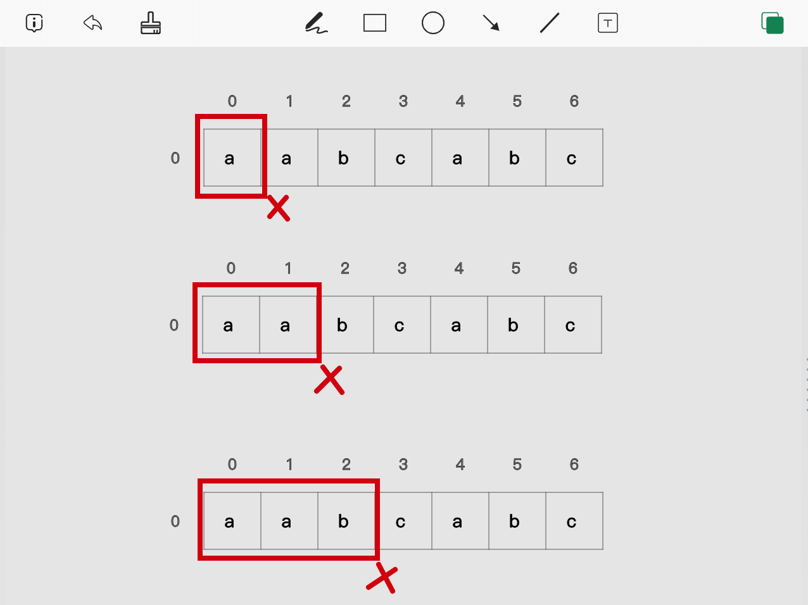
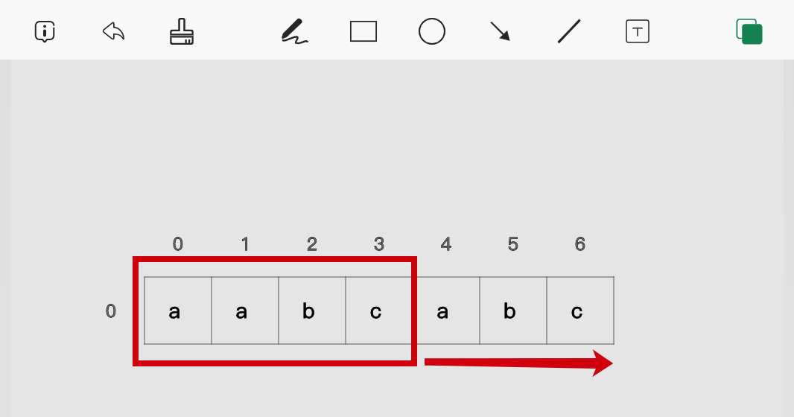
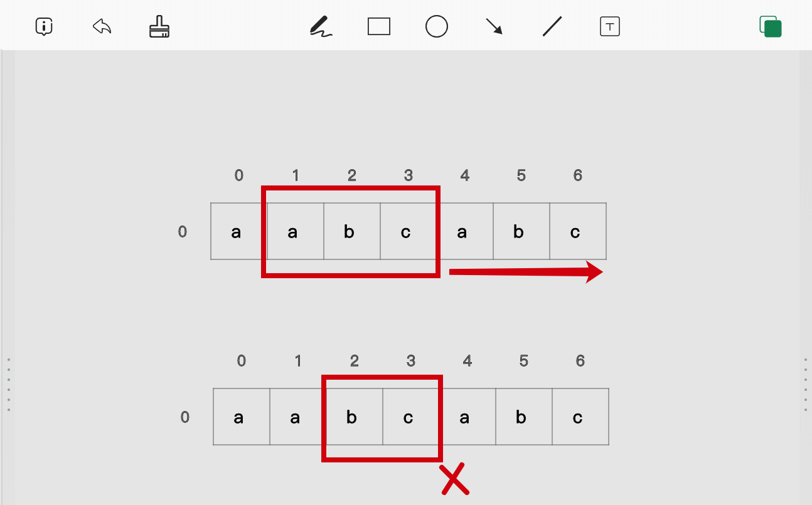
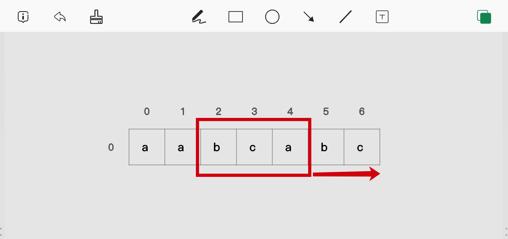
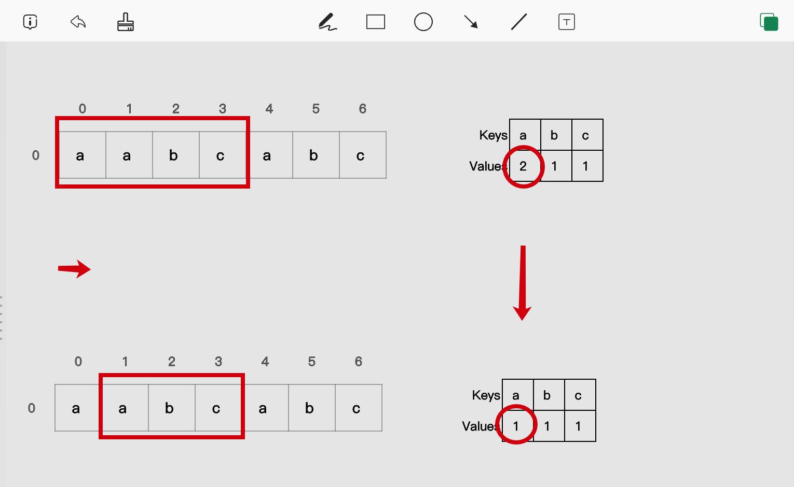

> 原文链接: https://leetcode-cn.com/problems/number-of-substrings-containing-all-three-characters


## 英文原文
<div><p>Given a string <code>s</code>&nbsp;consisting only of characters <em>a</em>, <em>b</em> and <em>c</em>.</p>

<p>Return the number of substrings containing <b>at least</b>&nbsp;one occurrence of all these characters <em>a</em>, <em>b</em> and <em>c</em>.</p>

<p>&nbsp;</p>
<p><strong>Example 1:</strong></p>

<pre>
<strong>Input:</strong> s = &quot;abcabc&quot;
<strong>Output:</strong> 10
<strong>Explanation:</strong> The substrings containing&nbsp;at least&nbsp;one occurrence of the characters&nbsp;<em>a</em>,&nbsp;<em>b</em>&nbsp;and&nbsp;<em>c are &quot;</em>abc<em>&quot;, &quot;</em>abca<em>&quot;, &quot;</em>abcab<em>&quot;, &quot;</em>abcabc<em>&quot;, &quot;</em>bca<em>&quot;, &quot;</em>bcab<em>&quot;, &quot;</em>bcabc<em>&quot;, &quot;</em>cab<em>&quot;, &quot;</em>cabc<em>&quot; </em>and<em> &quot;</em>abc<em>&quot; </em>(<strong>again</strong>)<em>. </em>
</pre>

<p><strong>Example 2:</strong></p>

<pre>
<strong>Input:</strong> s = &quot;aaacb&quot;
<strong>Output:</strong> 3
<strong>Explanation:</strong> The substrings containing&nbsp;at least&nbsp;one occurrence of the characters&nbsp;<em>a</em>,&nbsp;<em>b</em>&nbsp;and&nbsp;<em>c are &quot;</em>aaacb<em>&quot;, &quot;</em>aacb<em>&quot; </em>and<em> &quot;</em>acb<em>&quot;.</em><em> </em>
</pre>

<p><strong>Example 3:</strong></p>

<pre>
<strong>Input:</strong> s = &quot;abc&quot;
<strong>Output:</strong> 1
</pre>

<p>&nbsp;</p>
<p><strong>Constraints:</strong></p>

<ul>
	<li><code>3 &lt;= s.length &lt;= 5 x 10^4</code></li>
	<li><code>s</code>&nbsp;only consists of&nbsp;<em>a</em>, <em>b</em> or <em>c&nbsp;</em>characters.</li>
</ul>
</div>

## 中文题目
<div><p>给你一个字符串 <code>s</code>&nbsp;，它只包含三种字符 a, b 和 c 。</p>

<p>请你返回 a，b 和 c 都&nbsp;<strong>至少&nbsp;</strong>出现过一次的子字符串数目。</p>

<p>&nbsp;</p>

<p><strong>示例 1：</strong></p>

<pre><strong>输入：</strong>s = &quot;abcabc&quot;
<strong>输出：</strong>10
<strong>解释：</strong>包含 a，b 和 c 各至少一次的子字符串为<em> &quot;</em>abc<em>&quot;, &quot;</em>abca<em>&quot;, &quot;</em>abcab<em>&quot;, &quot;</em>abcabc<em>&quot;, &quot;</em>bca<em>&quot;, &quot;</em>bcab<em>&quot;, &quot;</em>bcabc<em>&quot;, &quot;</em>cab<em>&quot;, &quot;</em>cabc<em>&quot; </em>和<em> &quot;</em>abc<em>&quot; </em>(<strong>相同</strong><strong>字符串算多次</strong>)<em>。</em>
</pre>

<p><strong>示例 2：</strong></p>

<pre><strong>输入：</strong>s = &quot;aaacb&quot;
<strong>输出：</strong>3
<strong>解释：</strong>包含 a，b 和 c 各至少一次的子字符串为<em> &quot;</em>aaacb<em>&quot;, &quot;</em>aacb<em>&quot; </em>和<em> &quot;</em>acb<em>&quot; 。</em>
</pre>

<p><strong>示例 3：</strong></p>

<pre><strong>输入：</strong>s = &quot;abc&quot;
<strong>输出：</strong>1
</pre>

<p>&nbsp;</p>

<p><strong>提示：</strong></p>

<ul>
	<li><code>3 &lt;= s.length &lt;= 5 x 10^4</code></li>
	<li><code>s</code>&nbsp;只包含字符 a，b 和 c 。</li>
</ul>
</div>

## 通过代码
<RecoDemo>
</RecoDemo>


## 高赞题解

首先最朴素的想法：枚举所有的子串，然后检查是否符合条件。不过这个时间效率是 O(n^3)，过于低下。那是哪里有浪费和冗余呢？

为了更好的说明问题，我们稍稍修改一下样例 1，在前面再加个 "a",即:`"aabcabc"`


我们依旧傻傻的进行枚举，首先是 `"a"`,不符合。再是 `"aa"`，不符合。再是 `"aab"` ,不符合。然后终于出现了满足的条件的子串，`"aabc"`。（上图）

继续枚举：`"aabca"`，符合。`”aabcab"`，符合。诶等等，真的还需要再枚举吗？？？**当第一次发现 "aabc" 这个符合条件的子串时，它右边所有拓展出来的串都是符合条件的。** `"aabc"` 的右边可以扩展出 4 个串(包括自己)，答案加4。


如果把我们枚举范围看成一个窗口，我们刚刚从`index=0`开始，向右扩展窗口找到了第一个符合条件的字符串`"aabc"`。很容易发现，`"aabc"`是符合条件的，左边去掉一个"a"之后的后缀字符串`"abc"`也是符合条件的。（下图）

为了找到这些可能符合条件的后缀，**我们不断向右收缩窗口的左沿，直至不符合条件**。 `"aabc"`收缩成`"abc"`，符合，答案再加 4。`"abc"`收缩成`"bc"`，不符合，停止收缩。（上图）


此时，窗口左沿为 `index=2`，窗口右沿为 `index=3`，以 `index=3` 结尾的所有字符串我们已经找完了。**下一步，向右拓展窗口右沿，找到新的符合条件的字符串**`"bca"`,(当然如果不符合条件就继续拓展，直至符合条件)。符合条件后，又像刚才那样开始向右收缩窗口左沿。


重复以上步骤。

值得一提的是，为了判断当前窗口(或者说字符串)是不是符合条件的，肯定是需要对 abc 分别计数的。而每一个字符串都去遍历每个字符来计数的话也太慢了，**我们需要充分利用移动窗口前的计数信息，在之前的基础上相应的计数+1/-1。**



附上双百代码

```java
class Solution {
    public int numberOfSubstrings(String s) {
        int answer=0;
        //abc 的计数
        int[] count=new int[3];
        //窗口左沿
        int start=0;
        //窗口右沿
        for(int end=0;end<s.length();end++){
            char charAtEnd=s.charAt(end);
            count[charAtEnd-'a']++;
            while(count[0]>=1 && count[1]>=1 && count[2]>=1){
                answer+=s.length()-end;
                char charAtStart=s.charAt(start);
                count[charAtStart-'a']--;
                start++;
            } 
        }
        return answer;
    }
}
```

## 统计信息
| 通过次数 | 提交次数 | AC比率 |
| :------: | :------: | :------: |
|    6232    |    12594    |   49.5%   |

## 提交历史
| 提交时间 | 提交结果 | 执行时间 |  内存消耗  | 语言 |
| :------: | :------: | :------: | :--------: | :--------: |
