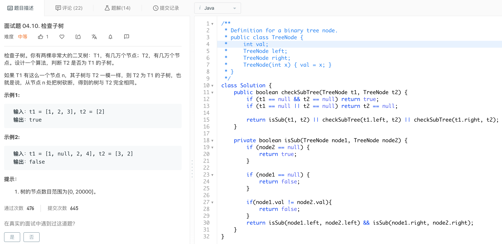

> 原文链接: https://leetcode-cn.com/problems/linked-list-in-binary-tree


## 英文原文
<div><p>Given a binary tree <code>root</code> and a&nbsp;linked list with&nbsp;<code>head</code>&nbsp;as the first node.&nbsp;</p>

<p>Return True if all the elements in the linked list starting from the <code>head</code> correspond to some <em>downward path</em> connected in the binary tree&nbsp;otherwise return False.</p>

<p>In this context downward path means a path that starts at some node and goes downwards.</p>

<p>&nbsp;</p>
<p><strong>Example 1:</strong></p>

<p><strong></strong></p>

<pre>
<strong>Input:</strong> head = [4,2,8], root = [1,4,4,null,2,2,null,1,null,6,8,null,null,null,null,1,3]
<strong>Output:</strong> true
<strong>Explanation:</strong> Nodes in blue form a subpath in the binary Tree.  
</pre>

<p><strong>Example 2:</strong></p>

<p><strong></strong></p>

<pre>
<strong>Input:</strong> head = [1,4,2,6], root = [1,4,4,null,2,2,null,1,null,6,8,null,null,null,null,1,3]
<strong>Output:</strong> true
</pre>

<p><strong>Example 3:</strong></p>

<pre>
<strong>Input:</strong> head = [1,4,2,6,8], root = [1,4,4,null,2,2,null,1,null,6,8,null,null,null,null,1,3]
<strong>Output:</strong> false
<strong>Explanation:</strong> There is no path in the binary tree that contains all the elements of the linked list from <code>head</code>.
</pre>

<p>&nbsp;</p>
<p><strong>Constraints:</strong></p>

<ul>
	<li>The number of nodes in the tree will be in the range <code>[1, 2500]</code>.</li>
	<li>The number of nodes in the list will be in the range <code>[1, 100]</code>.</li>
	<li><code>1 &lt;= Node.val&nbsp;&lt;= 100</code>&nbsp;for each node in the linked list and binary tree.</li>
</ul>
</div>

## 中文题目
<div><p>给你一棵以&nbsp;<code>root</code>&nbsp;为根的二叉树和一个&nbsp;<code>head</code>&nbsp;为第一个节点的链表。</p>

<p>如果在二叉树中，存在一条一直向下的路径，且每个点的数值恰好一一对应以&nbsp;<code>head</code>&nbsp;为首的链表中每个节点的值，那么请你返回 <code>True</code> ，否则返回 <code>False</code> 。</p>

<p>一直向下的路径的意思是：从树中某个节点开始，一直连续向下的路径。</p>

<p>&nbsp;</p>

<p><strong>示例 1：</strong></p>

<p><strong></strong></p>

<pre><strong>输入：</strong>head = [4,2,8], root = [1,4,4,null,2,2,null,1,null,6,8,null,null,null,null,1,3]
<strong>输出：</strong>true
<strong>解释：</strong>树中蓝色的节点构成了与链表对应的子路径。
</pre>

<p><strong>示例 2：</strong></p>

<p><strong></strong></p>

<pre><strong>输入：</strong>head = [1,4,2,6], root = [1,4,4,null,2,2,null,1,null,6,8,null,null,null,null,1,3]
<strong>输出：</strong>true
</pre>

<p><strong>示例 3：</strong></p>

<pre><strong>输入：</strong>head = [1,4,2,6,8], root = [1,4,4,null,2,2,null,1,null,6,8,null,null,null,null,1,3]
<strong>输出：</strong>false
<strong>解释：</strong>二叉树中不存在一一对应链表的路径。
</pre>

<p>&nbsp;</p>

<p><strong>提示：</strong></p>

<ul>
	<li>二叉树和链表中的每个节点的值都满足&nbsp;<code>1 &lt;= node.val&nbsp;&lt;= 100</code>&nbsp;。</li>
	<li>链表包含的节点数目在&nbsp;<code>1</code>&nbsp;到&nbsp;<code>100</code>&nbsp;之间。</li>
	<li>二叉树包含的节点数目在&nbsp;<code>1</code>&nbsp;到&nbsp;<code>2500</code>&nbsp;之间。</li>
</ul>
</div>

## 通过代码
<RecoDemo>
</RecoDemo>


## 高赞题解
## 相关题目
[面试题 04.10. 检查子树](https://leetcode-cn.com/problems/check-subtree-lcci/)



## 代码
周赛题，如果做过上面的就很容易啦，加点注释～～
```java []
class Solution {
    public boolean isSubPath(ListNode head, TreeNode root) {
        if (head == null) {
            return true;
        }
        if (root == null) {
            return false;
        }
        //先判断当前的节点，如果不对，再看左子树和右子树呗
        return isSub(head, root) || isSubPath(head, root.left) || isSubPath(head, root.right);
    }

    private boolean isSub(ListNode head, TreeNode node) {
        //特判：链表走完了，返回true
        if (head == null) {
            return true;
        }
        //特判：链表没走完，树走完了，这肯定不行，返回false
        if (node == null) {
            return false;
        }
        //如果值不同，必定不是啊
        if (head.val != node.val) {
            return false;
        }
        //如果值相同，继续看，左边和右边有一个满足即可
        return isSub(head.next, node.left) || isSub(head.next, node.right);
    }
}
```
```cpp []
class Solution {
public:
    bool isSubPath(ListNode* head, TreeNode* root) {
        if(head == nullptr) return true;
        if(root == nullptr) return false;
        return dfs(head,root) || isSubPath(head,root->left) || isSubPath(head,root->right);
    }
    bool dfs(ListNode *head,TreeNode *node){
        if(head == nullptr) return true;
        if(node == nullptr) return false;
        if(head->val != node->val) return false;
        return dfs(head->next,node->left) || dfs(head-> next,node->right);
    }
};
```

## 统计信息
| 通过次数 | 提交次数 | AC比率 |
| :------: | :------: | :------: |
|    15720    |    37548    |   41.9%   |

## 提交历史
| 提交时间 | 提交结果 | 执行时间 |  内存消耗  | 语言 |
| :------: | :------: | :------: | :--------: | :--------: |
