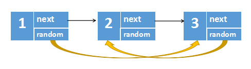
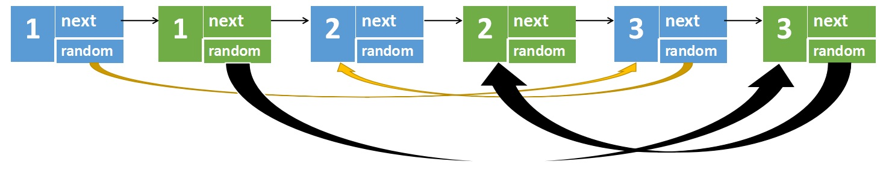
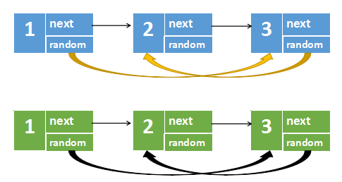
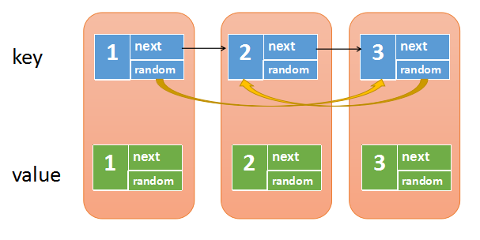
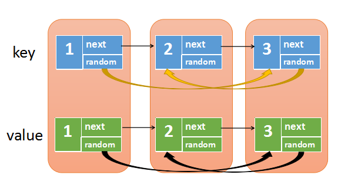

> 原文链接: https://leetcode-cn.com/problems/copy-list-with-random-pointer


## 英文原文
<div><p>A linked list of length <code>n</code> is given such that each node contains an additional random pointer, which could point to any node in the list, or <code>null</code>.</p>

<p>Construct a <a href="https://en.wikipedia.org/wiki/Object_copying#Deep_copy" target="_blank"><strong>deep copy</strong></a> of the list. The deep copy should consist of exactly <code>n</code> <strong>brand new</strong> nodes, where each new node has its value set to the value of its corresponding original node. Both the <code>next</code> and <code>random</code> pointer of the new nodes should point to new nodes in the copied list such that the pointers in the original list and copied list represent the same list state. <strong>None of the pointers in the new list should point to nodes in the original list</strong>.</p>

<p>For example, if there are two nodes <code>X</code> and <code>Y</code> in the original list, where <code>X.random --&gt; Y</code>, then for the corresponding two nodes <code>x</code> and <code>y</code> in the copied list, <code>x.random --&gt; y</code>.</p>

<p>Return <em>the head of the copied linked list</em>.</p>

<p>The linked list is represented in the input/output as a list of <code>n</code> nodes. Each node is represented as a pair of <code>[val, random_index]</code> where:</p>

<ul>
	<li><code>val</code>: an integer representing <code>Node.val</code></li>
	<li><code>random_index</code>: the index of the node (range from <code>0</code> to <code>n-1</code>) that the <code>random</code> pointer points to, or <code>null</code> if it does not point to any node.</li>
</ul>

<p>Your code will <strong>only</strong> be given the <code>head</code> of the original linked list.</p>

<p>&nbsp;</p>
<p><strong>Example 1:</strong></p>

<pre>
<strong>Input:</strong> head = [[7,null],[13,0],[11,4],[10,2],[1,0]]
<strong>Output:</strong> [[7,null],[13,0],[11,4],[10,2],[1,0]]
</pre>

<p><strong>Example 2:</strong></p>

<pre>
<strong>Input:</strong> head = [[1,1],[2,1]]
<strong>Output:</strong> [[1,1],[2,1]]
</pre>

<p><strong>Example 3:</strong></p>

<p><strong></strong></p>

<pre>
<strong>Input:</strong> head = [[3,null],[3,0],[3,null]]
<strong>Output:</strong> [[3,null],[3,0],[3,null]]
</pre>

<p><strong>Example 4:</strong></p>

<pre>
<strong>Input:</strong> head = []
<strong>Output:</strong> []
<strong>Explanation:</strong> The given linked list is empty (null pointer), so return null.
</pre>

<p>&nbsp;</p>
<p><strong>Constraints:</strong></p>

<ul>
	<li><code>0 &lt;= n &lt;= 1000</code></li>
	<li><code>-10000 &lt;= Node.val &lt;= 10000</code></li>
	<li><code>Node.random</code> is <code>null</code> or is pointing to some node in the linked list.</li>
</ul>
</div>

## 中文题目
<div><p>给你一个长度为 <code>n</code> 的链表，每个节点包含一个额外增加的随机指针 <code>random</code> ，该指针可以指向链表中的任何节点或空节点。</p>

<p>构造这个链表的 <strong><a href="https://baike.baidu.com/item/深拷贝/22785317?fr=aladdin" target="_blank">深拷贝</a></strong>。 深拷贝应该正好由 <code>n</code> 个 <strong>全新</strong> 节点组成，其中每个新节点的值都设为其对应的原节点的值。新节点的 <code>next</code> 指针和 <code>random</code> 指针也都应指向复制链表中的新节点，并使原链表和复制链表中的这些指针能够表示相同的链表状态。<strong>复制链表中的指针都不应指向原链表中的节点 </strong>。</p>

<p>例如，如果原链表中有 <code>X</code> 和 <code>Y</code> 两个节点，其中 <code>X.random --> Y</code> 。那么在复制链表中对应的两个节点 <code>x</code> 和 <code>y</code> ，同样有 <code>x.random --> y</code> 。</p>

<p>返回复制链表的头节点。</p>

<p>用一个由 <code>n</code> 个节点组成的链表来表示输入/输出中的链表。每个节点用一个 <code>[val, random_index]</code> 表示：</p>

<ul>
	<li><code>val</code>：一个表示 <code>Node.val</code> 的整数。</li>
	<li><code>random_index</code>：随机指针指向的节点索引（范围从 <code>0</code> 到 <code>n-1</code>）；如果不指向任何节点，则为  <code>null</code> 。</li>
</ul>

<p>你的代码 <strong>只</strong> 接受原链表的头节点 <code>head</code> 作为传入参数。</p>

<p> </p>

<p><strong>示例 1：</strong></p>

<p></p>

<pre>
<strong>输入：</strong>head = [[7,null],[13,0],[11,4],[10,2],[1,0]]
<strong>输出：</strong>[[7,null],[13,0],[11,4],[10,2],[1,0]]
</pre>

<p><strong>示例 2：</strong></p>

<p></p>

<pre>
<strong>输入：</strong>head = [[1,1],[2,1]]
<strong>输出：</strong>[[1,1],[2,1]]
</pre>

<p><strong>示例 3：</strong></p>

<p><strong></strong></p>

<pre>
<strong>输入：</strong>head = [[3,null],[3,0],[3,null]]
<strong>输出：</strong>[[3,null],[3,0],[3,null]]
</pre>

<p><strong>示例 4：</strong></p>

<pre>
<strong>输入：</strong>head = []
<strong>输出：</strong>[]
<strong>解释：</strong>给定的链表为空（空指针），因此返回 null。
</pre>

<p> </p>

<p><strong>提示：</strong></p>

<ul>
	<li><code>0 <= n <= 1000</code></li>
	<li><code>-10000 <= Node.val <= 10000</code></li>
	<li><code>Node.random</code> 为空（null）或指向链表中的节点。</li>
</ul>
</div>

## 通过代码
<RecoDemo>
</RecoDemo>


## 高赞题解
## 解法一

这题的最大难点就在于**复制随机指针**，比如下图中   

- 节点**1**的随机指针指向节点**3**   

- 节点**3**的随机指针指向节点**2**   

- 节点**2**的随机指针指向空   




我们可以用三步走来搞定这个问题   

**第一步**，根据遍历到的原节点创建对应的新节点，每个新创建的节点是在原节点后面，比如下图中原节点**1**不再指向原原节点**2**，而是指向新节点**1**   


**第二步**是最关键的一步，用来设置新链表的随机指针   



上图中，我们可以观察到这么一个规律   

- 原节点1的随机指针指向原节点3，新节点1的随机指针指向的是原节点3的next   

- 原节点3的随机指针指向原节点2，新节点3的随机指针指向的是原节点2的next  


也就是，原节点```i```的随机指针(如果有的话)，指向的是原节点```j```   

那么新节点```i```的随机指针，指向的是原节点```j```的**next**  

   

**第三步**就简单了，只要将两个链表分离开，再返回新链表就可以了




代码实现:

```java []

class Solution {

    public Node copyRandomList(Node head) {

        if(head==null) {

            return null;

        }

        Node p = head;

        //第一步，在每个原节点后面创建一个新节点

        //1->1'->2->2'->3->3'

        while(p!=null) {

            Node newNode = new Node(p.val);

            newNode.next = p.next;

            p.next = newNode;

            p = newNode.next;

        }

        p = head;

        //第二步，设置新节点的随机节点

        while(p!=null) {

            if(p.random!=null) {

                p.next.random = p.random.next;

            }

            p = p.next.next;

        }

        Node dummy = new Node(-1);

        p = head;

        Node cur = dummy;

        //第三步，将两个链表分离

        while(p!=null) {

            cur.next = p.next;

            cur = cur.next;

            p.next = cur.next;

            p = p.next;

        }

        return dummy.next;

    }

}	

```

```python []

class Solution(object):

    def copyRandomList(self, head):

        if not head:

            return None

        p = head

        # 第一步，在每个原节点后面创建一个新节点

        # 1->1'->2->2'->3->3'

        while p:

            new_node = Node(p.val,None,None)

            new_node.next = p.next

            p.next = new_node

            p = new_node.next

        p = head

        # 第二步，设置新节点的随机节点

        while p:

            if p.random:

                p.next.random = p.random.next

            p = p.next.next

        # 第三步，将两个链表分离

        p = head

        dummy = Node(-1,None,None)

        cur = dummy

        while p:

            cur.next = p.next

            cur = cur.next

            p.next = cur.next

            p = p.next

        return dummy.next

```


## 解法二

我们用哈希表来解决这个问题   

首先创建一个哈希表，再遍历原链表，遍历的同时再不断创建新节点   

我们将原节点作为**key**，新节点作为**value**放入哈希表中    




第二步我们再遍历原链表，这次我们要将新链表的next和random指针给设置上   




从上图中我们可以发现，原节点和新节点是一一对应的关系，所以   

- map.get(原节点)，得到的就是对应的新节点    

- map.get(原节点.next)，得到的就是对应的新节点.next   

- map.get(原节点.random)，得到的就是对应的新节点.random   


所以，我们只需要再次遍历原链表，然后设置：   

新节点.next -> map.get(原节点.next)    

新节点.random -> map.get(原节点.random)      

这样新链表的next和random都被串联起来了   

最后，我们然后```map.get(head)```，也就是对应的新链表的头节点，就可以解决此问题了。   


代码实现:

```java []

class Solution {

    public Node copyRandomList(Node head) {

        if(head==null) {

            return null;

        }

        //创建一个哈希表，key是原节点，value是新节点

        Map<Node,Node> map = new HashMap<Node,Node>();

        Node p = head;

        //将原节点和新节点放入哈希表中

        while(p!=null) {

            Node newNode = new Node(p.val);

            map.put(p,newNode);

            p = p.next;

        }

        p = head;

        //遍历原链表，设置新节点的next和random

        while(p!=null) {

            Node newNode = map.get(p);

            //p是原节点，map.get(p)是对应的新节点，p.next是原节点的下一个

            //map.get(p.next)是原节点下一个对应的新节点

            if(p.next!=null) {

                newNode.next = map.get(p.next);

            }

            //p.random是原节点随机指向

            //map.get(p.random)是原节点随机指向  对应的新节点 

            if(p.random!=null) {

                newNode.random = map.get(p.random);

            }

            p = p.next;

        }

        //返回头结点，即原节点对应的value(新节点)

        return map.get(head);

    }

}

```

```python []

class Solution(object):

    def copyRandomList(self, head):

        if not head:

            return None

        # 创建一个哈希表，key是原节点，value是新节点    

        d = dict()

        p = head

        # 将原节点和新节点放入哈希表中

        while p:

            new_node = Node(p.val,None,None)

            d[p] = new_node

            p = p.next

        p = head

        # 遍历原链表，设置新节点的next和random

        while p:

            # p是原节点，d[p]是对应的新节点，p.next是原节点的下一个

            # d[p.next]是原节点下一个对应的新节点

            if p.next:

                d[p].next = d[p.next]

            # p.random是原节点随机指向

            # d[p.random]是原节点随机指向  对应的新节点    

            if p.random:

                d[p].random = d[p.random]

            p = p.next

        # 返回头结点，即原节点对应的value(新节点)

        return d[head]

```


## 统计信息
| 通过次数 | 提交次数 | AC比率 |
| :------: | :------: | :------: |
|    120400    |    181939    |   66.2%   |

## 提交历史
| 提交时间 | 提交结果 | 执行时间 |  内存消耗  | 语言 |
| :------: | :------: | :------: | :--------: | :--------: |


## 相似题目
|                             题目                             | 难度 |
| :----------------------------------------------------------: | :---------: |
| [克隆图](https://leetcode-cn.com/problems/clone-graph/) | 中等|
