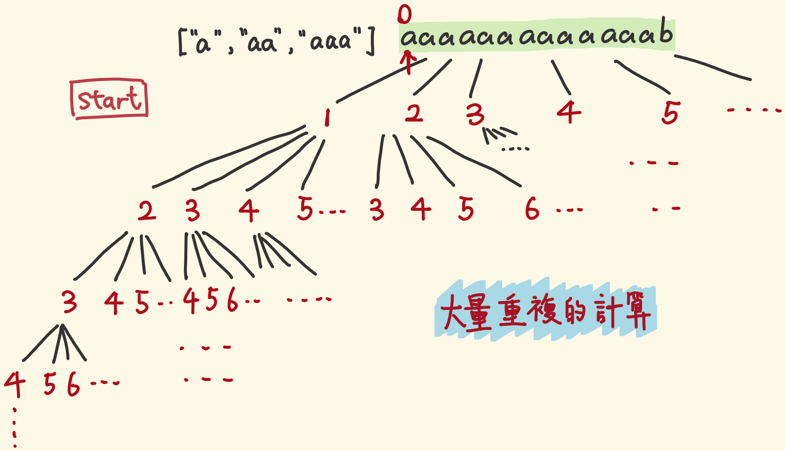
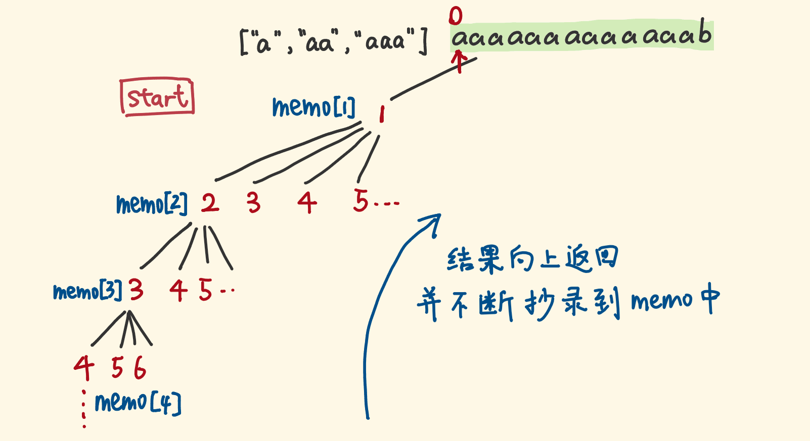
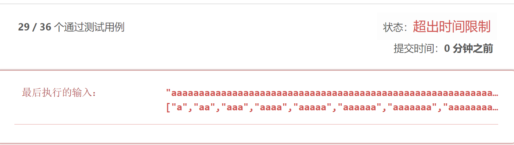
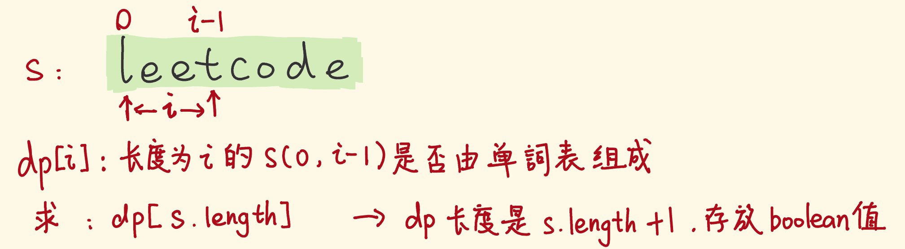

> 原文链接: https://leetcode-cn.com/problems/word-break


## 英文原文
<div><p>Given a string <code>s</code> and a dictionary of strings <code>wordDict</code>, return <code>true</code> if <code>s</code> can be segmented into a space-separated sequence of one or more dictionary words.</p>

<p><strong>Note</strong> that the same word in the dictionary may be reused multiple times in the segmentation.</p>

<p>&nbsp;</p>
<p><strong>Example 1:</strong></p>

<pre>
<strong>Input:</strong> s = &quot;leetcode&quot;, wordDict = [&quot;leet&quot;,&quot;code&quot;]
<strong>Output:</strong> true
<strong>Explanation:</strong> Return true because &quot;leetcode&quot; can be segmented as &quot;leet code&quot;.
</pre>

<p><strong>Example 2:</strong></p>

<pre>
<strong>Input:</strong> s = &quot;applepenapple&quot;, wordDict = [&quot;apple&quot;,&quot;pen&quot;]
<strong>Output:</strong> true
<strong>Explanation:</strong> Return true because &quot;applepenapple&quot; can be segmented as &quot;apple pen apple&quot;.
Note that you are allowed to reuse a dictionary word.
</pre>

<p><strong>Example 3:</strong></p>

<pre>
<strong>Input:</strong> s = &quot;catsandog&quot;, wordDict = [&quot;cats&quot;,&quot;dog&quot;,&quot;sand&quot;,&quot;and&quot;,&quot;cat&quot;]
<strong>Output:</strong> false
</pre>

<p>&nbsp;</p>
<p><strong>Constraints:</strong></p>

<ul>
	<li><code>1 &lt;= s.length &lt;= 300</code></li>
	<li><code>1 &lt;= wordDict.length &lt;= 1000</code></li>
	<li><code>1 &lt;= wordDict[i].length &lt;= 20</code></li>
	<li><code>s</code> and <code>wordDict[i]</code> consist of only lowercase English letters.</li>
	<li>All the strings of <code>wordDict</code> are <strong>unique</strong>.</li>
</ul>
</div>

## 中文题目
<div><p>给你一个字符串 <code>s</code> 和一个字符串列表 <code>wordDict</code> 作为字典，判定&nbsp;<code>s</code> 是否可以由空格拆分为一个或多个在字典中出现的单词。</p>

<p><strong>说明：</strong>拆分时可以重复使用字典中的单词。</p>

<p>&nbsp;</p>

<p><strong>示例 1：</strong></p>

<pre>
<strong>输入:</strong> s = "leetcode", wordDict = ["leet", "code"]
<strong>输出:</strong> true
<strong>解释:</strong> 返回 true 因为 "leetcode" 可以被拆分成 "leet code"。
</pre>

<p><strong>示例 2：</strong></p>

<pre>
<strong>输入:</strong> s = "applepenapple", wordDict = ["apple", "pen"]
<strong>输出:</strong> true
<strong>解释:</strong> 返回 true 因为 <code>"</code>applepenapple<code>"</code> 可以被拆分成 <code>"</code>apple pen apple<code>"</code>。
&nbsp;    注意你可以重复使用字典中的单词。
</pre>

<p><strong>示例 3：</strong></p>

<pre>
<strong>输入:</strong> s = "catsandog", wordDict = ["cats", "dog", "sand", "and", "cat"]
<strong>输出:</strong> false
</pre>

<p>&nbsp;</p>

<p><strong>提示：</strong></p>

<ul>
	<li><code>1 &lt;= s.length &lt;= 300</code></li>
	<li><code>1 &lt;= wordDict.length &lt;= 1000</code></li>
	<li><code>1 &lt;= wordDict[i].length &lt;= 20</code></li>
	<li><code>s</code> 和 <code>wordDict[i]</code> 仅有小写英文字母组成</li>
	<li><code>wordDict</code> 中的所有字符串 <strong>互不相同</strong></li>
</ul>
</div>

## 通过代码
<RecoDemo>
</RecoDemo>


## 高赞题解
早安，今天是端午，这道题很经典，很多题有它的影子，一起啃下。

#### DFS 思路

- `"leetcode"`能否 break，可以拆分为：

	- `"l"`是否是单词表的单词、剩余子串能否 break。

	- `"le"`是否是单词表的单词、剩余子串能否 break。

	-  `"lee"`...以此类推

- 用 DFS 回溯，考察所有的拆分可能，指针从左往右扫描：

  - 如果指针的左侧部分是单词，则对剩余子串递归考察。

  - 如果指针的左侧部分不是单词，不用看了，回溯，考察别的分支。


我画出递归树，即问题的解的空间树：


#### DFS 代码（看注释辅助理解）

通过23/36个用例，遇到下面这个用例超时：

"aaaaaaaaaaaaaaaaaaaaaaaaaaaaaaaaaaaaaaaaaaaaaaaaaaaaaaaaaaaaaaaaaaaaaaaaaaaaaaaaaaaaaaaaaaaaaaaaaaaaaaaaaaaaaaaaaaaaaaaaaaaaaaaaaaaaaaaaaaaaaaaaaaaaaab,["a","aa","aaa","aaaa","aaaaa","aaaaaa","aaaaaaa","aaaaaaaa","aaaaaaaaa","aaaaaaaaaa"]

```javascript []

const wordBreak = (s, wordDict) => {

	const len = s.length;

  	const wordSet = new Set(wordDict);


	const canBreak = (start) => { // 判断从start到末尾的子串能否break

		if (start == len) {//指针越界，s一步步成功划分为单词，才走到越界这步，现在没有剩余子串

			return true;   //返回真，结束递归

		}

		for (let i = start + 1; i <= len; i++) { //指针i去划分两部分，for枚举出当前所有的选项i

			const prefix = s.slice(start, i);    // 切出的前缀部分

			if (wordSet.has(prefix) && canBreak(i)) {// 前缀部分是单词，且剩余子串能break，返回真

				return true;                            

			} // 如果前缀部分不是单词，就不会执行canBreak(i)。进入下一轮迭代，再切出一个前缀串，再试

		}

		return false; // 指针i怎么划分，都没有返回true，则返回false

	}


	return canBreak(0); // 递归的入口，从0到末尾的子串能否break

}

```

```golang []

func canBreak(start int, s string, wordMap map[string]bool) bool {

	if start == len(s) {

		return true

	}

	for i := start + 1; i <= len(s); i++ {

		prefix := s[start:i]

		if wordMap[prefix] && canBreak(i, s, wordMap) {

			return true

		}

	}

	return false

}


func wordBreak(s string, wordDict []string) bool {

	wordMap := map[string]bool{}

	for _, v := range wordDict {

		wordMap[v] = true

	}

	return canBreak(0, s, wordMap)

}

```


#### 加入记忆化

- 下面这个例子中，start 指针代表了节点的状态，可以看到，做了大量重复计算：



- 用一个数组，存储计算的结果，数组索引为指针位置，值为计算的结果。下次遇到相同的子问题，直接返回命中的缓存值，就不用调重复的递归。




#### DFS + 记忆化 代码

```js []

const wordBreak = (s, wordDict) => {

  const len = s.length;

  const wordSet = new Set(wordDict);

  const memo = new Array(len);


  const canBreak = (start) => {

    if (start == len) return true;

    if (memo[start] !== undefined) return memo[start]; // memo中有，就用memo中的


    for (let i = start + 1; i <= len; i++) {

      const prefix = s.slice(start, i);

      if (wordSet.has(prefix) && canBreak(i)) {

        memo[start] = true; // 当前递归的结果存一下

        return true;

      }

    }

    memo[start] = false; // 当前递归的结果存一下

    return false;

  };

  return canBreak(0);

};

```


```golang []

func canBreak(start int, s string, wordMap map[string]bool, memo map[int]bool) bool {

	if start == len(s) {

		return true

	}

	if res, ok := memo[start]; ok {

		return res

	}

	for i := start + 1; i <= len(s); i++ {

		prefix := s[start:i]

		if wordMap[prefix] && canBreak(i, s, wordMap, memo) {

			memo[start] = true

			return true

		}

	}

	memo[start] = false

	return false

}


func wordBreak(s string, wordDict []string) bool {

	wordMap := map[string]bool{}

	for _, v := range wordDict {

		wordMap[v] = true

	}

	memo := make(map[int]bool)

	return canBreak(0, s, wordMap, memo)

}

```


#### BFS 方法 

- 刚才我们用DFS遍历空间树，当然也能用BFS。

- 维护一个队列，依然用指针描述一个节点。

- 起初，指针 0 入列，然后它出列，指针 1,2,3,4,5,6,7,8 是它的子节点，它们分别与 0 围出前缀子串，若是单词，让它入列，留作考察以它为起点的剩余子串；若不是单词，对应的指针不入列

- 然后重复这么做：节点（指针）出列，考察它的子节点，能入列的就入列、再出列……

- **直到**指针越界，没有剩余子串了，没有指针可入列，如果前缀子串是单词，说明之前一直在切出单词，返回 true。

- 如果整个BFS过程，始终没有返回true，则返回 false。


#### BFS 代码

```js []

const wordBreak = (s, wordDict) => {

  const wordSet = new Set(wordDict);

  const len = s.length;

  const queue = [];

  queue.push(0);


  while (queue.length != 0) {

    const start = queue.shift(); 	// 考察出列的指针

    for (let i = start + 1; i <= len; i++) { // i指针去划分两部分

      const prefix = s.slice(start, i);      // 切出前缀部分

      if (wordSet.has(prefix)) { // 前缀部分是单词

        if (i < len) { // i还没越界，还能继续划分，让它入列，作为下一层待考察的节点

          queue.push(i);

        } else { // i==len，指针越界，说明s串一路被切出单词，现在没有剩余子串，返回true

          return true;

        }

      } // 前缀部分不是单词，这个 i 指针不入列，继续下轮迭代，切出下一个前缀部分，再试

    }

  }

  return false; // BFS完所有节点（考察了所有划分的可能）都没返回true，则返回false

};

```

```go []

func wordBreak(s string, wordDict []string) bool {

	l := len(s)

	wordMap := map[string]bool{}

	for _, v := range wordDict {

		wordMap[v] = true

	}

	queue := []int{}

	queue = append(queue, 0)


	for len(queue) != 0 {

		start := queue[0]

		queue = queue[1:]

		for i := start + 1; i <= l; i++ {

			prefix := s[start:i]

			if wordMap[prefix] {

				if i < l {

					queue = append(queue, i)

				} else {

					return true

				}

			}

		}

	}

	return false

}

```


看似没有问题，但同样的，遇到下面的例子就超时。





#### BFS 避免访问重复的节点

未剪枝的DFS会搜索重复的子树，BFS也一样。你可以想想该用例，BFS是如何重复访问节点。


解决：用一个 visited 数组记录访问过的节点，出列考察一个指针时，存在重复则跳过。


#### 优化后的 BFS 代码

```js []

const wordBreak = (s, wordDict) => {

  const wordSet = new Set(wordDict);

  const len = s.length;

  const visited = new Array(len);


  const queue = [];

  queue.push(0);


  while (queue.length) {

    const start = queue.shift();  // 考察出列的指针

    if (visited[start]) continue; // 是访问过的，跳过

    visited[start] = true;        // 未访问过的，记录一下


    for (let i = start + 1; i <= len; i++) { // 用指针i去划分两部分

      const prefix = s.slice(start, i);      // 前缀部分

      if (wordSet.has(prefix)) {  // 前缀部分是单词

        if (i < len) {            // i还没越界，还能继续划分，让它入列，作为下一层待考察的节点

          queue.push(i);

        } else {  // i==len，指针越界，说明s串一路被切出单词，现在没有剩余子串，不用划分，返回true

          return true;

        }

      } // 前缀部分不是单词，i指针不入列，继续下轮迭代，切出下一个前缀部分，再试

    }

  }

  return false; // BFS完所有节点（考察了所有划分的可能）都没返回true，则返回false

};

```

```go []

func wordBreak(s string, wordDict []string) bool {

	l := len(s)

	wordMap := map[string]bool{}

	for _, v := range wordDict {

		wordMap[v] = true

	}

	queue := []int{}

	queue = append(queue, 0)

	visited := map[int]bool{}


	for len(queue) != 0 {

		start := queue[0]

		queue = queue[1:]

		if visited[start] {

			continue

		}

		visited[start] = true

		for i := start + 1; i <= l; i++ {

			prefix := s[start:i]

			if wordMap[prefix] {

				if i < l {

					queue = append(queue, i)

				} else {

					return true

				}

			}

		}

	}

	return false

}

```


#### 方法3：动态规划

- s 串能否分解为单词表的单词（前 s.length 个字符的 s 串能否分解为单词表单词）。

- 将大问题分解为规模小一点的子问题：

  - 前 $i$ 个字符的子串，能否分解成单词

  - 剩余子串，是否为单个单词。

- `dp[i]`：长度为`i`的`s[0:i-1]`子串是否能拆分成单词。题目求:`dp[s.length]`





#### 状态转移方程

- 类似的，我们用指针 `j` 去划分`s[0:i]` 子串，如下图：

- `s[0:i]` 子串对应 `dp[i+1]` ，它是否为 true（`s[0:i]`能否 break），取决于两点：

  - 它的前缀子串 `s[0:j-1]` 的 `dp[j]`，是否为 true。

  - 剩余子串 `s[j:i]`，是否是单词表的单词。


#### base case

 - base case 为`dp[0] = true`。即，长度为 0 的`s[0:-1]`**能**拆分成单词表单词。

 - 这看似荒谬，但这**只是为了**让边界情况也能套用状态转移方程，而已。

 - 当 j = 0 时（上图黄色前缀串为空串），`s[0:i]`的`dp[i+1]`，取决于`s[0:-1]`的`dp[0]`，和，剩余子串`s[0:i]`是否是单个单词。

 - 只有让`dp[0]`为真，`dp[i+1]`才会只取决于`s[0:i]`是否为单个单词，才能用上这个状态转移方程。

#### 动态规划 代码

```js []

const wordBreak = (s, wordDict) => {

  const wordSet = new Set(wordDict);

  const len = s.length;

  const dp = new Array(len + 1).fill(false);

  dp[0] = true;


  for (let i = 1; i <= len; i++) {

    for (let j = i - 1; j >= 0; j--) {    // j去划分成两部分

      const suffix = s.slice(j, i);       // 后缀部分 s[j: i-1]

      if (wordSet.has(suffix) && dp[j]) { // 后缀部分是单词，且左侧子串[0,j-1]的dp[j]为真

        dp[i] = true;

        break;  // dp[i] = true了，i长度的子串已经可以拆成单词了，不需要j继续划分子串了

      }

    }

  }

  return dp[len];

};

```

```go []

func wordBreak(s string, wordDict []string) bool {

	l := len(s)

	wordMap := map[string]bool{}

	for _, v := range wordDict {

		wordMap[v] = true

	}

	dp := make([]bool, l+1)

	dp[0] = true


	for i := 1; i <= l; i++ {

		for j := i - 1; j >= 0; j-- {

			suffix := s[j:i]

			if wordMap[suffix] && dp[j] {

				dp[i] = true

				break

			}

		}

	}

	return dp[l]

}

```


#### 动态规划 优化 代码

- 迭代过程中，如果发现`dp[i] == true` ，直接break

- 如果`dp[j] == false`，`dp[i]`没有为 true 的可能，continue，考察下一个 j

```js []

var wordBreak = function (s, wordDict) {

  const wordSet = new Set(wordDict);

  const len = s.length;

  const dp = new Array(len + 1).fill(false);

  dp[0] = true;

  for (let i = 1; i <= len; i++) {

    for (let j = i - 1; j >= 0; j--) {

      if (dp[i] == true) break;

      if (dp[j] == false) continue;

      const suffix = s.slice(j, i);

      if (wordSet.has(suffix) && dp[j] == true) {

        dp[i] = true;

        break;

      }

    }

  }

  return dp[s.length];

};

```

```go []

func wordBreak(s string, wordDict []string) bool {

	wordMap := map[string]bool{}

	for _, v := range wordDict {

		wordMap[v] = true

	}

	dp := make([]bool, len(s)+1)

	dp[0] = true


	for i := 1; i <= len(s); i++ {

		for j := i - 1; j >= 0; j-- {

			if dp[i] == true {

				break

			}

			if dp[j] == false {

				continue

			}

			suffix := s[j:i]

			if wordMap[suffix] && dp[j] {

				dp[i] = true

				break

			}

		}

	}

  return dp[len(s)]

}

```


#### 本文在行文组织、用词表述上改了几十遍，一直在读改，你应该可以感受到这份真诚。可以点个赞鼓励一下。


最后修改于：2021-09-08

## 统计信息
| 通过次数 | 提交次数 | AC比率 |
| :------: | :------: | :------: |
|    214176    |    413065    |   51.9%   |

## 提交历史
| 提交时间 | 提交结果 | 执行时间 |  内存消耗  | 语言 |
| :------: | :------: | :------: | :--------: | :--------: |


## 相似题目
|                             题目                             | 难度 |
| :----------------------------------------------------------: | :---------: |
| [单词拆分 II](https://leetcode-cn.com/problems/word-break-ii/) | 困难|
