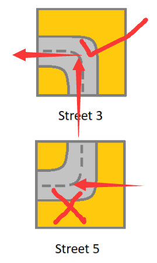

> 原文链接: https://leetcode-cn.com/problems/check-if-there-is-a-valid-path-in-a-grid


## 英文原文
<div>Given a <em>m</em> x <em>n</em> <code>grid</code>. Each cell of the <code>grid</code> represents a street. The street of&nbsp;<code>grid[i][j]</code> can be:
<ul>
	<li><strong>1</strong> which means a street connecting the left cell and the right cell.</li>
	<li><strong>2</strong> which means a street connecting the upper cell and the lower cell.</li>
	<li><b>3</b>&nbsp;which means a street connecting the left cell and the lower cell.</li>
	<li><b>4</b> which means a street connecting the right cell and the lower cell.</li>
	<li><b>5</b> which means a street connecting the left cell and the upper cell.</li>
	<li><b>6</b> which means a street connecting the right cell and the upper cell.</li>
</ul>

<p></p>

<p>You will initially start at the street of the&nbsp;upper-left cell <code>(0,0)</code>. A valid path in the grid is a path which starts from the upper left&nbsp;cell <code>(0,0)</code> and ends at the bottom-right&nbsp;cell <code>(m - 1, n - 1)</code>. <strong>The path should only follow the streets</strong>.</p>

<p><strong>Notice</strong> that you are <strong>not allowed</strong> to change any street.</p>

<p>Return <i>true</i>&nbsp;if there is a valid path in the grid or <em>false</em> otherwise.</p>

<p>&nbsp;</p>
<p><strong>Example 1:</strong></p>

<pre>
<strong>Input:</strong> grid = [[2,4,3],[6,5,2]]
<strong>Output:</strong> true
<strong>Explanation:</strong> As shown you can start at cell (0, 0) and visit all the cells of the grid to reach (m - 1, n - 1).
</pre>

<p><strong>Example 2:</strong></p>

<pre>
<strong>Input:</strong> grid = [[1,2,1],[1,2,1]]
<strong>Output:</strong> false
<strong>Explanation:</strong> As shown you the street at cell (0, 0) is not connected with any street of any other cell and you will get stuck at cell (0, 0)
</pre>

<p><strong>Example 3:</strong></p>

<pre>
<strong>Input:</strong> grid = [[1,1,2]]
<strong>Output:</strong> false
<strong>Explanation:</strong> You will get stuck at cell (0, 1) and you cannot reach cell (0, 2).
</pre>

<p><strong>Example 4:</strong></p>

<pre>
<strong>Input:</strong> grid = [[1,1,1,1,1,1,3]]
<strong>Output:</strong> true
</pre>

<p><strong>Example 5:</strong></p>

<pre>
<strong>Input:</strong> grid = [[2],[2],[2],[2],[2],[2],[6]]
<strong>Output:</strong> true
</pre>

<p>&nbsp;</p>
<p><strong>Constraints:</strong></p>

<ul>
	<li><code>m == grid.length</code></li>
	<li><code>n == grid[i].length</code></li>
	<li><code>1 &lt;= m, n &lt;= 300</code></li>
	<li><code>1 &lt;= grid[i][j] &lt;= 6</code></li>
</ul>
</div>

## 中文题目
<div><p>给你一个 <em>m</em> x <em>n</em> 的网格 <code>grid</code>。网格里的每个单元都代表一条街道。<code>grid[i][j]</code> 的街道可以是：</p>

<ul>
	<li><strong>1</strong> 表示连接左单元格和右单元格的街道。</li>
	<li><strong>2</strong> 表示连接上单元格和下单元格的街道。</li>
	<li><strong>3</strong>&nbsp;表示连接左单元格和下单元格的街道。</li>
	<li><strong>4</strong> 表示连接右单元格和下单元格的街道。</li>
	<li><strong>5</strong> 表示连接左单元格和上单元格的街道。</li>
	<li><strong>6</strong> 表示连接右单元格和上单元格的街道。</li>
</ul>

<p></p>

<p>你最开始从左上角的单元格 <code>(0,0)</code> 开始出发，网格中的「有效路径」是指从左上方的单元格 <code>(0,0)</code> 开始、一直到右下方的 <code>(m-1,n-1)</code> 结束的路径。<strong>该路径必须只沿着街道走</strong>。</p>

<p><strong>注意：</strong>你 <strong>不能</strong> 变更街道。</p>

<p>如果网格中存在有效的路径，则返回 <code>true</code>，否则返回 <code>false</code> 。</p>

<p>&nbsp;</p>

<p><strong>示例 1：</strong></p>

<p></p>

<pre><strong>输入：</strong>grid = [[2,4,3],[6,5,2]]
<strong>输出：</strong>true
<strong>解释：</strong>如图所示，你可以从 (0, 0) 开始，访问网格中的所有单元格并到达 (m - 1, n - 1) 。
</pre>

<p><strong>示例 2：</strong></p>

<p></p>

<pre><strong>输入：</strong>grid = [[1,2,1],[1,2,1]]
<strong>输出：</strong>false
<strong>解释：</strong>如图所示，单元格 (0, 0) 上的街道没有与任何其他单元格上的街道相连，你只会停在 (0, 0) 处。
</pre>

<p><strong>示例 3：</strong></p>

<pre><strong>输入：</strong>grid = [[1,1,2]]
<strong>输出：</strong>false
<strong>解释：</strong>你会停在 (0, 1)，而且无法到达 (0, 2) 。
</pre>

<p><strong>示例 4：</strong></p>

<pre><strong>输入：</strong>grid = [[1,1,1,1,1,1,3]]
<strong>输出：</strong>true
</pre>

<p><strong>示例 5：</strong></p>

<pre><strong>输入：</strong>grid = [[2],[2],[2],[2],[2],[2],[6]]
<strong>输出：</strong>true
</pre>

<p>&nbsp;</p>

<p><strong>提示：</strong></p>

<ul>
	<li><code>m == grid.length</code></li>
	<li><code>n == grid[i].length</code></li>
	<li><code>1 &lt;= m, n &lt;= 300</code></li>
	<li><code>1 &lt;= grid[i][j] &lt;= 6</code></li>
</ul>
</div>

## 通过代码
<RecoDemo>
</RecoDemo>


## 高赞题解
# 解题思路：
#### 通过构建pipe数组，将每个拼图转化为四个方向上的移动限制图。
## 例：
 `pipe[3][2]=3`，代表**3**号拼图可以由**向上**的方向进入其中，并转向**左方向**继续前进。

 `pipe[5][3]=-1`，代表**5**号拼图**不**可以由**向左**的方向进入其中。
#### 其中0代表向下、1代表向右、2代表向上、3代表向左、-1代表不可走

#### 这之后问题就变成了一个简单的DFS了
```
class Solution {
    int m,n,dx[4]={1,0,-1,0},dy[4]={0,1,0,-1};//0下、1右、2上、3左
    int pipe[7][4]={{-1,-1,-1,-1},{-1,1,-1,3},{0,-1,2,-1},{-1,0,3,-1},{-1,-1,1,0},{3,2,-1,-1},{1,-1,-1,2}};
    //记录各个拼图块路径的方向，0、1、2、3代表方向，-1代表不可走。
    bool dfs(int x,int y,int dir,vector<vector<int>>& grid){//(x,y,当前方向,地图)
        if(x==m-1&&y==n-1) return 1;//到达终点
        int xx=x+dx[dir];
        int yy=y+dy[dir];//得到下一个准备走的坐标
        if(xx<0||yy<0||xx>=m||yy>=n)return 0;//越界
        int nxt=grid[xx][yy];//得到下一块拼图的编号
        if(pipe[nxt][dir]!=-1)return dfs(xx,yy,pipe[nxt][dir],grid);//如果当前方向可走，则方向改变，继续走。
        return 0;//无法走，返回0
    }
    public:
    bool hasValidPath(vector<vector<int>>& grid) {    
        m=grid.size();
        n=grid[0].size();
        int sta=grid[0][0];//起点的拼图编号
        for(int i=0;i<4;++i)//朝着四个方向都试一下
            if(pipe[sta][i]!=-1)//当前方向可以走
                if(dfs(0,0,pipe[sta][i],grid))//沿着当前方向搜索
                    return 1;//拼图都有两个方向可以走，只要沿着一个初始方向走通就可以。
        return 0;
    }
};
```

## 3.23 updata
#### 之前是加了vis数组判断是否访问过的，之后感觉没啥用，就删掉了，发现也能过题目，便没再多想。
#### 这里很感谢[@study11](/u/study11/) [@xm9304](/u/xm9304/)同学的质疑
#### 同时很感谢[@mapleking](/u/mapleking/)同学的指正。
#### 之后，再[@LeetCode](/u/leetcode/)加一下测试用例。


```
class Solution {
    int m,n,dx[4]={1,0,-1,0},dy[4]={0,1,0,-1};//0下、1右、2上、3左
    int pipe[7][4]={
        {-1,-1,-1,-1},
        {-1,1,-1,3},
        {0,-1,2,-1},
        {-1,0,3,-1},
        {-1,-1,1,0},
        {3,2,-1,-1},
        {1,-1,-1,2}
    };
    //记录各个拼图块路径的方向，0、1、2、3代表方向，-1代表不可走。
    bool vis[302][302];
    bool dfs(int x,int y,int dir,vector<vector<int>>& grid){//(x,y,当前方向,地图)
        vis[x][y]=1;
        if(x==m-1&&y==n-1) return 1;//到达终点
        int xx=x+dx[dir];
        int yy=y+dy[dir];//得到下一个准备走的坐标
        if(xx<0||yy<0||xx>=m||yy>=n)return 0;//越界
        int nxt=grid[xx][yy];//得到下一块拼图的编号
        if(pipe[nxt][dir]!=-1&&!vis[xx][yy])
            return dfs(xx,yy,pipe[nxt][dir],grid);//如果当前方向可走，则方向改变，继续走。
        return 0;//无法走，返回0
    }
    public:
    bool hasValidPath(vector<vector<int>>& grid) {    
        m=grid.size();
        n=grid[0].size();
        memset(vis,0,sizeof(vis));
        int sta=grid[0][0];//起点的拼图编号
        for(int i=0;i<4;++i)//朝着四个方向都试一下
            if(pipe[sta][i]!=-1)//当前方向可以走
                if(dfs(0,0,pipe[sta][i],grid))//沿着当前方向搜索
                    return 1;//拼图都有两个方向可以走，只要沿着一个初始方向走通就可以。
        return 0;
    }
};
```


## 统计信息
| 通过次数 | 提交次数 | AC比率 |
| :------: | :------: | :------: |
|    6860    |    17077    |   40.2%   |

## 提交历史
| 提交时间 | 提交结果 | 执行时间 |  内存消耗  | 语言 |
| :------: | :------: | :------: | :--------: | :--------: |
