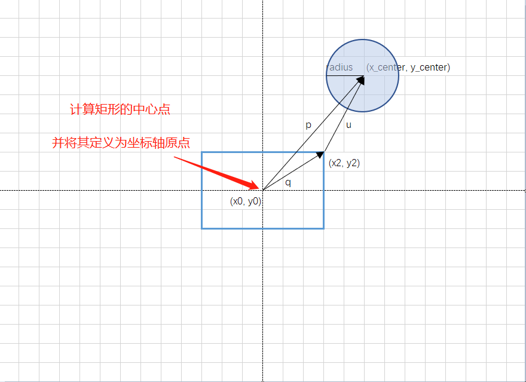

> 原文链接: https://leetcode-cn.com/problems/circle-and-rectangle-overlapping


## 英文原文
<div><p>Given a circle represented as (<code>radius</code>, <code>x_center</code>, <code>y_center</code>)&nbsp;and an axis-aligned rectangle represented as (<code>x1</code>, <code>y1</code>, <code>x2</code>, <code>y2</code>),&nbsp;where (<code>x1</code>, <code>y1</code>) are the coordinates of the bottom-left corner, and (<code>x2</code>, <code>y2</code>) are the coordinates of the top-right corner of the&nbsp;rectangle.</p>

<p>Return True if the circle and rectangle are overlapped otherwise return False.</p>

<p>In other words, check if there are <strong>any </strong>point&nbsp;(xi, yi) such that belongs to the circle and the rectangle at the same time.</p>

<p>&nbsp;</p>
<p><strong>Example 1:</strong></p>

<p></p>

<pre>
<strong>Input:</strong> radius = 1, x_center = 0, y_center = 0, x1 = 1, y1 = -1, x2 = 3, y2 = 1
<strong>Output:</strong> true
<strong>Explanation:</strong> Circle and rectangle share the point (1,0) 
</pre>

<p><strong>Example 2:</strong></p>

<p><strong></strong></p>

<pre>
<strong>Input:</strong> radius = 1, x_center = 0, y_center = 0, x1 = -1, y1 = 0, x2 = 0, y2 = 1
<strong>Output:</strong> true
</pre>

<p><strong>Example 3:</strong></p>

<p><strong></strong></p>

<pre>
<strong>Input:</strong> radius = 1, x_center = 1, y_center = 1, x1 = -3, y1 = -3, x2 = 3, y2 = 3
<strong>Output:</strong> true
</pre>

<p><strong>Example 4:</strong></p>

<pre>
<strong>Input:</strong> radius = 1, x_center = 1, y_center = 1, x1 = 1, y1 = -3, x2 = 2, y2 = -1
<strong>Output:</strong> false
</pre>

<p>&nbsp;</p>
<p><strong>Constraints:</strong></p>

<ul>
	<li><code>1 &lt;= radius &lt;= 2000</code></li>
	<li><code>-10^4 &lt;= x_center, y_center, x1, y1, x2, y2 &lt;= 10^4</code></li>
	<li><code>x1 &lt; x2</code></li>
	<li><code>y1 &lt; y2</code></li>
</ul>
</div>

## 中文题目
<div><p>给你一个以 (<code>radius</code>, <code>x_center</code>, <code>y_center</code>) 表示的圆和一个与坐标轴平行的矩形 (<code>x1</code>, <code>y1</code>, <code>x2</code>, <code>y2</code>)，其中&nbsp;(<code>x1</code>, <code>y1</code>) 是矩形左下角的坐标，(<code>x2</code>, <code>y2</code>) 是右上角的坐标。</p>

<p>如果圆和矩形有重叠的部分，请你返回 True ，否则返回 False&nbsp;。</p>

<p>换句话说，请你检测是否 <strong>存在</strong> 点&nbsp;(xi, yi) ，它既在圆上也在矩形上（两者都包括点落在边界上的情况）。</p>

<p>&nbsp;</p>

<p><strong>示例 1：</strong></p>

<p></p>

<pre><strong>输入：</strong>radius = 1, x_center = 0, y_center = 0, x1 = 1, y1 = -1, x2 = 3, y2 = 1
<strong>输出：</strong>true
<strong>解释：</strong>圆和矩形有公共点 (1,0) 
</pre>

<p><strong>示例 2：</strong></p>

<p><strong></strong></p>

<pre><strong>输入：</strong>radius = 1, x_center = 0, y_center = 0, x1 = -1, y1 = 0, x2 = 0, y2 = 1
<strong>输出：</strong>true
</pre>

<p><strong>示例 3：</strong></p>

<p><strong></strong></p>

<pre><strong>输入：</strong>radius = 1, x_center = 1, y_center = 1, x1 = -3, y1 = -3, x2 = 3, y2 = 3
<strong>输出：</strong>true
</pre>

<p><strong>示例 4：</strong></p>

<pre><strong>输入：</strong>radius = 1, x_center = 1, y_center = 1, x1 = 1, y1 = -3, x2 = 2, y2 = -1
<strong>输出：</strong>false
</pre>

<p>&nbsp;</p>

<p><strong>提示：</strong></p>

<ul>
	<li><code>1 &lt;= radius &lt;= 2000</code></li>
	<li><code>-10^4 &lt;= x_center, y_center, x1, y1, x2, y2 &lt;= 10^4</code></li>
	<li><code>x1 &lt; x2</code></li>
	<li><code>y1 &lt; y2</code></li>
</ul>
</div>

## 通过代码
<RecoDemo>
</RecoDemo>


## 高赞题解



### 思路
1. 计算矩形的中心点 `(x0, y0)`
    11. 将这个点定义为坐标轴原点

2. 计算矩形的中心点到圆心的向量 `p`
    21. 通过绝对值，将圆心转移至第一象限
    22. 在哪个象限并不重要，他们之间是相对关系

3. 计算矩形的中心点到矩形右上角的向量 `q`

4. 通过 `p - q` 得到从矩形右上角到圆心的向量 `u`
    41. 将分量为负数设置为 0 
    42. 分量为负，说明可以找到更短的距离，设置为 0 相当于做垂线
    43. 当 x 和 y 都为负，说明圆心在矩形内

5. 比较 `u` 和圆形半径 `radius` 的长度

### 图解
<,,>


### 答题
```C++ []
    bool checkOverlap(int radius, int x_center, int y_center, int x1, int y1, int x2, int y2) 
    {
        double x0 = (x1 + x2) / 2.0;
        double y0 = (y1 + y2) / 2.0;

        vector<double> p = { abs(x_center - x0) , abs(y_center - y0) };
        vector<double> q = { x2 - x0, y2 - y0 };
        
        vector<double> u = { max(p[0] - q[0], 0.0), max(p[1] - q[1], 0.0) };

        return sqrt(u[0] * u[0] + u[1] * u[1]) <= radius;   
    }
```



### 致谢

学习自 [怎样判断平面上一个矩形和一个圆形是否有重叠？](https://www.zhihu.com/question/24251545)  


感谢您的观看，希望对您有帮助，欢迎热烈的交流！  

**如果感觉还不错就点个赞吧~**

这是 [我的leetcode](https://github.com/AhJo53589/leetcode-cn) ，帮助我收集整理题目，可以方便的 `visual studio` 调试，欢迎关注，star



## 统计信息
| 通过次数 | 提交次数 | AC比率 |
| :------: | :------: | :------: |
|    4086    |    9768    |   41.8%   |

## 提交历史
| 提交时间 | 提交结果 | 执行时间 |  内存消耗  | 语言 |
| :------: | :------: | :------: | :--------: | :--------: |
