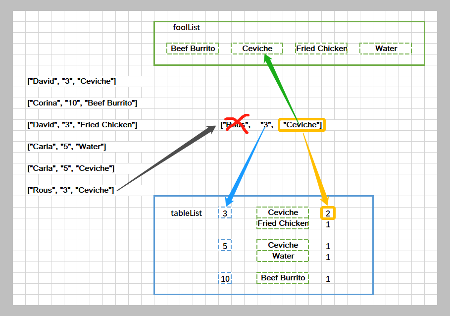

> 原文链接: https://leetcode-cn.com/problems/display-table-of-food-orders-in-a-restaurant


## 英文原文
<div><p>Given&nbsp;the array <code>orders</code>, which represents the orders that customers have done in a restaurant. More specifically&nbsp;<code>orders[i]=[customerName<sub>i</sub>,tableNumber<sub>i</sub>,foodItem<sub>i</sub>]</code> where <code>customerName<sub>i</sub></code> is the name of the customer, <code>tableNumber<sub>i</sub></code>&nbsp;is the table customer sit at, and <code>foodItem<sub>i</sub></code>&nbsp;is the item customer orders.</p>

<p><em>Return the restaurant&#39;s &ldquo;<strong>display table</strong>&rdquo;</em>. The &ldquo;<strong>display table</strong>&rdquo; is a table whose row entries denote how many of each food item each table ordered. The first column is the table number and the remaining columns correspond to each food item in alphabetical order. The first row should be a header whose first column is &ldquo;Table&rdquo;, followed by the names of the food items. Note that the customer names are not part of the table. Additionally, the rows should be sorted in numerically increasing order.</p>

<p>&nbsp;</p>
<p><strong>Example 1:</strong></p>

<pre>
<strong>Input:</strong> orders = [[&quot;David&quot;,&quot;3&quot;,&quot;Ceviche&quot;],[&quot;Corina&quot;,&quot;10&quot;,&quot;Beef Burrito&quot;],[&quot;David&quot;,&quot;3&quot;,&quot;Fried Chicken&quot;],[&quot;Carla&quot;,&quot;5&quot;,&quot;Water&quot;],[&quot;Carla&quot;,&quot;5&quot;,&quot;Ceviche&quot;],[&quot;Rous&quot;,&quot;3&quot;,&quot;Ceviche&quot;]]
<strong>Output:</strong> [[&quot;Table&quot;,&quot;Beef Burrito&quot;,&quot;Ceviche&quot;,&quot;Fried Chicken&quot;,&quot;Water&quot;],[&quot;3&quot;,&quot;0&quot;,&quot;2&quot;,&quot;1&quot;,&quot;0&quot;],[&quot;5&quot;,&quot;0&quot;,&quot;1&quot;,&quot;0&quot;,&quot;1&quot;],[&quot;10&quot;,&quot;1&quot;,&quot;0&quot;,&quot;0&quot;,&quot;0&quot;]] 
<strong>Explanation:
</strong>The displaying table looks like:
<strong>Table,Beef Burrito,Ceviche,Fried Chicken,Water</strong>
3    ,0           ,2      ,1            ,0
5    ,0           ,1      ,0            ,1
10   ,1           ,0      ,0            ,0
For the table 3: David orders &quot;Ceviche&quot; and &quot;Fried Chicken&quot;, and Rous orders &quot;Ceviche&quot;.
For the table 5: Carla orders &quot;Water&quot; and &quot;Ceviche&quot;.
For the table 10: Corina orders &quot;Beef Burrito&quot;. 
</pre>

<p><strong>Example 2:</strong></p>

<pre>
<strong>Input:</strong> orders = [[&quot;James&quot;,&quot;12&quot;,&quot;Fried Chicken&quot;],[&quot;Ratesh&quot;,&quot;12&quot;,&quot;Fried Chicken&quot;],[&quot;Amadeus&quot;,&quot;12&quot;,&quot;Fried Chicken&quot;],[&quot;Adam&quot;,&quot;1&quot;,&quot;Canadian Waffles&quot;],[&quot;Brianna&quot;,&quot;1&quot;,&quot;Canadian Waffles&quot;]]
<strong>Output:</strong> [[&quot;Table&quot;,&quot;Canadian Waffles&quot;,&quot;Fried Chicken&quot;],[&quot;1&quot;,&quot;2&quot;,&quot;0&quot;],[&quot;12&quot;,&quot;0&quot;,&quot;3&quot;]] 
<strong>Explanation:</strong> 
For the table 1: Adam and Brianna order &quot;Canadian Waffles&quot;.
For the table 12: James, Ratesh and Amadeus order &quot;Fried Chicken&quot;.
</pre>

<p><strong>Example 3:</strong></p>

<pre>
<strong>Input:</strong> orders = [[&quot;Laura&quot;,&quot;2&quot;,&quot;Bean Burrito&quot;],[&quot;Jhon&quot;,&quot;2&quot;,&quot;Beef Burrito&quot;],[&quot;Melissa&quot;,&quot;2&quot;,&quot;Soda&quot;]]
<strong>Output:</strong> [[&quot;Table&quot;,&quot;Bean Burrito&quot;,&quot;Beef Burrito&quot;,&quot;Soda&quot;],[&quot;2&quot;,&quot;1&quot;,&quot;1&quot;,&quot;1&quot;]]
</pre>

<p>&nbsp;</p>
<p><strong>Constraints:</strong></p>

<ul>
	<li><code>1 &lt;=&nbsp;orders.length &lt;= 5 * 10^4</code></li>
	<li><code>orders[i].length == 3</code></li>
	<li><code>1 &lt;= customerName<sub>i</sub>.length, foodItem<sub>i</sub>.length &lt;= 20</code></li>
	<li><code>customerName<sub>i</sub></code> and <code>foodItem<sub>i</sub></code> consist of lowercase and uppercase English letters and the space character.</li>
	<li><code>tableNumber<sub>i</sub>&nbsp;</code>is a valid integer between <code>1</code> and <code>500</code>.</li>
</ul></div>

## 中文题目
<div><p>给你一个数组 <code>orders</code>，表示客户在餐厅中完成的订单，确切地说， <code>orders[i]=[customerName<sub>i</sub>,tableNumber<sub>i</sub>,foodItem<sub>i</sub>]</code> ，其中 <code>customerName<sub>i</sub></code> 是客户的姓名，<code>tableNumber<sub>i</sub></code> 是客户所在餐桌的桌号，而 <code>foodItem<sub>i</sub></code> 是客户点的餐品名称。</p>

<p>请你返回该餐厅的 <strong>点菜展示表</strong><em> 。</em>在这张表中，表中第一行为标题，其第一列为餐桌桌号 &ldquo;Table&rdquo; ，后面每一列都是按字母顺序排列的餐品名称。接下来每一行中的项则表示每张餐桌订购的相应餐品数量，第一列应当填对应的桌号，后面依次填写下单的餐品数量。</p>

<p>注意：客户姓名不是点菜展示表的一部分。此外，表中的数据行应该按餐桌桌号升序排列。</p>

<p>&nbsp;</p>

<p><strong>示例 1：</strong></p>

<pre><strong>输入：</strong>orders = [[&quot;David&quot;,&quot;3&quot;,&quot;Ceviche&quot;],[&quot;Corina&quot;,&quot;10&quot;,&quot;Beef Burrito&quot;],[&quot;David&quot;,&quot;3&quot;,&quot;Fried Chicken&quot;],[&quot;Carla&quot;,&quot;5&quot;,&quot;Water&quot;],[&quot;Carla&quot;,&quot;5&quot;,&quot;Ceviche&quot;],[&quot;Rous&quot;,&quot;3&quot;,&quot;Ceviche&quot;]]
<strong>输出：</strong>[[&quot;Table&quot;,&quot;Beef Burrito&quot;,&quot;Ceviche&quot;,&quot;Fried Chicken&quot;,&quot;Water&quot;],[&quot;3&quot;,&quot;0&quot;,&quot;2&quot;,&quot;1&quot;,&quot;0&quot;],[&quot;5&quot;,&quot;0&quot;,&quot;1&quot;,&quot;0&quot;,&quot;1&quot;],[&quot;10&quot;,&quot;1&quot;,&quot;0&quot;,&quot;0&quot;,&quot;0&quot;]] 
<strong>解释：
</strong>点菜展示表如下所示：
<strong>Table,Beef Burrito,Ceviche,Fried Chicken,Water</strong>
3    ,0           ,2      ,1            ,0
5    ,0           ,1      ,0            ,1
10   ,1           ,0      ,0            ,0
对于餐桌 3：David 点了 &quot;Ceviche&quot; 和 &quot;Fried Chicken&quot;，而 Rous 点了 &quot;Ceviche&quot;
而餐桌 5：Carla 点了 &quot;Water&quot; 和 &quot;Ceviche&quot;
餐桌 10：Corina 点了 &quot;Beef Burrito&quot; 
</pre>

<p><strong>示例 2：</strong></p>

<pre><strong>输入：</strong>orders = [[&quot;James&quot;,&quot;12&quot;,&quot;Fried Chicken&quot;],[&quot;Ratesh&quot;,&quot;12&quot;,&quot;Fried Chicken&quot;],[&quot;Amadeus&quot;,&quot;12&quot;,&quot;Fried Chicken&quot;],[&quot;Adam&quot;,&quot;1&quot;,&quot;Canadian Waffles&quot;],[&quot;Brianna&quot;,&quot;1&quot;,&quot;Canadian Waffles&quot;]]
<strong>输出：</strong>[[&quot;Table&quot;,&quot;Canadian Waffles&quot;,&quot;Fried Chicken&quot;],[&quot;1&quot;,&quot;2&quot;,&quot;0&quot;],[&quot;12&quot;,&quot;0&quot;,&quot;3&quot;]] 
<strong>解释：</strong>
对于餐桌 1：Adam 和 Brianna 都点了 &quot;Canadian Waffles&quot;
而餐桌 12：James, Ratesh 和 Amadeus 都点了 &quot;Fried Chicken&quot;
</pre>

<p><strong>示例 3：</strong></p>

<pre><strong>输入：</strong>orders = [[&quot;Laura&quot;,&quot;2&quot;,&quot;Bean Burrito&quot;],[&quot;Jhon&quot;,&quot;2&quot;,&quot;Beef Burrito&quot;],[&quot;Melissa&quot;,&quot;2&quot;,&quot;Soda&quot;]]
<strong>输出：</strong>[[&quot;Table&quot;,&quot;Bean Burrito&quot;,&quot;Beef Burrito&quot;,&quot;Soda&quot;],[&quot;2&quot;,&quot;1&quot;,&quot;1&quot;,&quot;1&quot;]]
</pre>

<p>&nbsp;</p>

<p><strong>提示：</strong></p>

<ul>
	<li><code>1 &lt;=&nbsp;orders.length &lt;= 5 * 10^4</code></li>
	<li><code>orders[i].length == 3</code></li>
	<li><code>1 &lt;= customerName<sub>i</sub>.length, foodItem<sub>i</sub>.length &lt;= 20</code></li>
	<li><code>customerName<sub>i</sub></code> 和 <code>foodItem<sub>i</sub></code> 由大小写英文字母及空格字符 <code>&#39; &#39;</code> 组成。</li>
	<li><code>tableNumber<sub>i</sub></code> 是 <code>1</code> 到 <code>500</code> 范围内的整数。</li>
</ul>
</div>

## 通过代码
<RecoDemo>
</RecoDemo>


## 高赞题解
### 思路
1. 很多小伙伴表示这题不知道该如何下手，其实这道题算是一道考察的是如何管理数据，一个是对数据之间的逻辑关系搞清楚，一个就是数据结构的使用要熟悉。

2. 这道题来说，从最后要展示的数据开始思考
    21. 标题行包含：Table, food1, food2, ...
    22. 下面的数据是：桌号，food1_num, food2_num, ...
    23. 餐品名称并不是一次性给我们的，所以需要根据输入的数据来统计
    > 要去重还要排序，首选自带排序功能的 `set`
    24. 注意到 food1_num 并不是所有 food1 的数量总和，而只是某一张桌子的数量总和
    > 因为 key - value 关系，要排序，所以需要一个 `map` 

3. 首先需要一个 `set<string> foodList` 保存所有餐品名称

4. 然后还需要一个按照桌子保存的 `map<int, map<string, int>> tableList` 
    > 即：map<桌号，map<餐品名称，数量>>

5. 将输入按照这个格式存储

6. 转换成输出格式

### 图解


### 答题
```C++ []
    vector<vector<string>> displayTable(vector<vector<string>>& orders) {
        set<string> foodList;
        map<int, map<string, int>> tableList;

        for (auto& o : orders) {
            foodList.insert(o[2]);
            tableList[stoi(o[1])][o[2]]++;
        }

        vector<vector<string>> ans;
        vector<string> title = { "Table" };
        for (auto& s : foodList) {
            title.push_back(s);
        }
        ans.push_back(title);
        for (auto& p : tableList) {
            vector<string> t = { to_string(p.first) };
            for (auto& s : foodList) {
                t.push_back(to_string(p.second[s]));
            }
            ans.push_back(t);
        }

        return ans;
    }
```


### 致谢

感谢您的观看，希望对您有帮助，欢迎热烈的交流！  

**如果感觉还不错就点个赞吧~**


## 统计信息
| 通过次数 | 提交次数 | AC比率 |
| :------: | :------: | :------: |
|    26327    |    35961    |   73.2%   |

## 提交历史
| 提交时间 | 提交结果 | 执行时间 |  内存消耗  | 语言 |
| :------: | :------: | :------: | :--------: | :--------: |
