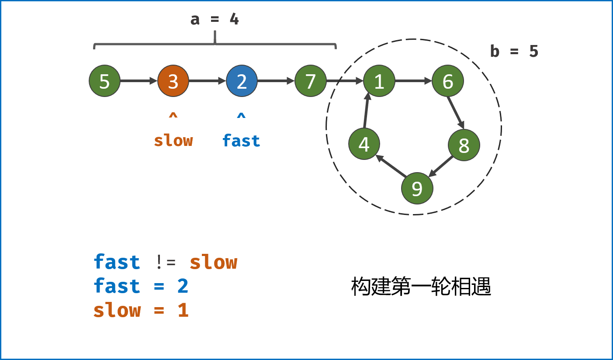
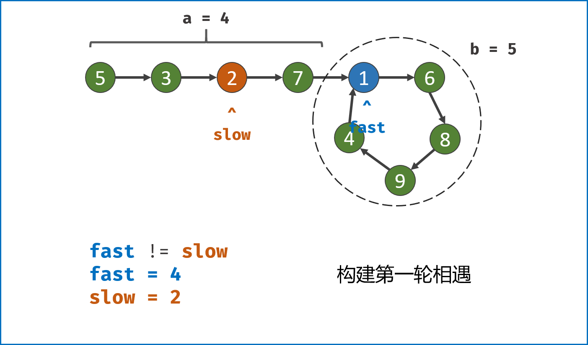
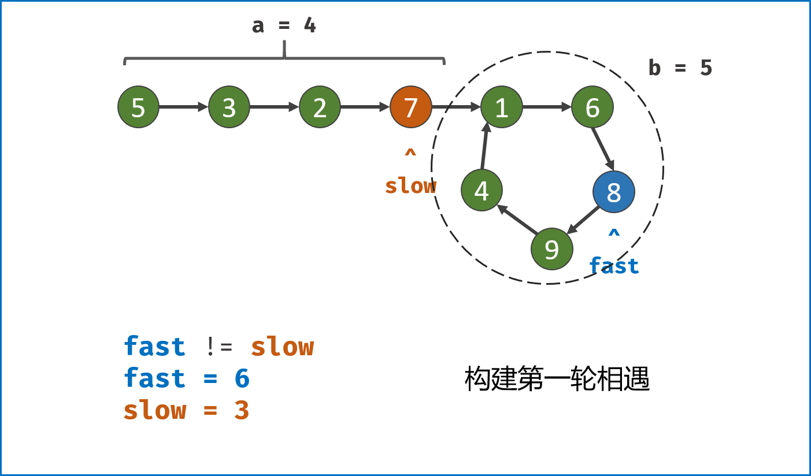
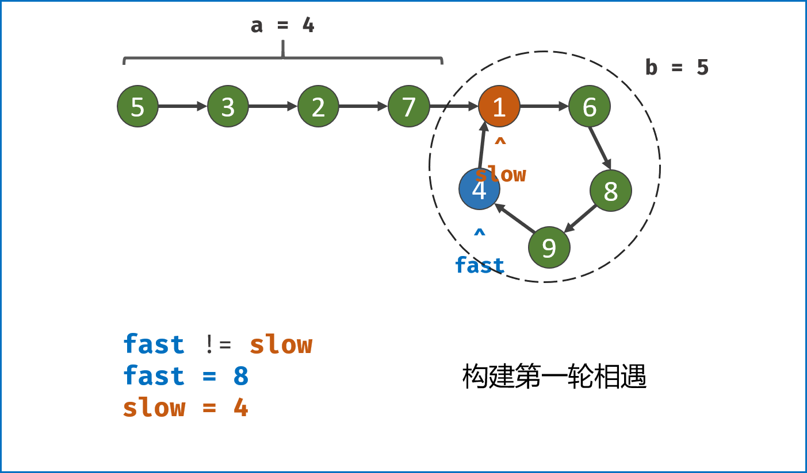
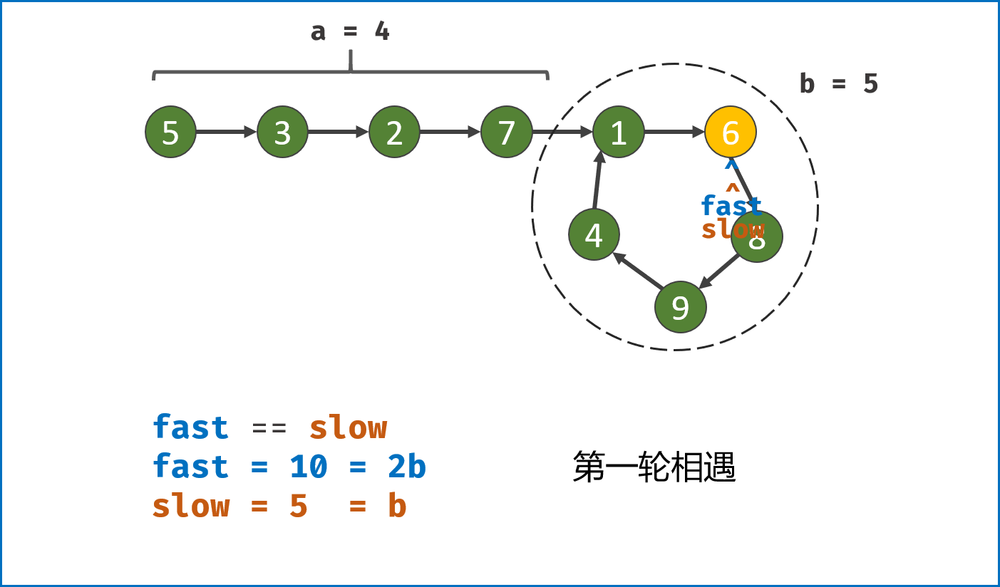
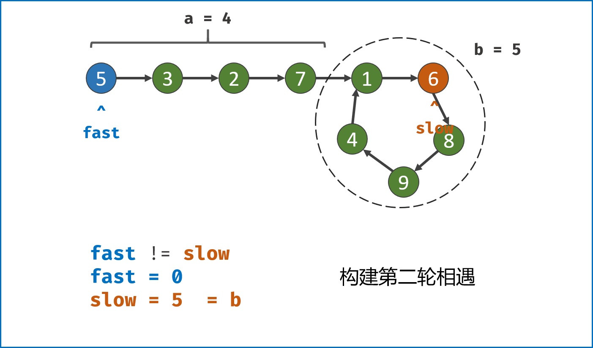
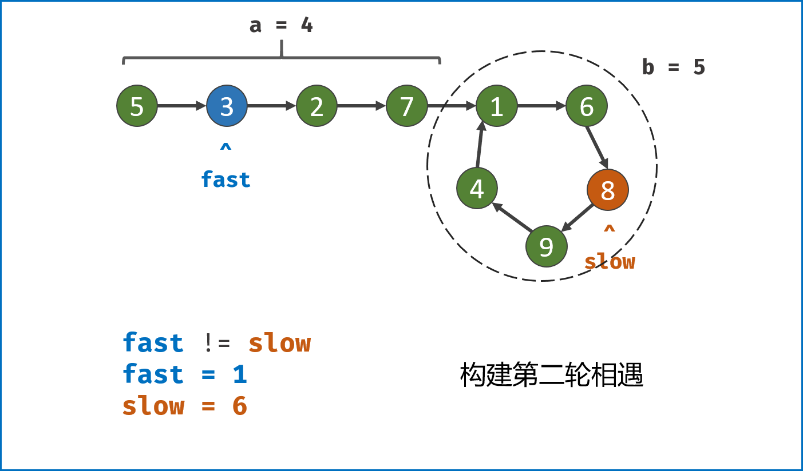
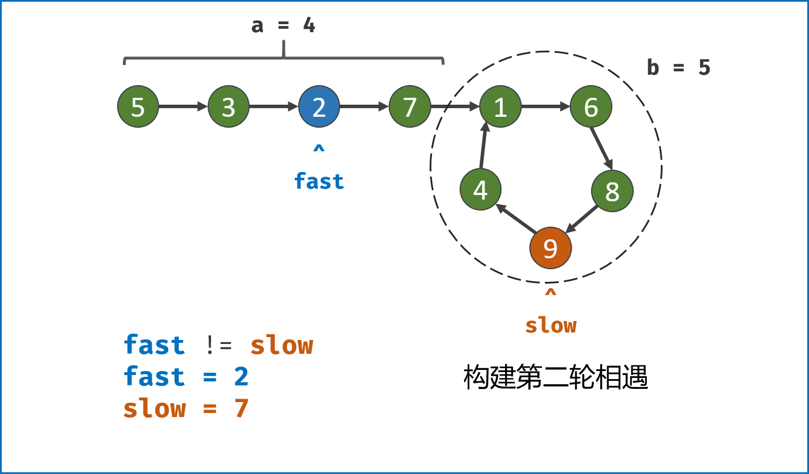
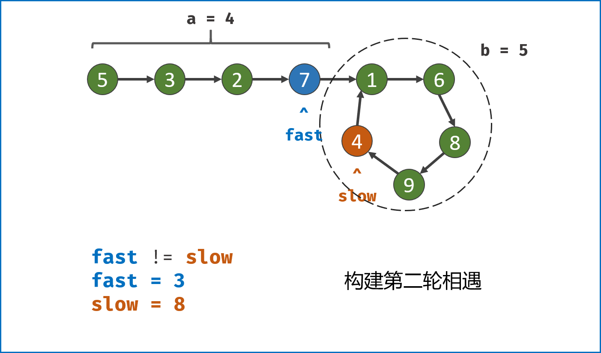
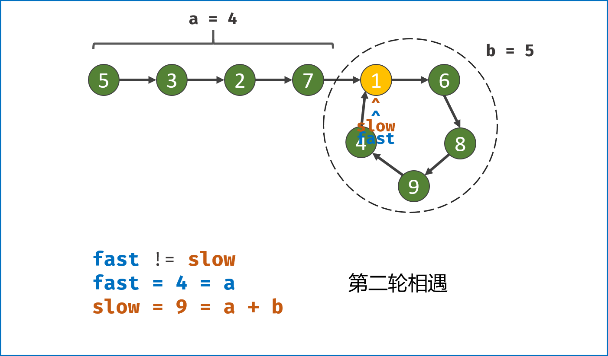

> 原文链接: https://leetcode-cn.com/problems/linked-list-cycle-ii


## 英文原文
<div><p>Given the <code>head</code> of a linked list, return <em>the node where the cycle begins. If there is no cycle, return </em><code>null</code>.</p>

<p>There is a cycle in a linked list if there is some node in the list that can be reached again by continuously following the <code>next</code> pointer. Internally, <code>pos</code> is used to denote the index of the node that tail&#39;s <code>next</code> pointer is connected to (<strong>0-indexed</strong>). It is <code>-1</code> if there is no cycle. <strong>Note that</strong> <code>pos</code> <strong>is not passed as a parameter</strong>.</p>

<p><strong>Do not modify</strong> the linked list.</p>

<p>&nbsp;</p>
<p><strong>Example 1:</strong></p>

<pre>
<strong>Input:</strong> head = [3,2,0,-4], pos = 1
<strong>Output:</strong> tail connects to node index 1
<strong>Explanation:</strong> There is a cycle in the linked list, where tail connects to the second node.
</pre>

<p><strong>Example 2:</strong></p>

<pre>
<strong>Input:</strong> head = [1,2], pos = 0
<strong>Output:</strong> tail connects to node index 0
<strong>Explanation:</strong> There is a cycle in the linked list, where tail connects to the first node.
</pre>

<p><strong>Example 3:</strong></p>

<pre>
<strong>Input:</strong> head = [1], pos = -1
<strong>Output:</strong> no cycle
<strong>Explanation:</strong> There is no cycle in the linked list.
</pre>

<p>&nbsp;</p>
<p><strong>Constraints:</strong></p>

<ul>
	<li>The number of the nodes in the list is in the range <code>[0, 10<sup>4</sup>]</code>.</li>
	<li><code>-10<sup>5</sup> &lt;= Node.val &lt;= 10<sup>5</sup></code></li>
	<li><code>pos</code> is <code>-1</code> or a <strong>valid index</strong> in the linked-list.</li>
</ul>

<p>&nbsp;</p>
<p><strong>Follow up:</strong> Can you solve it using <code>O(1)</code> (i.e. constant) memory?</p>
</div>

## 中文题目
<div><p>给定一个链表，返回链表开始入环的第一个节点。&nbsp;如果链表无环，则返回&nbsp;<code>null</code>。</p>

<p>如果链表中有某个节点，可以通过连续跟踪 <code>next</code> 指针再次到达，则链表中存在环。 为了表示给定链表中的环，评测系统内部使用整数 <code>pos</code> 来表示链表尾连接到链表中的位置（索引从 0 开始）。如果 <code>pos</code> 是 <code>-1</code>，则在该链表中没有环。<strong>注意：<code>pos</code> 不作为参数进行传递</strong>，仅仅是为了标识链表的实际情况。</p>

<p><strong>不允许修改 </strong>链表。</p>

<ul>
</ul>

<p>&nbsp;</p>

<p><strong>示例 1：</strong></p>

<p></p>

<pre>
<strong>输入：</strong>head = [3,2,0,-4], pos = 1
<strong>输出：</strong>返回索引为 1 的链表节点
<strong>解释：</strong>链表中有一个环，其尾部连接到第二个节点。
</pre>

<p><strong>示例&nbsp;2：</strong></p>

<p></p>

<pre>
<strong>输入：</strong>head = [1,2], pos = 0
<strong>输出：</strong>返回索引为 0 的链表节点
<strong>解释：</strong>链表中有一个环，其尾部连接到第一个节点。
</pre>

<p><strong>示例 3：</strong></p>

<p></p>

<pre>
<strong>输入：</strong>head = [1], pos = -1
<strong>输出：</strong>返回 null
<strong>解释：</strong>链表中没有环。
</pre>

<p>&nbsp;</p>

<p><strong>提示：</strong></p>

<ul>
	<li>链表中节点的数目范围在范围 <code>[0, 10<sup>4</sup>]</code> 内</li>
	<li><code>-10<sup>5</sup> &lt;= Node.val &lt;= 10<sup>5</sup></code></li>
	<li><code>pos</code> 的值为 <code>-1</code> 或者链表中的一个有效索引</li>
</ul>

<p>&nbsp;</p>

<p><strong>进阶：</strong>你是否可以使用 <code>O(1)</code> 空间解决此题？</p>
</div>

## 通过代码
<RecoDemo>
</RecoDemo>


## 高赞题解
### 解题思路：


- 这类链表题目一般都是使用双指针法解决的，例如寻找距离尾部第K个节点、寻找环入口、寻找公共尾部入口等。


##### 算法流程：


1. **双指针第一次相遇：** 设两指针 `fast`，`slow` 指向链表头部 `head`，`fast` 每轮走 $2$ 步，`slow` 每轮走 $1$ 步；


   1. **第一种结果：** `fast` 指针走过链表末端，说明链表无环，直接返回 `null`；


      - TIPS: 若有环，两指针一定会相遇。因为每走 $1$ 轮，`fast` 与 `slow` 的间距 $+1$，`fast` 终会追上 `slow`；


   2. **第二种结果：** 当`fast == slow`时， 两指针在环中 **第一次相遇** 。下面分析此时`fast` 与 `slow`走过的 **步数关系** ：


      - 设链表共有 $a+b$ 个节点，其中 **链表头部到链表入口** 有 $a$ 个节点（不计链表入口节点）， **链表环** 有 $b$ 个节点（这里需要注意，$a$ 和 $b$ 是未知数，例如图解上链表 $a=4$ , $b=5$）；设两指针分别走了 $f$，$s$ 步，则有：


      1. `fast` 走的步数是`slow`步数的 $2$ 倍，即 $f = 2s$；（**解析：** `fast` 每轮走 $2$ 步）

      2. `fast` 比 `slow`多走了 $n$ 个环的长度，即 $f = s + nb$；（ **解析：** 双指针都走过 $a$ 步，然后在环内绕圈直到重合，重合时 `fast` 比 `slow` 多走 **环的长度整数倍** ）；


      - 以上两式相减得：$f = 2nb$，$s = nb$，即`fast`和`slow` 指针分别走了 $2n$，$n$ 个 **环的周长** （注意： $n$  是未知数，不同链表的情况不同）。


2. **目前情况分析：** 


   - 如果让指针从链表头部一直向前走并统计步数`k`，那么所有 **走到链表入口节点时的步数** 是：`k=a+nb`（先走 $a$ 步到入口节点，之后每绕 $1$ 圈环（ $b$ 步）都会再次到入口节点）。

   - 而目前，`slow` 指针走过的步数为 $nb$ 步。因此，我们只要想办法让 `slow` 再走  $a$  步停下来，就可以到环的入口。

   - 但是我们不知道 $a$  的值，该怎么办？依然是使用双指针法。我们构建一个指针，此指针需要有以下性质：此指针和`slow` 一起向前走 `a` 步后，两者在入口节点重合。那么从哪里走到入口节点需要 $a$ 步？答案是链表头部`head`。


3. **双指针第二次相遇：**


   - `slow`指针 **位置不变** ，将`fast`指针重新 **指向链表头部节点** ；`slow`和`fast`同时每轮向前走 $1$ 步；

     - TIPS：此时 $f = 0$，$s = nb$ ；

   - 当 `fast` 指针走到$f = a$ 步时，`slow` 指针走到步$s = a+nb$，此时 **两指针重合，并同时指向链表环入口** 。


4. **返回`slow`指针指向的节点。**


##### **复杂度分析：**


- **时间复杂度** $O(N)$ ：第二次相遇中，慢指针须走步数 $a < a + b$；第一次相遇中，慢指针须走步数 $a + b - x < a + b$，其中 $x$ 为双指针重合点与环入口距离；因此总体为线性复杂度；

- **空间复杂度** $O(1)$ ：双指针使用常数大小的额外空间。


<,,,,,,,,,,>{:width=500}

{:align=center}


### 代码：


```Python []

class Solution(object):

    def detectCycle(self, head):

        fast, slow = head, head

        while True:

            if not (fast and fast.next): return

            fast, slow = fast.next.next, slow.next

            if fast == slow: break

        fast = head

        while fast != slow:

            fast, slow = fast.next, slow.next

        return fast

```


```Java []

public class Solution {

    public ListNode detectCycle(ListNode head) {

        ListNode fast = head, slow = head;

        while (true) {

            if (fast == null || fast.next == null) return null;

            fast = fast.next.next;

            slow = slow.next;

            if (fast == slow) break;

        }

        fast = head;

        while (slow != fast) {

            slow = slow.next;

            fast = fast.next;

        }

        return fast;

    }

}

```

## 统计信息
| 通过次数 | 提交次数 | AC比率 |
| :------: | :------: | :------: |
|    325579    |    588102    |   55.4%   |

## 提交历史
| 提交时间 | 提交结果 | 执行时间 |  内存消耗  | 语言 |
| :------: | :------: | :------: | :--------: | :--------: |


## 相似题目
|                             题目                             | 难度 |
| :----------------------------------------------------------: | :---------: |
| [环形链表](https://leetcode-cn.com/problems/linked-list-cycle/) | 简单|
| [寻找重复数](https://leetcode-cn.com/problems/find-the-duplicate-number/) | 中等|
