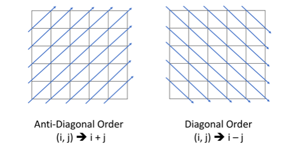

> 原文链接: https://leetcode-cn.com/problems/diagonal-traverse-ii


## 英文原文
<div>Given a list of lists of integers,&nbsp;<code>nums</code>,&nbsp;return all elements of <code>nums</code> in diagonal order as shown in the below images.
<p>&nbsp;</p>
<p><strong>Example 1:</strong></p>

<p><strong></strong></p>

<pre>
<strong>Input:</strong> nums = [[1,2,3],[4,5,6],[7,8,9]]
<strong>Output:</strong> [1,4,2,7,5,3,8,6,9]
</pre>

<p><strong>Example 2:</strong></p>

<p><strong></strong></p>

<pre>
<strong>Input:</strong> nums = [[1,2,3,4,5],[6,7],[8],[9,10,11],[12,13,14,15,16]]
<strong>Output:</strong> [1,6,2,8,7,3,9,4,12,10,5,13,11,14,15,16]
</pre>

<p><strong>Example 3:</strong></p>

<pre>
<strong>Input:</strong> nums = [[1,2,3],[4],[5,6,7],[8],[9,10,11]]
<strong>Output:</strong> [1,4,2,5,3,8,6,9,7,10,11]
</pre>

<p><strong>Example 4:</strong></p>

<pre>
<strong>Input:</strong> nums = [[1,2,3,4,5,6]]
<strong>Output:</strong> [1,2,3,4,5,6]
</pre>

<p>&nbsp;</p>
<p><strong>Constraints:</strong></p>

<ul>
	<li><code>1 &lt;= nums.length &lt;= 10^5</code></li>
	<li><code>1 &lt;= nums[i].length &lt;=&nbsp;10^5</code></li>
	<li><code>1 &lt;= nums[i][j] &lt;= 10^9</code></li>
	<li>There at most <code>10^5</code> elements in <code>nums</code>.</li>
</ul>
</div>

## 中文题目
<div><p>给你一个列表&nbsp;<code>nums</code>&nbsp;，里面每一个元素都是一个整数列表。请你依照下面各图的规则，按顺序返回&nbsp;<code>nums</code>&nbsp;中对角线上的整数。</p>

<p>&nbsp;</p>

<p><strong>示例 1：</strong></p>

<p><strong></strong></p>

<pre><strong>输入：</strong>nums = [[1,2,3],[4,5,6],[7,8,9]]
<strong>输出：</strong>[1,4,2,7,5,3,8,6,9]
</pre>

<p><strong>示例 2：</strong></p>

<p><strong></strong></p>

<pre><strong>输入：</strong>nums = [[1,2,3,4,5],[6,7],[8],[9,10,11],[12,13,14,15,16]]
<strong>输出：</strong>[1,6,2,8,7,3,9,4,12,10,5,13,11,14,15,16]
</pre>

<p><strong>示例 3：</strong></p>

<pre><strong>输入：</strong>nums = [[1,2,3],[4],[5,6,7],[8],[9,10,11]]
<strong>输出：</strong>[1,4,2,5,3,8,6,9,7,10,11]
</pre>

<p><strong>示例 4：</strong></p>

<pre><strong>输入：</strong>nums = [[1,2,3,4,5,6]]
<strong>输出：</strong>[1,2,3,4,5,6]
</pre>

<p>&nbsp;</p>

<p><strong>提示：</strong></p>

<ul>
	<li><code>1 &lt;= nums.length &lt;= 10^5</code></li>
	<li><code>1 &lt;= nums[i].length &lt;=&nbsp;10^5</code></li>
	<li><code>1 &lt;= nums[i][j] &lt;= 10^9</code></li>
	<li><code>nums</code>&nbsp;中最多有&nbsp;<code>10^5</code>&nbsp;个数字。</li>
</ul>
</div>

## 通过代码
<RecoDemo>
</RecoDemo>


## 高赞题解
### 解题思路
根据矩形的特点，设行的标号为i，列的标号为j。则对于每一条对角线而言，i + j的值是唯一的。
（可以参考 **LeetCode探索** 中 **“哈希表”** 的部分）


知道这一点之后，就可以按照对角线对nums中的值进行聚类。聚类完毕后，将所有的数值生成一个数组即可。

### 代码

```java
class Solution {
    public int[] findDiagonalOrder(List<List<Integer>> nums) {
        int len = 0;
		Map<Integer,List<Integer>> map = new TreeMap<>();
		for(int i = 0;i < nums.size();i++) {
			len += nums.get(i).size(); // 获取最后要返回的数组的长度，即元素个数
			for(int j = 0;j < nums.get(i).size();j++) {
				if(map.containsKey(i + j)) {
					map.get(i + j).add(nums.get(i).get(j));
				}
				else {
					List<Integer> list = new ArrayList<>();
					list.add(nums.get(i).get(j));
					map.put(i + j, list);
				}
			}
		}
		int[] ans = new int[len];
		int index = 0;
		for(int key : map.keySet()) { // 遍历map
			List<Integer> list = map.get(key);
			for(int j = list.size() - 1;j >= 0;j--) { // 根据题目的输出要求确定生成数组中元素的顺序
				ans[index] = list.get(j);
				index++;
			}
		}
        return ans;
    }
}
```

## 统计信息
| 通过次数 | 提交次数 | AC比率 |
| :------: | :------: | :------: |
|    7060    |    17577    |   40.2%   |

## 提交历史
| 提交时间 | 提交结果 | 执行时间 |  内存消耗  | 语言 |
| :------: | :------: | :------: | :--------: | :--------: |
